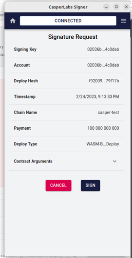
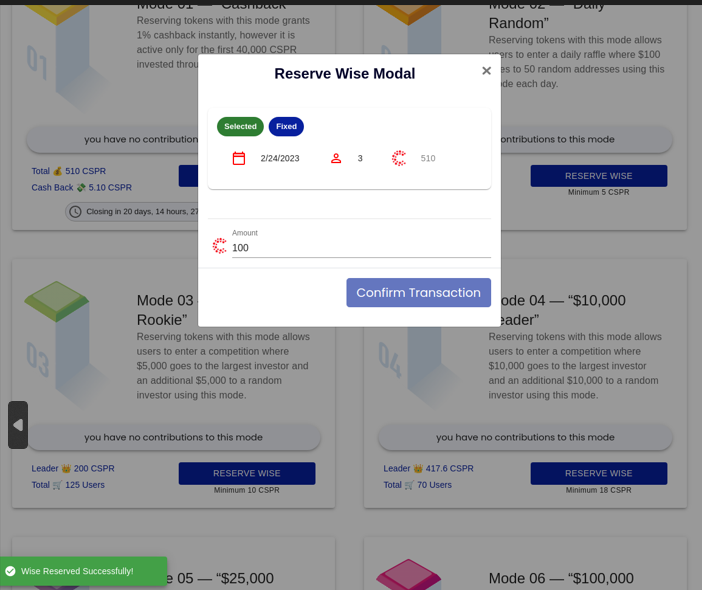
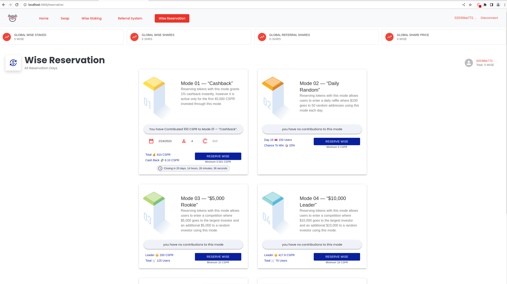

Grant Proposal | [386 - Fair Auction Launch System For Casper](https://portal.devxdao.com/public-proposals/386)
------------ | -------------
Milestone | 4
Milestone Titles | Auction Website (50 Day Fair Auction Website)
OP | CaptainBernardo
Reviewer | Yusuf Keten

# Milestone Details
The review will cover the 4th milestone set forth below.

## Details & Acceptance Criteria

**Details of what will be delivered in milestones:**

- This will translate the auction website from working with BNB to working with CSPR.
- The entire subgraph backend has to be replaced.
- New wallets will be integrated (casper signer, gosuto, etc).
- Examples, Tests & Documentation

**Acceptance criteria:**

- The website is usable with CSPR
- Tests work
- Anyone can deploy an example

**Additional notes regarding submission from OP:**

Please see attached for work that meets all requirements of this milestone

## Milestone Submission

The following milestone assets/artifacts were submitted for review:

Repository | Revision Reviewed
------------ | -------------
https://github.com/Rengo-Labs/CasperLabs-AuctionWebsiteInterface | 9345a59

# Install & Usage Testing Procedure and Findings

The reviewer successfully built and deployed the project on the Casper TestNet by following the instructions on the repository. Build was carried out on a virtual machine with Ubuntu 20.04 LTS operating system.

Successful result was achieved after many encountered errors and issues. OP fixed after reporting them. However, this process took quite a while, causing the review to pass the anticipated deadline by far.

## Build Log
```bash
yusuf@server:~/CasperLabs-AuctionWebsiteInterface$ npm run build


> wisetoken@0.1.0 build

> react-scripts build


Creating an optimized production build...

Compiled with warnings.


[eslint] 

src/app/components/Cards/ReservationCards/Mode1Cashback.js

  Line 55:11:  'accountHash' is assigned a value but never used  no-unused-vars

...
--- ESLINT ---
...

src/app/containers/Pages/Users/Staking.js

  Line 6:3:     'CHAINS' is defined but never used                                                                               no-unused-vars

  Line 7:3:     'SUPPORTED_NETWORKS' is defined but never used                                                                   no-unused-vars

  Line 21:3:    'AccessRights' is defined but never used                                                                         no-unused-vars

  Line 22:3:    'CasperServiceByJsonRPC' is defined but never used                                                               no-unused-vars

  Line 31:10:   'WISE_CONTRACT_HASH' is defined but never used                                                                   no-unused-vars

  Line 33:10:   'makeDeploy' is defined but never used                                                                           no-unused-vars

  Line 36:10:   'getDeploy' is defined but never used                                                                            no-unused-vars

  Line 37:10:   'NODE_ADDRESS' is defined but never used                                                                         no-unused-vars

  Line 38:10:   'createRecipientAddress' is defined but never used                                                               no-unused-vars

  Line 47:10:   'getStateRootHash' is defined but never used                                                                     no-unused-vars

  Line 48:10:   'balanceOf' is defined but never used                                                                            no-unused-vars

  Line 66:19:   'setCookie' is assigned a value but never used                                                                   no-unused-vars

  Line 68:27:   'setUserCsprBalance' is assigned a value but never used                                                          no-unused-vars

  Line 143:6:   React Hook useEffect has a missing dependency: 'getStakeData'. Either include it or remove the dependency array  react-hooks/exhaustive-deps

  Line 183:25:  Expected '===' and instead saw '=='                                                                              eqeqeq

  Line 200:13:  'referrerAddressByteArray' is assigned a value but never used                                                    no-unused-vars

  Line 277:13:  Expected '!==' and instead saw '!='                                                                              eqeqeq

  Line 282:24:  Expected '===' and instead saw '=='                                                                              eqeqeq

  Line 282:45:  Expected '===' and instead saw '=='                                                                              eqeqeq


Search for the keywords to learn more about each warning.

To ignore, add // eslint-disable-next-line to the line before.


File sizes after gzip:


  441.47 kB  build/static/js/main.e2fdd7a0.js

  57.82 kB   build/static/css/main.efe536fe.css


The project was built assuming it is hosted at /.

You can control this with the homepage field in your package.json.


The build folder is ready to be deployed.

You may serve it with a static server:


  npm install -g serve

  serve -s build


Find out more about deployment here:

  https://cra.link/deployment
```


## Overall Impression of usage testing

It was observed that the project is possible to build and deploy on the TestNet, following the instructions. OP fixed the errors mentioned in the previous review.

Reviewer was able to create a deploy through the web interface successfully. Deploy can be checked from https://testnet.cspr.live/deploy/f92009e082380e765db794d7c57ee144dd8ed298383b8c57587ee44f8a79f17b





Requirement | Finding
------------ | -------------
Project builds without errors | PASS
Documentation provides sufficient installation/execution instructions | PASS
Project functionality meets/exceeds acceptance criteria and operates without error | PASS

# Unit / Automated Testing

Although the repository doesn't have any test, the core repositories have enough tests as reviewed in previous milestones. Moreover, OP fixed the broken CI pipelines as suggested in the previous milestone review.

Requirement | Finding
------------ | -------------
Unit Tests - At least one positive path test | PASS
Unit Tests - At least one negative path test | PASS
Unit Tests - Additional path tests | PASS

# Documentation

### Code Documentation

A sufficient amount of low-level documentation exists on the project via properly formatted inline comments on the critical classes and the methods.

Requirement | Finding
------------ | -------------
Code Documented | PASS

### Project Documentation

The project has sufficient documentation for the installation and build instructions. Also, there is a video for example usage in the readme file.

Requirement | Finding
------------ | -------------
Usage Documented | PASS
Example Documented | PASS


## Overall Conclusion on Documentation

Based on the reviewer's findings, this review should pass.

# Open Source Practices

## Licenses

The repository is released under the MIT license.

Requirement | Finding
------------ | -------------
OSI-approved open source software license | PASS

## Contribution Policies

Pull requests and Issues are enabled on the repository, and the project contains a CONTRIBUTING and SECURITY policy.

Requirement | Finding
------------ | -------------
OSS contribution best practices | PASS


# Coding Standards

## General Observations

Code is generally well-structured and very readable. The project is committed to GitHub and the manual tests pass.

# Final Conclusion

The project provides the functionality described in the grant application and milestone acceptance criteria.

Thus, in the reviewer's opinion, this submission should pass.

# Recommendation

Recommendation | PASS
------------ | -------------
