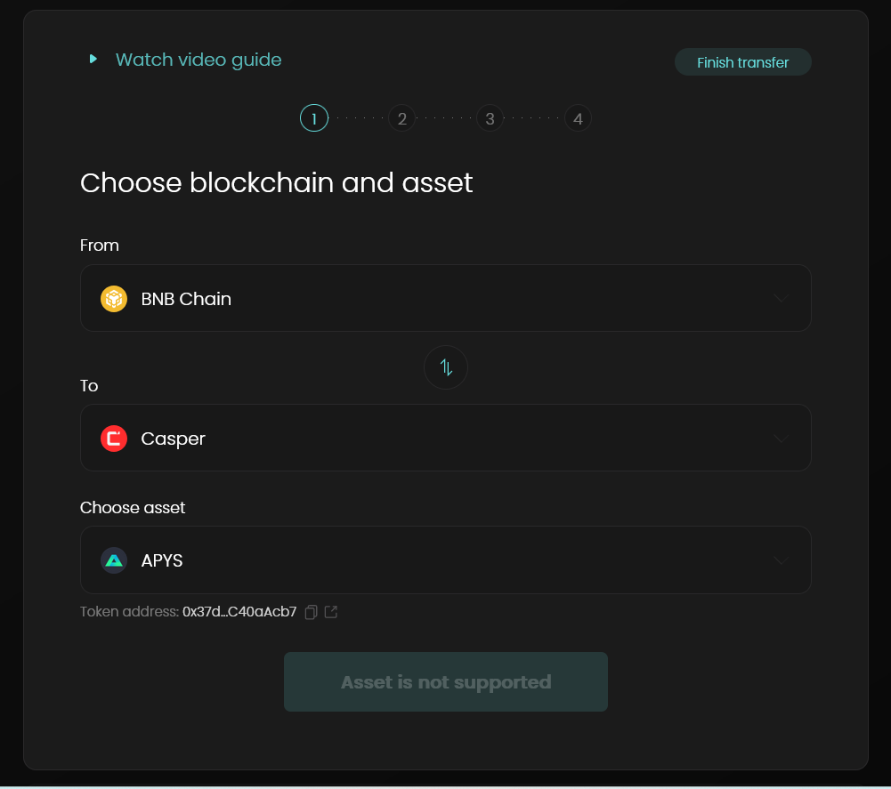

Grant Proposal | [389 - A bridge to Casper Network](https://portal.devxdao.com/public-proposals/389)
------------ | -------------
Milestone | 2
Milestone Title | Bridges completion
OP | Andriy
Reviewer | Hatice Kaya

# Milestone Details

## Details & Acceptance Criteria

**Details of what will be delivered in milestone:**

Bridge’s completion

**Acceptance criteria:**
The KPI here would be the bridge’s completion. By March 15, we would have integrated Casper Network with Allbridge’s ecosystem. Final product assumes adding Casper as one of the chains on https://app.allbridge.io and at least one token (ABR) to be bridged to and from Casper with all of the supported chains (Ethereum/BSC/HECO/Avalanche/Polygon/Fantom/Celo/Solana). We will also be ready to add more tokens to the bridge either from or to Casper (pending DEX collaborations to list bridged assets). Allbridge will provide user documentation and support and will monitor bridge activity for at least a year after launch with this term prolonged indefinitely if there is enough user activity on the bridge (generating at least $1000 in fee revenue per month). An additional grant will be requested for a full Security code review at the appropriate time

**Additional notes regarding submission from OP:**

The bridge is complete, the user documentation is also ready  
The bridge can been accessed at app.allbridge.io  
The documentation https://docs.allbridge.io/allbridge-overview/casper-documentation/casper-bridging-guide  
Attaching spreadsheet with examples of succesfull transactions  
https://docs.google.com/spreadsheets/d/1_TmbOTbSJJffvlzNyVTIKDiXtADPNcIXrBvBSPhr-Wk/edit?usp=sharing

## Milestone Submission

Most milestones require auditing of the code's functionality and compliance with the DEVxDAO's open-source standards. In this case, only the integration with the casper network was created as part of the grant; the core code was written long before this grant existed, and therefore is not subject to the open source standards. The primary goal of this review is to confirm that the user documentation functions as it is advertised to in its entirety (rather than simply getting a few test transactions).

- The bridge: app.allbridge.io
- The documentation: https://docs.allbridge.io/allbridge-overview/casper-documentation/casper-bridging-guide
- Spreadsheet with examples of succesfull transactions:  
https://docs.google.com/spreadsheets/d/1_TmbOTbSJJffvlzNyVTIKDiXtADPNcIXrBvBSPhr-Wk/edit?usp=sharing

# Usage Testing Procedure and Findings

Windows 11.0, Firefox 111.0.1 (64 bit), Casper Wallet 1.3.1 and MetaMask 10.30.4 were used for testing.

Following the usage instructions provided on the documentation, we visited the bridge app on https://app.allbridge.io, and saw that it was loaded successfully, and is seen as described on the documentation. Then we selected `BNB Chain` as the source (`From` field) and `Casper` as the target (`To` field), and `ABR` as the asset to be bridged.

It was also seen that the `Connect Wallet` button turns to `Asset is not supported` when any asset other than ABR is selected. This is not a failure point as it is already stated on the documentation and the milestone acceptance criteria.

Then we selected other chains from the `From` list, and saw that they were also supported as `BNB Chain`, for the `ABR` asset.

Then we bridged 40 ABR from BNB Chain to Casper by following the steps on the documentation. The cost was 10 ABR.

Then we bridged 30 ABR from Casper to BNB Chain by following the steps on the documentation.

### Deploys Tested

- BSC to CSPR spend limit approval: https://bscscan.com/tx/0x1814902b6cef4ac121bed7ca0b8e22d32394253e70fd9fe0c662c1ed92cf4ac3
- BSC to CSPR sent: https://bscscan.com/tx/0xadad1dbd0b31c9937f5853a77ae0e602e2617c64bf9967fde9d7297d7d6871b3
- BSC to CSPR received: https://cspr.live/deploy/5c3c88faa37d3db2f892d52b0666e1d05c67c124e07650736828a8b395ce99a8

- CSPR to BSC spending approval: https://cspr.live/deploy/2d173ebde90e32848ebcd038b83d8593aec54bb2645f2cb35803fe70bd65d034
- CSPR to BSC sent: https://cspr.live/deploy/39d3e68c5869db1149e196f48d7ee8e39505e91d6b3ac95303c59570f24c6038
- CSPR to BSC received: https://bscscan.com/tx/0x53f61f6b8d402249bbb3860d3608fc02b53fe0ece3a75495de41806c5fedc1b5

### Deploys Provided

- BNB Chain to Casper Source TX: https://bscscan.com/tx/0x438b8cdc7ca5c4fb0188512fb714d6ecd92497977ca1992af1334400dbc2b567
- BNB Chain to Casper Destination TX: https://cspr.live/deploy/4853dd3a63eb136393aff323072409e2095f5530f228567559e83cac6b55f57a

- Casper to Solana Source TX: https://cspr.live/deploy/774368cc35267909baec1d69d0b2f0c7831fc957387b1475854a30235e2403ad
- Casper to Solana  Destination TX: https://explorer.solana.com/tx/5MREuXSUVQ9YhL36L7ANHUHNVfQkwa8cFYMGwyfeRkrPVPmGc7iK6HkjkRfxgta7SYgtCsekNMqULjjjiaib6icJ

- Solana to Casper Source TX: https://explorer.solana.com/tx/4FCVXznF6HP2p8Q263ebqr83zbdfxGsyZsbKzPmvWK8wVNW39KeitxC4esWAW458b72bUqGGPyBCSBPd2sXw6mJG
- Solana to Casper Destination TX: https://cspr.live/deploy/f3493ad9601c9636d4a591c639ab6024b2b4ab3d12b053791bb3585f8c895547

- Casper to Near Source TX: https://cspr.live/deploy/61f88e4c7bb69d963364bc3404295c3402a8e3c450b81fa05a932d317a868e15
- Casper to Near Destination TX: https://explorer.near.org/transactions/GNDp4EB25Umu9TcuGFBVu77LBExvWGt6WBms1VXQ1wuo

- Near to Casper Source TX:https://explorer.near.org/transactions/4WP6yZSU56AjDoSe8n4FH9XpjGujSpm5M39gFz2MV8Yu
- Near to Casper Destination TX:https://cspr.live/deploy/8b828a98a243a11544553a19b3cabdf6a3caab9ddea6039b09a4f9cab82e73f5

- Casper to BNB Chain Source TX:https://cspr.live/deploy/c34422ddacdc2273a7a93ccce399607000e98fcd54c6e8805b0064a7f96b7c5e
- Casper to BNB Chain Destination TX:https://bscscan.com/tx/0xa4846feb3b1a36930b8a650e59ee88357193dcca20d856344eb005e13d923618

## Overall Impression of usage testing

All operations were completed successfully by following the steps on the provided documentation. Building the project is out of scope for this review. The provided user documentation is high quality with clear steps.

It is worth noting that spending approval limit on the other chain was editable, but the spending approval limit on Casper was not editable and was very high. This concern was reported to the OP. OP explained that the default approval is always set to maximum, to avoid repeating the approvals for future transfers, and that Casper Wallet does not allow editable spending approval values. Whether this can be considered a security concern is out of scope of this review.

Requirement | Finding
------------ | -------------
Project builds without errors | NA
Documentation provides sufficient installation/execution instructions | PASS
Project functionality meets/exceeds acceptance criteria and operates without error | PASS with Notes

# Unit / Automated Testing

This part is out of scope for this review.

Requirement | Finding
------------ | -------------
Unit Tests - At least one positive path test | NA
Unit Tests - At least one negative path test | NA
Unit Tests - Additional path tests | NA

# Documentation

### Code Documentation

This part is out of scope for this review.

Requirement | Finding
------------ | -------------
Code Documented | NA

### Project Documentation

Project and the usage documentation is extensive, and high quality with clear steps, explanation and screenshots.

Requirement | Finding
------------ | -------------
Usage Documented | PASS
Example Documented | PASS

## Overall Conclusion on Documentation

Based on the reviewer's findings, this review should PASS.

# Open Source Practices

## Licenses

This part is out of scope for this review.

Requirement | Finding
------------ | -------------
OSI-approved open source software license | NA

## Contribution Policies

This part is out of scope for this review.

Requirement | Finding
------------ | -------------
OSS contribution best practices | NA

# Coding Standards

## General Observations

This part is out of scope for this review.

# Final Conclusion

The submission meets the acceptance criteria of the milestone, and provides extensive documentation. In reviewer's opinion, this submission should PASS with Notes only due to the spending approval amount concern.

# Recommendation

Recommendation | PASS with Notes
------------ | -------------
