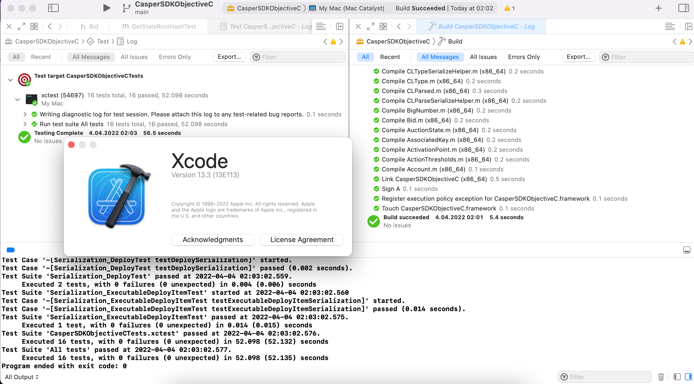

Grant Proposal | [405 - Casper Objective-C SDK](https://portal.devxdao.com/public-proposals/405)
------------ | -------------
Milestone | 1
Milestone Title | Connecting to a Casper node
OP | Huy Tran
Reviewer | Yusuf Keten

# Milestone Details
The review will cover the 1st milestone criteria set forth below.

## Details & Acceptance Criteria

**Details of what will be delivered in milestone:**

- First version of Objective-C SDK: Objective-C SDK project available on a public GitHub repository
- Following methods of the API fully implemented and will return when called by the SDK:
   * chain_get_state_root_hash
   *  info_get_peers  
- Unit tests

**Acceptance criteria:**

- Objective-C SDK project available on a public GitHub repository
- Following methods of the API fully implemented and will return when called:
   * chain_get_state_root_hash
   *  info_get_peers  
- Unit tests

**Additional notes regarding submission from OP:**

- Objective-C SDK project available on a public GitHub repository - Following methods of the API fully implemented and will return when called: * chain_get_state_root_hash * info_get_peers

- Unit tests

## Milestone Submission

The following milestone assets/artifacts were submitted for review:

Repository | Revision Reviewed
------------ | -------------
https://github.com/tqhuy2018/Casper-ObjectiveC-sdk | [a6c6a45](https://github.com/tqhuy2018/Casper-ObjectiveC-sdk/commit/a6c6a45b662b13138eb01a900cd2b8ee6365f4b2)

# Install & Usage Testing Procedure and Findings

Following the instructions in the README file of repository(https://github.com/tqhuy2018/Casper-ObjectiveC-sdk), the reviewer was able to successfully build the source code on a macOS Monterey 12.3 Mac using Xcode version 13.3.

[Build Logs](assets/build-run.md)

## Overall Impression of usage testing

The project builds without errors, the documentation provides sufficient installation and execution instructions, and the project functionality meets the acceptance criteria and operates without errors.

Requirement | Finding
------------ | -------------
Project builds without errors | PASS
Documentation provides sufficient installation/execution instructions | PASS
Project functionality meets/exceeds acceptance criteria and operates without error | PASS

# Unit / Automated Testing

There are 3 positive tests for "chain_get_state_root_hash", 2 negative tests for "chain_get_state_root_hash", and 1 positive test for "info_get_peers". The reviewer was able to successfully run the unit tests. Therefore, the project has sufficient unit tests.

[Test Logs](assets/test-run.md)

Requirement | Finding
------------ | -------------
Unit Tests - At least one positive path test | PASS
Unit Tests - At least one negative path test | PASS

# Documentation

### Code Documentation

A sufficient amount of low-level documentation exists on the project via properly formatted inline comments on the critical classes and the methods.

Requirement | Finding
------------ | -------------
Code Documented | PASS

### Project Documentation

The project has a detailed documentation for usage with examples, along with the installation, build and test instructions.

Requirement | Finding
------------ | -------------
Usage Documented | PASS
Example Documented | PASS

## Overall Conclusion on Documentation
Based on the reviewer's findings, this review should pass.

# Open Source Practices

## Licenses

The Project is released under the MIT License.

Requirement | Finding
------------ | -------------
OSI-approved open source software license | PASS

## Contribution Policies

Pull requests and Issues are enabled on the repository, and the project contains a CONTRIBUTING and a SECURITY policy.

Requirement | Finding
------------ | -------------
OSS contribution best practices | PASS

# Coding Standards

## General Observations

Code is generally well-structured and very readable. The project as committed to GitHub and both the unit tests and the manual tests pass.

# Final Conclusion

The project provides the functionality described in the grant application and milestone acceptance criteria.

# Recommendation

Recommendation | PASS
------------ | -------------
