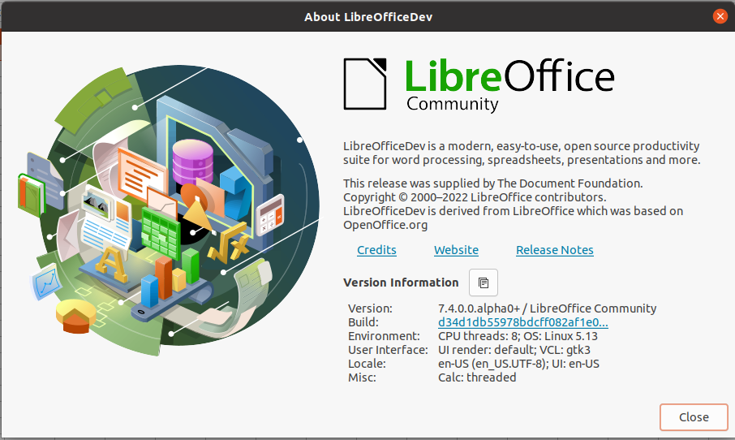
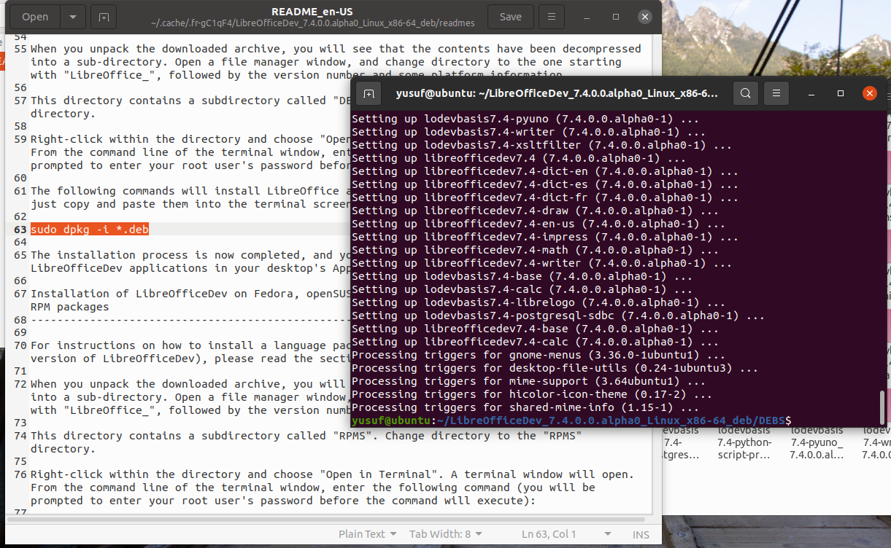
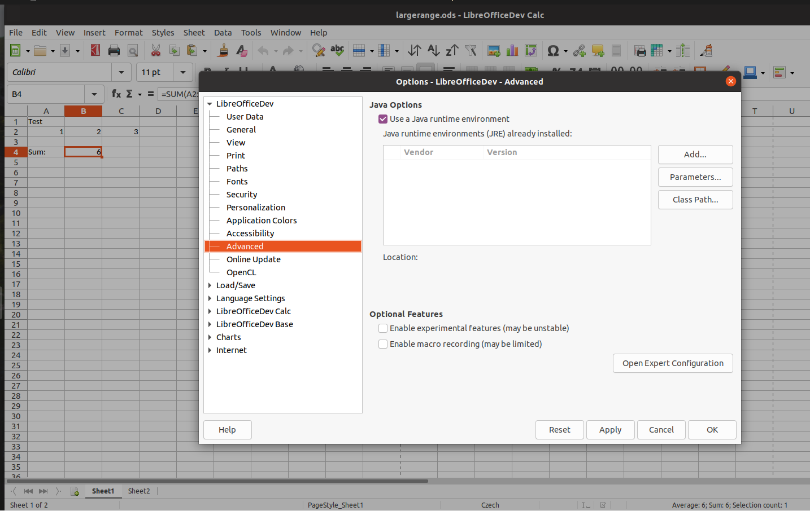
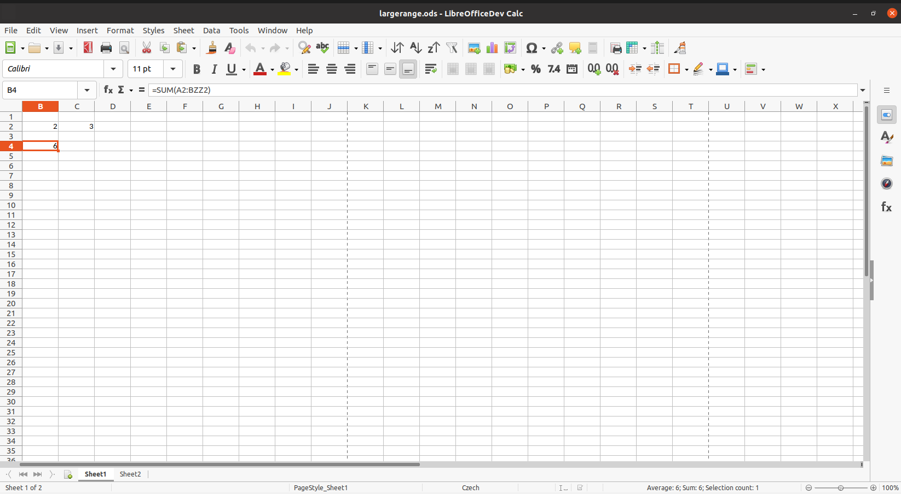
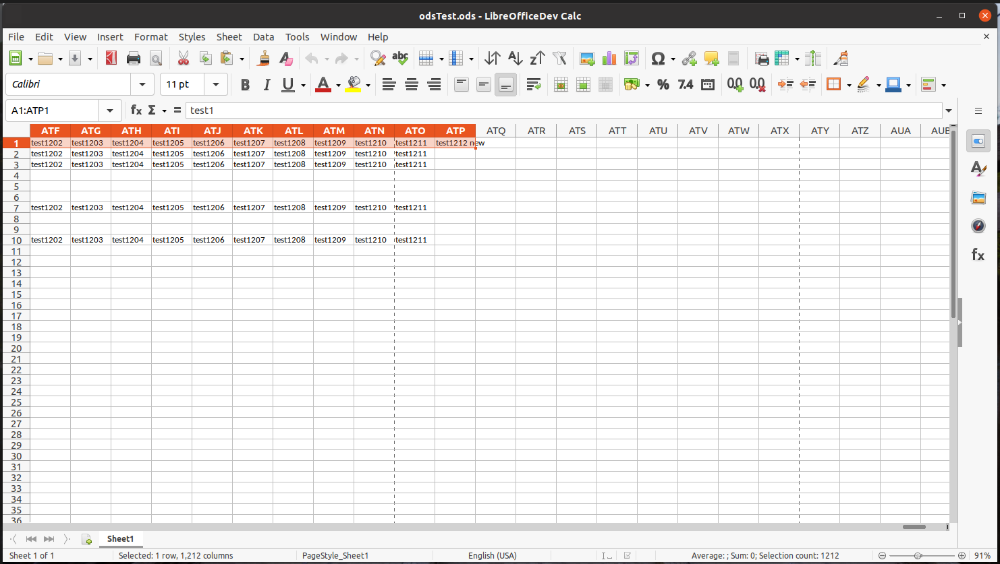

Grant Proposal | [409 - Towards Decentralized Documents: Remove LibreOffice Column Limits](https://portal.devxdao.com/public-proposals/409)
------------ | -------------
Milestone | 2
Milestone Title | ODS import/export
OP | Muhammet Kara
Reviewer | Yusuf Keten

# Milestone Details
The review will cover the 2nd milestone criteria set forth below.

## Details & Acceptance Criteria

**Details of what will be delivered in milestone:**

Remove the 1024 columns limit in Calc and make it dynamic: up to the ODS import/export

**Acceptance criteria:**

ODS import/export feature will be verifiable by following the steps below:

1) Create a document in Excel that has more than 1024 columns.
2) Save it as XLSX.
3) Open it in Calc.
4) Notice that the file opens without truncating the content to 1024 columns.
5) Make some changes to the file, save it to ODS.
6) Close the application.
7) Open the resulting ODS file again with LibreOffice and confirm that no columns are truncated.

**Additional notes regarding submission from OP:**

Loading the sample ODS document just crashes on libreoffice-7-3 (with experimental options enabled) and both ODS import and export works on master (even without experimental options) where our work has been merged.

Sample document: https://github.com/mrkara/ColumnLimitSampleDocs/raw/master/largerange.ods

Here is how you can test this yourself:

1) Get a master daily build from https://dev-builds.libreoffice.org/daily/master/current.html

2) Start LibreOffice, go to Tools -> Options -> LibreOffice -> Advanced, disable Experimental features, and restart LibreOffice.

3) Open the attached document which has a formula that requires more than 1k columns.

Let us know if it helps to have a short screen-share session where we show you this in action.

Opting in is no longer necessary, as the "enable very large spreadsheet" switch is on by default on master.

## Milestone Submission

The following milestone assets/artifacts were submitted for review:

Repository | Revision Reviewed
------------ | -------------
https://github.com/LibreOffice/core | [d34d1db](https://github.com/LibreOffice/core/commit/d34d1db55978bdcff082af1e0f75b18fa6fc94f4)

# Install & Usage Testing Procedure and Findings

There is a guide about the build process of LibreOffice. However, all of the submission commits are merged into the project. Therefore, the reviewer installed the latest LibreOffice master build. (2022-04-10 09:09:17) The project is tested on Ubuntu 20.04 and the installation file name was ["LibreOfficeDev_7.4.0.0.alpha0_Linux_x86-64_deb.tar.gz".](https://dev-builds.libreoffice.org/daily/master/Linux-rpm_deb-x86_64@tb87-TDF/2022-04-10_09.13.48/LibreOfficeDev_7.4.0.0.alpha0_Linux_x86-64_deb.tar.gz)

[Build Logs](assets/build.md)

Build Guideline: https://www.libreoffice.org/about-us/source-code/

Daily master builds: https://dev-builds.libreoffice.org/daily/master/

Sample files can be found under the 'assets' folder. The following files are used in this milestone:

1) [largerange.ods](assets/largerange.ods)

2) [odsTest.ods](assets/odsTest.ods)

## Overall Impression of usage testing

The commits are all merged into the project. LibreOffice has a strict CI/CD process. Also, the reviewer installed the latest LibreOffice master build successfully. The reviewer has observed that the sample documents that have more than 1024 columns can be loaded, exported, and imported successfully. Also, there is no truncation of columns in the sample documents.

Requirement | Finding
------------ | -------------
Project builds without errors | PASS
Documentation provides sufficient installation/execution instructions | PASS
Project functionality meets/exceeds acceptance criteria and operates without error | PASS

# Unit / Automated Testing

LibreOffice has two types of automatic checks:
* unit tests check low level functionality at compile time
* subsequent tests check high level functionality

The build output includes the unit tests that run at compile time. After the last commit is pushed to the repository, the CI tool has started a build with tests. The build has finished successfully.

Build Link: https://ci.libreoffice.org/job/gerrit_master/112072/

Last Commit: https://gerrit.libreoffice.org/c/core/+/132751

Included Commits: https://git.libreoffice.org/core/+log/d34d1db55978bdcff082af1e0f75b18fa6fc94f4

Requirement | Finding
------------ | -------------
Unit Tests - At least one positive path test | PASS
Unit Tests - At least one negative path test | PASS
Unit Tests - Additional path tests | PASS

# Documentation

### Code Documentation

A sufficient amount of low-level documentation exists on the project via properly formatted inline comments on the critical classes and the methods.

Requirement | Finding
------------ | -------------
Code Documented | PASS

### Project Documentation

LibreOffice has well-defined documentation structure. There is a wiki page for developers and a wiki page for users.

LibreOffice TDF Wiki: https://wiki.documentfoundation.org/Main_Page

Requirement | Finding
------------ | -------------
Usage Documented | PASS
Example Documented | PASS

## Overall Conclusion on Documentation

Based on the reviewer's findings, this review should pass.

# Open Source Practices

## Licenses

The base repository is correctly released under the MPL-2.0 License.

Requirement | Finding
------------ | -------------
OSI-approved open source software license | PASS

## Contribution Policies

Pull requests and issues are enabled on the repositories. LibreOffice has a [security policy.](https://www.libreoffice.org/about-us/security/) Also, the project has a detailed [contribution guide.](https://wiki.documentfoundation.org/Development)

Requirement | Finding
------------ | -------------
OSS contribution best practices | PASS

# Coding Standards

## General Observations

All of the commits are readable and well-structured. Also, they are appropriate for LibreOffice code standards. The commits are well-commented.

# Final Conclusion

LibreOffice has a high quality CI/CD pipeline. Also, the LibreOffice developer community has a high quality code review process. Therefore, the project provides the functionality that is required by the project. Also, it meets the acceptance criteria. Thus, in the reviewer's opinion, this submission should pass.

# Recommendation

Recommendation | PASS
------------ | -------------
