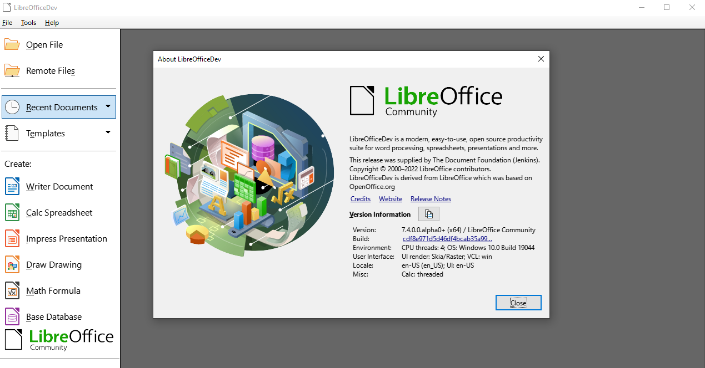
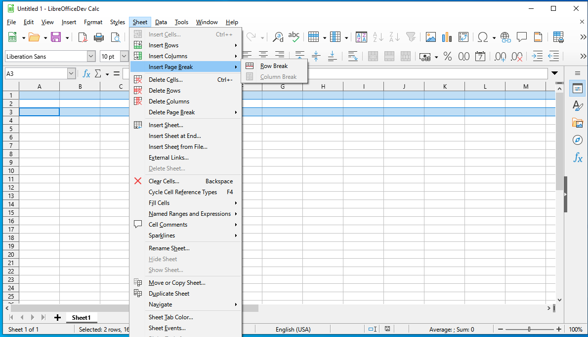
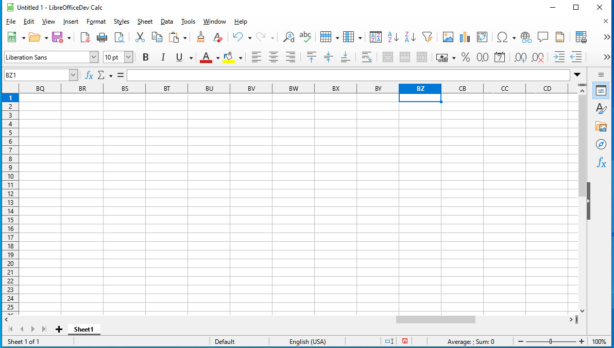

Grant Proposal | [409 - Towards Decentralized Documents: Remove LibreOffice Column Limits](https://portal.devxdao.com/public-proposals/409)
------------ | -------------
Milestone | 3
Milestone Title | User interface and the regresion fixes
OP | Muhammet Kara
Reviewer | Yusuf Keten

# Milestone Details
The review will cover the 3rd milestone criteria set forth below.

## Details & Acceptance Criteria

**Details of what will be delivered in milestone:**

User interface and dealing with the most pressing community-reported regressions

**Acceptance criteria:**

1) Create a document in Excel that has more than 1024 columns.

2) Save it as XLSX.

3) Open it in Calc.

4) Notice that the file opens without truncating the content to 1024 columns.

5) Make same changes to the file, save it to ODS.

6) Close the app.

7) Notice that the saved changes are preserved when opening the ODS file.

8) Make some further changes to the file, save it to XLSX.

9) Open the resulting XLSX in Excel and confirm that no columns are truncated.

**Additional notes regarding submission from OP:**

This month we mostly focused on fixing a lot of problems which are only visible when you work with more than 64  columns: if you have more columns than that, these are allocated only on-demand, and there were lot of problems around that.

We found these problems by allocating just a single column by default, and this way those corner cases were already visible with just two columns. Today, we have the entire libreoffice testsuite passing with just 1 column allocated initially.

As demonstration of a Calc problem fixed in April we think https://bugs.documentfoundation.org/show_bug.cgi?id=148147 would be a good one. It can be reproduced either with older master, or also with stable LO (7.2/7.3) if large sheets are enabled.

Steps to reproduce it:

- If using stable LO, first Tools->Options->LibreOffice->Enable experimental features, then restart LO, then start Calc, Tools->Options->LibreOffice Calc->Defaults->Enable very large spreadsheets and close Calc. When using older LO master from March, no setup is necessary.

- Create new empty Calc sheet.

- Select row 1 by clicking the '1' on the left of the sheet.
 
- Select also row 3 by holding Ctrl and clicking on the '3' on the left of the sheet.

- Rows 1 and 3 are now both selected.

- Click 'Sheet' in the menu => There is a delay of several seconds.

Steps to reproduce an other problem:

- LO master from 26th of April or older is necessary (and newer than 7th of March).
  
- Create new empty Calc sheet.

- Go to cell CA1.

- Hide the CA column by right-clicking the 'CA' header and 'Hide columns'.

- Bug: It is not possible to use left/right arrow keys to move between columns BZ and CA.

Please do your testing with a master daily build from <https://dev-builds.libreoffice.org/daily/master/current.html>.

Let us know if it helps to have a short screen-share session where we show you this in action.

Opting in is no longer necessary, as the "enable very large spreadsheet" switch is on by default on master, old documents are transparently upgraded to 16k columns without any blocking UI.

## Milestone Submission

The following milestone assets/artifacts were submitted for review:

Repository | Revision Reviewed
------------ | -------------
https://github.com/LibreOffice/core | [cdf8e97](https://github.com/LibreOffice/core/commit/cdf8e971d5d46df4bcab35a99c4254df9459213f)

# Install & Usage Testing Procedure and Findings

There is a guide about the build process of LibreOffice. However, all of the submission commits are merged into the project. Therefore, the reviewer installed the latest LibreOffice master build. (2022-05-09 05:07:20) The project is tested on a Windows 10 machine and the installation file name was ["LibreOfficeDev_7.4.0.0.alpha0_Win_x64.msi".](https://dev-builds.libreoffice.org/daily/master/Win-x86_64@tb77-TDF/2022-05-09_05.07.31/LibreOfficeDev_7.4.0.0.alpha0_Win_x64.msi)

[Build Logs](assets/build.md)

Build Guideline: https://www.libreoffice.org/about-us/source-code/

Daily master builds: https://dev-builds.libreoffice.org/daily/master/

## Overall Impression of usage testing

The commits are all merged into the project. LibreOffice has a strict CI/CD process. Also, the reviewer installed the latest LibreOffice master build successfully. The reviewer has observed that the sample documents that have more than 1024 columns can be loaded, exported, and imported successfully. There is no truncation of columns in the sample documents. The reviewer observed that all of the bugs mentioned above are fixed.

Requirement | Finding
------------ | -------------
Project builds without errors | PASS
Documentation provides sufficient installation/execution instructions | PASS
Project functionality meets/exceeds acceptance criteria and operates without error | PASS

# Unit / Automated Testing

LibreOffice has two types of automatic checks:
* unit tests check low-level functionality at compile time
* subsequent tests check high-level functionality

The build output includes the unit tests that run at compile time. After the last commit is pushed to the repository, the CI tool has started a build with tests. The build has finished successfully.

Build Link: https://ci.libreoffice.org/job/gerrit_master/114084/

Last Commit: https://gerrit.libreoffice.org/c/core/+/134021

Included Commits: https://git.libreoffice.org/core/+log/cdf8e971d5d46df4bcab35a99c4254df9459213f

Requirement | Finding
------------ | -------------
Unit Tests - At least one positive path test | PASS
Unit Tests - At least one negative path test | PASS
Unit Tests - Additional path tests | PASS

# Documentation

### Code Documentation

A sufficient amount of low-level documentation exists on the project via properly formatted inline comments on the critical classes and the methods.

Requirement | Finding
------------ | -------------
Code Documented | PASS

### Project Documentation

LibreOffice has a well-defined documentation structure. There is a wiki page for developers and a wiki page for users.

LibreOffice TDF Wiki: https://wiki.documentfoundation.org/Main_Page

Requirement | Finding
------------ | -------------
Usage Documented | PASS
Example Documented | PASS

## Overall Conclusion on Documentation

The project documentation is well organized and comprehensive.

# Open Source Practices

## Licenses

The base repository is correctly released under the MPL-2.0 License.

Requirement | Finding
------------ | -------------
OSI-approved open source software license | PASS

## Contribution Policies

Pull requests and issues are enabled on the repositories. LibreOffice has a [security policy.](https://www.libreoffice.org/about-us/security/) Also, the project has a detailed [contribution guide.](https://wiki.documentfoundation.org/Development)

Requirement | Finding
------------ | -------------
OSS contribution best practices | PASS

# Coding Standards

## General Observations

All of the commits are readable and well-structured. Also, they are appropriate for LibreOffice code standards. The commits are well-commented.

# Final Conclusion

LibreOffice has a high-quality CI/CD pipeline. Moreover, the LibreOffice developer community has a high-quality code review process. Therefore, the project provides the functionality that is required by the project. Also, it meets the acceptance criteria. 

Thus, in the reviewer's opinion, this submission should pass.

# Recommendation

Recommendation | PASS
------------ | -------------
