Grant Proposal | [414 - ServicesDAO additional features development December](https://portal.devxdao.com/public-proposals/414)
------------ | -------------
Milestone | 1
Milestone Title | Updates delivered and released on production environment - Submission 1
OP | Ekin Keçeci
Reviewer | Yusuf Keten

# Milestone Details
The review will cover the first milestone criteria set forth below.

## Details & Acceptance Criteria

**Details of what will be delivered in milestone:**

- Following changes in the description is delivered and pushed to the ServicesDAO repository:
- "My Bids" view added to menu to show all bids of the user in a table.
- Price Discovery added to landing page
- Id column in every page is unified and changed to JobID 
- Users can see available reputation in submit vote popup
- KYC integration with kycaid.com
- Landing page desing edits
- New inputs added to job post form (Coding Language, Code Url)
- Flagging mechanism added to job posts
- Total reputation of the user is shown near user comments in forum
- Restart vote feature added for admin
- Restart auction feature added for admin
- Simple Vote start feature added for admin
- Staked reputation released immediately after the informal vote
- Request UUID control added to job posting and comment posting to prevent double click actions
- Job status filter added to "My Jobs" and "All Jobs" pages
- Edit job feature added for job poster (Available for expired, failed and rejected) jobs.
- Job posts UI changed to show anonymized bids
- Distribution of Fees confirmation and real time VA reputation distribution pie chart added.
- Show only eligible switch added to "Voting" and "Auction" pages

**Acceptance criteria:**

- Requested changes in the description and attachments is pushed to ServicesDAO repositories and deployed on the CRDAO production environment.

**Additional notes regarding submission from OP:**

- Tasks were completed and released in December for ServicesDAO platform.

## Milestone Submission

The following milestone assets/artifacts were submitted for review:

Repository | Revision Reviewed
------------ | -------------
https://github.com/EKON-YAZILIM/ServicesDAO | [f7d4379](https://github.com/EKON-YAZILIM/ServicesDAO/commit/f7d43799878afa4dc1eea41e8ba50acc0d8d77aa)

# Install & Usage Testing Procedure and Findings

Following the instructions in the README file of the repository(https://github.com/EKON-YAZILIM/ServicesDAO), the reviewer was able to successfully build the source code using Docker on Ubuntu 20.04.

[Docker - ServicesDAO Logs](assets/docker-services-dao.md)

[Docker - VotingEngine Logs](assets/docker-voting-engine.md)

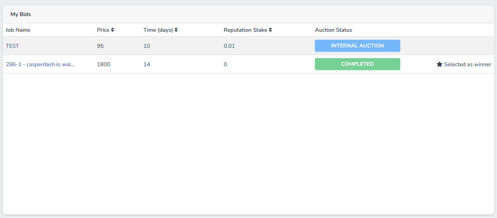

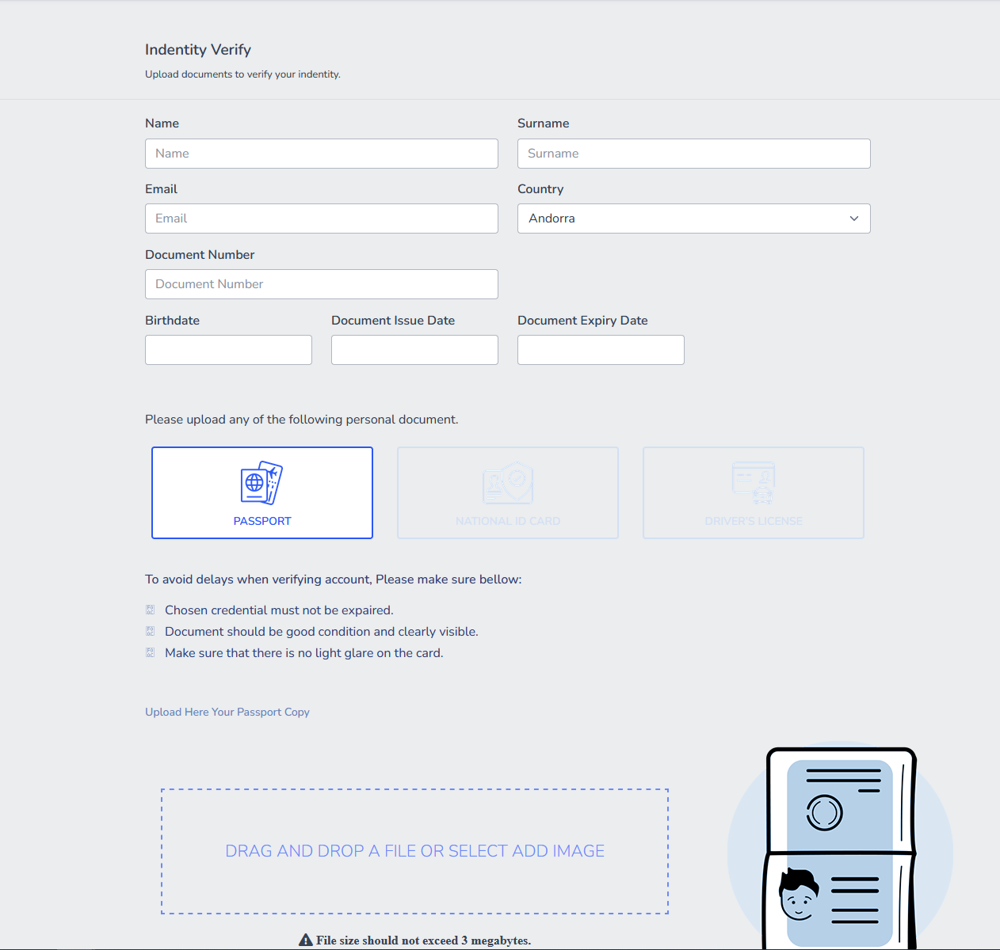

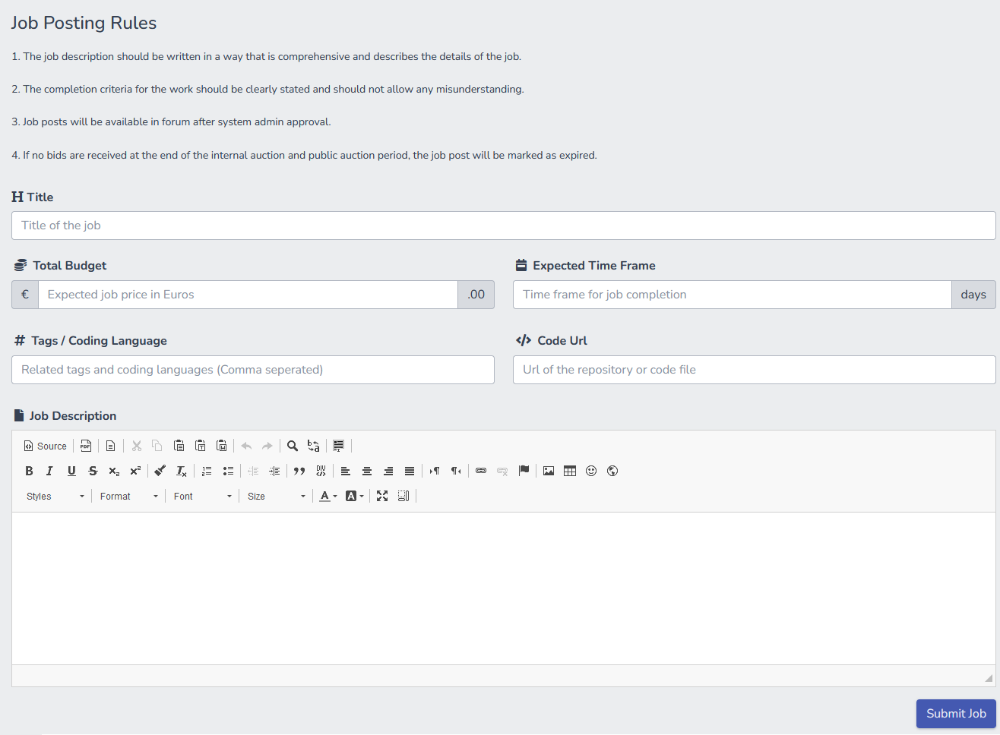

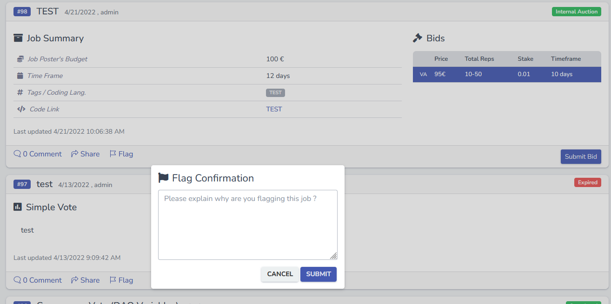

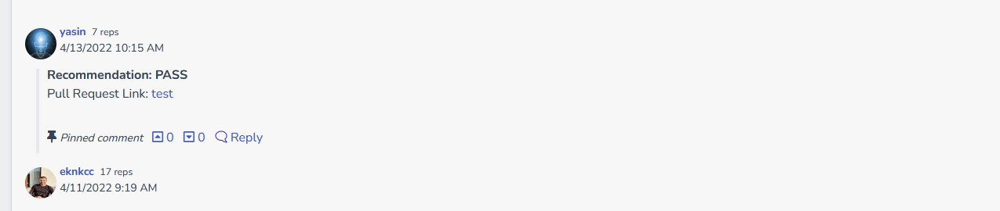

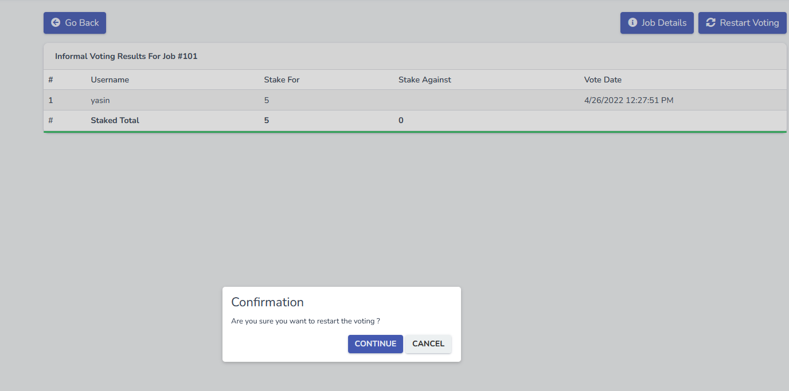

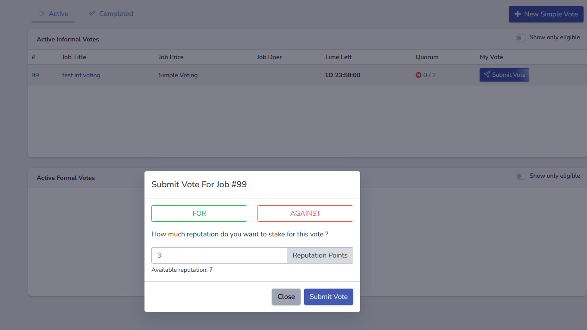

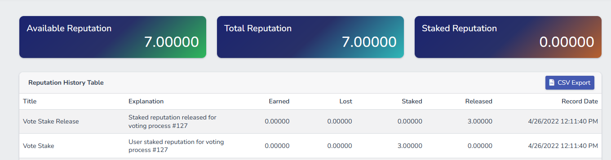

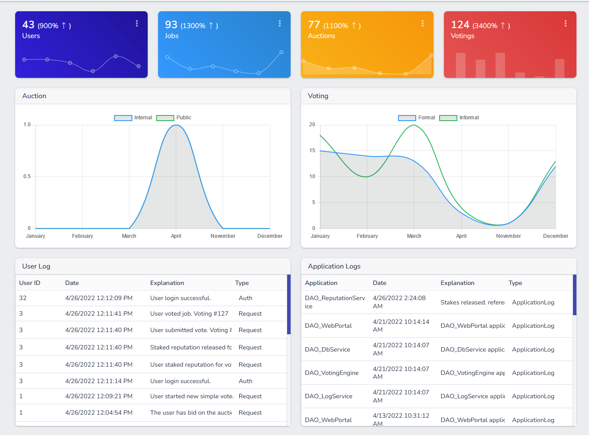

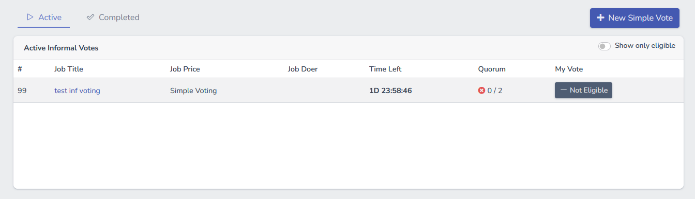

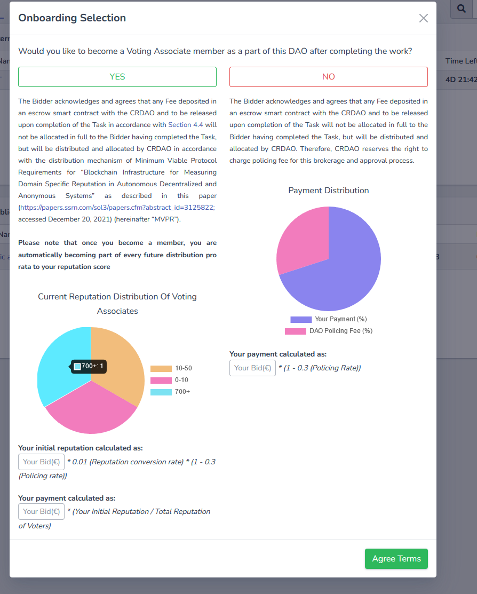

## Overall Impression of usage testing

The project builds without errors, the documentation provides sufficient installation and execution instructions, and the project functionality meets the acceptance criteria and operates without errors.

Requirement | Finding
------------ | -------------
Project builds without errors | PASS
Documentation provides sufficient installation/execution instructions | PASS
Project functionality meets/exceeds acceptance criteria and operates without error | PASS

# Unit / Automated Testing

The project has unit tests for most of the critical classes and methods.

The manual tests are done by the reviewer thanks to OP's help. All of the features work as expected.

The automated test results are shown below. All of the tests are passing.

[DB Service Test Logs](assets/test-run-db.md)

[Identity Service Test Logs](assets/test-run-identity.md)

[Reputation Service Test Logs](assets/test-run-reputation.md)

[Voting Engine Test Logs](assets/test-run-voting-engine.md)

[WebPortal Test Logs](assets/test-run-webportal.md)

Requirement | Finding
------------ | -------------
Unit Tests - At least one positive path test | PASS
Unit Tests - At least one negative path test | PASS
Unit Tests - Additional path tests | PASS

# Documentation

### Code Documentation

A sufficient amount of low-level documentation exists on the project via properly formatted inline comments on the critical classes and the methods.

Requirement | Finding
------------ | -------------
Code Documented | PASS

### Project Documentation

The project has detailed documentation for the build and test instructions.

Requirement | Finding
------------ | -------------
Usage Documented | PASS
Example Documented | PASS

## Overall Conclusion on Documentation

In the reviewer's opinion, the project and usage documentation are sufficient. 

# Open Source Practices

## Licenses

The Project is released under the MIT License.

Requirement | Finding
------------ | -------------
OSI-approved open source software license | PASS

## Contribution Policies

Pull requests and Issues are enabled on the repository, and the project contains a CONTRIBUTING and a SECURITY policy.

Requirement | Finding
------------ | -------------
OSS contribution best practices | PASS

# Coding Standards

## General Observations

Reviewer finds the code to be generally well-structured and readable. The project is committed to GitHub and both the unit tests and the manual tests pass.

# Final Conclusion

The project provides the functionality described in the grant application and milestone acceptance criteria. Also, it is well documented and already deployed in the CRDAO production environment.

Thus, in the reviewer's opinion, this submission should pass.

# Recommendation

Recommendation | PASS
------------ | -------------
