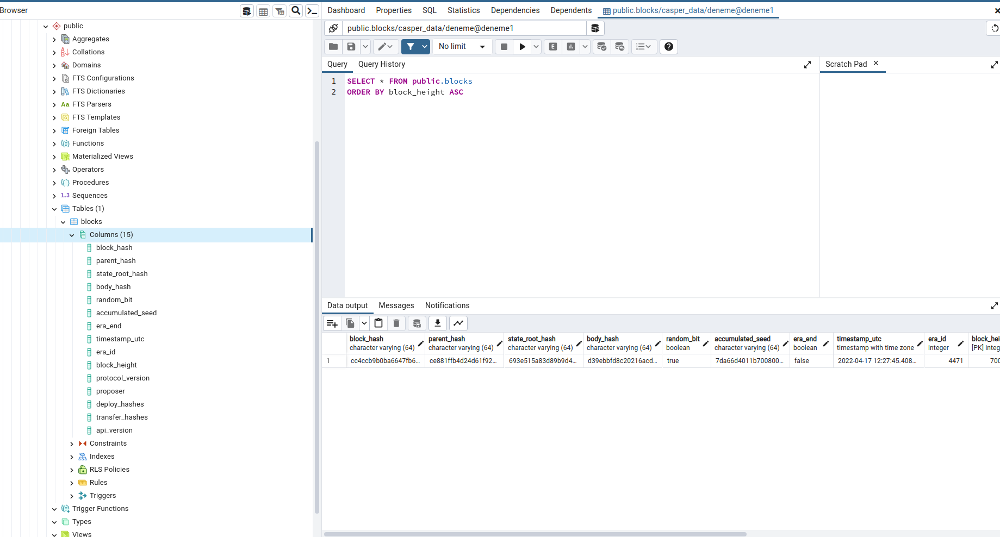
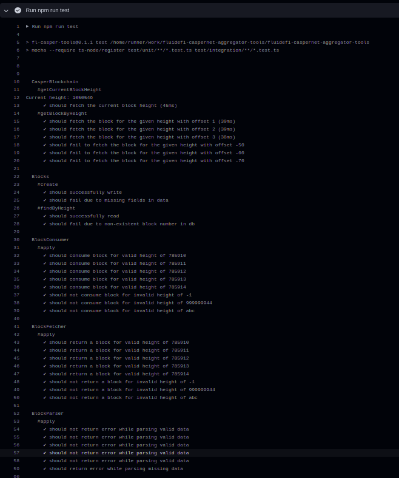
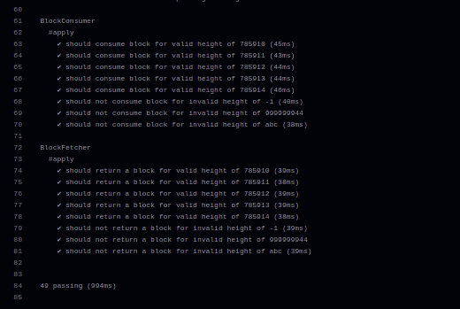
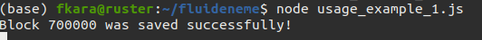
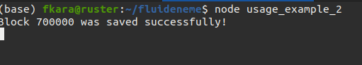
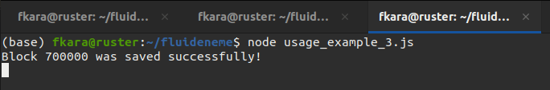
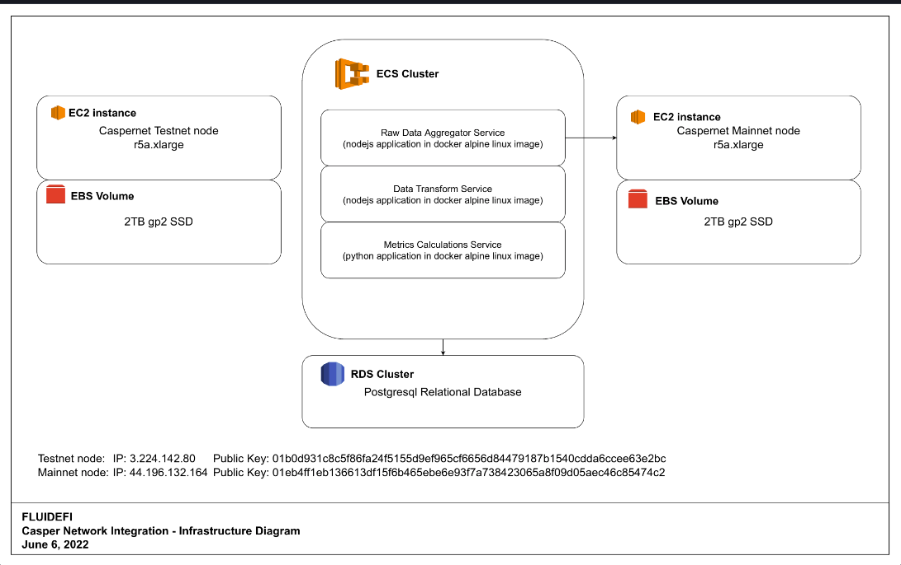
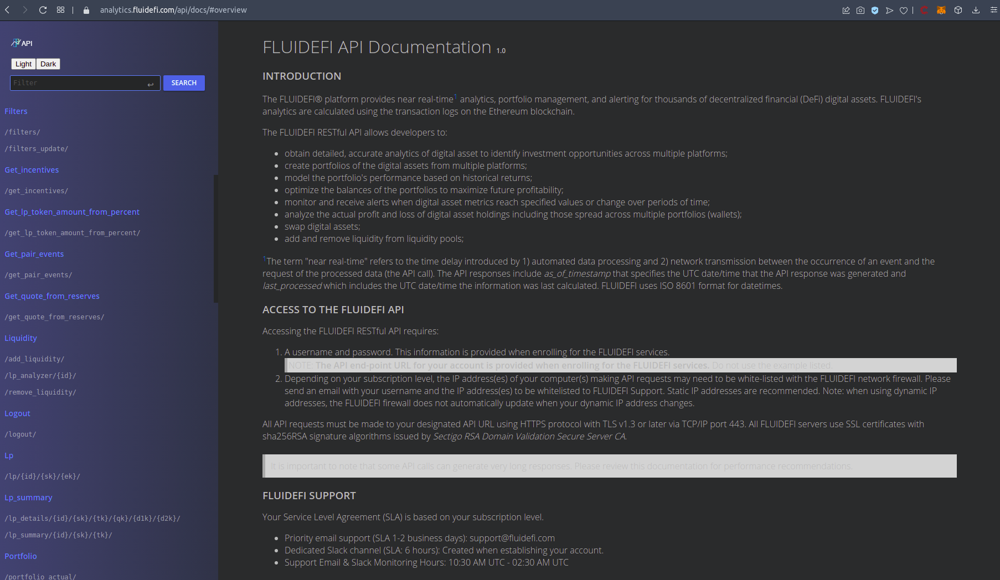

Grant Proposal | [451 - Analytics & Portfolio Management for DeFi Automatic Market Makers (AMM)](https://portal.devxdao.com/public-proposals/451)
------------ | -------------
Milestone | 1 - Second Submission
Milestone Title | Establish Infrastructure & Proof of Concept
OP | FLUIDEFI
Reviewer | Furkan Ahmet Kara <furkanahmetkara.fk@gmail.com>

# Milestone Details

## Details & Acceptance Criteria

**Details of what will be delivered in milestone:**

Infrastructure design and setup
- Create GitHub repository
- Connect to Blockchain 
- Set up primary and backup nodes on mainnet for production use
- Connect to Testnet
- Define FLUIDEFI DB schema for AMM (Example: CasperSwap)
- Test current DEVxDAO Python & Javascript SDKs to ensure there is functionality in place to build the entire FLUIDEFI proposed project. A large amount of effort will be put into this step. Specifically, FLUIDEFI’s current production platform is built entirely with Web3. For this step we will need to code test scripts to ensure Python & Javascript SDKs have the necessary functionality and are working without errors. If problems with the SDKs are found, our team will work with the SDK developers to resolve those issues. During this time, this project may be put on hold.

**Acceptance criteria:**

CODE: Test scripts and results
DOCUMENT: Infrastructure design diagram
LINK: GitHub repository
NODES: Set up primary and backup nodes on mainnet for production use Connect to Testnet
DOCUMENT: Completed DB schema for AMM (for example: CasperSwap)
DOCUMENT: API Definition for RESTful API calls that provide ranking and summary analytics of liquidity pools with metrics including, but not limited to: 
Open, close, high, low prices of underlying assets
total_period_return	Total rate of return for a liquidity pool in the specified period
yield_on_lp_fees	Return from fees in the specified period
price_change_ret	Return from the change in price of the underlying tokens in the specified period
hodl_return		Return if tokens were held (not staked in a liquidity pool) in the specified period
fees_apy	Return from fees in the specified period, annualized
Cumulative total return metrics on investment in base_currency
impermanent_loss_level	The percentage difference in portfolio value between staking tokens in an AMM and holding tokens in a wallet. Fees are not taken into account in this calculation
impermanent_loss_impact	The percentage difference in ROI between staking tokens in an AMM and holding tokens in a wallet. Fees are not taken into account in this calculation
Volume & transactions during the time_period specified
Reserves & Poolsize

Definition of Done (DOD): Provide the above documents, links, and proof of node setup.

**Additional notes regarding submission from OP:**

LINK: GitHub repository. Above URL. There is an aggregator repo as well (see below).

CODE: Test scripts and results. In the above repo; see test folder.

DOCUMENT: Infrastructure design diagram. https://github.com/fluidefi/fluidefi-caspernet-aggregator-tools/blob/master/casper-infra.drawio.pdf 

NODES: Set up primary and backup nodes on mainnet for production use Connect to Testnet. Servers are located at: 
Mainnet: caspernet02.fluidefi.io
Testnet: caspertest1.fluidefi.io

DOCUMENT: Completed DB schema for AMM (for example: CasperSwap). Two (2) .pdf docs, here: https://github.com/fluidefi/fluidefi-caspernet-aggregator-tools/tree/master/src/schema

DOCUMENT: API Definition for RESTful API calls that provide ranking and summary analytics of liquidity pools with metrics. Docs are online, here: https://analytics.fluidefi.com/api/docs/#overview

CR-Dao reviewer: Please send any questions to Louis@fluidefi.com.
Thank you!

## Milestone Submission

The following milestone assets/artifacts were submitted for review:

Repository | Revision Reviewed
------------ | -------------
https://github.com/fluidefi/fluidefi-caspernet-aggregator-tools | 4744343

# Install & Usage Testing Procedure and Findings

Following the instructions in the [README](https://github.com/fluidefi/fluidefi-caspernet-aggregator-tools) and [docs](https://github.com/fluidefi/fluidefi-caspernet-aggregator-tools/blob/main/docs/INSTALLATION.md) of the project , the reviewer was able to successfully install the project as a package and created the postgres DB.

## Overall Impression of usage testing

Initially reviewer encountered some difficulties while building the project and contacted the OP and OP made required changes immediately. The [documentation](https://github.com/fluidefi/fluidefi-caspernet-aggregator-tools/tree/main/docs) provides sufficient installation and execution instructions along with the usage examples. Reviewer encountered some difficulties while applying usage examples and got some errors but OP fixed that issues fast and now usage examples execute without any error. Project functionality meets the acceptance criteria and operates without errors.

Requirement | Finding
------------ | -------------
Project builds without errors | PASS
Documentation provides sufficient installation/execution instructions | PASS
Project functionality meets/exceeds acceptance criteria and operates without error | PASS

# Unit / Automated Testing

The project has unit tests for all critical classes and methods. [CI Actions](https://github.com/fluidefi/fluidefi-caspernet-aggregator-tools/runs/8023466793?check_suite_focus=true) are enabled on github repository. Reviewer checked the tests in CI Actions and they were successfully completed without any errors. Initially testing instructions were missing on documentation but after reporting them to OP, project documentation updated and test instructions added. Reviewer ran tests manually by following instruction on README of the project and they completed successfully too.

Requirement | Finding
------------ | -------------
Unit Tests - At least one positive path test | PASS
Unit Tests - At least one negative path test | PASS
Unit Tests - Additional path tests | PASS

# Documentation

### Code Documentation

Code was missing inline comments and low-level code documentation but reviewer contacted to OP regarding this issue and OP fixed it immediately. Now Code is generally well documented and critical classes have comments. Low-level code documentation is good enough to meet CRDAO code review standarts and allow auto-generation of the documentation. Also, after reviewers suggestion, OP added auto generated typedocs under [docs](https://github.com/fluidefi/fluidefi-caspernet-aggregator-tools/tree/main/docs/typedocs) folder of the project.

Requirement | Finding
------------ | -------------
Code Documented | PASS

### Project Documentation

Initially project documentation was in a bad shape and missing some instructions but ,after reviewer's comments and suggestions, OP updated it. The README file provides the necessary information to get quick overview about project and have instructions and links to the documentation regarding [INSTALLATION](https://github.com/fluidefi/fluidefi-caspernet-aggregator-tools/blob/main/docs/INSTALLATION.md) and [USAGE OWERWIEW](https://github.com/fluidefi/fluidefi-caspernet-aggregator-tools/blob/main/docs/USAGE_OVERVIEW.md). Usage examples needed minor changes and OP immediatly updated them after reviewer's suggestion. Now, Documentation has sufficient usage examples and instructions which execute without any errors. OP manage to try and execute all examples without any issues by following instructions.

Requirement | Finding
------------ | -------------
Usage Documented | PASS
Example Documented | PASS

## Overall Conclusion on Documentation

In reviewer's opinion documentation for the project is sufficient for this milestone.

# Open Source Practices

## Licenses

The Project is released under the MIT License.

Requirement | Finding
------------ | -------------
OSI-approved open source software license | PASS

## Contribution Policies

The project contains a CONTRIBUTING and SECURITY policy that links to a Code of Conduct. Pull requests and Issues are enabled.
Requirement | Finding
------------ | -------------
OSS contribution best practices | PASS

# Coding Standards

## General Observations

Project meets the acceptance criteria. Code repo is available, test scripts are written and CI actions has been used. Source code is well written and have sufficiend amount of code level documentation. OP is reachable and responsive in general.

Design diagrams and schemas, which are also mentioned in milestone submission, are included in repository as pdf files and can be found under [schema folder](https://github.com/fluidefi/fluidefi-caspernet-aggregator-tools/tree/main/src/schema)

Infrastructure Diagram

[Mainnet](caspernet02.fluidefi.io:8888/status) and [Testnet](caspertest1.fluidefi.io:8888/status) nodes are active and located at, OP reported that rpc ports are not public because of security reasons:
Mainnet: caspernet02.fluidefi.io
Testnet: caspertest1.fluidefi.io

Public nodes planned to be used as backup nodes and which is fine in reviewer's opinion as it conforms to best practices.

[Docs](https://analytics.fluidefi.com/api/docs/#overview) of API Definition for RESTful API calls available online.

OP was reachable and has good communication. Issues reported by reviewer generally fixed immediately.

# Final Conclusion

Reviewer recommends that this submission should PASS as it meets the milestone acceptance criteria and DEVxDAO standarts.

# Recommendation

Recommendation | PASS
------------ | -------------
