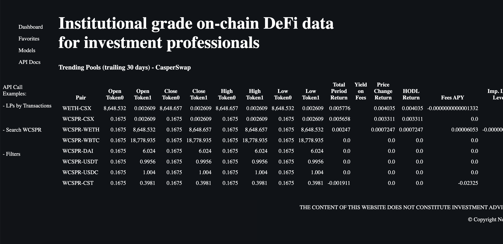
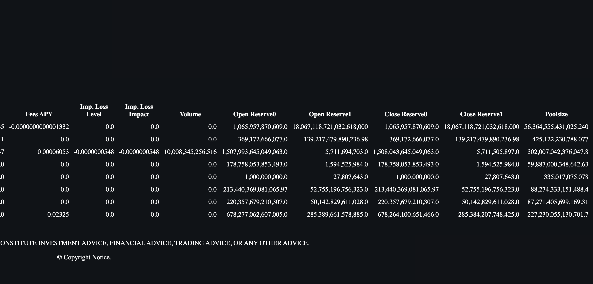

Grant Proposal | [451 - Analytics & Portfolio Management for DeFi Automatic Market Makers (AMM))](https://portal.devxdao.com/public-proposals/451)
------------ | -------------
Milestone | 2
Milestone Title | Analytics for DeFi Automatic Market Makers (AMM)
OP | FLUIDEFI
Reviewer | Muhammed Didin <mdidin80@gmail.com>

# Milestone Details

## Details & Acceptance Criteria

**Details of what will be delivered in milestone:**

Fully tested web browser based UI/UX that supports the above functionality complete with documentation.

**Acceptance criteria:**

Criteria for milestone completion includes successful execution of the following goals:
RESTful API calls that provide ranking and summary analytics of liquidity pools with metrics including, but not limited to: 
Open, close, high, low prices of underlying assets
total_period_return	Total rate of return for a liquidity pool in the specified period
yield_on_lp_fees	Return from fees in the specified period
price_change_ret	Return from the change in price of the underlying tokens in the specified period
hodl_return		Return if tokens were held (not staked in a liquidity pool) in the specified period
fees_apy	Return from fees in the specified period, annualized
Cumulative total return metrics on investment in base_currency
impermanent_loss_level	The percentage difference in portfolio value between staking tokens in an AMM and holding tokens in a wallet. Fees are not taken into account in this calculation
impermanent_loss_impact	The percentage difference in ROI between staking tokens in an AMM and holding tokens in a wallet. Fees are not taken into account in this calculation
Volume & transactions during the time_period specified
Reserves & Poolsize
RESTful API calls for searching and filtering liquidity pools and underlying assets
All API calls passing test scripts
Web front-end that uses API calls

Definition of Done (DOD): Fully tested web browser based UI/UX that supports the above functionality complete with documentation.

**Additional notes regarding submission from OP:**

The submission is in two repositories:

1. The FLUIDEFI Caspernet aggregator:
https://github.com/fluidefi/fluidefi-caspernet-aggregator-tools
(Please install this first.)

2. The FLUIDEFI Caspernet analytics: 
https://github.com/fluidefi/fluidefi-caspernet-analytics-tools
(Install this second)

There is developer documentation and QA documentation. Knowledge of docker is essential for testing.

Our team is happy to help CR-DAO with evaluation and support as we did during Milestone 1 via email or Telegram.
## Milestone Submission

The following milestone assets/artifacts were submitted for review:

Repository | Revision Reviewed
------------ | -------------
https://github.com/fluidefi/fluidefi-caspernet-aggregator-tools | d8fdad
https://github.com/fluidefi/fluidefi-caspernet-analytics-tools | 42280e8

# Install & Usage Testing Procedure and Findings

Following the instructions in the README file of the repository, the reviewer was able to successfully build and run the source code and use the project on macOS Monterey.

### Install

[Full Install Logs](assets/install.txt)

### Usage

[Full Install Logs](assets/build.txt)

### Usage

After the program is built, the interface directly welcomes the user.

The following information is provided through the interface.
- Open, close, high, low prices of underlying assets
- total_period_return
- yield_on_lp_fees	
- price_change_ret
- hodl_return
- fees_apy
- impermanent_loss_level
- impermanent_loss_impact
- Volume & Poolsize

## Overall Impression of usage testing

The project builds without errors, the documentation provides sufficient installation and execution instructions, and the project functionality meets the acceptance criteria and operates without errors. Although it is not in the Acceptance criteria, the reviewer recommends improving the mainpage user interface and considering the user experience.

Requirement | Finding
------------ | -------------
Project builds without errors | PASS 
Documentation provides sufficient installation/execution instructions | PASS
Project functionality meets/exceeds acceptance criteria and operates without error | PASS

# Unit / Automated Testing

The reviewer was able to successfully run the unit tests. The bash script provided in the README file was able to run the unit tests. The project has 18 unit tests which covers all critical classes and methods. 

[Full Test Logs](assets/tests.txt)

Requirement | Finding
------------ | -------------
Unit Tests - At least one positive path test | PASS
Unit Tests - At least one negative path test | PASS
Unit Tests - Additional path tests | PASS

# Documentation

### Code Documentation

Properly formatted inline comments on the critical classes and the methods are added to the project. The reviewer thinks that there is a sufficient amount of code documentation.

Requirement | Finding
------------ | -------------
Code Documented | PASS

### Project Documentation

The README file has sufficient basic usage instructions for the applied methods. Using the project documentation, the reviewer was able to create, run, and use the project. Project documentation has detailed and sufficient documentation about the project.

Requirement | Finding
------------ | -------------
Usage Documented | PASS 
Example Documented | PASS

## Overall Conclusion on Documentation

Documentation explains everything clearly and in detail.

In the reviewer's opinion, the project has sufficient documentation. 

# Open Source Practices

## Licenses

The Project is released under the MIT License.

Requirement | Finding
------------ | -------------
OSI-approved open source software license | PASS

## Contribution Policies

The project has Contributing and Security Policies and a Code of Conduct.

Requirement | Finding
------------ | -------------
OSS contribution best practices | PASS

# Coding Standards

## General Observations

The project has well-structured and readable code. Code and project documentation is sufficient and they provide the necessary information to use the program. The project complies with open source standards.

# Final Conclusion

The project provides the functionality described in the grant application and milestone acceptance criteria. 

Thus, in the reviewer's opinion, this submission should PASS.

# Recommendation

Recommendation | PASS
------------ | -------------

