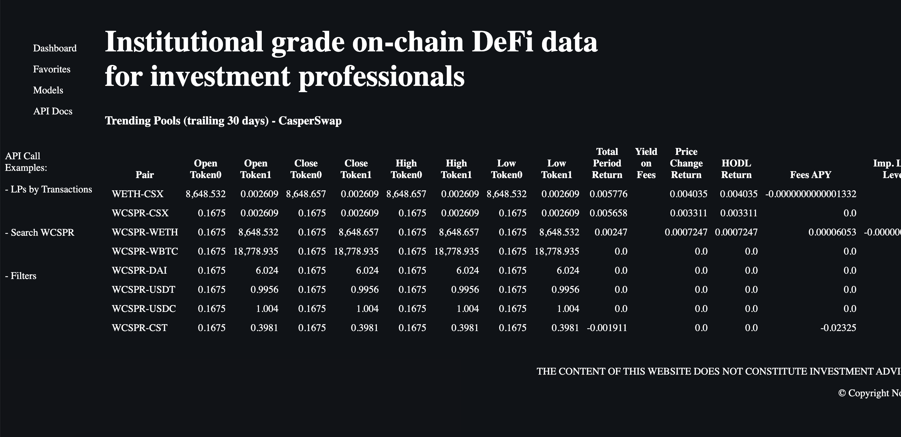
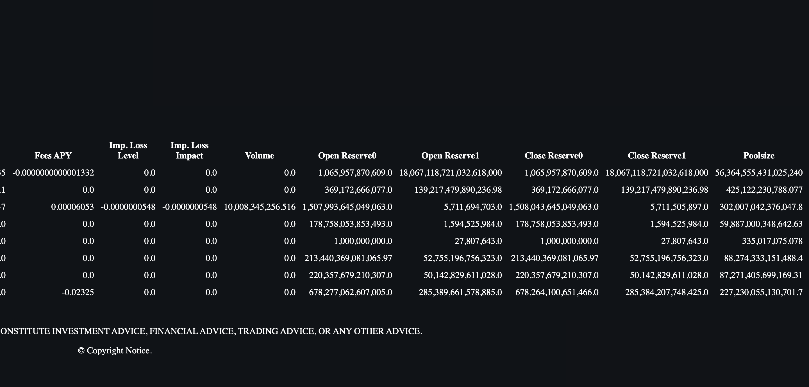
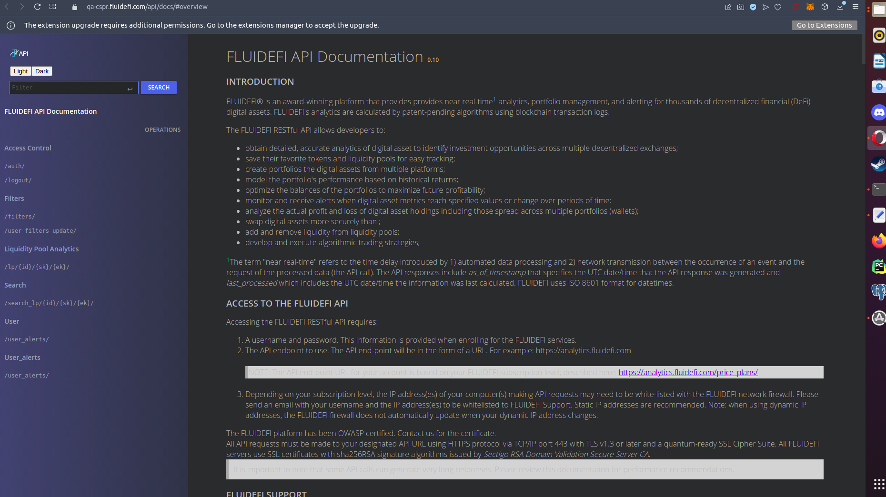
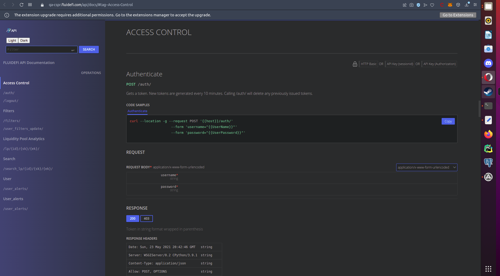
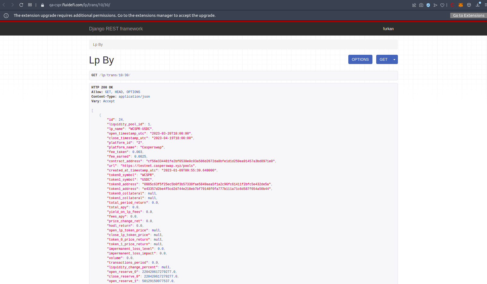
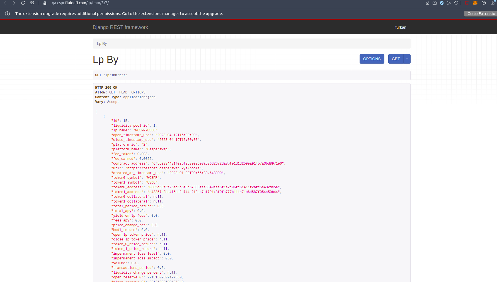

Grant Proposal | [451 - Analytics & Portfolio Management for DeFi Automatic Market Makers (AMM))](https://portal.devxdao.com/public-proposals/451)
------------ | -------------
Milestone | 3
Milestone Title | Project Definition for Portfolio modeling, historical analysis, alerts, & robo-trading for DeFi AMMs
OP | FLUIDEFI
Reviewer | Furkan Ahmet Kara <furkanahmetkara.fk@gmail.com>

# Milestone Details

## Details & Acceptance Criteria

**Details of what will be delivered in milestone:**

API Definition for 
 - Limit & delta alerts by emails
 - Portfolio Modeling
 - Support for a wallet (TBD)
 - API calls for swap, add & remove liquidity 
 - ‘Robo-trading for AMMs’ by combining alerts and swap functionality
 - UI/UX for portfolio modeling, historical analysis, alerts, & robo-trading

**Acceptance criteria:**

Criteria for milestone completion includes successful execution of the following goals:

DOCUMENT: RESTful API calls for creating portfolio models, adding & removing assets, assigning investment amounts, and modeling by historical performance
DOCUMENT: RESTful API calls for calculating profit/loss on holdings comprised of multiple wallets
DOCUMENT: Swap tokens, add & remove liquidity, through scripts that call the FLUIDEFI API

Definition of Done (DOD): Provide the above documents to support the functionality in milestone 1 & 2 with documentation, whitepaper, and examples. This prepares for Milestone #4

**Additional notes regarding submission from OP:**

Milestone 3 is dependent upon the tester having installed the code in two repositories:

1. The FLUIDEFI Caspernet aggregator:
https://github.com/fluidefi/fluidefi-caspernet-aggregator-tools
(Please install this first.)

2. The FLUIDEFI Caspernet analytics: 
https://github.com/fluidefi/fluidefi-caspernet-analytics-tools
(Install this second - milestone 3 is here)

There is developer documentation and QA documentation. Knowledge of docker is essential for testing.

Our team is happy to help CR-DAO with evaluation and support as we did during Milestone 1 via email or Telegram.

## Milestone Submission

The following milestone assets/artifacts were submitted for review:

Repository | Revision Reviewed
------------ | -------------
https://github.com/fluidefi/fluidefi-caspernet-aggregator-tools | d8fdad
https://github.com/fluidefi/fluidefi-caspernet-analytics-tools | 42280e8

# Install & Usage Testing Procedure and Findings

Milestone 3 is only a documentation milestone ,and as agreed with the job poster install and build steps will be referenced to milestone 2 review.

### Install

[Full Install Logs](assets/install.txt)

### Usage

[Full Install Logs](assets/build.txt)

### Usage

"After the program is built, the interface directly welcomes the user.

The following information is provided through the interface.
- Open, close, high, low prices of underlying assets
- total_period_return
- yield_on_lp_fees	
- price_change_ret
- hodl_return
- fees_apy
- impermanent_loss_level
- impermanent_loss_impact
- Volume & Poolsize"(reference to milestone 2)

## Overall Impression of usage testing

Reviewer requested a username and password to see and test API functions and the OP immediately provided it. PDF that provided on the submission is very clear and covering the acceptance criteria.

Requirement | Finding
------------ | -------------
Project builds without errors | PASS 
Documentation provides sufficient installation/execution instructions | PASS
Project functionality meets/exceeds acceptance criteria and operates without error | PASS

# Unit / Automated Testing

"The reviewer was able to successfully run the unit tests. The bash script provided in the README file was able to run the unit tests. The project has 18 unit tests which covers all critical classes and methods. "(reference to milestone 2)

[Full Test Logs](assets/tests.txt)

Requirement | Finding
------------ | -------------
Unit Tests - At least one positive path test | PASS
Unit Tests - At least one negative path test | PASS
Unit Tests - Additional path tests | PASS

# Documentation

### Code Documentation

Properly formatted inline comments on the critical classes and the methods are added to the project. The reviewer thinks that there is a sufficient amount of code documentation.

Code is well documented, all critical classes and methods have proper inline comments. In the reviewer's opinion code documentation is sufficient and this part of the review should PASS.

Requirement | Finding
------------ | -------------
Code Documented | PASS

### Project Documentation

Project documentation has detailed and sufficient documentation about the project. Documentation PDF provided by the OP is well enough. PDF has 17 pages which covers all the acceptance criteria.

[Documentation PDF for milestone 3](assets/DEVxDAO-FLUIDEFI_Milestone_3.pdf)

Also, Project has a website for documentation with a huge coverage:

[Project Documentation Overview](https://qa-cspr.fluidefi.com/api/docs/#overview)

Requirement | Finding
------------ | -------------
Usage Documented | PASS 
Example Documented | PASS

## Overall Conclusion on Documentation

Project documentation is so good, and coverage is huge covering all methods and functions.

The reviewer thinks that project documentation is sufficient enough. 

# Open Source Practices

## Licenses

The Project is released under the MIT License.

Requirement | Finding
------------ | -------------
OSI-approved open source software license | PASS

## Contribution Policies

The project has Contributing and Security Policies and a Code of Conduct. Pull requests and issues are enabled on GitHub.

Requirement | Finding
------------ | -------------
OSS contribution best practices | PASS

# Coding Standards

Actions and CodeQL is activated on GitHub, which is really important for a open source project.

## General Observations

Project has clear and well documented code. Project has a good structure overall ,and the documentation coverage is very good overall. Project has good open source practices enabled and activated.

# Final Conclusion

The milestone submission meets the acceptance criteria. OP provided a password and username to test API calls. Here are some example screenshots.

The reviewer thinks that this milestone submission should PASS

# Recommendation

Recommendation | PASS
------------ | -------------

