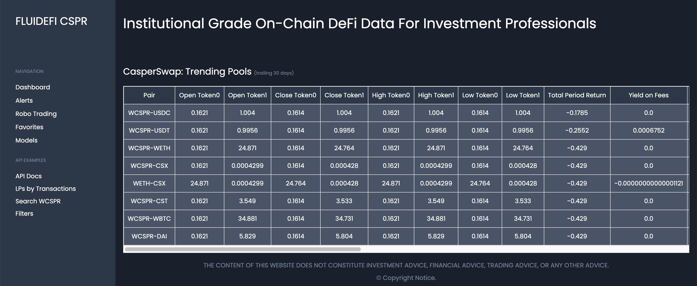
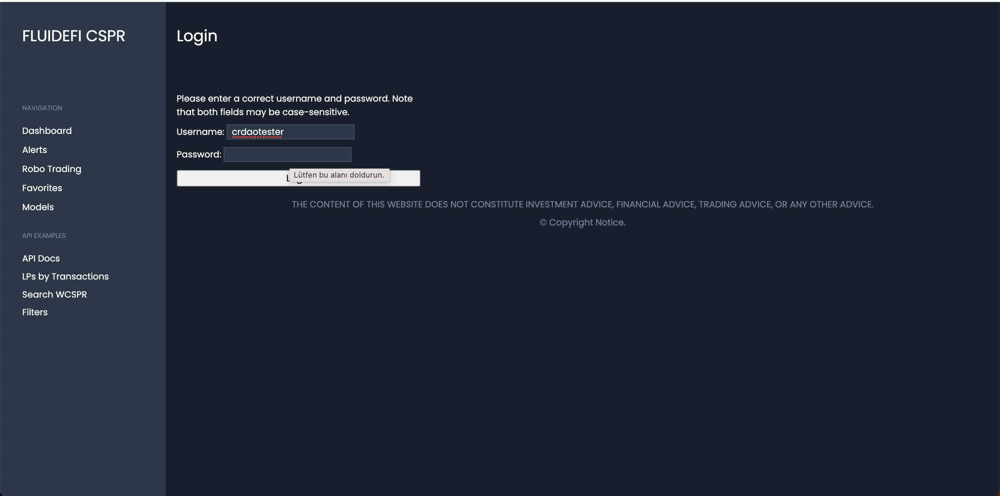
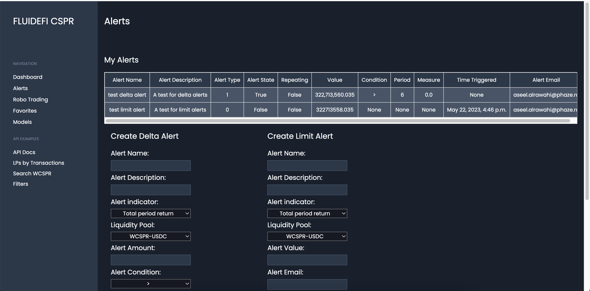
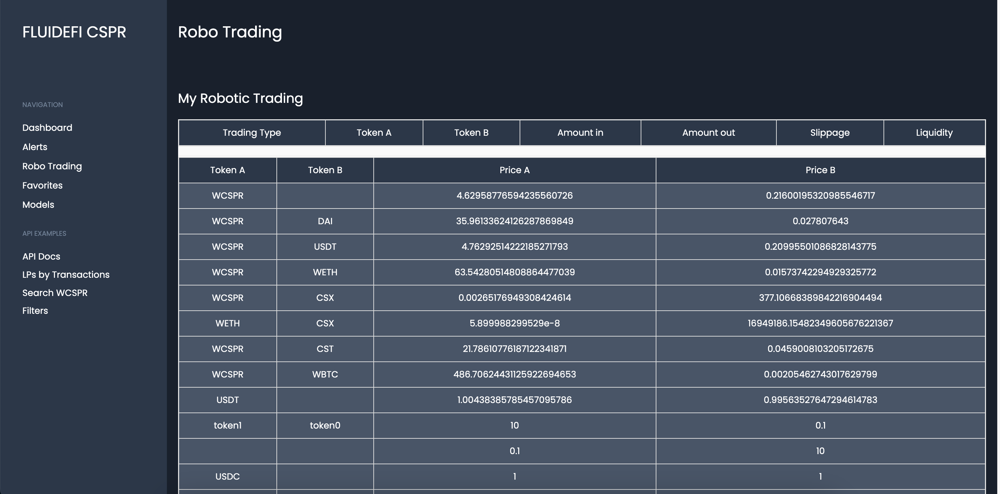
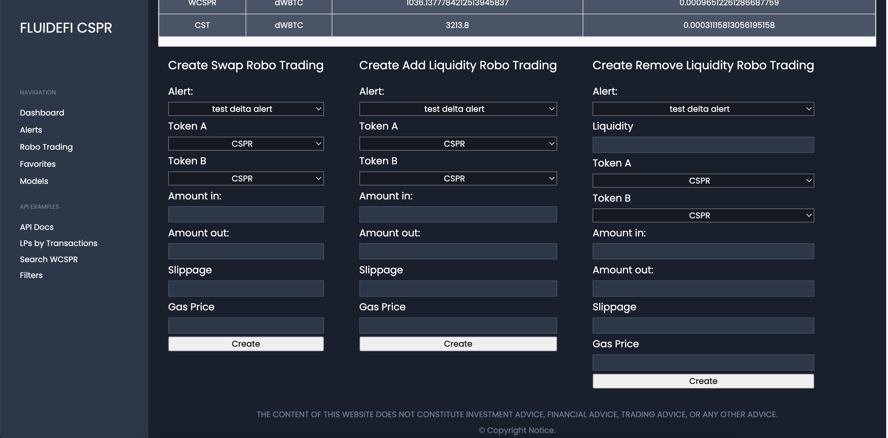
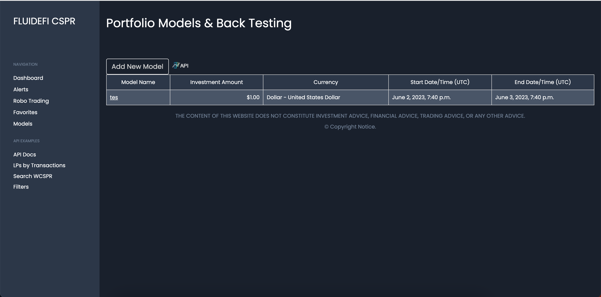
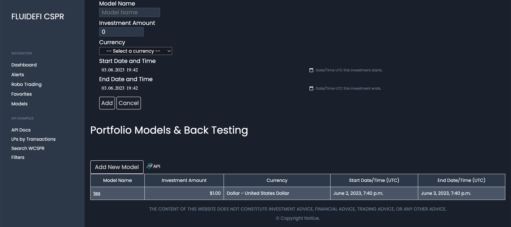

Grant Proposal | [451 - Analytics & Portfolio Management for DeFi Automatic Market Makers (AMM))](https://portal.devxdao.com/public-proposals/451)
------------ | -------------
Milestone | 4
Milestone Title | Portfolio modeling, historical analysis, alerts, & robo-trading for DeFi AMMs
OP | FLUIDEFI
Reviewer | Muhammed Didin <mdidin80@gmail.com>

# Milestone Details

## Details & Acceptance Criteria

**Details of what will be delivered in milestone:**

Fully tested web browser based UI/UX that supports the above functionality complete with documentation.

**Acceptance criteria:**

RESTful API calls for creating portfolio models, adding & removing assets, assigning investment amounts, and modeling by historical performance
RESTful API calls for calculating profit/loss on holdings comprised of multiple wallets
Swap tokens, add & remove liquidity, through scripts that call the FLUIDEFI API
All API calls passing test scripts
Web front-end that uses API calls
Published documentation including metrics

**Additional notes regarding submission from OP:**

As of this milestone submission, CasperSwap is operational on the latest testnet and this project matches.
The QA version can be tested here: https://qa-cspr.fluidefi.com/ 
Please note, a lack of arbitrage on testnet leads to some unusual metrics given dollar-pegged tokens do not equal $1.00.
In addition to the fluidefi-caspernet-analytics-tools repo, the swap, add, & remove liquidity functionality is located in this repo:
https://github.com/fluidefi/fluidefi-caspernet-wallet-tools

## Milestone Submission

The following milestone assets/artifacts were submitted for review:

Repository | Revision Reviewed
------------ | -------------
https://github.com/fluidefi/fluidefi-caspernet-wallet-tools | 9be73f9
https://github.com/fluidefi/fluidefi-caspernet-analytics-tools | 453cb1d

# Install & Usage Testing Procedure and Findings

Following the instructions in the README file of the repository, the reviewer was able to successfully build and run the source code and use the project on macOS Monterey.

### Install

[Full Install Logs](assets/install.txt)

### Build

[Full Build Logs](assets/build.txt)

### Usage

After the program is built, the interface directly welcomes the user.

The following information is provided through the main page.
- Open, close, high, low prices of underlying assets
- total_period_return
- yield_on_lp_fees	
- price_change_ret
- hodl_return
- fees_apy
- impermanent_loss_level
- impermanent_loss_impact
- Volume & Poolsize

For reaching the Alerts, Robo Trading, Favorites and Models pages, the user needs to enter his/her credentials. The reviewer used the credentials provided by the OP.

If the user enters wrong credentials, the webpage gives a proper error message.

The website has the following screens.

Alerts page:

Robo trading page:

Models page:

For adding a new model, the user shall press the "Add New Model" button.

Add new model page:

It appears on the "Models" page after a new model has been added.

Also API documentation is available from [this](https://qa-cspr.fluidefi.com/api/docs/#overview) page.

## Overall Impression of usage testing

The project builds without errors, the documentation provides sufficient installation and execution instructions, and the project functionality meets the acceptance criteria and operates without errors. It has been observed by the reviewer that the user experience and user interface have been improved compared to previous milestones.

Requirement | Finding
------------ | -------------
Project builds without errors | PASS 
Documentation provides sufficient installation/execution instructions | PASS
Project functionality meets/exceeds acceptance criteria and operates without error | PASS

# Unit / Automated Testing

The reviewer was able to successfully run the unit tests. The bash script provided in the README file was able to run the unit tests. The project has 18 unit tests which covers all critical classes and methods. 

[Full Test Logs](assets/tests.txt)

Requirement | Finding
------------ | -------------
Unit Tests - At least one positive path test | PASS
Unit Tests - At least one negative path test | PASS
Unit Tests - Additional path tests | PASS

# Documentation

### Code Documentation

Properly formatted inline comments on the critical classes and the methods are added to the project. The reviewer thinks that there is a sufficient amount of code documentation.

Requirement | Finding
------------ | -------------
Code Documented | PASS

### Project Documentation

The README file has sufficient basic usage instructions for the applied methods. Using the project documentation, the reviewer was able to create, run, and use the project. Project documentation has detailed and sufficient documentation about the project.

Requirement | Finding
------------ | -------------
Usage Documented | PASS 
Example Documented | PASS

## Overall Conclusion on Documentation

Documentation explains everything clearly and in detail.

In the reviewer's opinion, the project has sufficient documentation. 

# Open Source Practices

## Licenses

The Project is released under the MIT License.

Requirement | Finding
------------ | -------------
OSI-approved open source software license | PASS

## Contribution Policies

The project has Contributing and Security Policies and a Code of Conduct.

Requirement | Finding
------------ | -------------
OSS contribution best practices | PASS

# Coding Standards

## General Observations

The project has well-structured and readable code. Code and project documentation is sufficient and they provide the necessary information to use the program. The project complies with open source standards.

# Final Conclusion

The project provides the functionality described in the grant application and milestone acceptance criteria. 

Thus, in the reviewer's opinion, this submission should PASS.

# Recommendation

Recommendation | PASS
------------ | -------------

