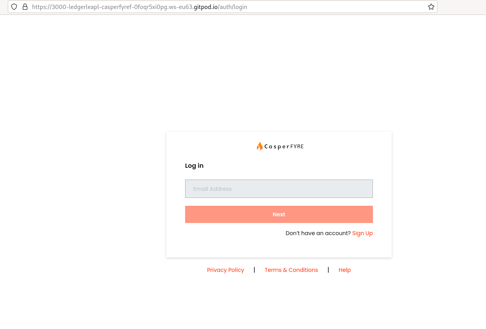

Grant Proposal | [460 - Mainnet token distribution system with API, UX, Accounting, and Security tools](https://portal.devxdao.com/public-proposals/460)
------------ | -------------
Milestone | 2
Milestone Title | Interfaces and remaining system features
OP | LedgerLeap
Reviewer | Muhammet Kara

# Milestone Details

## Details & Acceptance Criteria

**Details of what will be delivered in milestone:**

The second of two milestones will include the design, development, and delivery of a react front end. User-facing views will include a registration form, 2FA screens, user dashboard, a tab for API requests table, a tab for IP whitelist management, associated screens for managing IPs, and a settings area. For Admins, the UX will include login, a tab for applications, views to process applications, a tab for the API keys table, tab for API requests table, tab for wallets, and tab for admin settings. Support functions and views will include reset passwords, disable keys, change keys, deny accounts, approve accounts, add/remove IP, user screen management, API call detail viewing, adjusting rate limits, adjusting accessible wallets, viewing wallet balances, and tracking TXIDs for transfers. This phase will require UX design, mockup production, and development of all front end views and associated backend support functions. We expect 3 days of planning/designing and 12 working days of development with 3 developers assigned, including testing.

**Acceptance criteria:**

The environment will be installable with clear installation instructions to tie to the delivery in milestone 1, and all listed features above will function including tests for
* reset passwords
*  disable keys
* change keys
* deny accounts
* approve accounts
* add/remove IP
* user screen management
* API call detail viewing
* adjusting rate limits
* adjusting accessible wallets
* viewing wallet balances
* tracking TXIDs for transfers
* Tables for transfers, users, wallets.

**Additional notes regarding submission from OP:**

Frontend

License: Apache 2.0

The URL of the frontend staging deployment is at:  
https://casperfyre.com/

Frontend codebase has been updated and completed to include all required views and controllers. User and admin roles have different sets of views. Layouts, buttons, tables, settings panel, etc have been designed in accordance to the specifications of the grant description. Global styling is also consistent with the specs.

Simple overview of UX:  
- Login/Registration pages are standardized with 2fa, if applicable.  
- Main Dashboard contains recent API call history, API key overview  
, and wallet overview.  
- “My API logs” page contains all API call history with breakdown of current standing limits.  
- “Keys and Wallets” page contains full view and management of one’s keys, key history, wallets, and wallet history.  
- “Settings” page contains basic account settings control, user details, and developer documentation link.  
- “Applications” page (admin role only) allows admins to manage users (applicants) and applications to use the API.  
- “API Keyholders” (admin role only) page allows admins to view and manage an overview of all API key holders on the platform. This is where an admin would enable/disable user accounts/API keys etc.

A full usage guide and instruction can be found at https://github.com/ledgerleapllc/casperfyre-frontend/blob/main/README.md

## Milestone Submission

The following milestone assets/artifacts were submitted for review:

Repository | Revision Reviewed
------------ | -------------
https://github.com/ledgerleapllc/casperfyre-frontend | 7692cd5
https://github.com/ledgerleapllc/casperfyre-backend | 0db12e7

# Install & Usage Testing Procedure and Findings

Reviewer used an Ubuntu 20.04 LTS Gitpod cloud machine and an Ubuntu 20.04 LTS local virtual machine to test the project.

Reviewer followed instructions given on the README to [build](assets/build-and-run.md) and run the project successfully.

Further user testing was done on [casperfyre.com](https://casperfyre.com/) live instance provided by the OP.

## Overall Impression of usage testing

Project works as expected. It builds without errors and its functionality covers the acceptance criteria for this milestone.

Requirement | Finding
------------ | -------------
Project builds without errors | PASS
Documentation provides sufficient installation/execution instructions | PASS
Project functionality meets/exceeds acceptance criteria and operates without error | PASS

# Unit / Automated Testing

The reviewer observed that both the backend and the frontend tests run successfully, and the critical functionality is tested, covering both the positive and the negative paths.

- [Backend tests](assets/backend-tests.md)

Requirement | Finding
------------ | -------------
Unit Tests - At least one positive path test | PASS
Unit Tests - At least one negative path test | PASS
Unit Tests - Additional path tests | PASS

# Documentation

### Code Documentation

Reviewer thinks that the code documentation is sufficient, covering critical sections of the code-base, with comments that allow auto-generation of the code documentation in HTML format.

- [Docs](assets/docs.tar.gz)

Requirement | Finding
------------ | -------------
Code Documented | PASS

### Project Documentation

Reviewer thinks that the project is sufficiently documented, with usage explanation and examples.

Requirement | Finding
------------ | -------------
Usage Documented | PASS
Example Documented | PASS

## Overall Conclusion on Documentation

Documentation for the project is sufficient for this milestone.

# Open Source Practices

## Licenses

The Project is released under the Apache-2.0 License, which is an OSI-approved open-source license, and matches the license promised on the grant proposal.

Requirement | Finding
------------ | -------------
OSI-approved open source software license | PASS

## Contribution Policies

Project contains CONTRIBUTING and SECURITY policies. Pull requests and issues are enabled on the repository and the project is set up for public participation.

Requirement | Finding
------------ | -------------
OSS contribution best practices | PASS

# Coding Standards

## General Observations

Source code is well-written and thought out. It is easily readable. General best coding practices are used throughout the project. Overall sufficient work is done.

# Final Conclusion

During the course of this review, a number of security vulnerabilities were discovered and reported by the reviewer, and it was observed that the OP quickly fixed the issues. Then a number of small issues were reported again as they were encountered by the reviewer, and the OP was again very responsive, and quick to fix and improve the project based on the feedback. The reviewer praises the OP for their cooperation, responsiveness, and willingness to improve their product.

After all the fixes and improvements by the OP, the reviewer thinks that the project is in a working state, covering the acceptance criteria for the milestone and the grant. Thus, the reviewer suggests this milestone to PASS.

# Recommendation

Recommendation | PASS
------------ | -------------

