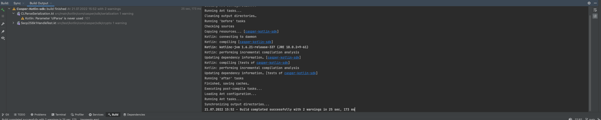
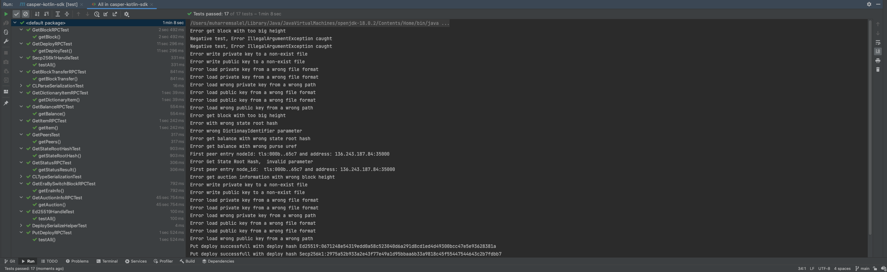

Grant Proposal | [469 - Casper Kotlin SDK](https://portal.devxdao.com/public-proposals/469)
------------ | -------------
Milestone | 2
Milestone Title | Final release of Kotlin SDK
OP | Huy Tran
Reviewer | Muharrem Salel

# Milestone Details
The review will cover the second milestone criteria set forth below.

## Details & Acceptance Criteria

**Details of what will be delivered in milestone:**

- Kotlin version of CLType primitives
- Kotlin version for Casper Domain Specific Objects 
- Serialization of Casper Domain Specific Objects 
- ED25519/SECP256K1 key pairs Wrappers implemented
- PutDeploy call implemented and tested
- SDK calls will return Casper Domaine Specific Objects

 Unit test full coverage

 **Acceptance criteria:**

 - Kotlin version of CLType primitives 
 - Kotlin version for Casper Domain Specific Objects 
 - Serialization of Casper Domain Specific Objects 
 - ED25519/SECP256K1 key pairs Wrappers implemented 
 - PutDeploy call implemented and tested 
 - SDK calls will return Casper Domaine Specific Objects 
 
 Unit test full coverage

 **Additional notes regarding submission from OP:**

  - Kotlin version of CLType primitives 
 - Kotlin version for Casper Domain Specific Objects 
 - Serialization of Casper Domain Specific Objects 
 - ED25519/SECP256K1 key pairs Wrappers implemented 
 - PutDeploy call implemented and tested 
 - SDK calls will return Casper Domaine Specific Objects 
 
 Unit test full coverage

 ## Milestone Submission

The following milestone assets/artifacts were submitted for review:

Repository | Revision Reviewed
------------ | -------------
https://github.com/tqhuy2018/Casper-Kotlin-sdk | 6ee0ac2

# Install & Usage Testing Procedure and Findings

Following the instructions in the README of https://github.com/tqhuy2018/Casper-Kotlin-sdk, the reviewer was
able to successfully build the source code for this milestone. 

## Overall Impression of usage testing

The project builds without errors but with warnings, the documentation provides sufficient installation  and execution instructions especcially for Mac users, and the project functionality meets the acceptance criteria and operates without errors. Building project from maven was requiring special efford and toold of IDE, then when reiewer talked with OP, OP quickly fixed the problem

``` sh
Executing pre-compile tasks...
Loading Ant configuration...
Running Ant tasks...
Cleaning output directories…
Running 'before' tasks
Checking sources
Copying resources... [casper-kotlin-sdk]
Kotlin: connecting to daemon
Kotlin: compiling [casper-kotlin-sdk]
Kotlin: kotlinc-jvm 1.6.21-release-337 (JRE 18.0.2+9-61)
Kotlin: performing incremental compilation analysis
Updating dependency information… [casper-kotlin-sdk]
Kotlin: compiling [tests of casper-kotlin-sdk]
Kotlin: performing incremental compilation analysis
Updating dependency information… [tests of casper-kotlin-sdk]
Running 'after' tasks
Finished, saving caches…
Executing post-compile tasks...
Loading Ant configuration...
Running Ant tasks...
Synchronizing output directories...
21.07.2022 15:52 - Build completed successfully with 2 warnings in 25 sec, 173 ms

```


[Build Logs - mvn clean package](assets/mvn-clean-package.md)

[Build Logs - mvn package](assets/mvn-package.md)

Requirement | Finding
------------ | -------------
Project builds without errors | PASS
Documentation provides sufficient installation/execution instructions | PASS with Notes
Project functionality meets/exceeds acceptance criteria and operates without error | PASS


# Unit / Automated Testing

The project has unit tests for all critical classes and methods.



[Test Logs - mvn test](assets/mvn-test.md)

Requirement | Finding
------------ | -------------
Unit Tests - At least one positive path test | PASS
Unit Tests - At least one negative path test | PASS 
Unit Tests - Additional path tests | PASS

# Documentation

### Code Documentation

Low-level documentation in the project is exist and it covers almost all classes and methods. 

Requirement | Finding
------------ | -------------
Low level function documentation | PASS 

### Project Documentation

The README file provides necessary informations to build project and run the tests. It provides all necessary information with visual aid which is a good touch. Usage documentation is also shows how to use sdk with example project as well as how to get necessary jar file. However, creating this jar file over maven was not easy, and it did not mentioned in the documentation. Then when reviewer talked with OP, OP fixed the documentation and problem of maven. 

Requirement | Finding
------------ | -------------
Sufficient Project Documentation | PASS with Notes 

# Open Source Practices

## Licenses

The Project is released under the MIT License.

Requirement | Finding
------------ | -------------
OSI-approved open source software license | PASS

## Contribution Policies

Pull requests and Issues are enabled on the repository. The project also has CONTRIBUTING and SECURITY policy.

Requirement | Finding
------------ | -------------
OSS contribution best practices | PASS

# Coding Standards

## General Observations

Code is generally well-structured and readable. The project is committed to GitHub and both the unit tests and the manual tests pass.

# Final Conclusion

The project provides the functionality described in the grant application and milestone acceptance criteria.

Thus, in the reviewer's opinion, this submission should pass with notes.

# Recommendation

Recommendation | PASS with Notes
------------ | -------------
