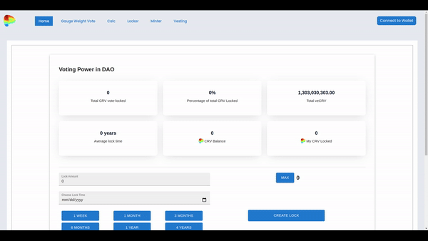
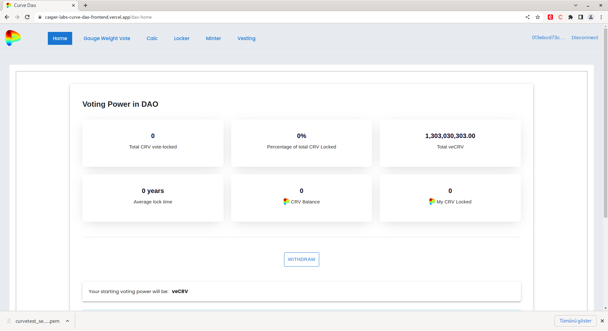

Grant Proposal | [500 - CurveDAO Staking Model](https://portal.devxdao.com/public-proposals/500)
------------ | -------------
Milestone | 1
Milestone Title | Contracts
OP | CaptainBernardo
Reviewer | Muhammet Kara

# Milestone Details
The review will cover the first milestone criteria set forth below.

## Details & Acceptance Criteria

**Details of what will be delivered in milestone:**

**Deliverables**
The following contracts split up into crates:
- ChildStreamer
- CurvePool
- CurveRewards
- CurveTokenV1-V3 (The logic is built on top of the previous version so all versions need to be ported)
- ERC20-CRV
- ERC20-LP (likely just reuse our LP token crate)
- FeeDistributor
- GaugeController
- LiquidityGauge V1-V4 (The logic is built on top of the previous version so all versions need to be ported)
- LiquidityGauge Reward
- Minter
- Pausable
- RewardClaimer
- RewardsOnlyGuage
- RewardStream
- Synthetic-RewardsDistributionReceipient
- Synthetix Staking Contracts (either Arcadia’s version or a new one)
- UnitVault
- VestingEscrow
- VestingEscrowFactory
- VestingEscrowSimple
- VotingEscrow

**Acceptance criteria:**

Due to the complexity of this, we will just deploy a version of this contract that’s set up to work with a testnet instance of Casper Swap

CRDAO: Verification of this milestone will include a suite of unit tests for each contract.  Due to the complexity of bootstrapping this system, our team will provide a test environment with a running version of casper swap

**Additional notes regarding submission from OP:**

 Completed per acceptance criteria

## Milestone Submission

The following milestone assets/artifacts were submitted for review:

Repository | Revision Reviewed
------------ | -------------
https://github.com/Rengo-Labs/CasperLabs-Curve-DAO | e6ef46b .. a806de2

# Install & Usage Testing Procedure and Findings

The reviewer followed the instructions on the README of the project to build and deploy to the Testnet, and test its functionality by running the tests. The procedure was carried out on Ubuntu 20.04.

At the first attempts of following the instructions, the reviewer encountered a number of issues/errors, mostly at the documentation level, causing the project to be not buildable/deployable/usable, which would normally result in a review with a FAIL recommendation. The reviewer provided the OP with the feedback coming out of these attempts. The OP fixed & improved the project and its documentation based on the feedback, and informed the reviewer that the project is now ready to be reviewed. The review presented here covers the latest version of the project which includes all of those fixes and the improvements.

Reviewer first installed the prerequisites by following the instructions on the main README, and then built and deployed the smart contracts by following the instructions on the README.

- [Build logs](assets/build.md)
- [TestNet deploy hashes](assets/deploy-hashes)

Then the reviewer observed the user interface in action, on the demo video provided by the OP.

Then the reviewer observed that it was possible to sign into the temporary installation, provided by the OP as promised on the respective milestone's acceptance criteria.

It was also observed that the Gauge Weight Vote menu was returning a blank screen, and the OP informed the reviewer that it is out of scope for this submission, and it would be a piece that will be completed by another project later.

## Overall Impression of usage testing

It was observed that the project builds and passes the automated tests successfully after the fixes and improvements by the OP, and the documentation provides sufficient installation/execution instructions. However, the reviewer thinks that the documentation still has room for improvement towards more explanations about the command parameters, better gas amount values on the sample commands, as well as more explanations covering the entirety of the project as it is a complex one which may be hard to understand, with many different smart contract units. It is also worth mentioning that no heavy/extensive testing on the UI was done during this review due to that part being in the scope of the next milestone of the project.

Requirement | Finding
------------ | -------------
Project builds without errors | PASS
Documentation provides sufficient installation/execution instructions | PASS
Project functionality meets/exceeds acceptance criteria and operates without error | PASS with Notes

# Unit / Automated Testing

_Summarize the result of the unit testing / automated testing / integration testing provided in the Milestone. Feel free to include
automated test output, either as text, image or other artifact. Provide a `PASS`, `FAIL`, or `PASS With Notes` for the requirements
below. In the case of `PASS With Notes`, make sure that the notes for improvement are clearly spelled out in this section._

Requirement | Finding
------------ | -------------
Unit Tests - At least one positive path test | PASS / FAIL / PASS with Notes
Unit Tests - At least one negative path test | PASS / FAIL / PASS with Notes
Unit Tests - Additional path tests | PASS / FAIL / PASS with Notes

# Documentation

### Code Documentation

_Summarize the code level documentation you encountered. Provide a `PASS`, `FAIL`, or `PASS With Notes` for the requirements
below. In the case of `PASS With Notes`, make sure that the notes for improvement are clearly spelled out in this section._

Requirement | Finding
------------ | -------------
Code Documented | PASS / FAIL / PASS with Notes

### Project Documentation

_Summarize the project level documentation you encountered. This covers the information provided in the README for the project, 
as well any exampled provided. Provide a `PASS`, `FAIL`, or `PASS With Notes` for the requirements
below. In the case of `PASS With Notes`, make sure that the notes for improvement are clearly spelled out in this section._

Requirement | Finding
------------ | -------------
Usage Documented | PASS / FAIL / PASS with Notes
Example Documented | PASS / FAIL / PASS with Notes

## Overall Conclusion on Documentation

_Summarize your review of the documentation in this project, including code, usage and examples_

# Open Source Practices

## Licenses

The project is released under Apache-2.0 license, which is an OSI-approved open-source license, and it is the same license promised on the DxD proposal.

Requirement | Finding
------------ | -------------
OSI-approved open source software license | PASS

## Contribution Policies

Project contains CONTRIBUTING, SECURITY and CODE OF CONDUCT policies. Pull requests and Issues are enabled on the repositories and the project is set up for public participation.

Requirement | Finding
------------ | -------------
OSS contribution best practices | PASS

# Coding Standards

## General Observations

_Provide any general observations about the project you want to add to your review. These can be subjective in nature as well, and do not
contribute to your recommendation to pass or fail the submission._

# Final Conclusion

_Summarize your final conclusion, and provide your motivation for your recommendation below. For example, you may say 'Reviewer recommends that this
submission should fail code review, because it does not contain an OSI-approved open source license'_

# Recommendation

Recommendation | PASS / FAIL / PASS with Notes
------------ | -------------
