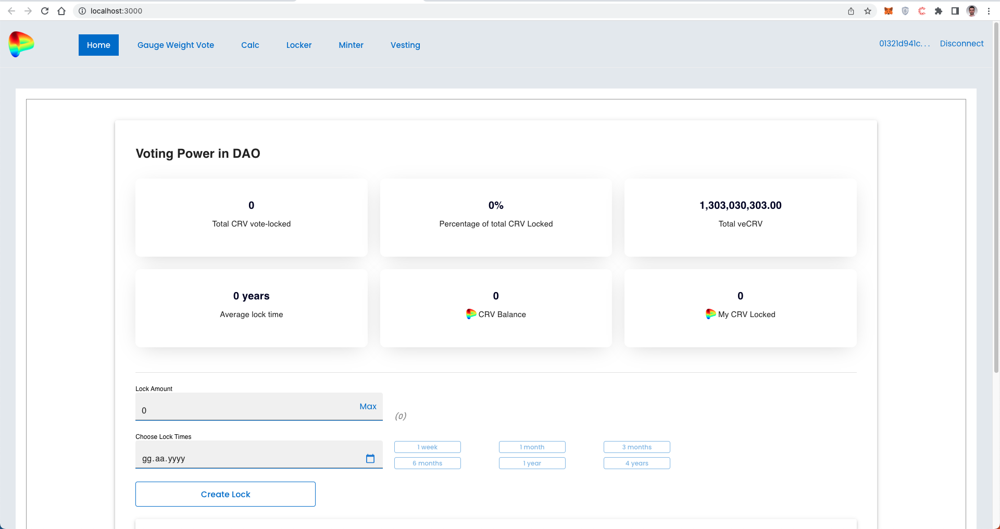

Grant Proposal | [CurveDAO Staking Model](https://portal.devxdao.com/public-proposals/500)
------------ | -------------
Milestone | 2
Milestone Title | Front End
OP | Captain Bernardo
Reviewer | Muhammed Didin <mdidin80@gmail.com>

# Milestone Details

## Details & Acceptance Criteria

**Details of what will be delivered in milestone:**

Deliverables
   - A UX Website + JS Clients for the front end
   - I wish we would just clone the old one but given our experience with Web3 and the CasperSwap UX, it’s easier to just rebuild from scratch

**Acceptance criteria:**

We will add the UX to a testnet instance of CasperSwap as a fully integrated tab.

CRDAO: Verification will be a combination of a limited set of unit tests for the UX testing the primary user flows and manual testing instructions (probably through video, otherwise written) on how to operate the UX.

**Additional notes regarding submission from OP:**

Completed per requirements above

## Milestone Submission

The following milestone assets/artifacts were submitted for review:

Repository | Revision Reviewed
------------ | -------------
https://github.com/Rengo-Labs/CasperLabs-Curve-DAO-Frontend | f77e66d
https://github.com/Rengo-Labs/CasperLabs-Curve-DAO-Backend | e411d92

# Install & Usage Testing Procedure and Findings

Following the instructions in the README file of the repository, the reviewer was able to successfully build and run the source code and use the project on macOS Monterey.

### Build

[Full Build Logs](assets/build.txt)

[Full Install Logs](assets/install.txt)

### Usage

After building, the Home page welcomes the user. 

For connecting with the Casper wallet, the user shall click on "Connect to Wallet" button.

After connecting with Casper Wallet, the address of the connected wallet appears at the top right.

Gauge Weight Vote screen:

Gauge Boost Calculator screen:

Locker screen:

Minter screen:

Vesting screen:

## Overall Impression of usage testing

The project builds without errors, the documentation provides sufficient installation and execution instructions, and the project functionality meets the acceptance criteria and operates without errors.

Requirement | Finding
------------ | -------------
Project builds without errors | PASS 
Documentation provides sufficient installation/execution instructions | PASS
Project functionality meets/exceeds acceptance criteria and operates without error | PASS

# Unit / Automated Testing

First, the reviewer created a mock server on the backend repository to run the unit tests.

[Mock Server Logs](assets/mock-server.txt)

Then, the reviewer queried the bash script specified in the README and run the unit tests.

[Unit Test Logs](assets/tests.txt)

There are 42 unit tests in the project and these tests test each endpoint.

Requirement | Finding
------------ | -------------
Unit Tests - At least one positive path test | PASS
Unit Tests - At least one negative path test | PASS
Unit Tests - Additional path tests | PASS

# Documentation

### Code Documentation

Code level documentation was developed by the project team during the review process. In conclusion properly formatted inline comments on the critical classes and the methods are added to the project. The reviewer thinks that there is a sufficient amount of code documentation.

Requirement | Finding
------------ | -------------
Code Documented | PASS

### Project Documentation

The Readme file has sufficient basic usage instructions for the implemented methods. The reviewer was able to build, run and use the project using project documentation. Also, architecture is explained in the [Architecture Documentation](https://docs.google.com/document/d/1eiP_UrAI2vrevCzMLlosOp23WibxohCiv6BirpU99V0/edit).

Requirement | Finding
------------ | -------------
Usage Documented | PASS 
Example Documented | PASS

## Overall Conclusion on Documentation

In the reviewer's opinion, the project has sufficient documentation. 

# Open Source Practices

## Licenses

The Project is released under the Apache - 2.0 License.

Requirement | Finding
------------ | -------------
OSI-approved open source software license | PASS

## Contribution Policies

The project has Contributing and Security Policies and a Code of Conduct.

Requirement | Finding
------------ | -------------
OSS contribution best practices | PASS

# Coding Standards

## General Observations

The project has well-structured and readable code. Code and project documentation is sufficient and they provide the necessary information to use the program. The project complies with open source standards.

# Final Conclusion

Manual and unit tests show that the project provides the functionality described in the grant application and milestone acceptance criteria. 

Thus, in the reviewer's opinion, this submission should PASS.

# Recommendation

Recommendation | PASS
------------ | -------------

