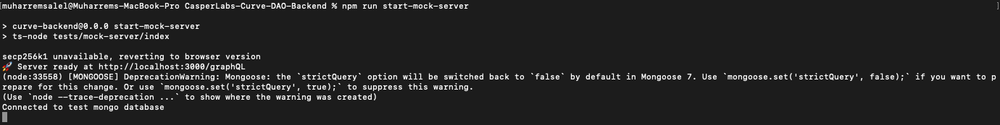

Grant Proposal | [500 - CurveDAO Staking Model](https://portal.devxdao.com/public-proposals/500)
------------ | -------------
Milestone | 3
Milestone Title | Backend
OP | CaptainBernardo
Reviewer | Muharrem Salel

# Milestone Details
The review will cover the third milestone criteria set forth below.

## Details & Acceptance Criteria

**Details of what will be delivered in milestone:**

**Deliverables**
- Backend event aggregation needs to be set up to run the UX.
- Will be built in parallel with Milestone #2.

**Acceptance criteria:**

Our team will likely submit this with the front end so the front end can display up-to-date numbers instead of placeholders as evaluating the UX without a working
backend would be a duplication of effort.

CRDAO: Verification will be provided as a suite of unit tests against the API. The front-end UX milestone's unit test suite may and manual testing instructions
should hit all the APIs to provide integration coverage.

**Additional notes regarding submission from OP:**

 Completed per acceptance criteria

## Milestone Submission

The following milestone assets/artifacts were submitted for review:

Repository | Revision Reviewed
------------ | -------------
https://github.com/Rengo-Labs/CasperLabs-Curve-DAO-Backend | e411d92

# Install & Usage Testing Procedure and Findings

The reviewer followed the instructions on the README of the project to build, and test its functionality by running the tests. The procedure was carried out on Macbook Pro 2019 MacOs.

At the first attempt of following the instructions, the reviewer encountered some problems caused by a lack of information in the documentation then when the reviewer communicate with OP, OP fixed these issues so that the reviewer can build and test the project

Testing the endpoints

Running the tests

-[Tests](assets/test.md)

## Overall Impression of usage testing

It was observed that the project builds and passes the automated tests successfully after the fixes and improvements by the OP, and the documentation provides sufficient installation/execution instructions. However, the reviewer thinks that the documentation still has room for improvement towards more explanations about why and how to use third-party libraries and create the necessary environment to run the project.

Requirement | Finding
------------ | -------------
The project builds without errors | PASS
Documentation provides sufficient installation/execution instructions | PASS with Notes
Project functionality meets/exceeds acceptance criteria and operates without error | PASS

# Unit / Automated Testing

The project has sufficient tests covering both the positive and the negative paths.  The reviewer observed that all of the tests successfully pass.

Requirement | Finding
------------ | -------------
Unit Tests - At least one positive path test | PASS
Unit Tests - At least one negative path test | PASS
Unit Tests - Additional path tests | PASS

# Documentation

### Code Documentation

Low-level documentation in the project exists and it covers almost all classes and methods. 

Requirement | Finding
------------ | -------------
Code Documented | PASS

### Project Documentation

The README files provide the necessary information to build the project and run the tests. However, there are still some points to make improvements to engage with user better.

Requirement | Finding
------------ | -------------
Sufficient Project Documentation | PASS with Notes 

# Open Source Practices

## Licenses

The project is released under the Apache-2.0 license, which is an OSI-approved open-source license, and it is the same license promised in the DxD proposal.

Requirement | Finding
------------ | -------------
OSI-approved open-source software license | PASS

## Contribution Policies

The project contains CONTRIBUTING, SECURITY, and CODE OF CONDUCT policies. Pull requests and Issues are enabled on the repositories and the project is set up for public participation.

Requirement | Finding
------------ | -------------
OSS contribution best practices | PASS

# Coding Standards

## General Observations

The code is generally well-structured and readable. The project has been committed to GitHub and has extensive tests.

# Final Conclusion

The project is generally in very good shape in terms of open-source guidelines. However, project documentation still has room for improvement towards more explanations about why and how to use third-party libraries and create the necessary environment to run the project.

Thus, in the reviewer's opinion, this submission should pass with notes.

# Recommendation

Recommendation | PASS with Notes
------------ | -------------
