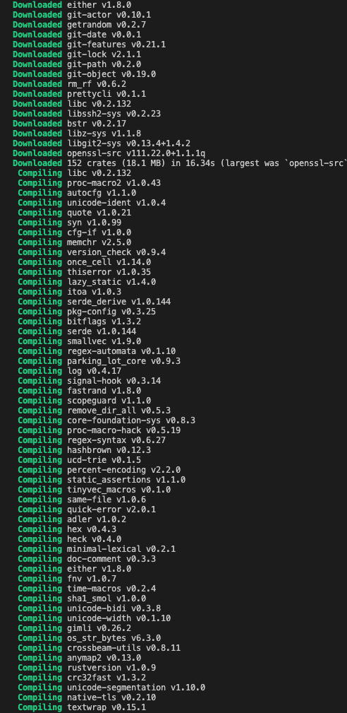
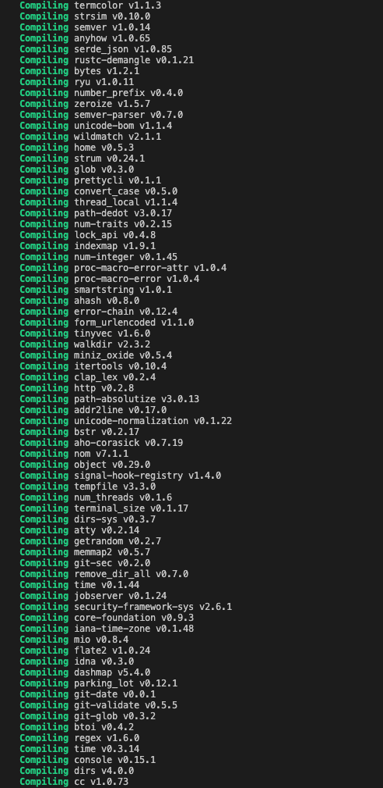
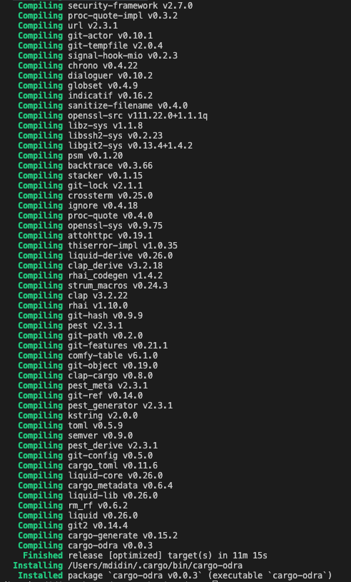
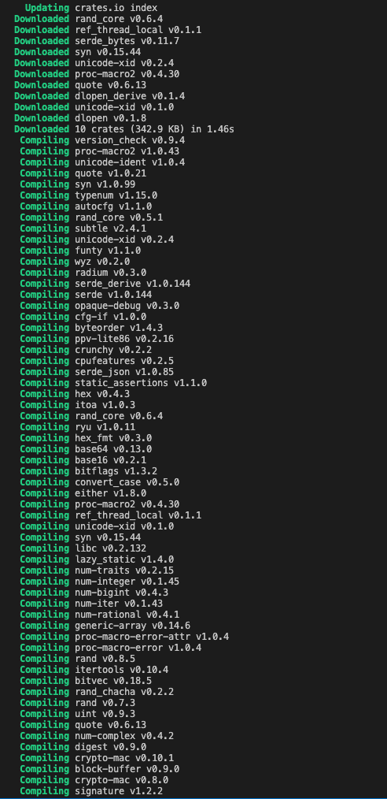
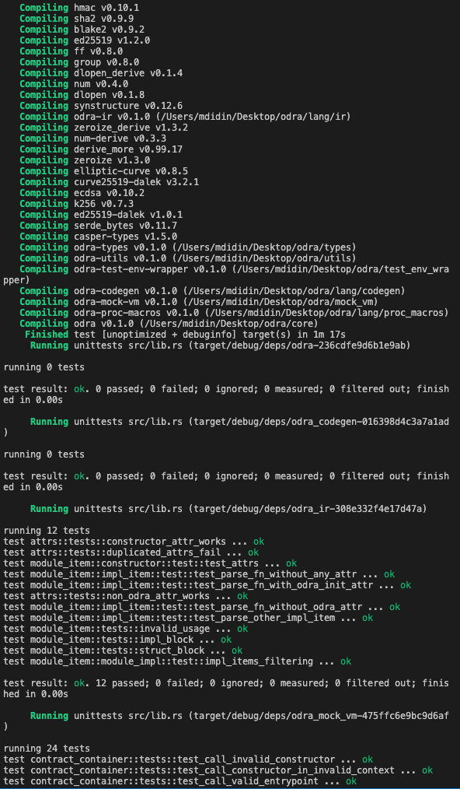
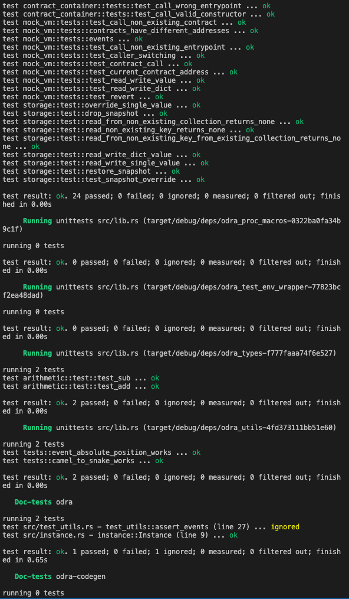
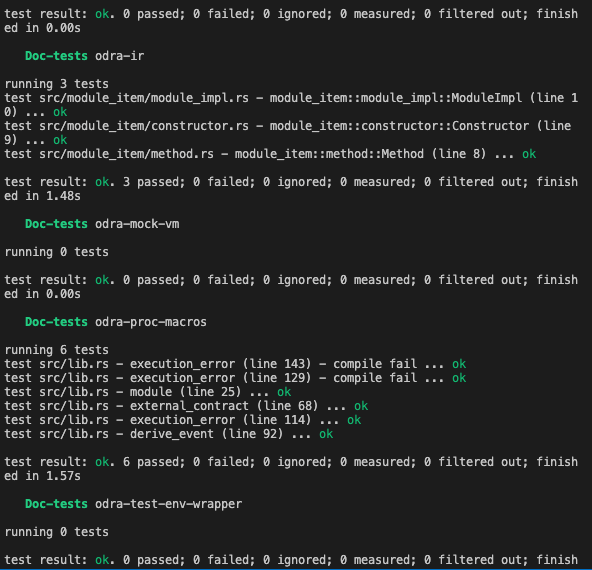

Grant Proposal | [507 - 1 - Odra - Casper Smart Contracts Framework](https://portal.devxdao.com/app/proposal/507)
------------ | -------------
Milestone | 1
Milestone Title | MVP Part 1
OP | Maciej Zieliński
Reviewer | Muhammed Didin <mdidin80@gmail.com>

# Milestone Details

## Details & Acceptance Criteria


**Details of what will be delivered in milestone:**

- Variable, Mapping, Events, #[odra::module] and #[odra:external_contract] macros are available.
- Smart contracts can be run against CasperVM and can produce WASM file for Casper. 

**Acceptance criteria:**

- Version is 0.1.0 released to the http://crates.io, - it is possible to write simple smart contracts and test them using CasperVM.

## Additional notes regarding submission from OP:
We are happy to announce we have achieved goals of milestones #1 and #2.
- We have also provided a console tool called Cargo Odra, that simplifies development process.


## Milestone Submission

The following milestone assets/artifacts were submitted for review:

Repository | Revision Reviewed
------------ | -------------
https://github.com/odradev/odra | 3905380


# Install & Usage Testing Procedure and Findings

Following the installation instructions in the repository,
the reviewer was able to run the project using the instruction guides specified. 







## Overall Impression of usage testing

Following the instructions, the reviewer was able to build and run the project. The documentation provides sufficient installation and execution instructions. The reviewer thinks that project functionality meets the acceptance criteria and operates without errors.

Build logs can be found in the [build_logs.txt](assets/build_logs.txt) file.


Requirement | Finding
------------ | -------------
Project builds without errors | PASS
Documentation provides sufficient installation/execution instructions | PASS 
Project functionality meets/exceeds acceptance criteria and operates without error | PASS 

# Unit / Automated Testing

The project contains sufficient unit tests. The reviewer was able to run all tests locally by following the documentation. But there is at least one test that is being ignored.

````
test src/test_utils.rs - test_utils::assert_events (line 27) ... ignored
````

Test run logs can be found in [tests.txt](assets/test_logs.txt) file. Also, these tests are available and successfully runs on [actions](https://github.com/odradev/odra/actions) part of Github repository.







Requirement | Finding
------------ | -------------
Unit Tests - At least one positive path test | PASS 
Unit Tests - At least one negative path test | PASS 
Unit Tests - Additional path tests | PASS  with notes


# Documentation

### Code Documentation

Some part of code is well documented via low level documentation. But the low level code documentation does not cover all the parts of the project([For example](https://github.com/odradev/odra/tree/0.1.0/lang/proc_macros/src)). Low level code documentation should cover all the parts of the project especially important classes. The reviewer observes that code documentation should be improved in the upcoming milestones.

Requirement | Finding
------------ | -------------
Code Documented | PASS with notes

### Project Documentation


The project has a separate [documentation page](https://docs.rs/odra/latest/odra/). However, the purpose and usage details of the project should be more clearly stated in the readme and documentation. In addition, project codes are kept in 5 different repositories. This makes the documentation much more important in terms of intelligibility. The accepted project proposal states that the documentation will be written in the 3rd milestone. The reviewer observes that these situations should be taken into account when writing the documentation.

Requirement | Finding
------------ | -------------
Usage Documented | PASS with notes
Example Documented | PASS with notes


## Overall Conclusion on Documentation

Based on the reviewer's observations documentation should be improved in the upcoming milestones.

# Open Source Practices

## Licenses

The Project is released under the MIT License.

Requirement | Finding
------------ | -------------
OSI-approved open source software license | PASS

## Contribution Policies

The project is open for contribution via issues and pull requests sections. But the project does not contain any CONTRIBUTING and SECURITY policy that links to a Code of Conduct. The reviewer highly recommends to the development team to create them in the upcoming milestones.


Requirement | Finding
------------ | -------------
OSS contribution best practices | PASS with notes

# Coding Standards

## General Observations

Code is well structured and the project can be easily set up using the documentation via the Github repository. Also, the project provides open source development standards. 

# Final Conclusion

The project provides the functionality described in the grant application and milestone acceptance criteria. However, as stated above, the reviewer observes that there are parts that need improvements.

Thus, in the reviewer opinion this submission should PASS with notes.

# Recommendation

Recommendation | PASS with notes
------------ | -------------