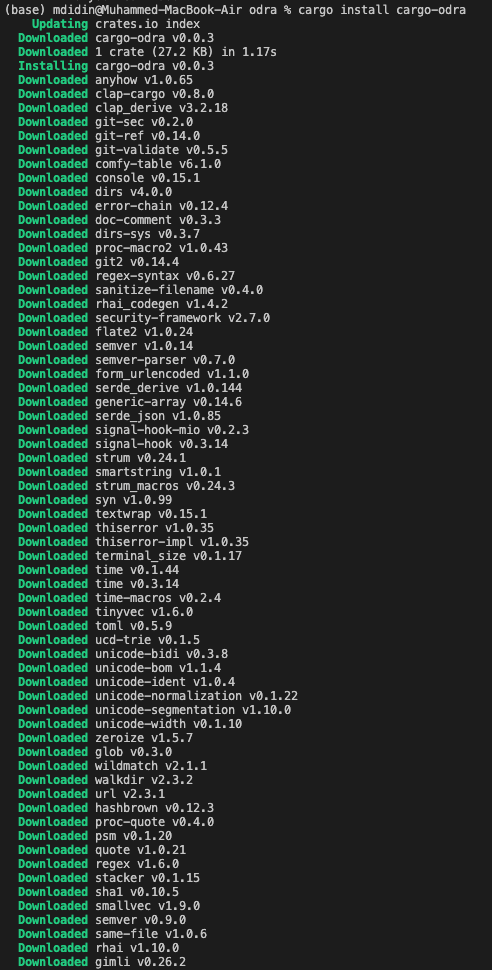

Grant Proposal | [507 - 1 - Odra - Casper Smart Contracts Framework](https://portal.devxdao.com/app/proposal/507)
------------ | -------------
Milestone | 1
Milestone Title | MVP Part 1
OP | Maciej Zieliński
Reviewer | Muhammed Didin <mdidin80@gmail.com>

# Milestone Details

## Details & Acceptance Criteria

**Details of what will be delivered in milestone:**

- Variable, Mapping, Events, #[odra::module] and #[odra:external_contract] macros are available.
- Smart contracts can be run against CasperVM and can produce WASM file for Casper. 

**Acceptance criteria:**

- Version is 0.1.0 released to the http://crates.io, - it is possible to write simple smart contracts and test them using CasperVM.

## Additional notes regarding submission from OP:
We are happy to announce we have achieved goals of milestones #1 and #2.
- We have also provided a console tool called Cargo Odra, that simplifies development process.

## Milestone Submission

The following milestone assets/artifacts were submitted for review:

Repository | Revision Reviewed
------------ | -------------
https://github.com/odradev/odra | 3905380

# Install & Usage Testing Procedure and Findings

Following the installation instructions in the repository,
the reviewer was able to run the project using the instruction guides specified. 

## Overall Impression of usage testing

Following the instructions, the reviewer was able to build and run the project. The documentation provides sufficient installation and execution instructions. The reviewer thinks that project functionality meets the acceptance criteria and operates without errors.

Build logs can be found in the [build_logs.txt](assets/build_logs.txt) file.

Requirement | Finding
------------ | -------------
Project builds without errors | PASS
Documentation provides sufficient installation/execution instructions | PASS 
Project functionality meets/exceeds acceptance criteria and operates without error | PASS 

# Unit / Automated Testing

The project contains sufficient unit tests. The reviewer was able to run all tests locally by following the documentation. Test run logs can be found in [tests.txt](assets/test_logs.txt) file. Also, these tests are available and successfully runs on [actions](https://github.com/odradev/odra/actions) part of Github repository.

Requirement | Finding
------------ | -------------
Unit Tests - At least one positive path test | PASS 
Unit Tests - At least one negative path test | PASS 
Unit Tests - Additional path tests | PASS 

# Documentation

### Code Documentation

Code is well documented and commented. Low-level code documentation is good enough to meet CRDAO code review standards and allow auto-generation of the documentation.

Requirement | Finding
------------ | -------------
Code Documented | PASS

### Project Documentation

The reviewer observes that the project has detailed documentation  for usage with examples, along with the installation, build and test instructions, and documents are well structured.

Requirement | Finding
------------ | -------------
Usage Documented | PASS 
Example Documented | PASS 

## Overall Conclusion on Documentation

Based on the reviewer's observations documentation is detailed and well prepared.

# Open Source Practices

## Licenses

The Project is released under the MIT License.

Requirement | Finding
------------ | -------------
OSI-approved open source software license | PASS

## Contribution Policies

The project is open for contribution via issues and pull requests sections. But the project does not contain any contribution policy or a code of conduct. The reviewer highly recommends to the development team to create one in the upcoming milestones.

Requirement | Finding
------------ | -------------
OSS contribution best practices | PASS with notes

# Coding Standards

## General Observations

Code is well structured and the project can be easily set up using the documentation via the Github repository. Also, the project provides open source development standards.

# Final Conclusion

The project provides the functionality described in the grant application and milestone acceptance criteria. 

Thus, in the reviewer opinion this submission should PASS with notes.

# Recommendation

Recommendation | PASS with notes
------------ | -------------