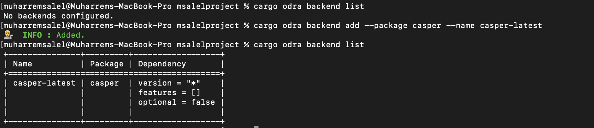
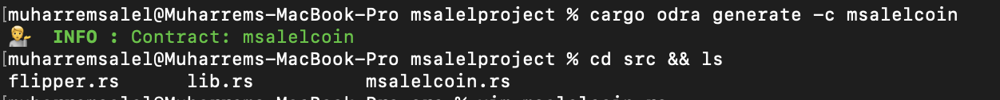

Grant Proposal | [507 - Odra - Casper Smart Contracts Framework](https://portal.devxdao.com/app/proposal/507)
------------ | -------------
Milestone | 2
Milestone Title | MVP Part 2
OP | Maciej Zieliński
Reviewer | Muharrem Salel

# Milestone Details
The review will cover the second milestone criteria set forth below.

## Details & Acceptance Criteria

**Details of what will be delivered in milestone:**

- It is possible to develop and debug smart contracts against the fast mock virtual machine.
- The ERC20 contract is available as an example and can be used as a starting point for the development.

 **Acceptance criteria:**

- Version is 0.2.0 released to http://crates.io.
- Rust debugger can be used to debug smart contracts and tests.
- A standard library is initialized with the ERC20 contract and can be used to develop custom tokens.

 **Additional notes regarding submission from OP:**

- We have also provided a console tool called Cargo Odra, which simplifies the development process.

 ## Milestone Submission

The following milestone assets/artifacts were submitted for review:

Repository | Revision Reviewed
------------ | -------------
https://github.com/odradev/odra | 3905380

# Install & Usage Testing Procedure and Findings

Instructions at the README.md file in the repository(https://github.com/odradev/odra) alone are not clear enough to understand and use the framework. However, when helper repositories and the repository that was created for examples of the framework are combined, they explain a clear path for users, and following instructions step by step helps the user to run and test the codebase. The reviewer followed these steps from a Mac (macOS Monterey - MacBook Pro Intel i9 2019) and an Ubuntu Machine (Ubuntu 18.04.6) and successfully run both tests and the project itself. However, the reviewer encountered some problems while downloading rust and necessary libraries while following the makefile of the example project repository(https://github.com/odradev/odra-examples), then building rust via recommended way solved the problem. The reviewer informed OP about the situation. OP extended the repository accordingly. In my opinion step by step visual aid could be a good touch. However, at this point, it is sufficient enough. 

Additionally, one of the acceptance criteria is releasing version 0.2.0 at http://crates.io. However, the current version at http://crates.io is 0.1.0. The reviewer communicated with the OP about the situation, and OP stated that they released all their work in one release since it is relatively easy. Since OP fulfilled all its promises as functionality and this is not the final milestone, this should not be a reason for failure. However, these criterias should be followed more strictly for the next milestones. 

## Overall Impression of usage testing

The project builds without errors, and documentation provides sufficient installation and execution instructions. However, to reach complete information user needs to read the instructions of all repositories. The project functionality meets the acceptance criteria and operates without errors but with some warnings. 

[Installation](./assets/cargo_install_cargo-odra.md)

[Example repository test](assets/odra_examples_test.md)

Requirement | Finding
------------ | -------------
The project builds without errors | PASS
Documentation provides sufficient installation/execution instructions | PASS with Notes
Project functionality meets/exceeds acceptance criteria and operates without error | PASS

# Unit / Automated Testing

The project has unit tests for all critical classes and methods.

[Creation of example project and test](assets/create_example_project_and_test.md)

[Test example project against casper](assets/example_project_test_against_casper.md)

Requirement | Finding
------------ | -------------
Unit Tests - At least one positive path test | PASS
Unit Tests - At least one negative path test | PASS 
Unit Tests - Additional path tests | PASS

# Documentation

### Code Documentation

Low-level documentation in the project exists and it covers almost all classes and methods. 

Requirement | Finding
------------ | -------------
Low-level function documentation | PASS 

### Project Documentation

The README files provide the necessary information to build the project and run the tests. Usage documentation also shows how to use the framework with an example project. However, to reach complete information user needs to read the instructions of all repositories. It would be helpful to add more explanations to show how to use the project.

Requirement | Finding
------------ | -------------
Sufficient Project Documentation | PASS with Notes 

# Open Source Practices

## Licenses

The project is released under the MIT License.

Requirement | Finding
------------ | -------------
OSI-approved open source software license | PASS

## Contribution Policies

Pull requests and Issues are enabled on the repository. However, the project does not contain any CONTRIBUTING and SECURITY policy that links to a Code of Conduct. The reviewer communicated with the OP about the situation, and they added the files into the repository at the version that covers the next milestone. 

Requirement | Finding
------------ | -------------
OSS contribution best practices | PASS with Notes

# Coding Standards

## General Observations

The code is generally well-structured and readable. The project is committed to GitHub and both the unit tests and the manual tests pass.

# Final Conclusion

The project provides the functionality described in the grant application and milestone acceptance criteria. However, there are certain points noted above that could be improved on the project.

Thus, in the reviewer's opinion, this submission should pass with notes.

# Recommendation

Recommendation | PASS with Notes
------------ | -------------
