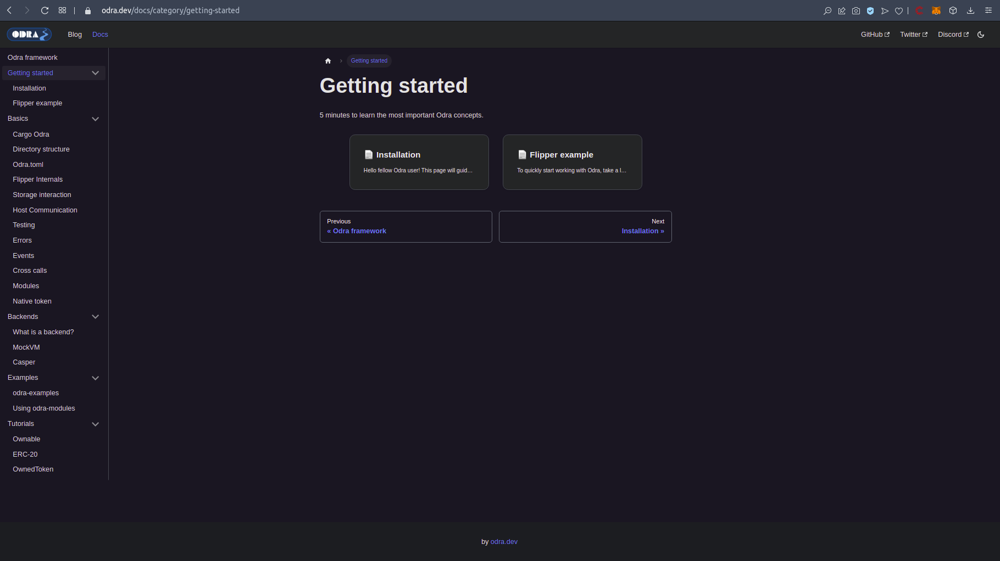
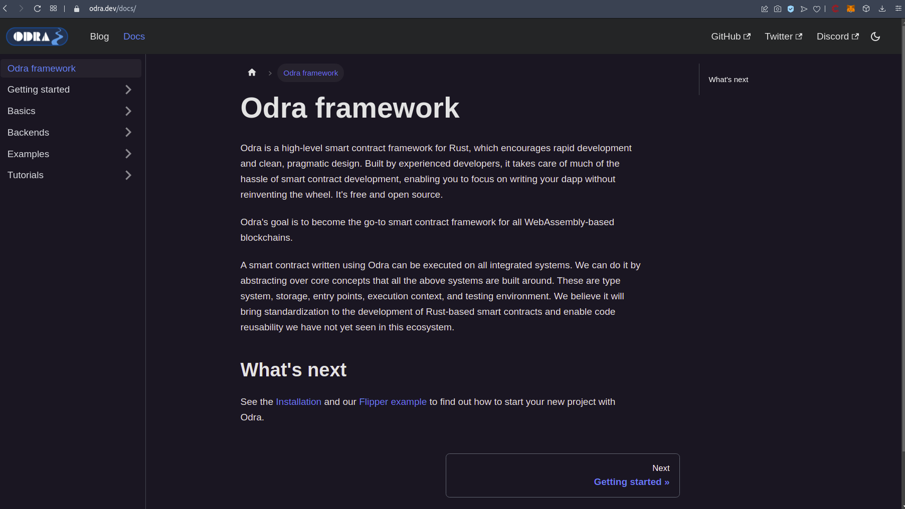
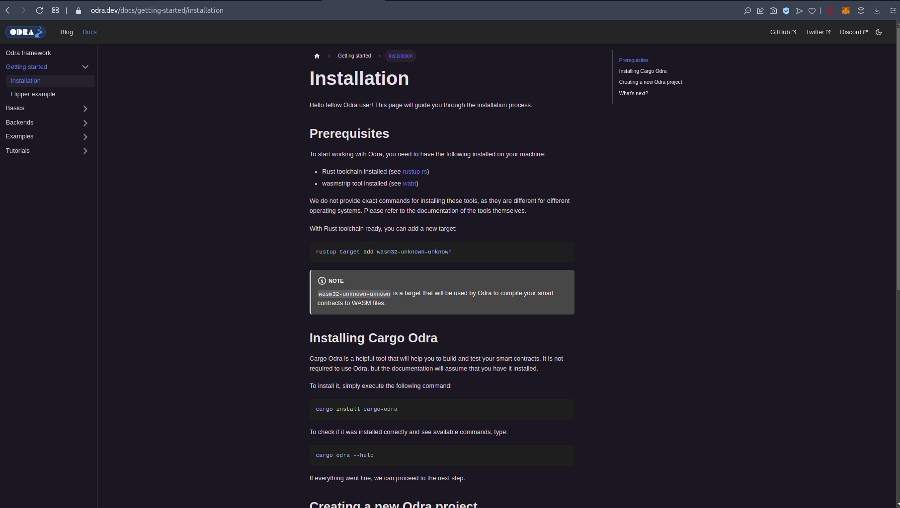
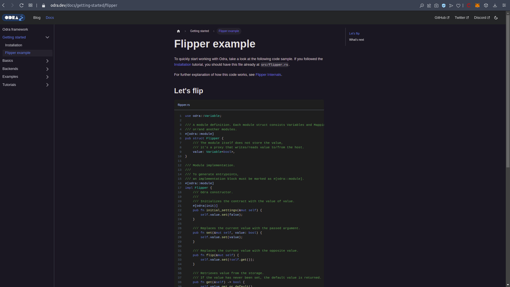

Grant Proposal | [507 - Odra - Casper Smart Contracts Framework](https://portal.devxdao.com/public-proposals/507)
------------ | -------------
Milestone | 3
Milestone Title | MVP Docs
OP | Maciej Zieliński
Reviewers | Furkan Ahmet Kara <furkanahmetkara.fk@gmail.com>

# Milestone Details

## Details & Acceptance Criteria

**Details of what will be delivered in milestone:**

Milestone #3 aims at:
- choosing a web framework for documentation and tutorials,
- designing the documentation structure,
- complete code documentation for features developed in milestones #1 and #2,
- ERC20-based tutorial.

**Acceptance criteria:**

- 0.1.0 version of documentation and tutorials is published.

**Additional notes regarding submission from OP:**

We have wrote the documentation for Odra. We have used Docusaurus as a building platformt. ERC20 tutorial is available.

Docs are available here: https://odra.dev/docs

Markdown files of documentation is available here: https://github.com/odradev/odradev.github.io/tree/master/docusaurus/docs

## Milestone Submission

The following milestone assets/artifacts were submitted for review:

Repository | Revision Reviewed
------------ | -------------
https://github.com/odradev/odra | c5ad96b

# Install & Usage Testing Procedure and Findings

Only "https://odra.dev/docs/" was submitted on the milestone submission but for building, installing, testing, and other standard review purposes [main repo](https://github.com/odradev/odra) of the project used aswell. 

Following the instructions in the [README](https://github.com/odradev/odra) of the project and published docs, reviewer was able to successfully install the project along with it's dependencies, and run the tests for this milestone on Ubuntu 20.04. As mentioned on the review of the milestone 4 there are a lot of links to other repositories and sites on the readme, but it can be better to have more explanation about them in the README of the project instead of just linking to other repositories but published docs were better in this manner. Also, adding a requirement.txt and using it to install prerequisities might be useful too.

[Build Logs](assets/cargoodralogs.md)

## Overall Impression of usage testing

The project builds without errors, the documentation provides sufficient installation and execution instructions. Build instructions are giving required information but can be enhanced and more clear by detailing each step. Same as installation instructions this part also needs improvements in the reviewer's opinion. The project functionality meets/exceeds the acceptance criteria and operates without errors.

[Example Build Logs](assets/examplebuildlogs.md)
[Example Test Logs](assets/exampletestlogs.md)

Requirement | Finding
------------ | -------------
Project builds without errors | PASS
Documentation provides sufficient installation/execution instructions | PASS with Notes
Project functionality meets/exceeds acceptance criteria and operates without error | PASS

# Unit / Automated Testing

The project has sufficient amount of tests, covering both positive and negative paths. All tests run successfully.

[Test Logs](assets/justtestlogs.md)
[Actions](https://github.com/odradev/odra/actions/runs/4627346138)

Requirement | Finding
------------ | -------------
Unit Tests - At least one positive path test | PASS
Unit Tests - At least one negative path test | PASS
Unit Tests - Additional path tests | PASS

# Documentation

### Code Documentation

The critical functions of the project have an acceptable level of code-level documentation.

Requirement | Finding
------------ | -------------
Code Documented | PASS

### Project Documentation

The project has sufficient documentation coverage for usage with examples, along with installation, build, and test instructions. [Published version of the docs](https://odra.dev/docs/) have extensive coverage and organized well.

Requirement | Finding
------------ | -------------
Usage Documented | PASS
Example Documented | PASS

## Overall Conclusion on Documentation

In the reviewer's opinion, this review should pass.

# Open Source Practices

## Licenses

The Project is released under the MIT License.

Requirement | Finding
------------ | -------------
OSI-approved open source software license | PASS

## Contribution Policies

Pull requests and Issues are enabled on the repository, and the project contains a CONTRIBUTING and a SECURITY policy. CODE OF CONDUCT can be added.

Requirement | Finding
------------ | -------------
OSS contribution best practices | PASS

# Coding Standards

## General Observations

The project published publicly on [GitHub](https://github.com/odradev/odra). Project documentation is sufficient enough as general. Unit test coverage is good enough but can be improved, and all test run successfully.

Corresponding version of odra docs released on https://odra.dev/docs/.

# Final Conclusion

The project meets the milestone acceptance criteria.Install and usage instructions are sufficient but can be a bit confusing due to numerous links to other repositories and sites in the repo README. However, [the published docs](	https://odra.dev/docs) are comprehensive and well-organized. Screenshots from the docs can be found below. Tests run successfully.

Thus, in the reviewer's opinion, this submission should PASS with Notes.

# Recommendation

Recommendation | PASS
------------ | -------------
