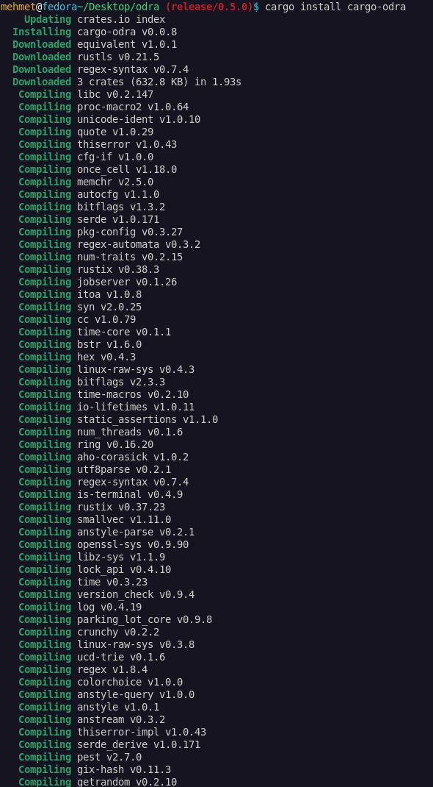
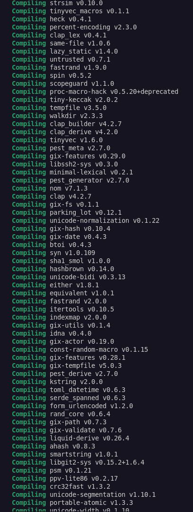
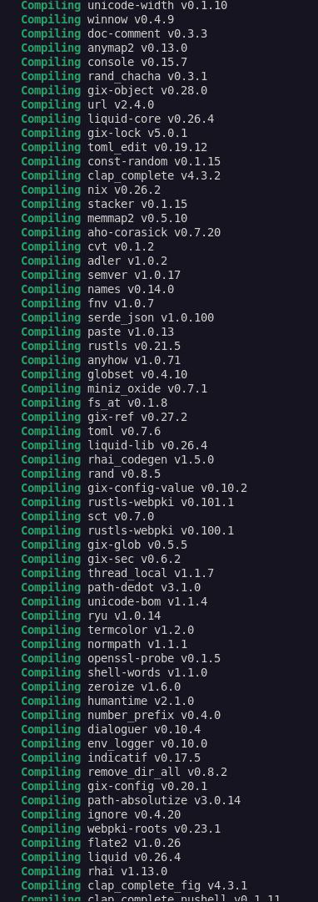
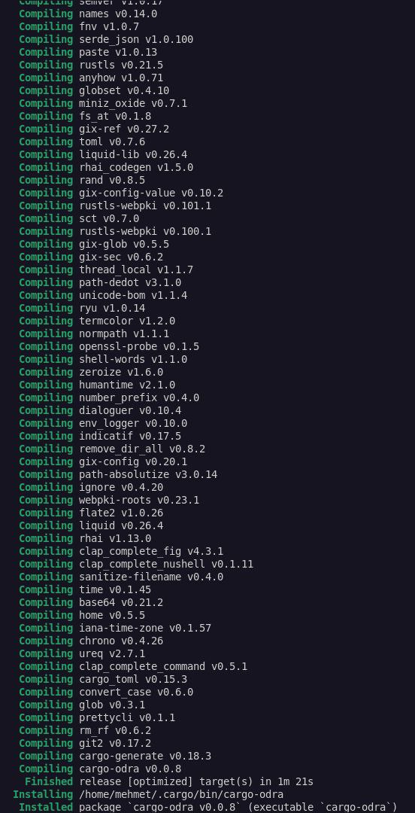

Grant Proposal | [507 - Odra - Casper Smart Contracts Framework](https://portal.devxdao.com/public-proposals/507)
------------ | -------------
Milestone | 6
Milestone Title |  Tokens
OP | zie1ony
Reviewer | Mehmet Sait Gülmez <cenggulmez.65@gmail.com>

# Milestone Details

## Details & Acceptance Criteria

**Details of what will be delivered in milestone:**

Milestone #6 produces reusable modules:
- ERC721
- ERC1155

**Acceptance criteria:**

- Next version of odra is released to the http://crates.io. 
- Above modules are included into the standard library.

**Additional notes regarding submission from OP:**

Both standards are avialable as a reusable modules published on https://crates.io/crates/odra-modules.

The code is here: https://github.com/odradev/odra/tree/release/0.4.0/modules/src

## Milestone Submission

The following milestone assets/artifacts were submitted for review:

Repository | Revision Reviewed
------------ | -------------
https://github.com/odradev/odra | 3632c5d

# Install & Usage Testing Procedure and Findings

The reviewer used a local installation of [Fedora Linux 35 (Workstation Edition)](assets/os-hardware.md) for the review. All instructions for the installation are available in the [README](https://github.com/odradev/odra) file. After following the instructions step by step, the reviewer was able to successfully install the project. However, it was observed that usage instructions and examples of creating and deploying ERC721 and ERC1155 smart contract to the Casper Network are not available in the documentation. 

- [Build Logs](assets/build.md)

## Overall Impression of usage testing

The OP said that they have deployed erc721 to the network in their personal project but the reviewer observed that there was no instructions on how to create ERC721 and ERC1155 contract and deploy them to the Casper Network in documentation. Hence, the reviewer was unable to test ERC721 and ERC1155 on the Casper Network. The Op should provide users a clear documentation use ERC721 and ERC1155. Since 

Requirement | Finding
------------ | -------------
Project builds without errors | PASS
Documentation provides sufficient installation/execution instructions | PASS with Notes
Project functionality meets/exceeds acceptance criteria and operates without error | PASS with Notes

# Unit / Automated Testing

The reviewer observed that both positive and negative paths are available in the source code and amount of unit tests are sufficient. In adddition, the reviewer was able to successfully run all the unit tests.

- [Test Logs](assets/test-logs.md)

Requirement | Finding
------------ | -------------
Unit Tests - At least one positive path test | PASS
Unit Tests - At least one negative path test | PASS
Unit Tests - Additional path tests | PASS

# Documentation

### Code Documentation

The reviewer observed that properly formatted inline comments are not available in ERC721 and ERC1155 modules. 

Requirement | Finding
------------ | -------------
Code Documented | PASS with Notes

### Project Documentation

The reviewer observed that ERC721 and ERC1155 modules were not documented. Therefore, the reviewer contacted to the OP for this issue and they said documentation of these modules was not the part of this milestone and they will provide full documentation for all modules in the next milestone. 

Requirement | Finding
------------ | -------------
Usage Documented | FAIL
Example Documented | FAIL

## Overall Conclusion on Documentation

In the reviewer's opinion, the project documentation should be improved.

# Open Source Practices

## Licenses

The Project is released under the MIT License.

Requirement | Finding
------------ | -------------
OSI-approved open source software license | PASS

## Contribution Policies

The project contains a CONTRIBUTING and SECURITY policy that links to a Code of Conduct policy. Pull requests and Issues are enabled. As the reviewers of the previous milestones had suggested,  the reviewer also suggested that it would be nice if CODE OF CONDUCT can be added in the repository.

Requirement | Finding
------------ | -------------
OSS contribution best practices | PASS

# Coding Standards

## General Observations

Code is generally well structured and readable. However, the reviewer thinks that inline comments should be added to the proper places in the source code in order to make them more clear and understandable.

# Final Conclusion

In the reviewer opinion, this submission should pass with notes.

# Recommendation

Recommendation | PASS with Notes
------------ | -------------