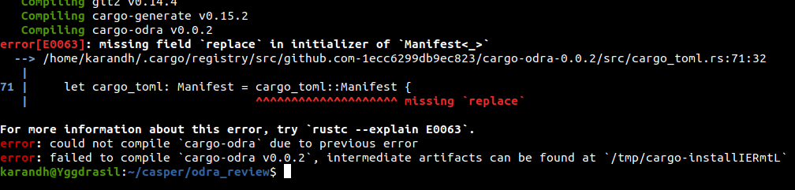
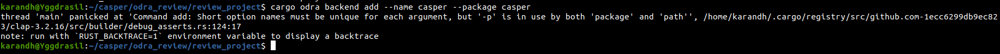

| Grant Proposal  | [1 - Odra - Casper Smart Contracts Framework](https://crdao.ossa.dev/Public-Job-Detail/167) |
|-----------------|---------------------------------------------------------------------------------------------|
 | Milestone       | 1                                                                                           |
 | Milestone Title | MVP Part 1                                                                                  |
 | OP              | Maciej Zieliński                                                                            |
 | Reviewer        | Karan Dhareshwar (karan@casperlabs.io), Zoltan Lovas (zoltan@casperlabs.io)                 |

# Milestone Details

## Details & Acceptance Criteria

**Details of what will be delivered in milestone:**

The goal of this milestone is to develop:
- parts: Variable, Mapping, Events,
- macros for modules and contracts: #[odra::module], #[odra:external_contract],
- tests using CasperVM.

**Acceptance criteria:**

- version is 0.1.0 released to the http://crates.io,
- it is possible to write simple smart contracts and test them using CasperVM.

**Additional notes regarding submission from OP:**

We have also provided a console tool called Cargo Odra, that simplifies development process.

## Milestone Submission

The following milestone assets/artifacts were submitted for review:

| Repository                       | Revision Reviewed     |
|----------------------------------|-----------------------|
 |https://github.com/odradev/odra   | 3905380               |


# Install & Usage Testing Procedure and Findings

The project tells users to use the `cargo odra` tool to help setup and use the Odra framework for their project.
However, the current documentation does not tell a user on how to install it. For users of the Cargo tool it would
be clear, however this missing information would be an impediment to newcomers coming from other language frameworks.
Attempting to install the current latest release of 0.0.2 of the odra tool via the `cargo install` command results in an error.
However, manual installation of the tool is possible by pulling the source code down and compiling the binary.



## Overall Impression of usage testing

Given that the most commonly expected way of using the `Cargo` tool directly fails, it is recommended that
the current documentation be updated to include instructions on installing and using the `cargo-odra` tool.

| Requirement                                                                        | Finding |
|------------------------------------------------------------------------------------|---------|
 | Project builds without errors                                                      | FAIL    |
 | Documentation provides sufficient installation/execution instructions              | FAIL    |
 | Project functionality meets/exceeds acceptance criteria and operates without error | FAIL    |

# Unit / Automated Testing

The current odra project has 53 unit tests, some of which are modular and cover the functionality of exact
modules of the system. Other tests assert and verify the expected before of the framework itself, compiling Wasm
and running it against a VM. There is coverage of both positive and negative critical path tests. There is at least
one test that is currently being ignored.

```rust
test src/test_utils.rs - test_utils::assert_events (line 27) ... ignored
```

| Requirement                                  | Finding           |
|----------------------------------------------|-------------------|
 | Unit Tests - At least one positive path test | PASS              |
 | Unit Tests - At least one negative path test | PASS              |
 | Unit Tests - Additional path tests           | PASS with Notes   |

# Documentation

### Code Documentation

The project has code generated low level documentation which provides the most basic level of documentation
for a user of the framework. However, it would be beneficial for users to understand how the framework
is abstracting the underlying blockchain runtime giving users more clarity.

| Requirement     | Finding         |
|-----------------|-----------------|
 | Code Documented | PASS with Notes |

### Project Documentation

The project level documentation is fairly lacking, given that the `#[odra::module]` and `#[odra:external_contract]`
macros are meant to be used by the developer, there seems to be little to no high level documentation around
how these macros work. This is potentially harmful as it can be a severe impediment in debugging the contract
itself if the error is being raised from inside the macro itself. Given, that this framework is meant to abstract
away the underlying blockchain runtime, the high level abstraction model should also be documented. Currently, the
project documentation does not give enough detail and information. 

| Requirement        | Finding           |
|--------------------|-------------------|
 | Usage Documented   | Pass with Notes   |
 | Example Documented | Pass with Notes   |

## Overall Conclusion on Documentation

While the low level code documentation is present, the overall project documentation appears to be incomplete.

# Open Source Practices

## Licenses

The project is licensed under the MIT license which conforms to the open source coding standard.

| Requirement                               | Finding |
|-------------------------------------------|---------|
 | OSI-approved open source software license | PASS    |

## Contribution Policies

Pull requests and Issues are enabled however no contributing guidelines are specified, including CONTRIBUTING and SECURITY policies
would be beneficial.

| Requirement                     | Finding         |
|---------------------------------|-----------------|
 | OSS contribution best practices | PASS with Notes |

# Coding Standards

## General Observations

Part of the milestone acceptance criterion was that Wasm produced by the framework can be run against the Casper VM.
However, attempting to build the Wasm so that it can be tested against a standalone instance of the Casper VM does
not work as attempting to add the Casper runtime backend results in the following error message.




# Final Conclusion

While the project meets the acceptance criteria specified in the proposal. However, the current lack of project documentation
around the framework in general is lacking. There should be more information around what the `[odra::module]` macro 
is doing for the author under the hood. Some examples highlighting the expanded code would help contract developers understand
how the macro is behaving allowing for easier debugging. As it was not possible to compile the Wasm and run it against the
Casper VM one of the milestone criterion was not met.

# Recommendation

Recommendation | FAIL
------------ | -------------
