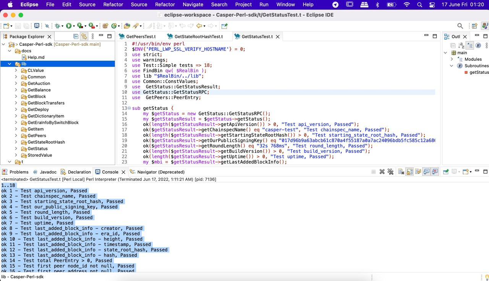

Grant Proposal | [509 - Casper Perl SDK](https://portal.devxdao.com/public-proposals/509)
------------ | -------------
Milestone | 1
Milestone Title | Beta version
OP | Huy Tran
Reviewer | Yusuf Keten

# Milestone Details
The review will cover the 1st milestone criteria set forth below.

## Details & Acceptance Criteria

**Details of what will be delivered in milestone:**

- First version of Perl SDK: Perl SDK project available on a public GitHub repository
  
- Following methods fully implemented and will return when called by the SDK:
   * chain_get_state_root_hash
   *  info_get_peers  
   *  info_get_deploy 
   *  info_get_status 
   *  chain_get_block_transfers 
   *  chain_get_block
   *  chain_get_era_info_by_switch_block    
   *  state_get_item
   *  state_get_dictionary_item
   *  state_get_balance
   *  state_get_auction_info

- Unit tests full coverage
- Full documentation of the SDK

**Acceptance criteria:**

- Perl SDK project available on a public GitHub repository
  
- Following methods fully implemented:
   * chain_get_state_root_hash
   *  info_get_peers  
   *  info_get_deploy 
   *  info_get_status 
   *  chain_get_block_transfers 
   *  chain_get_block
   *  chain_get_era_info_by_switch_block    
   *  state_get_item
   *  state_get_dictionary_item
   *  state_get_balance
   *  state_get_auction_info

- Unit test full coverage
- Documentation are available for all critical classes and methods.

**Additional notes regarding submission from OP:**
- Perl SDK project available on a public GitHub repository

- Following methods fully implemented:
   *  chain_get_state_root_hash
   *  info_get_peers  
   *  info_get_deploy 
   *  info_get_status 
   *  chain_get_block_transfers 
   *  chain_get_block
   *  chain_get_era_info_by_switch_block    
   *  state_get_item
   *  state_get_dictionary_item
   *  state_get_balance
   *  state_get_auction_info

- Unit test full coverage
- Documentation are available for all critical classes and methods.

## Milestone Submission

The following milestone assets/artifacts were submitted for review:

Repository | Revision Reviewed
------------ | -------------
https://github.com/tqhuy2018/Casper-Perl-sdk | f8e1fa5

# Install & Usage Testing Procedure and Findings

Following the instructions in the README file of repository(https://github.com/tqhuy2018/Casper-Perl-sdk), the reviewer was able to successfully run the code on a macOS Monterey 12.3 Mac using Perl v5.30.3 and Eclipse IDE 2022-06 (4.24.0).

## Overall Impression of usage testing

The project builds without errors, the documentation provides sufficient installation and execution instructions, and the project functionality meets the acceptance criteria and operates without errors.

Requirement | Finding
------------ | -------------
Project builds without errors | PASS
Documentation provides sufficient installation/execution instructions | PASS
Project functionality meets/exceeds acceptance criteria and operates without error | PASS

# Unit / Automated Testing

The project has unit tests for all critical classes and methods.

**Test Logs**

[GetAuctionTest](assets/GetAuctionTest.md)

[GetBalanceTest](assets/GetBalanceTest.md)

[GetBlockTest](assets/GetBlockTest.md)

[GetBlockTransfersResultTest](assets/GetBlockTransfersResultTest.md)

[GetDeployRPCTest](assets/GetDeployRPCTest.md)

[GetDeployRPCTest2](assets/GetDeployRPCTest2.md)

[GetDictionaryItemTest](assets/GetDictionaryItemTest.md)

[GetEraBySwitchBlockTest](assets/GetEraBySwitchBlockTest.md)

[GetItemTest](assets/GetItemTest.md)

[GetPeersTest](assets/GetPeersTest.md)

[GetStateRootHashTest](assets/GetStateRootHashTest.md)

[GetStatusTest](assets/GetStatusTest.md)

Requirement | Finding
------------ | -------------
Unit Tests - At least one positive path test | PASS
Unit Tests - At least one negative path test | PASS
Unit Tests - Additional path tests | PASS

# Documentation

### Code Documentation

A sufficient amount of low-level documentation exists on the project via properly formatted inline comments on the critical classes and the methods.

Requirement | Finding
------------ | -------------
Code Documented | PASS

### Project Documentation

The project has a detailed documentation for usage with examples, along with the installation, build and test instructions.

Requirement | Finding
------------ | -------------
Usage Documented | PASS
Example Documented | PASS

## Overall Conclusion on Documentation
In the reviewer's opinion, the project usage and code-level documentation are sufficient.

# Open Source Practices

## Licenses

The Project is released under the MIT License.

Requirement | Finding
------------ | -------------
OSI-approved open source software license | PASS

## Contribution Policies

Pull requests and Issues are enabled on the repository, and the project contains a CONTRIBUTING and a SECURITY policy.

Requirement | Finding
------------ | -------------
OSS contribution best practices | PASS

# Coding Standards

## General Observations

Code is generally well-structured and very readable. The project is committed to GitHub and both the unit tests and the manual tests pass.

# Final Conclusion

The project provides the functionality described in the grant application and milestone acceptance criteria.

Thus, in the reviewer's opinion, this submission should pass.

# Recommendation

Recommendation | PASS
------------ | -------------
