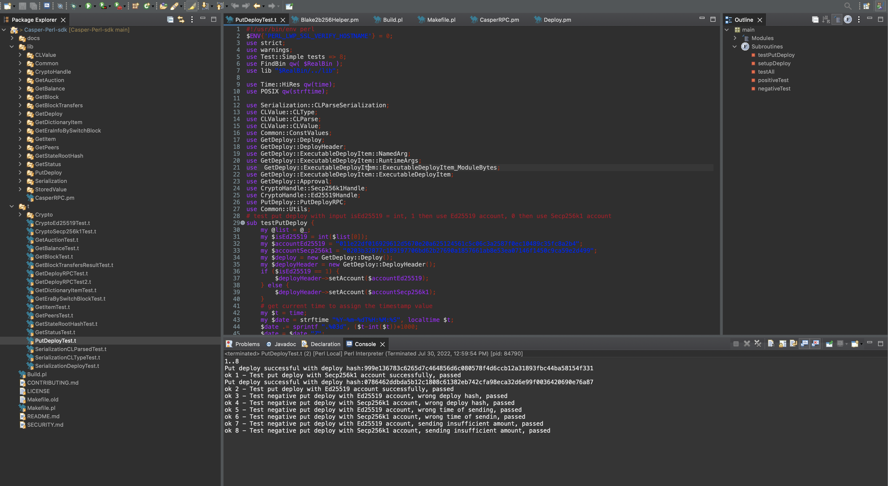
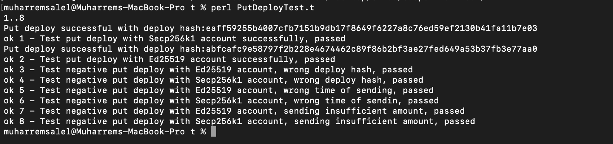
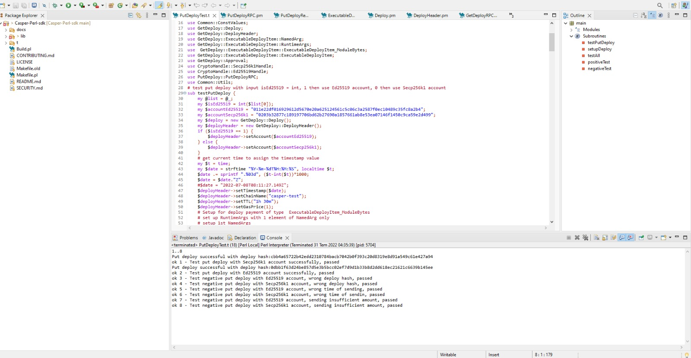
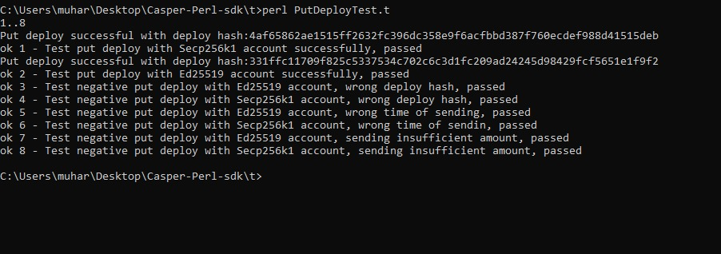
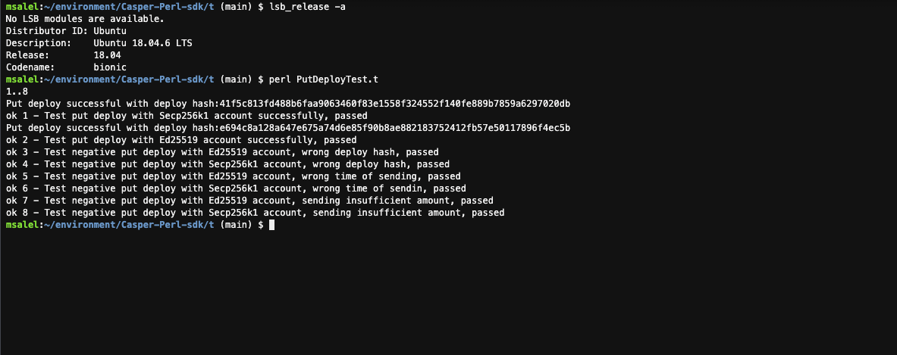
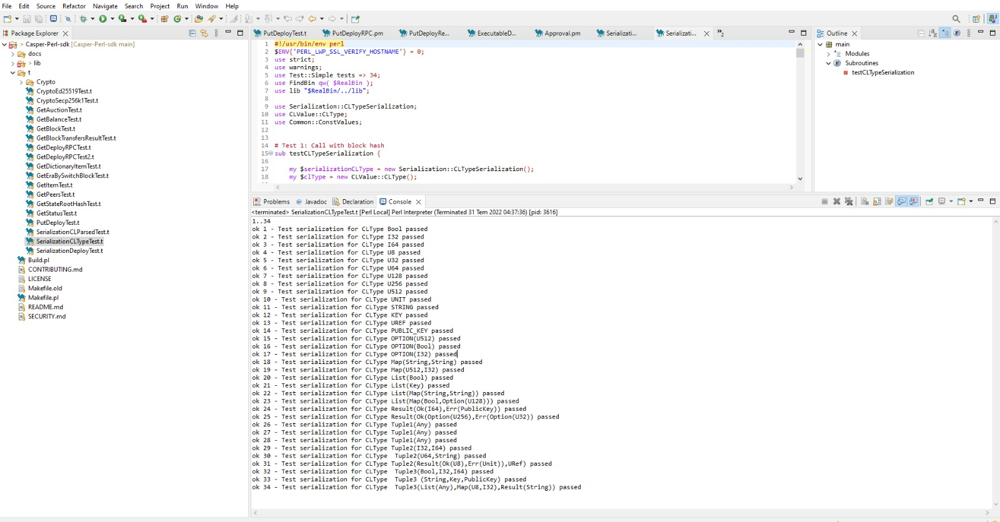
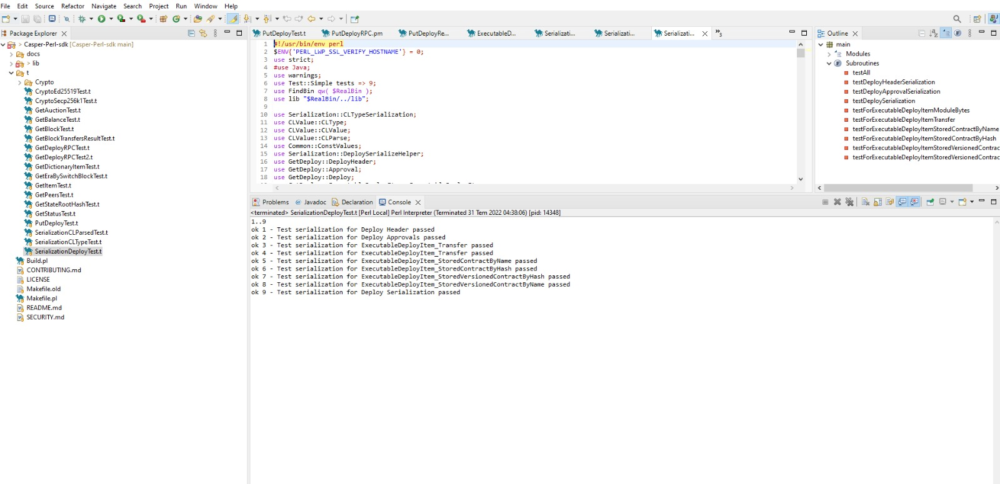
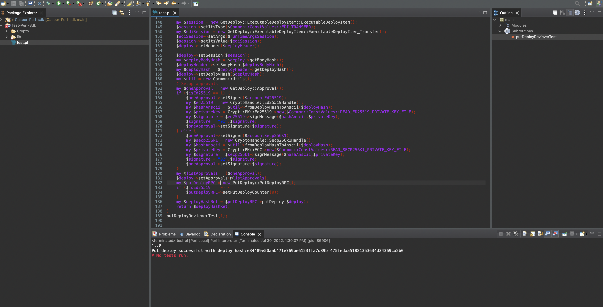
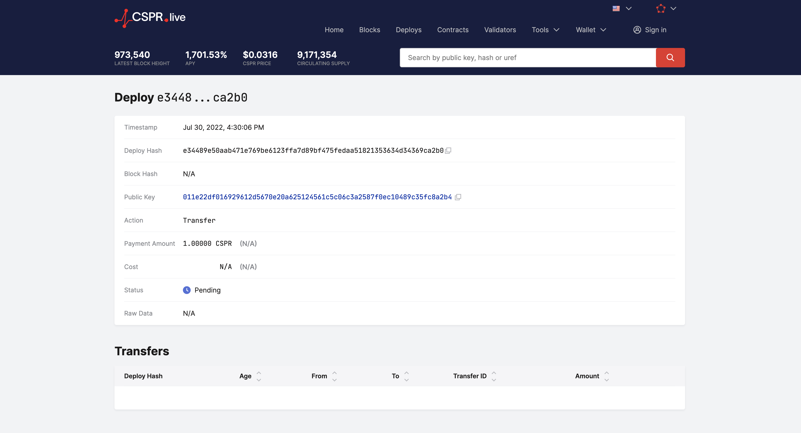

Grant Proposal | [509 - Casper Perl SDK](https://portal.devxdao.com/public-proposals/509)
------------ | -------------
Milestone | 2
Milestone Title | Final release of PERL SDK
OP | Huy Tran
Reviewer | Muharrem Salel

# Milestone Details
The review will cover the 2nd milestone criteria set forth below.

## Details & Acceptance Criteria

**Details of what will be delivered in milestone:**

- Perl version of CLType primitives 
- Perl version for Casper Domain Specific Objects 
- Serialization of Casper Domain Specific Objects 
- ED25519/SECP256K1 key pairs Wrappers implemented 
- PutDeploy call implemented and tested 
- SDK calls will return Casper Domaine Specific Objects 

Unit test full coverage

**Acceptance criteria:**

- Perl version of CLType primitives 
- Perl version for Casper Domain Specific Objects 
- Serialization of Casper Domain Specific Objects 
- ED25519/SECP256K1 key pairs Wrappers implemented 
- PutDeploy call implemented and tested 
- SDK calls will return Casper Domaine Specific Objects 

Unit test full coverage

**Additional notes regarding submission from OP:**

- Perl version of CLType primitives
- Perl version for Casper Domain Specific Objects 
- Serialization of Casper Domain Specific Objects 
- ED25519/SECP256K1 key pairs Wrappers implemented
- PutDeploy call implemented and tested
- SDK calls will return Casper Domaine Specific Objects

 Unit test full coverage

## Milestone Submission

The following milestone assets/artifacts were submitted for review:

Repository | Revision Reviewed
------------ | -------------
https://github.com/tqhuy2018/Casper-Perl-sdk | 88db833

# Install & Usage Testing Procedure and Findings

Instructions at the README.md file in the repository(https://github.com/tqhuy2018/Casper-Perl-sdk) explain a clear path for users from Windows and Mac operating systems, following instructions step by step helps the user to run and test the codebase. The reviewer followed these steps from both Mac (macOS Monterey - MacBook Pro Intel i9 2019) and a Windows (Windows10 - AMD Ryzen 5 5600X) machine and successfully run both tests and the project itself. Also, the reviewer successfully runs the project and tests on Ubuntu Machine (Ubuntu 18.04.6) by following the same steps written for macOS. However, the reviewer encountered a problem with Perl libraries' installation locations, then OP updated README to help users when they encounter this common problem. The project also shows two ways to run it which are an IDE (Eclipse) and a command line and both were clear enough to follow and achieve the result. 

## Overall Impression of usage testing

The project builds without errors, the documentation provides sufficient installation and execution instructions, and the project functionality meets the acceptance criteria and operates without errors.

Requirement | Finding
------------ | -------------
The project builds without errors | PASS
Documentation provides sufficient installation/execution instructions | PASS
Project functionality meets/exceeds acceptance criteria and operates without error | PASS

# Unit / Automated Testing

The project has unit tests for all critical classes and methods.

[SerializationCLParsedTest](assets/SerializationCLParsedTest.md)

Requirement | Finding
------------ | -------------
Unit Tests - At least one positive path test | PASS
Unit Tests - At least one negative path test | PASS
Unit Tests - Additional path tests | PASS

# Documentation

### Code Documentation

A sufficient amount of low-level documentation exists on the project via properly formatted inline comments on the critical classes and the methods.

Requirement | Finding
------------ | -------------
Code Documented | PASS

### Project Documentation

The project has detailed documentation for usage with examples, along with the installation, build and test instructions. The project also includes additional documentation to run specific functions like PutDeploy as well as a sample project to use SDK.

Requirement | Finding
------------ | -------------
Usage Documented | PASS
Example Documented | PASS

## Overall Conclusion on Documentation
In the reviewer's opinion, the project usage and code-level documentation are sufficient. 

# Open Source Practices

## Licenses

The Project is released under the MIT License.

Requirement | Finding
------------ | -------------
OSI-approved open source software license | PASS

## Contribution Policies

Pull requests and Issues are enabled on the repository, and the project contains a CONTRIBUTING and a SECURITY policy.

Requirement | Finding
------------ | -------------
OSS contribution best practices | PASS

# Coding Standards

## General Observations

Code is generally well-structured and very readable. The project is committed to GitHub and both the unit tests and the manual tests pass.

# Final Conclusion

The project provides the functionality described in the grant application and milestone acceptance criteria.

Thus, in the reviewer's opinion, this submission should pass.

# Recommendation

Recommendation | PASS
------------ | -------------