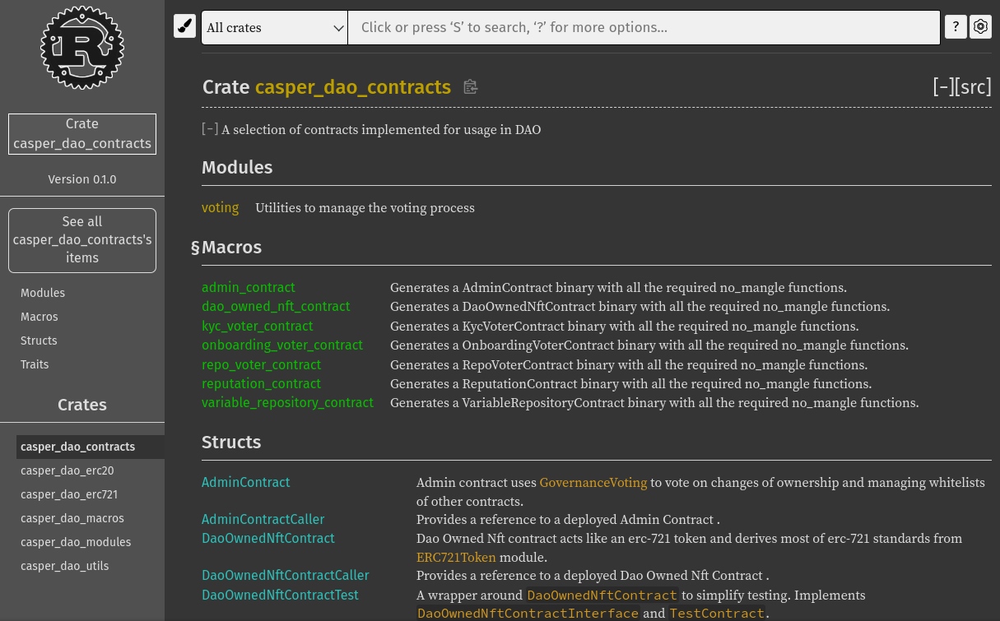

Grant Proposal | [513 - On-Chain MVPR](https://portal.devxdao.com/public-proposals/513)
------------ | -------------
Milestone | 2
Milestone Title | Variable Repository
OP | Michael Steuer
Reviewer | Gökhan Gurbetoğlu <crdao@ggurbet.com>

# Milestone Details

## Details & Acceptance Criteria

**Details of what will be delivered in milestone:**

This is a Key/Value store contract that supports writes from white listed contracts only, its contents are variables that influence voting, bidding, and other contracts.

**Acceptance criteria:**

- Configurations can be set from specific accounts
- JS Client enables installation, usage and testing of the contract

**Additional notes regarding submission from OP:**

Please find the release notes for Milestone 2 and 4 here: https://github.com/make-software/dao-contracts/releases/tag/milestone-2-4

Release Notes:

This release contains the following smart contracts:
- Variable Repository - keeps track of system parameters,
- Variable Repository Voter - allows voting on system parameters,
- Admin Contract - central contract, that enables the upgrade of the whole system,
- KYC NFT - keeps track of accounts that passed the KYC process,
- KYC Voter - allows performing a KYC process and mints KYC NFT,
- VA NFT - keeps track of accounts that are VAs.
- Onboarding Voter - allows to onboard new VAs and mints VA NFT.

Notes for the DEVxDAO:
- This code fully realizes milestone #2: Variable Repository.
- This code fully realizes milestone #4: KYC Contract.
- It contains a large part of the voting code required for milestone #5: Voting Contract. A full code will be the subject of the next release.

## Milestone Submission

The following milestone assets/artifacts were submitted for review:

Repository | Revision Reviewed
------------ | -------------
https://github.com/make-software/dao-contracts/tree/milestone-2-4 | 7c24f46


# Install & Usage Testing Procedure and Findings

Reviewer used an Ubuntu 20.04.2 LTS local machine and a GitHub Codespaces cloud machine with Ubuntu 20.04.4 LTS installed for this review.

README provides installation instructions. However, the prerequisites are not mentioned there. It is understood from the repository that it needs `rust` and relevant `cargo` packages to be installed, however these are not listed in the README. Reviewer installed these using the official Rust method listed on their [website](https://www.rust-lang.org/tools/install):

```sh
curl --proto '=https' --tlsv1.2 -sSf https://sh.rustup.rs | sh
```
- [`rust` installation logs](assets/rustup.md)

After that, running `make build-contracts` as stated in the README did not work and resulted in an error:

```sh
@ggurbet ➜ /workspaces/dao-contracts (7c24f46) $ make build-contracts
make: *** No rule to make target 'build-contracts'.  Stop.
```

Upon inspecting the `Makefile`, reviewer found out the correct target name has since been changed to `build-dao-contracts`. This issue was reported to OP and has been updated in the latest versin of the README.

Contacting the OP and after making the necessary updates on the README, reviewer run the build operations again using the `make build-all` command and successfully built the project:

```sh
@ggurbet ➜ /workspaces/dao-contracts (7c24f46 ✗) $ make build-all
cargo build --release --target wasm32-unknown-unknown --quiet --features=wasm --no-default-features -p casper-dao-contracts
cargo build --release --target wasm32-unknown-unknown --quiet --features=wasm --no-default-features -p casper-dao-erc20
cargo build --release --target wasm32-unknown-unknown --quiet --features=wasm --no-default-features -p casper-dao-erc721
```

## Overall Impression of usage testing

_Summarize your impression following detailed usage testing and provide a `PASS`, `FAIL`, or `PASS With Notes` for the requirements below. In the case of `PASS With Notes`, make sure that the notes for improvement are clearly spelled out in this section._

Requirement | Finding
------------ | -------------
Project builds without errors | PASS / FAIL / PASS with Notes
Documentation provides sufficient installation/execution instructions | PASS / FAIL / PASS with Notes
Project functionality meets/exceeds acceptance criteria and operates without error | PASS / FAIL / PASS with Notes

# Unit / Automated Testing

All automated unit tests PASS for this milestone. Tests cover critical functionality. Reviewer successfully run all automated tests on an Ubuntu 20.04.4 LTS machine. Overall quality of tests are sufficient. Test output is below.

- [Unit tests output](assets/unit-tests.md)

Requirement | Finding
------------ | -------------
Unit Tests - At least one positive path test | PASS
Unit Tests - At least one negative path test | PASS
Unit Tests - Additional path tests | PASS

# Documentation

### Code Documentation

Code is well documented. Critical functionality is properly explained and lots of additional comments exist.

Requirement | Finding
------------ | -------------
Code Documented | PASS

### Project Documentation

Project documentation is done via Rustdoc. All critical functionality of the code is documented. There are examples inside the documentation about how to use different aspects of the code. There was one warning while generating the documentation, which needs developer attention.

- [Documentation build logs](assets/docs.md)



Requirement | Finding
------------ | -------------
Usage Documented | PASS with Notes
Example Documented | PASS

## Overall Conclusion on Documentation

Code documentation is sufficient. General documentation is sufficient and includes usage examples.

# Open Source Practices

## Licenses

The Project is released under the Apache-2.0 License.

Requirement | Finding
------------ | -------------
OSI-approved open source software license | PASS

## Contribution Policies

Project does not contain CONTRIBUTING and SECURITY policies. These need to be included before the final milestone. Pull requests and Issues are enabled on the repository and the project is set up for public participation.

Requirement | Finding
------------ | -------------
OSS contribution best practices | PASS with Notes

# Coding Standards

## General Observations

_Provide any general observations about the project you want to add to your review. These can be subjective in nature as well, and do not contribute to your recommendation to pass or fail the submission._

# Final Conclusion

_Summarize your final conclusion, and provide your motivation for your recommendation below. For example, you may say 'Reviewer recommends that this submission should fail code review, because it does not contain an OSI-approved open source license'_

# Recommendation

Recommendation | PASS / FAIL / PASS with Notes
------------ | -------------
