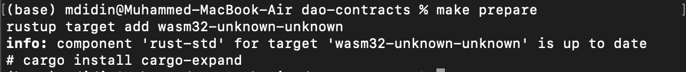
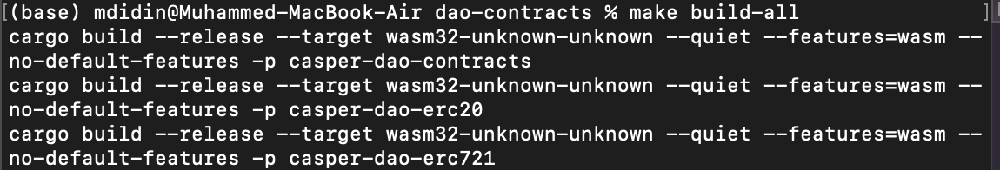
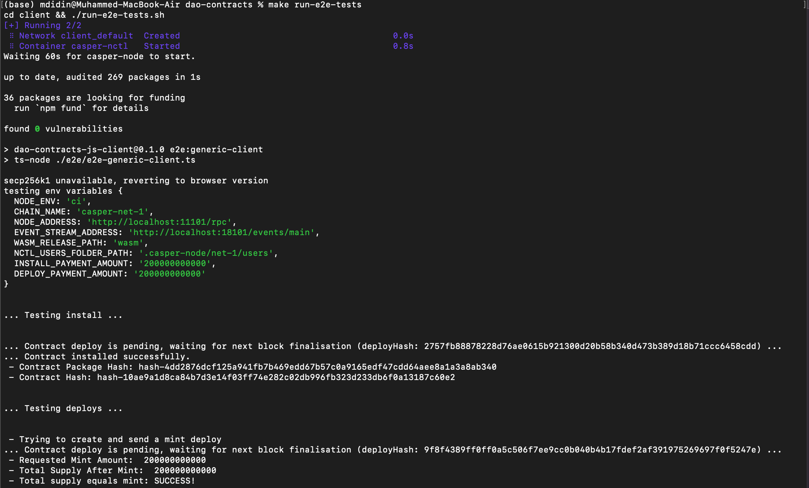
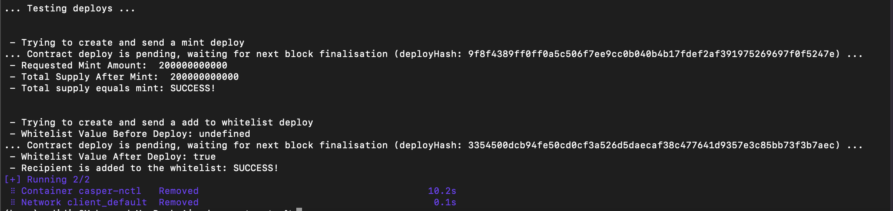

Grant Proposal | [513 - On-Chain MVPR](https://portal.devxdao.com/public-proposals/513)
------------ | -------------
Milestone | 5
Milestone Title | Voting Contract
OP | Michael Steuer
Reviewer | Muhammed Didin <mdidin80@gmail.com>

# Milestone Details

## Details & Acceptance Criteria

**Details of what will be delivered in milestone:**
- The voting contract installed on Casper Network

**Acceptance criteria:**

Voting contract can be installed on the Casper Network Specific vote type contracts can inherit from the abstract, as demonstrated through examples, such as Simple Votes and Grant Votes JS Client enables installation, usage and testing of the contract

**Additional notes regarding submission from OP:**

We have finished all the smart contract code for Milestone #5: Voting Contract.
All voter contract are implemented:
- KYC Voter Contract,
- Onboarding Voter Contract,
- Reputation Voter Contract,
- Variable Repository Voter Contract,
- Simple Voter,
- Admin Contract.
In addition voting module is available for implementing new voter contracts.
Finally, the JS Client has been updated to support these use cases, including its CI tests.

For a better understanding of the role and operation of voting contracts, see https://github.com/make-software/dao-contracts/blob/develop/docs/architecture.md

## Milestone Submission

The following milestone assets/artifacts were submitted for review:

Repository | Revision Reviewed
------------ | -------------
https://github.com/make-software/dao-contracts/tree/develop| b86174c


# Install & Usage Testing Procedure and Findings

The reviewer used a macOS Monterey for this review.

README provides sufficient installation instructions. It is stated in the README that Rust toolchain and wasmstrip tool are the prerequisites for this milestone, and installation guidelines are linked. By following the README;

- Preparing environment:
````
make prepare
````


- Build `WASM` files:

```
make build-all
```

[Full Build Logs](assets/build-all.txt)

## Overall Impression of usage testing

The project builds without errors, the documentation provides sufficient installation and execution instructions, and the project functionality meets the acceptance criteria and operates without errors. 
All builds were successful, and all unit tests ran without errors.

Requirement | Finding
------------ | -------------
Project builds without errors | PASS
Documentation provides sufficient installation/execution instructions | PASS
Project functionality meets/exceeds acceptance criteria and operates without error | PASS

# Unit / Automated Testing

The repository contains 242 unit/automated tests and all automated unit tests PASS for this milestone. Tests cover critical functionality. The reviewer successfully ran all automated tests on a macOS Monterey machine. The overall quality of the tests is sufficient.

[Full Unit/Automated Test Logs](assets/tests.txt)

Also, E2E tests cover milestone acceptance criteria.





[Full E2E Tests Logs](assets/e2e-tests.txt)

Requirement | Finding
------------ | -------------
Unit Tests - At least one positive path test | PASS
Unit Tests - At least one negative path test | PASS
Unit Tests - Additional path tests | PASS

# Documentation

### Code Documentation

The code is well documented. Critical functionality is properly explained and lots of additional comments exist.

Requirement | Finding
------------ | -------------
Code Documented | PASS

### Project Documentation

Project documentation contains the architecture of the project. The README file contains the prerequisites; building, running and testing instructions. Also, E2E tests' prerequisites and running instructions are explained in the README file.

Requirement | Finding
------------ | -------------
Usage Documented | PASS
Example Documented | PASS

## Overall Conclusion on Documentation

Code documentation is sufficient. General documentation is sufficient and includes usage examples.

# Open Source Practices

## Licenses

The Project is released under the Apache-2.0 License.

Requirement | Finding
------------ | -------------
OSI-approved open source software license | PASS

## Contribution Policies

The project has CONTRIBUTING and SECURITY policies and a Code of Conduct. Also, Pull requests and Issues are enabled on the repository and the project is set up for public participation.

Requirement | Finding
------------ | -------------
OSS contribution best practices | PASS

# Coding Standards

## General Observations

The source code is well-written and thought out. It is easily readable. General best coding practices are used throughout the project. Overall sufficient work is done.

# Final Conclusion

 E2E tests show that the project covers its acceptance criteria. Project documentation shows the architecture of the project. README file contains necessary information about the prerequisites and how to run and build the project and tests. The project accommodates open-source practices.  So in the reviewer's opinion, this milestone should PASS.

# Recommendation

Recommendation | PASS
------------ | -------------
