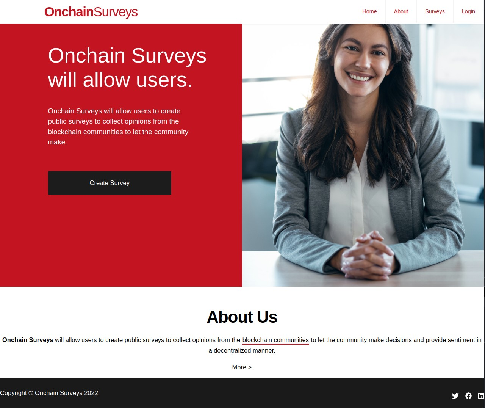
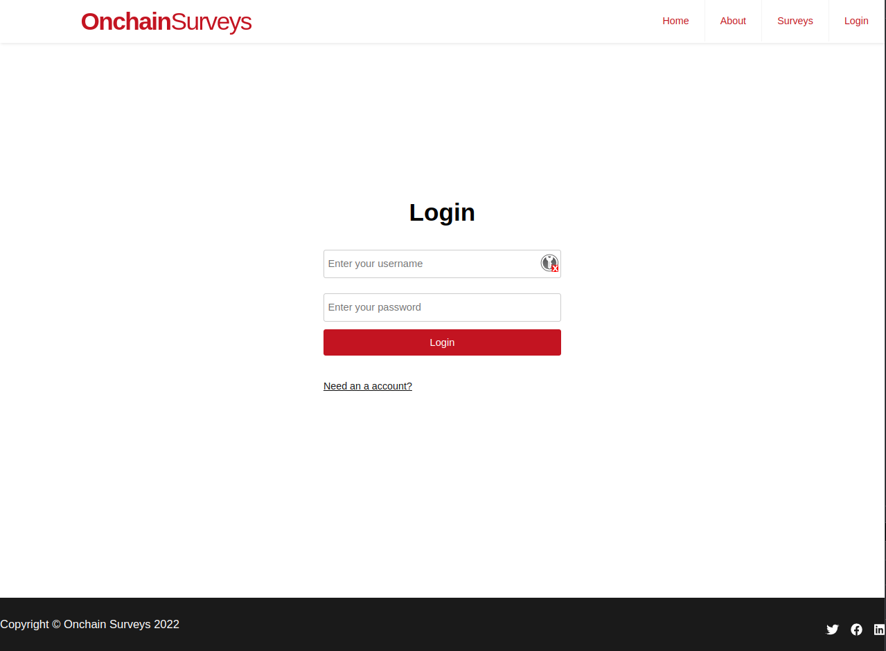
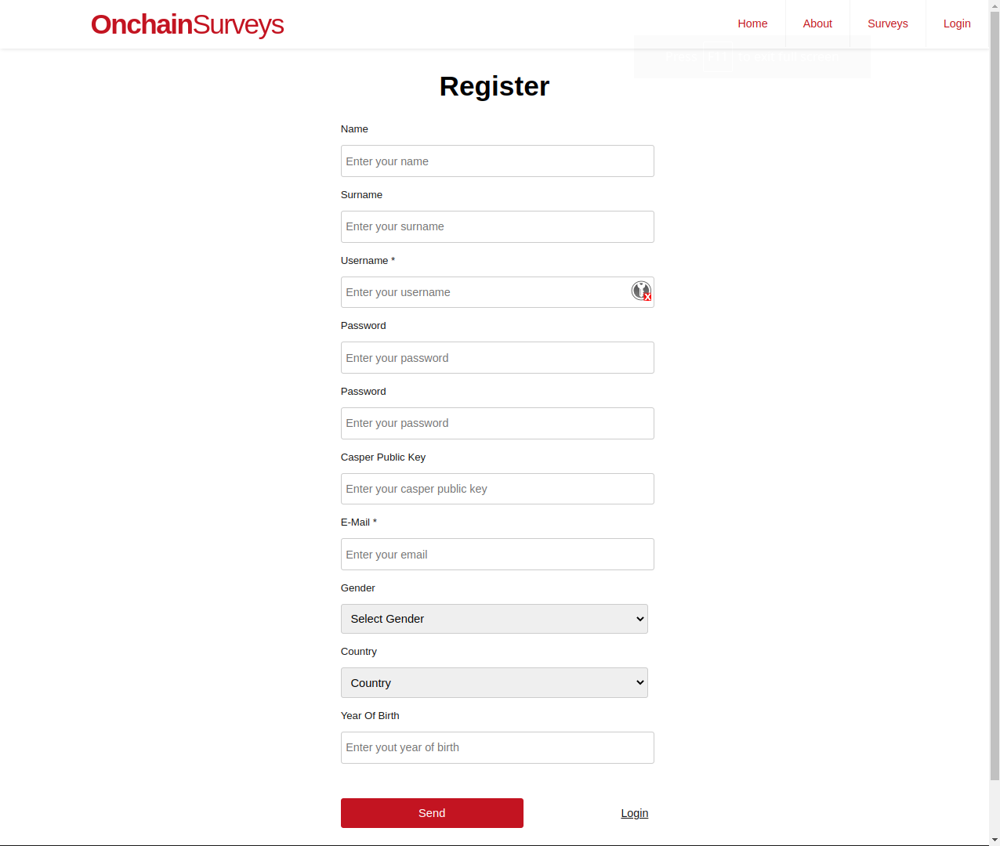
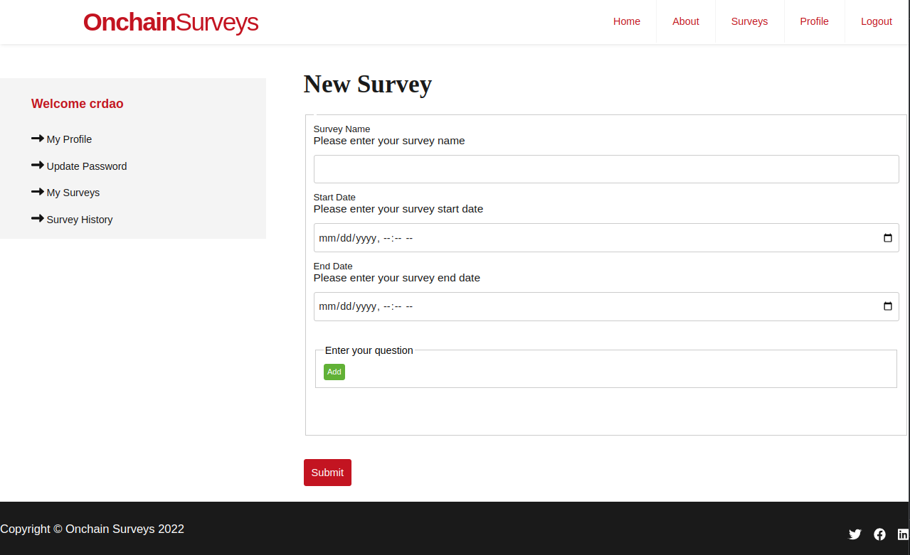
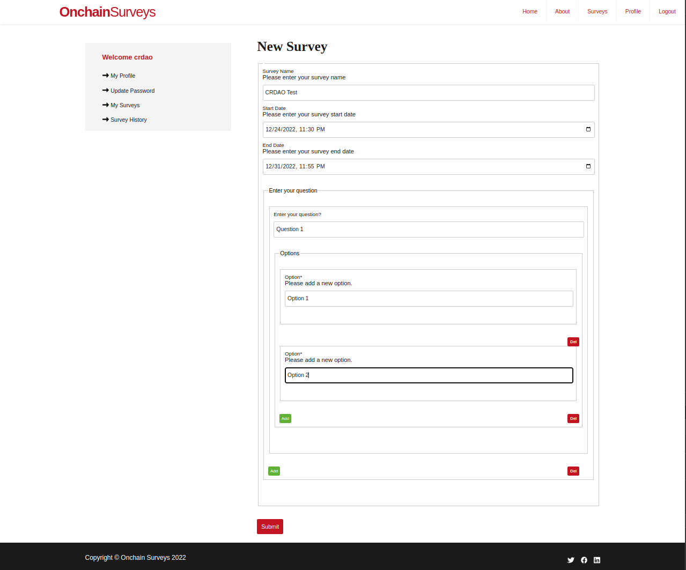
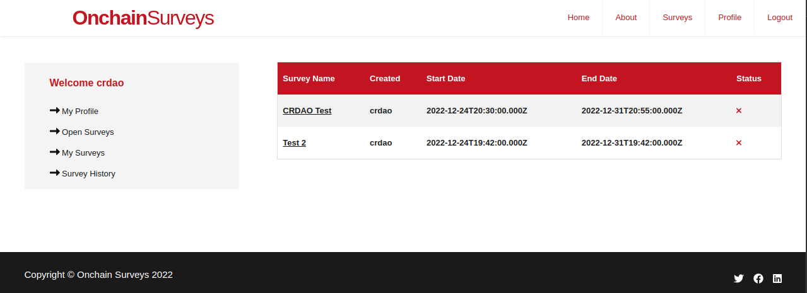
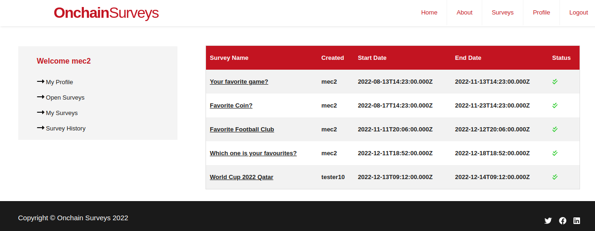
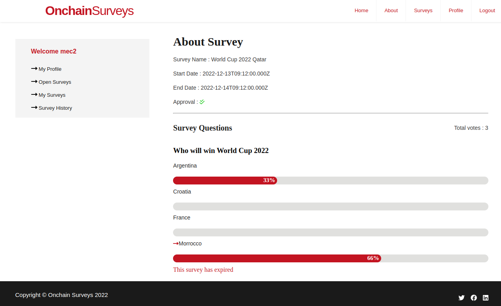

Grant Proposal | [519 - Onchain Surveys](https://portal.devxdao.com/public-proposals/519)
------------ | -------------
Milestone | 1
Milestone Title | App development
OP | Hidayet
Reviewer | Gökhan Gurbetoğlu <crdao@ggurbet.com>

# Milestone Details

## Details & Acceptance Criteria

**Details of what will be delivered in milestone:**

Off-chain version of the app will be developed and deployed.

**Acceptance criteria:**

Users will be able to:
- Register and login,
- Create surveys,
- See results of surveys they filled,
- See overall stats of survey results.

These views will be available at minimum:
- Create Survey
- My Surveys
- Survey History
- All Surveys
- Open Surveys

The functionality above will be available on a Public deployment.

**Additional notes regarding submission from OP:**

We developed the project using react on the frontend, nodejs on the backend and mongodb as database. There will be two kind of users in the system whose are user and admin. Users have the ability to register and login. After registering and logging in users can create surveys and get the results of their surveys. On top of that users will be able to see their survey history, open surveys and all surveys. Admins have the ability to approve surveys.

## Milestone Submission

The following milestone assets/artifacts were submitted for review:

Repository | Revision Reviewed
------------ | -------------
https://github.com/onchainsurveys/onchain | 85c6d17

# Install & Usage Testing Procedure and Findings

Reviewer used an Ubuntu 20.04 LTS GitPod instance and a server provided by the OP for doing this review.

Reviewer was successfully able to install the project using the provided instructions in the README. After the installation, reviewer created a MongoDB database and connected it to the app using the provided instructions. Then, running `npm start` launched the application.

- [API installation logs](assets/api-install.md)
- [Client installation logs](assets/client-install.md)

After running the app, invoking different endpoints provided in the README yielded the expected results. Here are some example results returned from the API after creating some surveys.

- [/api/surveys](assets/api-surveys.md)
- [/api/surveys/getmysurvey/username](assets//api-surveys-getmysurvey-username.md)

Here are some screenshots from the Client app:

#### Client Landing Page

#### Login Page

#### Registration Page

#### Survey Creation Page

#### Survey Creation Page - Filled

#### My Surveys Page

#### Survey History Page

#### Survey Stats

## Overall Impression of usage testing

All critical functionality required for this milestone is implemented and they are running as intended. Further improvements would be beneficial for the ease of use of the app in the following milestones.

Requirement | Finding
------------ | -------------
Project builds without errors | PASS
Documentation provides sufficient installation/execution instructions | PASS
Project functionality meets/exceeds acceptance criteria and operates without error | PASS

# Unit / Automated Testing

_Summarize the result of the unit testing / automated testing / integration testing provided in the Milestone. Feel free to include
automated test output, either as text, image or other artifact. Provide a `PASS`, `FAIL`, or `PASS With Notes` for the requirements
below. In the case of `PASS With Notes`, make sure that the notes for improvement are clearly spelled out in this section._

Requirement | Finding
------------ | -------------
Unit Tests - At least one positive path test | PASS / FAIL / PASS with Notes
Unit Tests - At least one negative path test | PASS / FAIL / PASS with Notes
Unit Tests - Additional path tests | PASS / FAIL / PASS with Notes

# Documentation

### Code Documentation

Code documentation is missing. There is no detail inside the code about the structure of the application. Only some one word - one line comments exist but they are not explanatory. Since this is the first milestone, it is given a passing grade. However, these need to be addressed in the future milestones.

Requirement | Finding
------------ | -------------
Code Documented | PASS with Notes

### Project Documentation

Detailed instructions for installing, running and testing the application is provided in the README. There are many examples provided with the instructions. However, further documentation with explanations are not sufficient. These need to be improved in the next milestones. For the first milestone, current status is enough to PASS with Notes.

Requirement | Finding
------------ | -------------
Usage Documented | PASS with Notes
Example Documented | PASS with Notes

## Overall Conclusion on Documentation

Code documentation is insufficient. General documentation is also insufficient and needs improvements.

# Open Source Practices

## Licenses

The Project is released under the Apache-2.0 License.

Requirement | Finding
------------ | -------------
OSI-approved open source software license | PASS

## Contribution Policies

The project contains clear CONTRIBUTING and SECURITY policies, as well as the optional CODE OF CONDUCT policy. Pull requests and Issues are enabled on the repository and the project is set up for public participation. As an added bonus, issue templates also exist for the repository.

Requirement | Finding
------------ | -------------
OSS contribution best practices | PASS

# Coding Standards

## General Observations

_Provide any general observations about the project you want to add to your review. These can be subjective in nature as well, and do not
contribute to your recommendation to pass or fail the submission._

# Final Conclusion

_Summarize your final conclusion, and provide your motivation for your recommendation below. For example, you may say 'Reviewer recommends that this
submission should fail code review, because it does not contain an OSI-approved open source license'_

# Recommendation

Recommendation | PASS with Notes
------------ | -------------
