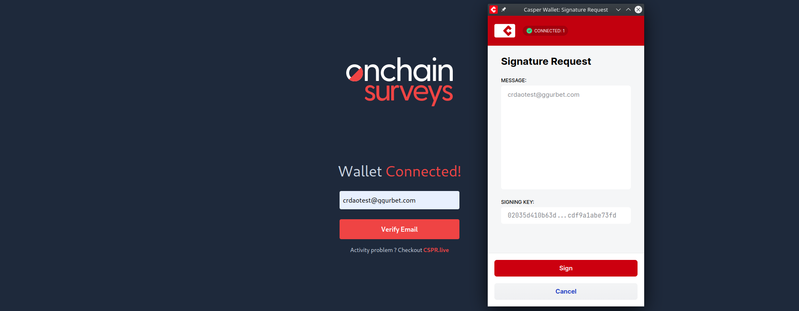
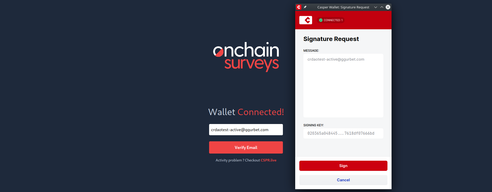
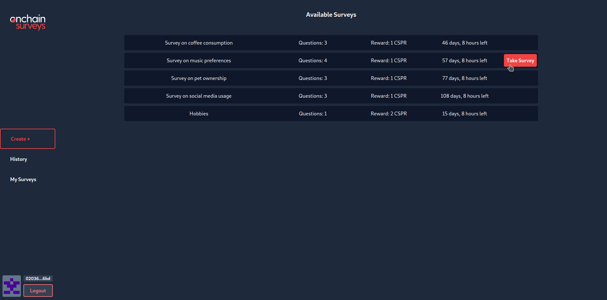
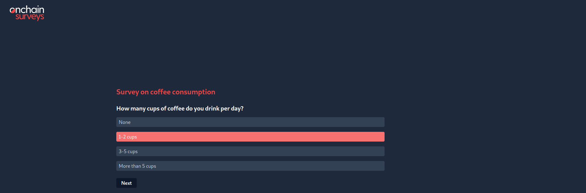
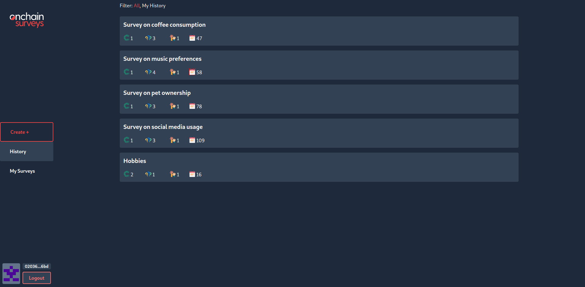
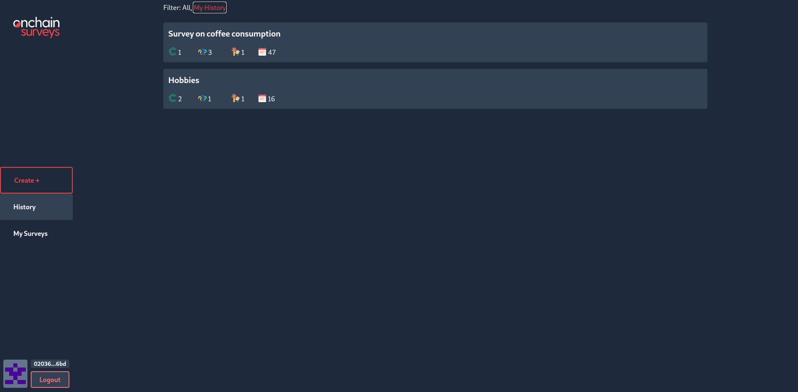
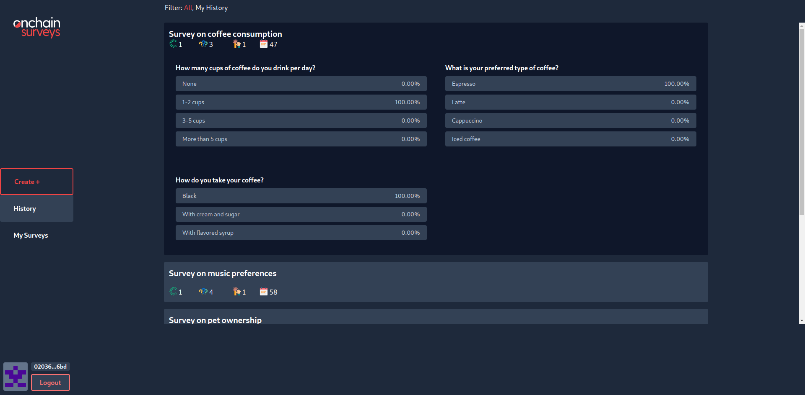
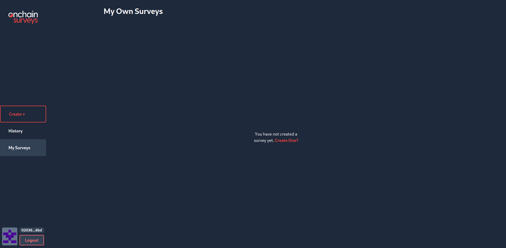
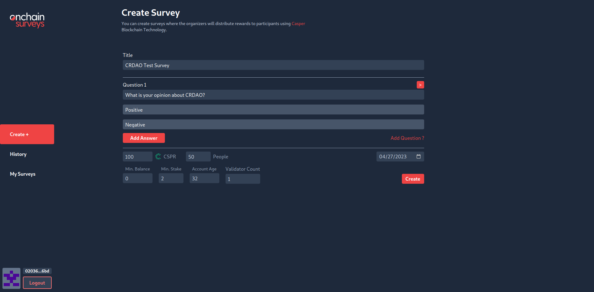
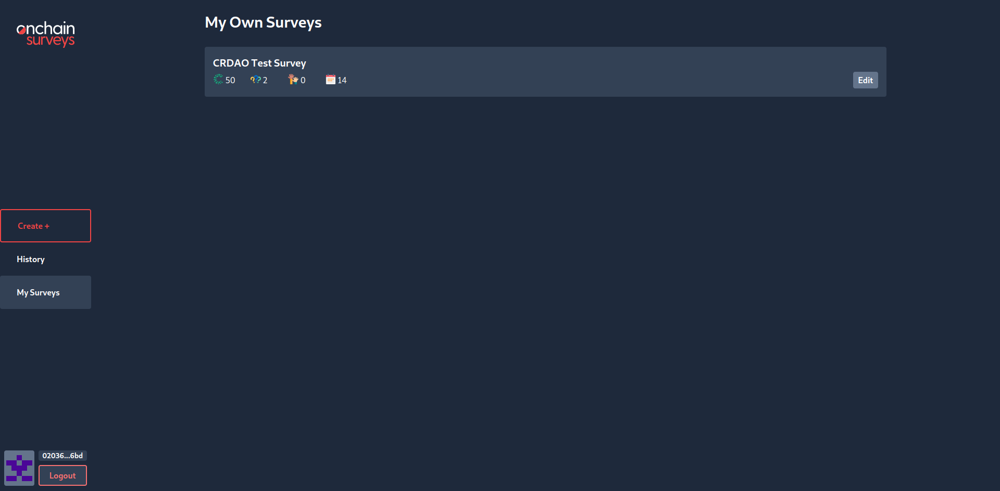

Grant Proposal | [519 - Onchain Surveys](https://portal.devxdao.com/public-proposals/519)
------------ | -------------
Milestone | 1
Milestone Title | App development
OP | fuahka
Reviewer | Gökhan Gurbetoğlu <crdao@ggurbet.com>

# Milestone Details

## Details & Acceptance Criteria

**Details of what will be delivered in milestone:**

The app will be integrated with Casper Signer.

**Acceptance criteria:**

Users will be able to:
- Connect their onchain accounts, and use it to login to the system.
- Fresh accounts, with no on-chain activity will not be able to create or fill surveys.

**Additional notes regarding submission from OP:**

For the reviewer: for any questions, you can send me a message on Telegram (Telegram username: fuahka)

## Milestone Submission

The following milestone assets/artifacts were submitted for review:

Repository | Revision Reviewed
------------ | -------------
https://github.com/yunusem/onchainsurveys | b17583b

# Install & Usage Testing Procedure and Findings

Reviewer used an Ubuntu 22.04.2 LTS GitPod instance and a server provided by the OP for doing this review.

Reviewer was successfully able to install the project using the provided instructions in the README. After the installation, reviewer created a MongoDB database and connected it to the app using the provided instructions. Then, running `npm start` on both the client and server launched the respective applications.

- [Client Installation Logs](assets/client-install.md)
- [Server Installation Logs](assets/server-install.md)

Here are some screenshots from the Client app:

#### Landing page

#### Login with new account (low activity)

#### Login fail with new low activity account

#### Login with high activity account

#### Available surveys

#### Answering a survey

#### Survey history - All surveys

#### Survey history - My surveys

#### Survey stats

#### My surveys page without any created surveys present

#### Creating a new survey

#### My surveys page after creating surveys

## Overall Impression of usage testing

Note that the interface is completely changed since the first milestone. However, functionality is still there. Additionally, new functionality required by Milestone 2 is also added and we see that it is not possible for a new, low account to sign in to the page. Also, we can set limits on the surveys so that only accounts with matching criteria could complete them.

All critical functionality required for this milestone is implemented and they are running as intended. Further improvements would be beneficial for the ease of use of the app in the following milestones.

Requirement | Finding
------------ | -------------
Project builds without errors | PASS
Documentation provides sufficient installation/execution instructions | PASS
Project functionality meets/exceeds acceptance criteria and operates without error | PASS

# Unit / Automated Testing

Unit tests for critical functionality are added and sufficient. Test logs are below.

- [Client Test Logs](assets/client-tests-log.md)
- [Server Test Logs](assets/server-tests-log.md)

Requirement | Finding
------------ | -------------
Unit Tests - At least one positive path test | PASS
Unit Tests - At least one negative path test | PASS
Unit Tests - Additional path tests | PASS

# Documentation

### Code Documentation

Code documentation is sufficient. There are many explanatory comments inside the code. Also, some TODOs exist for future implementations of following milestones.

Requirement | Finding
------------ | -------------
Code Documented | PASS

### Project Documentation

Detailed instructions for installing, running and testing the application is provided in the README. There are many examples provided with the instructions. However, further documentation with explanations are not sufficient. These need to be improved in the next milestones. For this earlier milestone, current status is enough to PASS with Notes.

Requirement | Finding
------------ | -------------
Usage Documented | PASS with Notes
Example Documented | PASS with Notes

## Overall Conclusion on Documentation

Code documentation is sufficient. General documentation needs improvements.

# Open Source Practices

## Licenses

The Project is released under the Apache-2.0 License.

Requirement | Finding
------------ | -------------
OSI-approved open source software license | PASS

## Contribution Policies

The project contains clear CONTRIBUTING and SECURITY policies, as well as the optional CODE OF CONDUCT policy. Pull requests and Issues are enabled on the repository and the project is set up for public participation. As an added bonus, issue templates also exist for the repository.

Requirement | Finding
------------ | -------------
OSS contribution best practices | PASS

# Coding Standards

## General Observations

Source code is well-written and thought out. It is easily readable. General best coding practices are used throughout the project.

# Final Conclusion

The project would benefit greatly from a Continuous Integration (CI) Action on GitHub. Code documentation is of acceptable quality and further project documentation is expected. Documentation provides information but it would benefit greatly from improvements and expansion. Coding practices and visual presentation of the project are of exceptional quality. Unit tests are sufficient.

Because of these reasons, reviewer suggests a resolution of PASS with Notes for this milestone.

# Recommendation

Recommendation | PASS with Notes
------------ | -------------
