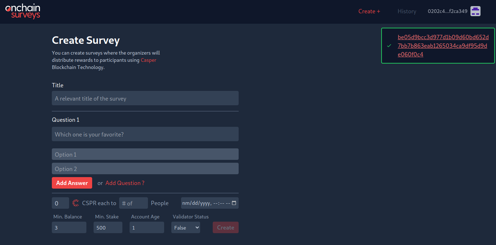

Grant Proposal | [519 - Onchain Surveys](https://portal.devxdao.com/public-proposals/519)
------------ | -------------
Milestones | 3 & 4
Milestone Titles | Onchain transition & Onchain expansion
OP | fuahka
Reviewer | Gökhan Gurbetoğlu <crdao@ggurbet.com>

# Milestone Details

## Details & Acceptance Criteria

### Milesetone 3

**Details of what will be delivered in milestone:**

The app will be integrated to the Casper Network to actively use and store data onchain.

**Acceptance criteria:**

- Smart contract to store basic user data will be deployed on the Mainnet.
- Survey creators will be able to define requirements for the participants like:
  - minimum balance
  - minimum stake
  - account age
  - validator status

**Additional notes regarding submission from OP:**

For the reviewer: for any questions, you can send me a message on telegram(telegram username: fuahka)

### Milesetone 4

**Details of what will be delivered in milestone:**

The onchain aspects of the app will be expanded, and a fee structure will be developed for the sustainability of the project.

**Acceptance criteria:**

- Survey creators will be able to;
  - Define a maximum number of participants
  - Define incentives for participants

- App administrators will be able to define
  - Fee amount for survey creation
  - Commission rate for incentivized surveys

- (optional:) Subscription will be available through casper-eip-1337
- (optional:) Overall survey stats will be stored on the Mainnet.
- (optional:) Additional features will be developed and available based on community feedback.

**Additional notes regarding submission from OP:**

For the reviewer: for any questions, you can send me a message on telegram(telegram username: fuahka)

## Milestone Submission

The following milestone assets/artifacts were submitted for review:

Repository | Revision Reviewed
------------ | -------------
https://github.com/yunusem/onchainsurveys | 4aae8db

# Install & Usage Testing Procedure and Findings

Reviewer used a local Pardus 21.5 an Ubuntu 22.04.2 LTS GitPod instance and a server provided by the OP for doing this review.

Reviewer was successfully able to install the project using the provided instructions in the README. After the installation, reviewer created a MongoDB database and connected it to the app using the provided instructions. Then, running `npm start` on both the client and server launched the respective applications.

- [Client Installation Logs](assets/client-install.md)
- [Server Installation Logs](assets/server-install.md)

Reviewer used the live instance provided by the OP to carry on usage tests. Each milestone was checked to see if they meet their respective acceptance criteria.

### Survey Creators

Here are some screenshots from the app:

#### Landing page

#### Email verification

#### Create survey

#### Survey checkout

#### Signing survey checkout

#### Survey signing successful

Deploy of the signed checkout is at: https://testnet.cspr.live/deploy/be05d9bcc3d977d1b09d60bd652d7bb7b863eab1265034ca9df95d9de060f0c4

### App Administrators

Here are some screenshots from the app:

## Overall Impression of usage testing

The app successfully meets the acceptance criteria related to defining requirements for participants and setting limitations and incentives. Survey creators are able to specify criteria such as minimum balance, minimum stake, account age, and validator status for participants. Additionally, they have the ability to set a maximum number of participants and define incentives to encourage participation. These features enable survey creators to tailor their surveys and ensure the desired participant characteristics and engagement levels are met.

Requirement | Finding
------------ | -------------
Project builds without errors | PASS
Documentation provides sufficient installation/execution instructions | PASS
Project functionality meets/exceeds acceptance criteria and operates without error | PASS

# Unit / Automated Testing

_Summarize the result of the unit testing / automated testing / integration testing provided in the Milestone. Feel free to include
automated test output, either as text, image or other artifact. Provide a `PASS`, `FAIL`, or `PASS With Notes` for the requirements
below. In the case of `PASS With Notes`, make sure that the notes for improvement are clearly spelled out in this section._

Requirement | Finding
------------ | -------------
Unit Tests - At least one positive path test | PASS / FAIL / PASS with Notes
Unit Tests - At least one negative path test | PASS / FAIL / PASS with Notes
Unit Tests - Additional path tests | PASS / FAIL / PASS with Notes

# Documentation

### Code Documentation

The code documentation is adequate, with numerous informative comments incorporated throughout the codebase.

Requirement | Finding
------------ | -------------
Code Documented | PASS

### Project Documentation

The README contains detailed instructions for installing, running, and testing the application. These instructions are comprehensive and provide step-by-step guidance on how to set up the application environment. Additionally, the README includes numerous examples that illustrate the usage of different features and functionalities, helping users to better understand the application's capabilities.

Requirement | Finding
------------ | -------------
Usage Documented | PASS
Example Documented | PASS

## Overall Conclusion on Documentation

Both the code documentation and general documentation are sufficient, providing the necessary information and guidance for understanding and utilizing the project effectively.

# Open Source Practices

## Licenses

The Project is released under the Apache-2.0 License.

Requirement | Finding
------------ | -------------
OSI-approved open source software license | PASS

## Contribution Policies

The project contains clear CONTRIBUTING and SECURITY policies, as well as the optional CODE OF CONDUCT policy. Pull requests and Issues are enabled on the repository and the project is set up for public participation. As an added bonus, issue templates also exist for the repository.

Requirement | Finding
------------ | -------------
OSS contribution best practices | PASS

# Coding Standards

## General Observations

The source code demonstrates a high level of craftsmanship and thoughtfulness. It exhibits clear readability and adheres to general best coding practices, ensuring a robust and maintainable project.

# Final Conclusion

_Summarize your final conclusion, and provide your motivation for your recommendation below. For example, you may say 'Reviewer recommends that this
submission should fail code review, because it does not contain an OSI-approved open source license'_

# Recommendation

Recommendation | PASS / FAIL / PASS with Notes
------------ | -------------
