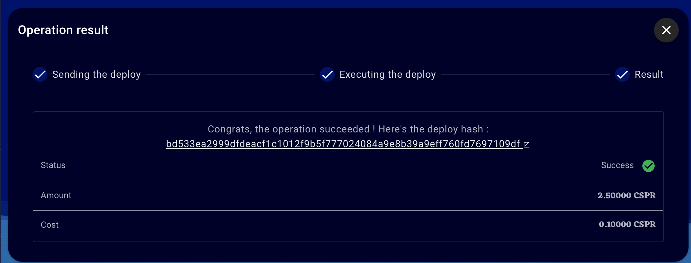

Grant Proposal | [531 - CasperHolders - DeFi update](https://portal.devxdao.com/app/proposal/531)
------------ | -------------
Milestone | 1-2
Milestone Title | Support ERC-20 operations
OP | Killian
Reviewer | Muhammed Didin <mdidin80@gmail.com>

# Milestone Details

## Details & Acceptance Criteria

**Details of what will be delivered in milestone:**

A web and mobile front-end that does the operations specified in the Acceptance Criteria.

**Acceptance criteria:**

Users will be able to :
 - Approve allowance 
 - Transfer erc20 tokens to other accounts 
 - Deploy a new token

Admins will be able to : 
- Transfer tokens to other accounts 
- Mint & burn tokens for the RengoLabs implementation

Users will be able to see their ERC-20 token balance on web & mobile app.

**Additional notes regarding submission from OP:**

Review guide : 
https://docs.google.com/document/d/1cF1IZWoZgul9gXZ51FEHoIUspog1kMkJU3RIKatrkTU/edit?usp=sharing

Contact if needed : killianh@live.fr or https://t.me/KillianH

## Milestone Submission

The following milestone assets/artifacts were submitted for review:

Repository | Revision Reviewed
------------ | -------------
https://github.com/casperholders/casperparser | e867ff2
https://github.com/casperholders/casperholdersfront| 8847c50
https://github.com/casperholders/casperholders-mobile| 32db020


# Install & Usage Testing Procedure and Findings

Following the instructions in the README file of the repository, the reviewer was able to successfully build and run the source code and use the project on macOS Monterey.


### Build

[Full Docker Build Logs](assets/build-docker.txt)

[Full CasperParser Build Logs](assets/build-casperparser.txt)

[Full Web Frontend Build Logs](assets/build-frontend.txt)

[Full Mobile Frontend Build Logs](assets/build-mobile.txt)


### Usage

### Web

After building the web front-end, the main page welcomes the user. 


For signing with Casper Signer, the reviewer pushed the "Connect" button. Following the Casper Signer instructions, the reviewer was able to sign.


Main page after successfully signing:


The balance page shows the balance details of the user.


The users can also see the operations that they made.


For transferring the CSPR token to another account, the reviewer queried to /transfer page.


After entering the account public key and amount the reviewer pushed the "Send Transaction" button. The operation was successful.


Transfer Result: https://testnet.cspr.live/deploy/bd533ea2999dfdeacf1c1012f9b5f777024084a9e8b39a9eff760fd7697109df


Users can create tokens on the Casper network using the CasperHolders site. To create a new token, the reviewer followed the steps below:
- Go to the /smartcontract page in the advanced menu
- Click on the download button on the ERC20 smart contract card.
- Click on the set argument button on the ERC20 Smart Contract card.
- Click on the Smart Contract file input and choose the downloaded wasm
- Fill in the different args and deploy then deploy the smart contract.

Args: 
```

  name: CRDAO225

  symbol: CRDAO225

  decimals: 1

  total_supply: 10

  amount (for the fee to deploy the smart contract): 100
```
The reviewer used the attached [sample smart contract](assets/erc20_token.wasm)  provided by the OP.

Sample create token result: https://testnet.cspr.live/deploy/af975a5956a74480b360b1197956c3e61b3186a9625a71fdc9cad57ae6685436

Users can also transfer the tokens they have created between accounts.

For this, the following steps should be followed:

- Go to the /balance page
- Add your erc20 token
- Verify your balance 
- Transfer tokens to another account.

The reviewer was able to successfully send the token he created to another account.

Sample transfer token result: https://testnet.cspr.live/deploy/a7becdee42ca1a3f8b6e6bdc784d922b450631a875db64eb158616748a866de4

#### Mobile 

The CasperHolders project also has a mobile interface. Following the instructions in the README file of the repository, the reviewer was able to successfully build and run the source code and use the project on iOS and Android platforms.

[Full Mobile Build](assets/build-mobile.txt)

Also, mobile applications have been listed on markets already.

Android: https://play.google.com/store/apps/details?id=com.casperholders.wallet

iOS: https://apps.apple.com/us/app/casper-holders/id1609981086

After successfully building the project, the sign-in page welcomes the user.


The reviewer clicked on the "Connect Locally" button and signed in with the public key.


However, users who want to build locally should save the key specified by the OP in the review guide in the .env.local file.

The balance page show the balance details of the account.


"Transfer", "Stake" and "Unstake" operations are performed via the "Operations" page. 


Through the NFTs page, users can see NFT products.


Through the history page, users can see operations history.


## Overall Impression of usage testing

The project builds without errors, the documentation provides sufficient installation and execution instructions, and the project functionality meets the acceptance criteria and operates without errors. 

Requirement | Finding
------------ | -------------
Project builds without errors | PASS 
Documentation provides sufficient installation/execution instructions | PASS
Project functionality meets/exceeds acceptance criteria and operates without error | PASS

# Unit / Automated Testing

The reviewer was able to successfully run the unit tests via GitHub CodeSpaces. The scripts provided in the README file was able to run the unit tests. The project runs the tests on a Chrome page via the cypress framework. There are 20 tests in the project. These tests cover all critical processes and pass successfully. All test logs are below.


[Full Test Logs](assets/test-frontend.txt)

Requirement | Finding
------------ | -------------
Unit Tests - At least one positive path test | PASS
Unit Tests - At least one negative path test | PASS
Unit Tests - Additional path tests | PASS

# Documentation

### Code Documentation

Properly formatted inline comments on the critical classes and the methods are added to the project. The reviewer thinks that there is a sufficient amount of code documentation.

Requirement | Finding
------------ | -------------
Code Documented | PASS

### Project Documentation

The Readme files have sufficient basic usage instructions for the implemented methods. The reviewer was able to build, run and use the project using project documentation.


Requirement | Finding
------------ | -------------
Usage Documented | PASS 
Example Documented | PASS

## Overall Conclusion on Documentation

In the reviewer's opinion, the project has sufficient documentation. 

# Open Source Practices

## Licenses

The Project is released under the Apache 2.0 License.

Requirement | Finding
------------ | -------------
OSI-approved open source software license | PASS

## Contribution Policies

The project has Contributing and Security Policies and a Code of Conduct.

Requirement | Finding
------------ | -------------
OSS contribution best practices | PASS

# Coding Standards

## General Observations

The project has well-structured and readable code. Code and project documentation is sufficient and they provide the necessary information to use the program. The project complies with open source standards.

# Final Conclusion

Manual and e2e tests shows that the project provides the functionality described in the grant application and milestone acceptance criteria. Also, the project complies with open source standards.

Thus, in the reviewer's opinion, this submission should PASS.

# Recommendation

Recommendation | PASS
------------ | -------------

