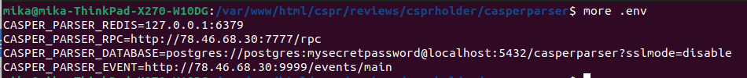
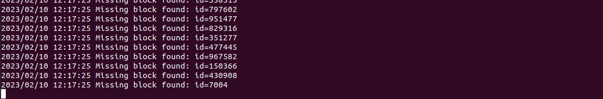

Grant Proposal | [531 - CasperHolders - DeFi update](https://portal.devxdao.com/public-proposals/531)
------------ | -------------
Milestone | 3:4
Milestone Title | Support for NFT CEP-47 tokens
OP | Killian Hascoet
Reviewer | Mikael Grouwet <m.grouwet@gmail.com>

# Milestone Details

## Details & Acceptance Criteria

**Details of what will be delivered in milestone:**

*Milestone 3 :*

Support for Casper NFT CEP-47 tokens.

Those smart contracts deployments will be added to the casper data software to reconize that kind of deploys and all the actions associated with it.

https://github.com/casperholders/casperdata

https://github.com/casper-ecosystem/casper-nft-cep47

*Milestone 4 :*

Add the hability to deploy an NFT CEP-47 smart contract from Casper implementation.
Add the hability to interact with a deployed NFT CEP-47 smart contract.

Users  :
- Approve / transfer_from / burn methods

Contract admins :
- set_token_meta / mint / mint_copies / burn / transfer methods

Users will be able to list and display details of their NFT's.

**Acceptance criteria:**

*Milestone 3 :*

CasperData can parse deploys from NFT CEP-47 smart contracts from Casper.
Those deploys will be stored in a database like in the previous grant.

Anybody will be able to setup casper data and do whatever they want with the generated data.
The maingoal of CasperData is to provide a source of thruth from off-chain data to display operations made by users on the Casper Network.

Is needed for milestone 4 and user operations details.

*Milestone 4 :*

Users  will be able to :
- Use approve / transfer_from / burn methods
- Deploy a NFT CEP-47 smart contract

Contract admins :
- Use set_token_meta / mint / mint_copies / burn / transfer methods

Users will be able to see their NFT's on web & mobile app.

**Additional notes regarding submission from OP:**

The OP provided a documentation about how to test this milestone correctly :
- https://docs.google.com/document/d/1SDkwse6WIYSXnNvJCP0i9cMDVsctWOtIAFQKthcf8F8/edit?usp=sharing
- https://docs.google.com/document/d/1cF1IZWoZgul9gXZ51FEHoIUspog1kMkJU3RIKatrkTU/edit?usp=sharing

## Milestone Submission

The following milestone assets/artifacts were submitted for review:

Repository | Revision Reviewed
------------ | -------------
https://github.com/casperholders/casperparser | e867ff2
https://github.com/casperholders/casperholdersfront/tree/develop | 0cc8a5e

# Install & Usage Testing Procedure and Findings

*Milestone 3 - CasperParser*

The reviewer was able to build, run & test the functionality described in the acceptance criteria.

Build and run :

Installation of dependencies :

In order to build the parser correctly, the .env should be created before running the command. It's not documented in the README but the error given by the console is clear enough to correct it and make it built successfully.

A client and a worker must be started to parse the data from the Casper's blockchain.

There is a nice visual interface to see the progress :

The reviewer has also installed pgadmin to check the content of the database. The reviewer was able to find the data back.

The code coverage is pretty high :

*Milestone 4 - Use CEP-47 in the webapp*

The reviewer was also able to build, run and test the app successfully.

The reviewer can use the CEP47 functionality described in the acceptance criteria.

There is also specific tests for this milestone :

The global impression for these 2 milestones is pretty good. The reviewer was able to build, run and test both milestones without too much difficulty and with the documentation provided by the OP.

## Overall Impression of usage testing

The project builds and runs without errors, the documentation contains the needed instructions for installation and execution. The project meets the acceptance criteria.

Requirement | Finding
------------ | -------------
Project builds without errors | PASS
Documentation provides sufficient installation/execution instructions | PASS
Project functionality meets/exceeds acceptance criteria and operates without error | PASS

# Unit / Automated Testing

All automated unit tests PASS for this milestone. The reviewer also noticed that the code coverage is pretty high for the casperParser (more than 70%).

Requirement | Finding
------------ | -------------
Unit Tests - At least one positive path test | PASS
Unit Tests - At least one negative path test | PASS
Unit Tests - Additional path tests | PASS

# Documentation

### Code Documentation

The code is overall well documented, and almost all classes and critical functions have acceptable code-level documentation.

Requirement | Finding
------------ | -------------
Code Documented | PASS

### Project Documentation

Project documentation is sufficient to build and set up the project. The reviewer was able to complete the necessary operations following the information provided by the documentation.

Requirement | Finding
------------ | -------------
Usage Documented | PASS
Example Documented | PASS

## Overall Conclusion on Documentation

The code is globally well documented, and almost all classes are documented. The project documentation contains the needed information to understand the project and make it build/run properly.

So, in the reviewers opinion the documentation is sufficient for this milestone.

# Open Source Practices

## Licenses

The Project is released under the Apache-2.0 license

Requirement | Finding
------------ | -------------
OSI-approved open source software license | PASS

## Contribution Policies

The project has CONTRIBUTING and SECURITY policies that link to a Code of Conduct. Also, Pull Requests and Issues are enabled.

Requirement | Finding
------------ | -------------
OSS contribution best practices | PASS

# Coding Standards

## General Observations

The source code is well-written and documented. General best coding practices are used throughout the project. The project is committed to GitHub and both the unit tests and the manual tests are passed.

# Final Conclusion

The project meets the acceptance criteria. The project works as expected and the reviewer doesn't find any critical issues.

Thus, in the reviewer's opinion, this submission should PASS.

# Recommendation

Recommendation | PASS
------------ | -------------
