Grant Proposal | [531 - CasperHolders - DeFi update](https://portal.devxdao.com/public-proposals/531)
------------ | -------------
Milestone | 5 - 6
Milestone Title | Support for CasperLabs private auction
OP | Killian Hascoet
Reviewer | Furkan Ahmet Kara <furkanahmetkara.fk@gmail.com>

# Milestone Details

## Details & Acceptance Criteria

**Details of what will be delivered in milestone:**

*Milestone 5 :*

Support for CasperLabs private auction.

Those smart contracts deployments will be added to the casper data software to reconize that kind of deploys and all the actions associated with it.

https://github.com/casperholders/casperdata

https://github.com/CasperLabs/casper-private-auction

*Milestone 6 :*

Add the hability to deploy an CasperLabs private auction smart contract from Casper implementation.
Add the hability to interact with a deployed CasperLabs private auction smart contract.

Users  :
- bid / cancel_bid  methods

Contract admins : 
- finalize methods

Users will be able to list auctions.
Users will be able to view the detail of an auction and the corresponding NFT.

**Acceptance criteria:**

*Milestone 5 :*

CasperData can parse deploys from CasperLabs private auction smart contracts from Casper.
Those deploys will be stored in a database like in the previous grant.

Anybody will be able to setup casper data and do whatever they want with the generated data.
The maingoal of CasperData is to provide a source of thruth from off-chain data to display operations made by users on the Casper Network.

Is needed for milestone 6 and user operations details.

*Milestone 6 :*

Users  will be able to :
- Use bid / cancel_bid  methods
- Deploy an auction

Contract admins : 
- Use finalize methods

Users will be able to list auctions.
Users will be able to view the detail of an auction and the corresponding NFT.

**Additional notes regarding submission from OP:**

Review guide : 
https://docs.google.com/document/d/1cF1IZWoZgul9gXZ51FEHoIUspog1kMkJU3RIKatrkTU/edit?usp=sharing

Contact if needed : killianh@live.fr or https://t.me/KillianH

## Milestone Submission

The following milestone assets/artifacts were submitted for review:

Repository | Revision Reviewed
------------ | -------------
https://github.com/casperholders/casperparser | e867ff2
https://github.com/casperholders/casperholdersfront/tree/develop | 0cc8a5e

# Install & Usage Testing Procedure and Findings

*CasperParser*

The reviewer was able to build, run the project

Build:

[build](assets/buildparser.txt)

[redis](assets/redis.txt)

[postgres](assets/postgres.txt)

*CasperHoldersFront*

The reviewer was also able to build, run and test the app successfully.

[build](assets/build.txt)

All deploys can be checked here for the auction processes:

[Deploys Account](https://testnet.cspr.live/account/01c6c5f40d191fb1489d7f79e2cd483d8d26e576576ed185a9018526c77c85bf61)

Screenshots of usage testing are below:

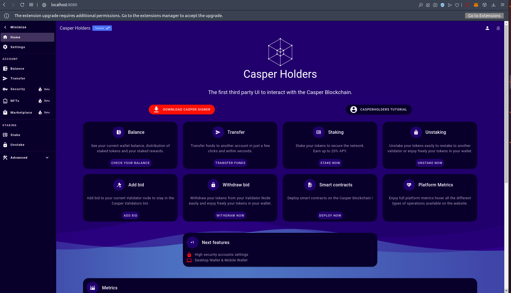

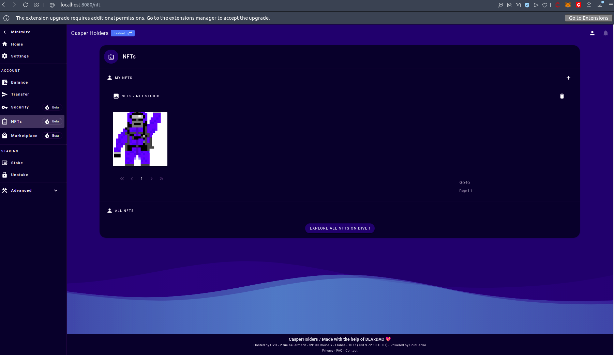

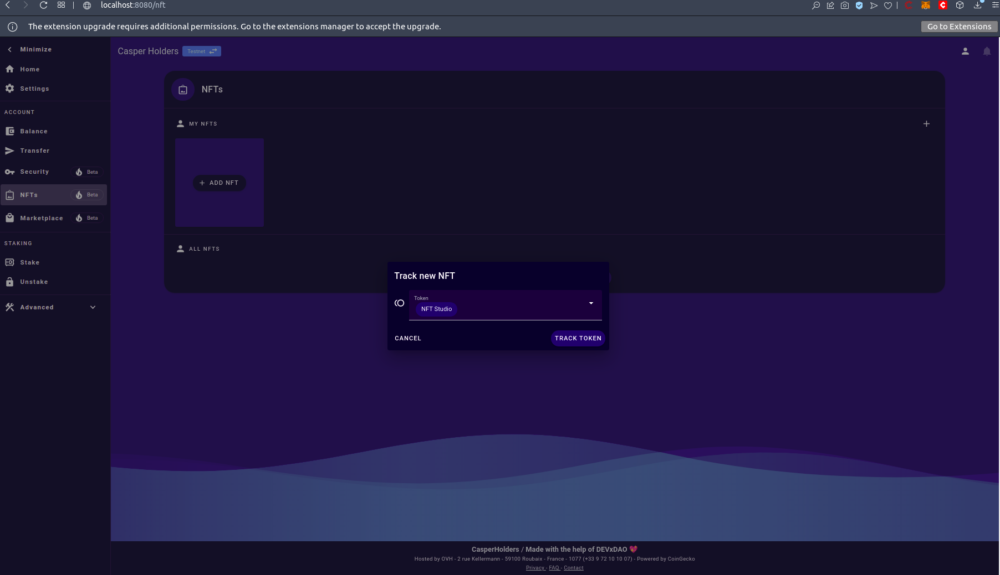

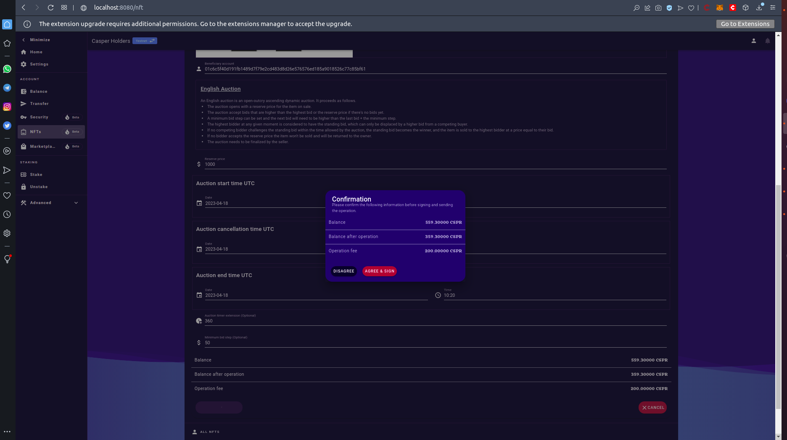

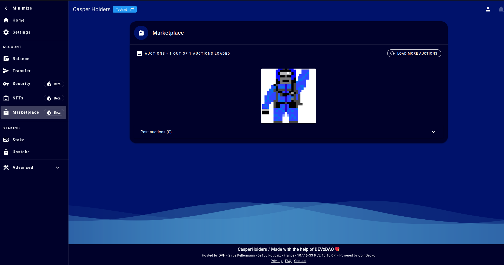

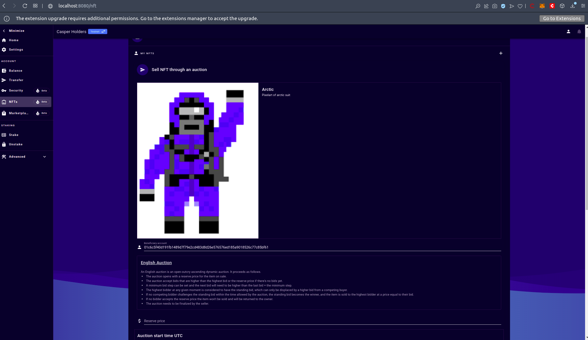

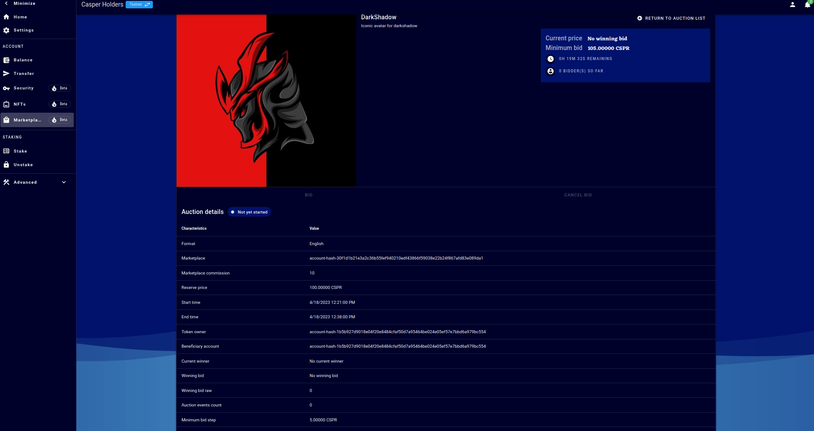

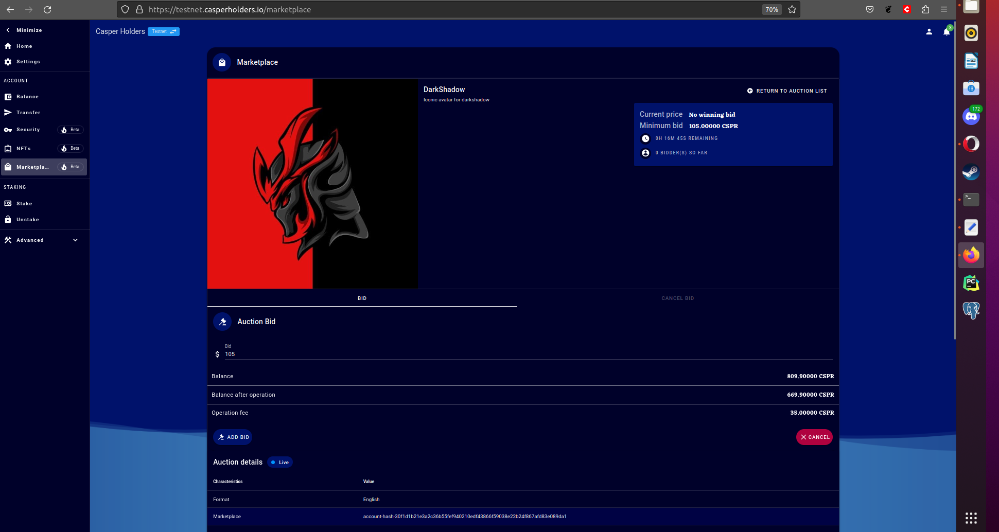

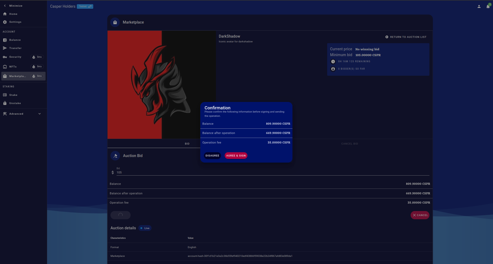

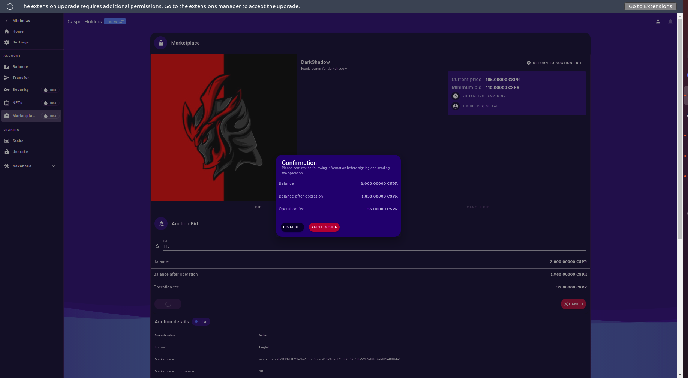

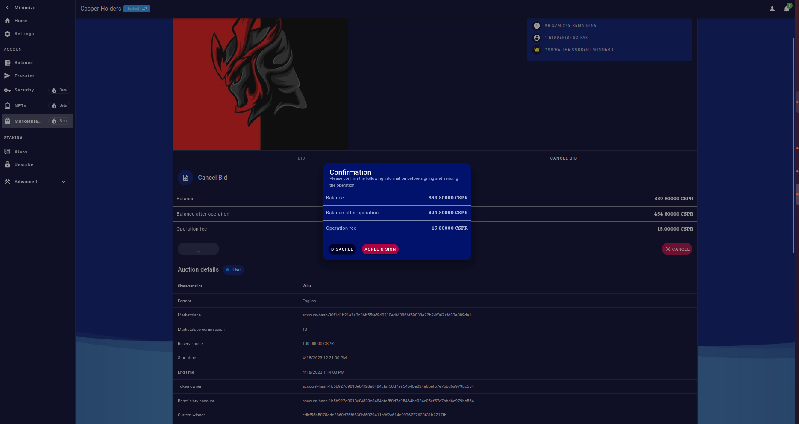

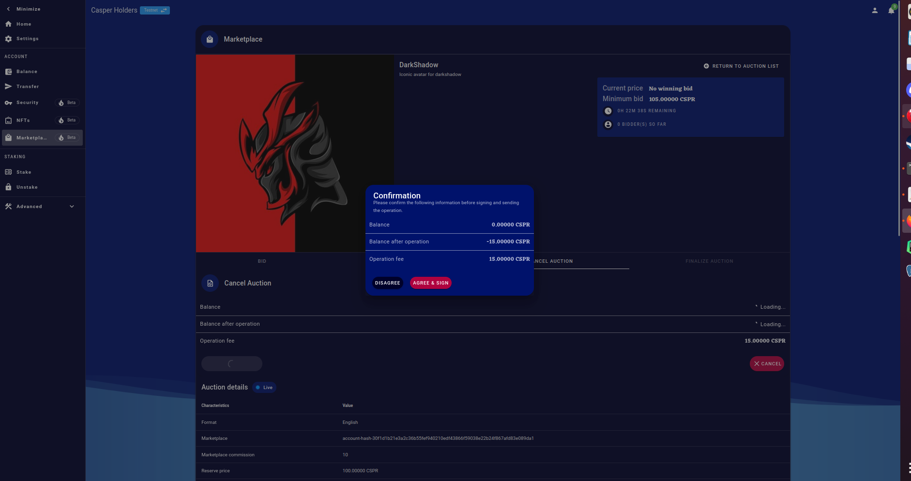

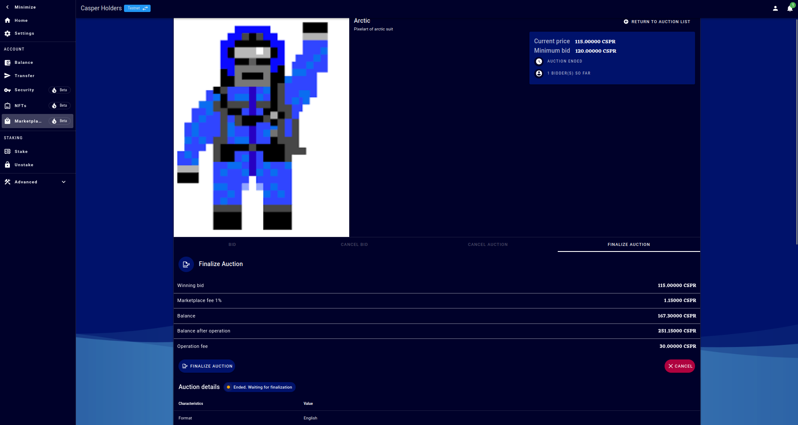

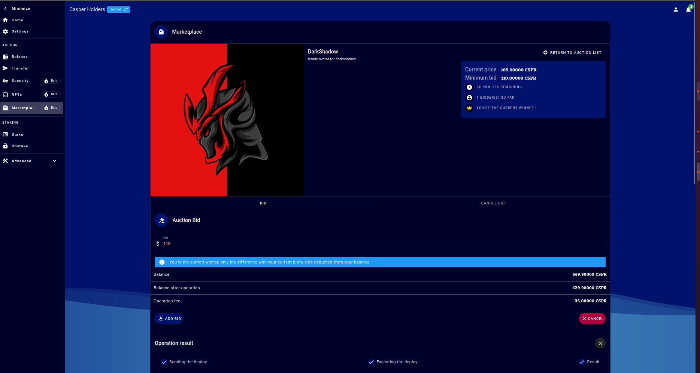

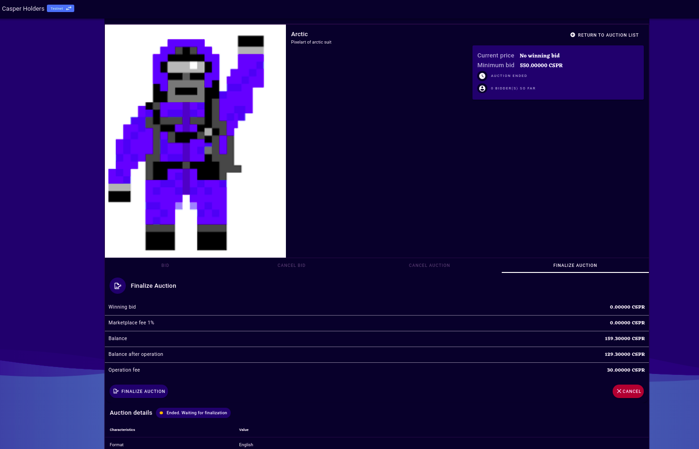

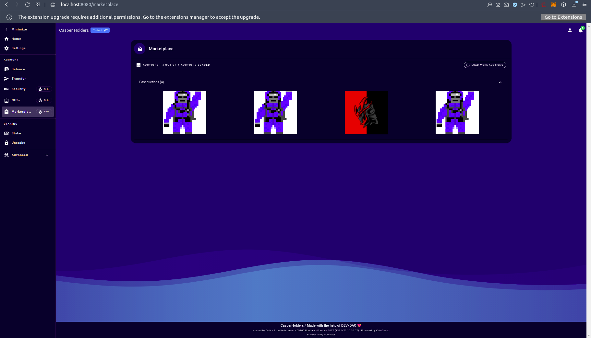

## Overall Impression of usage testing

The project builds and runs without errors, the documentation contains the needed instructions for installation and execution. The project meets the acceptance criteria but auction mechanism should be updated and improved in the reviewers opinion(will be explained in the conclusion).

Requirement | Finding
------------ | -------------
Project builds without errors | PASS
Documentation provides sufficient installation/execution instructions | PASS
Project functionality meets/exceeds acceptance criteria and operates without error | PASS with Notes

# Unit / Automated Testing

Tests run successfully, coverage is sufficient. Logs are below:

[Test Logs](assets/fronttests.txt)

Requirement | Finding
------------ | -------------
Unit Tests - At least one positive path test | PASS
Unit Tests - At least one negative path test | PASS
Unit Tests - Additional path tests | PASS

# Documentation

### Code Documentation

The code is good enough, critical functions have acceptable code-level documentation.

Requirement | Finding
------------ | -------------
Code Documented | PASS

### Project Documentation

The reviewer was able to run and test the project by following the instructions provided in the documentation. Project documentation is sufficient to build and set up the project.

Requirement | Finding
------------ | -------------
Usage Documented | PASS
Example Documented | PASS

## Overall Conclusion on Documentation

Code level documentation is sufficient enough. Project documentation has necessary instructions to build, run and test the project

So, in the reviewers opinion the documentation is sufficient for this milestone.

# Open Source Practices

## Licenses

The Project is released under the Apache-2.0 license

Requirement | Finding
------------ | -------------
OSI-approved open source software license | PASS

## Contribution Policies

The project has CONTRIBUTING and SECURITY policies that link to a Code of Conduct. Pull Requests and Issues are enabled.

Requirement | Finding
------------ | -------------
OSS contribution best practices | PASS

# Coding Standards

## General Observations

The source code is well-structered and documented. The project is uploaded on GitHub. Tests run successfully.

# Final Conclusion

The project meets the acceptance criteria but there are things that needs to be updated in the reviewer's opinion:

While trying to start and auction start date is set to an outdated time so it cause the deploy to be failed. To fix this you need to change start date to a valid one manually. The reviewer thinks that default start time should be updated to a valid time.

The reviewer thinks that bidding mechanism should be changed aswell. When a new bidder bid on an auction old bids are being overwritten. And if the new bidder cancel his bid auction will have no bid and if this happen just before auction end, it will cause auction to fail. Thus, in the reviewer's opinion there should be a mechanism to store all bids and if the winner cancel his bid second bid should be replaced as a winner and so on.

Also, another thing is that if one bidder bid and second one bids same amount right after him, before the first deploy complete, it will fail the second bid and gas fee will be burned for no reason. The reviewer thinks that there can be a mechanism on the ui or backend to check and sort this.

Thus, in the reviewer's opinion, this submission should PASS with Notes.

# Recommendation

Recommendation | PASS with Notes
------------ | -------------
