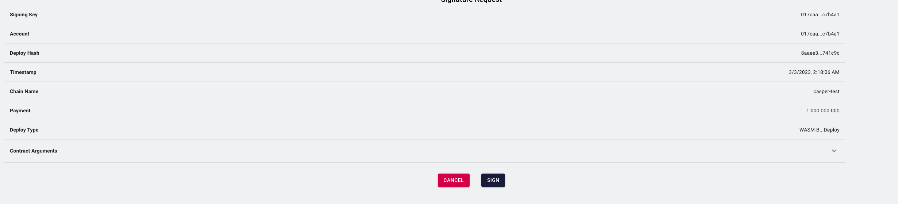

Grant Proposal | [531 - CasperHolders - DeFi update](https://portal.devxdao.com/public-proposals/531)
------------ | -------------
Milestone | 7
Milestone Title | Multi-sig & offline deploys
OP | Killian Hascoet
Reviewer | Muharrem Salel <muharremsalel@gmail.com>

# Milestone Details

## Details & Acceptance Criteria

**Details of what will be delivered in milestone:**

Users will be able to : 
- Perform an operation with keys that have custom deploys weights and share the JSON deploy / or link to others parties to sign the deploy.
- Already implemented and live in beta on testnet + mainnet.

**Acceptance criteria:**

- Perform an operation with keys that have custom deploys weights and share the JSON deploy / or link to others parties to sign the deploy.

**Additional notes regarding submission from OP:**

Review guide : 
https://docs.google.com/document/d/1cF1IZWoZgul9gXZ51FEHoIUspog1kMkJU3RIKatrkTU/edit?usp=sharing

## Milestone Submission

The following milestone assets/artifacts were submitted for review:

Repository | Revision Reviewed
------------ | -------------
https://github.com/casperholders/casperholdersfront/tree/develop | ed717b7

# Install & Usage Testing Procedure and Findings

Instructions in the README.md file in the repository(https://github.com/casperholders/casperholdersfront/tree/develop) are well-written that make usage of the project easy. They explain a clear path for users, and following instructions step by step helps the user to run and test the codebase. The reviewer followed these steps from a Mac (macOS Monterey - MacBook Pro Intel i9 2019) and successfully run both tests and the project itself.

## Overall Impression of usage testing

The project builds and runs without errors, the documentation contains the needed instructions for installation and execution. The project meets the acceptance criteria.

Requirement | Finding
------------ | -------------
The project builds without errors | PASS
Documentation provides sufficient installation/execution instructions | PASS
Project functionality meets/exceeds acceptance criteria and operates without error | PASS

# Unit / Automated Testing

All automated unit tests PASS for this milestone.

Requirement | Finding
------------ | -------------
Unit Tests - At least one positive path test | PASS
Unit Tests - At least one negative path test | PASS
Unit Tests - Additional path tests | PASS

# Documentation

### Code Documentation

The code is overall well documented, and almost all classes and critical functions have acceptable code-level documentation.

Requirement | Finding
------------ | -------------
Code Documented | PASS

### Project Documentation

Project documentation is sufficient to build and set up the project. The reviewer was able to complete the necessary operations following the information provided by the documentation.

Requirement | Finding
------------ | -------------
Usage Documented | PASS
Example Documented | PASS

## Overall Conclusion on Documentation

The code is globally well documented, and almost all classes are documented. The project documentation contains the needed information to understand the project and make it build/run properly.

So, in the reviewer's opinion, the documentation is sufficient for this milestone.

# Open Source Practices

## Licenses

The Project is released under the Apache-2.0 license

Requirement | Finding
------------ | -------------
OSI-approved open-source software license | PASS

## Contribution Policies

The project has CONTRIBUTING and SECURITY policies that link to a Code of Conduct. Also, Pull Requests and Issues are enabled.

Requirement | Finding
------------ | -------------
OSS contribution best practices | PASS

# Coding Standards

## General Observations

The source code is well-written and documented. General best coding practices are used throughout the project. The project is committed to GitHub and both the unit tests and the manual tests are passed.

# Final Conclusion

The project meets the acceptance criteria. The project works as expected and the reviewer doesn't find any critical issues.

Thus, in the reviewer's opinion, this submission should PASS.

# Recommendation

Recommendation | PASS
------------ | -------------
