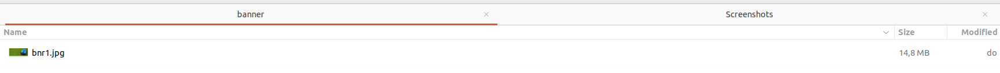

Grant Proposal | [532 - Verified Impact NFT Contract, first implementation for Ukraine (VI-NFT)](https://portal.devxdao.com/public-proposals/532)
------------ | -------------
Milestone | 4
Milestone Title | NFT CreatorAccess
OP | dradel
Reviewer | Mikael Grouwet <m.grouwet@gmail.com>

# Milestone Details

## Details & Acceptance Criteria

**Details of what will be delivered in milestone:**

The NFT creator access, including:
- Connection with Casper Signer
- Display the current VI NFT contracts
- Ability to mint based on the contract

**Acceptance criteria:**

NFT CreatorAccess website and GitHub code.
The deployed website allowing the user of:
- Connection with Casper Signer
- Display the current VI NFT contracts
- Ability to mint based on the contract

**Additional notes regarding submission from OP:**

The OP provided a documentation about how to test this milestone correctly https://drive.google.com/file/d/1T5dMR6Rn87hWM-RkGFxVcx7lrnkl6fm5/view?usp=sharing

## Milestone Submission

The following milestone assets/artifacts were submitted for review:

Repository | Revision Reviewed
------------ | -------------
https://github.com/AdelElMessiry/Verified-Impact-NFTs | b6e3877

# Install & Usage Testing Procedure and Findings

The reviewer was able to build and install the project after the OP has reworked the README.

The reviewer was able to compile and build the contract as mentioned in the README. 
The only thing is that the link to the casper's documentation was broken.

Installation of the dependencies via the "yarn install" command :

And then the project start successfully :

The OP provided a website (https://staging.verifiedimpactnfts.com/) which is the the same as the local version.  
At first the OP provided info about how to use a custom version of the signer but during the review, the Casper's Signer was updated and it's no more needed. 

The reviewer was able to mint a picture 

The reviewer also noticed few things that can be improved:

**logging**

There are a lot of warning in the console after starting the project. 
The reviewer recommends to the OP to correct some of them for a better readability.

**console.log**

The reviewer also noticed that there are also a lot of "console.log" in the console of the browser. 
The reviewer recommends also to clean these log in the production environment :

**Image size**

The reviewer also saw that the main banner's size is 14Mo. It's clearly to high and not recommended. It will have an impact on the user experience and on the performance. 

**Constants**

The reviewer noted that he can define more "env" variables (defined in the file constants/blockchains.ts and constants/paymentAmounts.ts) but it's not documented. 
It's important for someone who want to fork the repository. He must know what can be parametrize or not.

**yarn build**

There is no documentation about how to build the project for a production environment. 
It's a single command but it should be mentioned somewhere.

**Button Casper Signer**

When passing the mouse over the Casper's Signer button, the cursor doesn't display a hand. 
Without the documentation provided by the OP, the reviewer will be not aware that the button is clickable 

## Overall Impression of usage testing

After some little research, the reviewer was able to run and test the project.

The app works as described by the OP.

The reviewer recommends the OP to have a look at theses findings :
- console.log
- logging
- image size
- constants
- yarn build
- Casper's Signer button

Except that, the app meets the acceptance criteria.

Requirement | Finding
------------ | -------------
Project builds without errors | PASS
Documentation provides sufficient installation/execution instructions | PASS with Notes
Project functionality meets/exceeds acceptance criteria and operates without error | PASS

# Unit / Automated Testing

9 tests are defined. The reviewer recommends to add more tests to have a better code coverage.

The reviewer advises the OP to add tests in the future to increase the stability of the app.

Requirement | Finding
------------ | -------------
Unit Tests - At least one positive path test | Pass
Unit Tests - At least one negative path test | Pass
Unit Tests - Additional path tests | Pass with Notes

# Documentation

### Code Documentation

After the reviewer notify the OP, the OP added a doc folder with a documentation based on JSDoc.
It's sufficient enough for this review but it can be improve.

Requirement | Finding
------------ | -------------
Code Documented | Pass with Notes

### Project Documentation

As mentioned earlier, the documentation was improved during the review.

The OP take in account the feedback and provide sufficient documentation to understand the app.

Requirement | Finding
------------ | -------------
Usage Documented | Pass
Example Documented | Pass

## Overall Conclusion on Documentation

The reviewer concludes that the project has sufficient documentation but the code documentation can be improved.

# Open Source Practices

## Licenses

The Project is released under the MIT License

Requirement | Finding
------------ | -------------
OSI-approved open source software license | PASS

## Contribution Policies

Pull requests and Issues are enabled.  
The repository does contain a CONTRIBUTING and a SECURITY policy.

Requirement | Finding
------------ | -------------
OSS contribution best practices | PASS

# Coding Standards

## General Observations

Code is generally well-structured and readable. 

The OP should take a look at the findings describe earlier :
- console.log
- logging
- image size
- constants
- yarn build
- Casper's Signer button

He should also improve the code's documentation and add more tests to have a better code coverage.

# Final Conclusion

The project meets the acceptance criterias.

The reviewer appreciates that during the review the Casper's signer added the the support of verifiedimpactnfts.com which simplify the tests.

The reviewer also like the work of the OP during the review to improve the documentations and the tests. It's sufficient but the reviewer recommands to continue working on it, especially the unit tests.

Thus, in the reviewer's opinion, this submission should Pass with Notes.

# Recommendation

Recommendation | Pass with Notes
------------ | -------------
