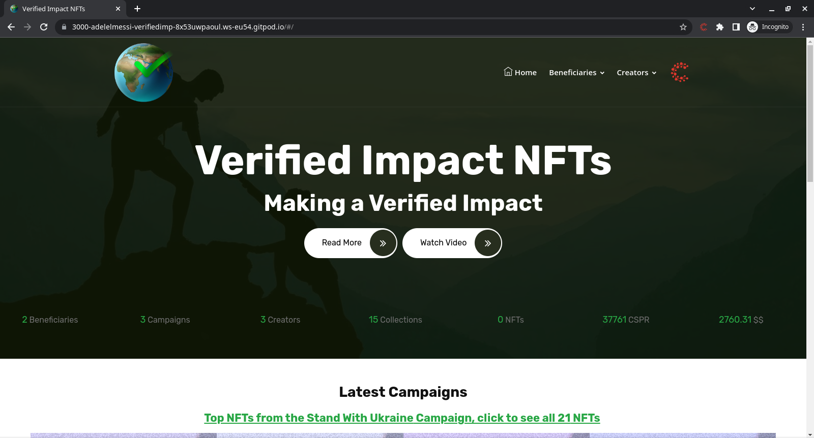
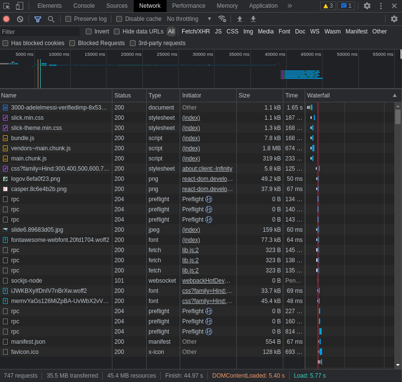
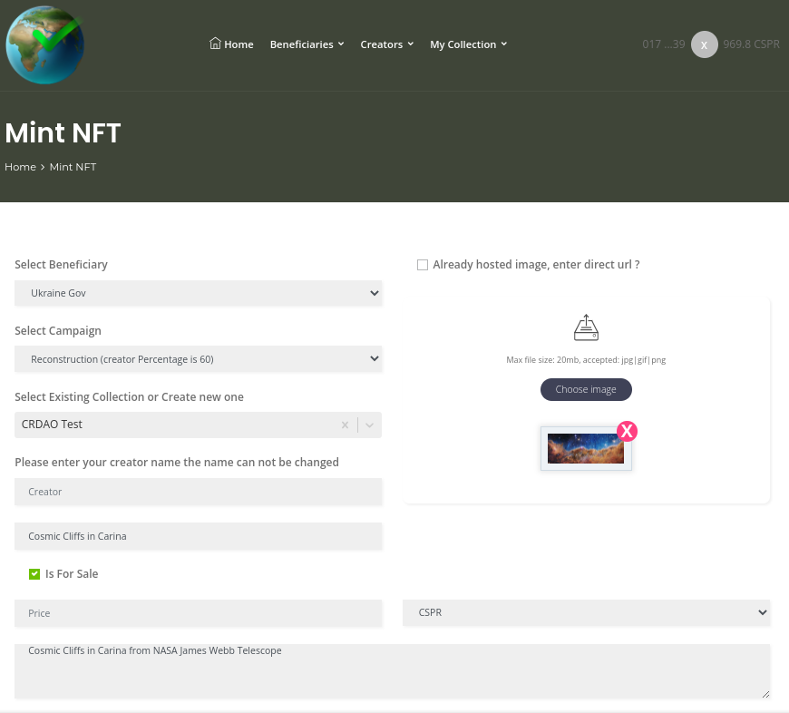
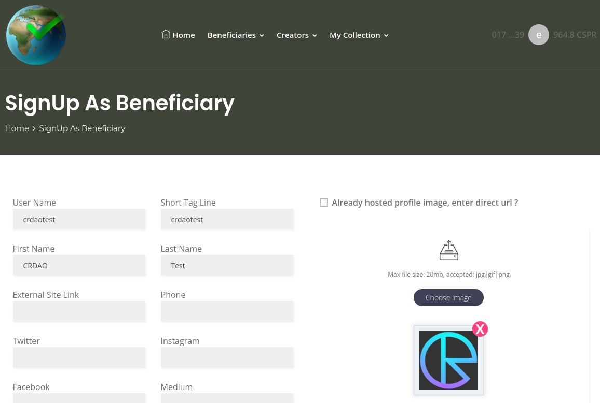
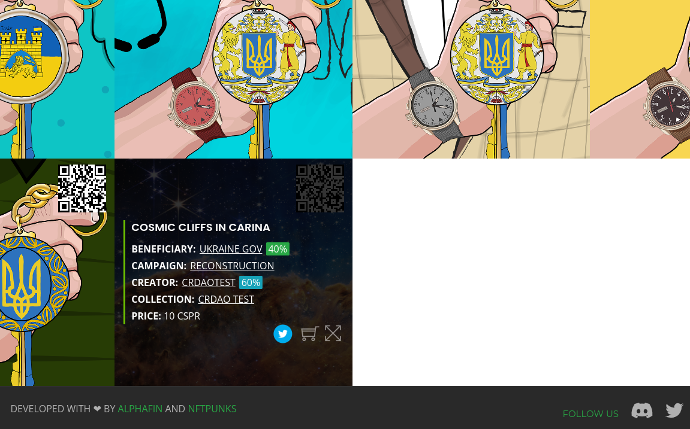

Grant Proposal | [532 - Verified Impact NFT Contract, first implementation for Ukraine (VI-NFT)](https://portal.devxdao.com/public-proposals/532)
------------ | -------------
Milestone | 5
Milestone Title | VI NFT Smart Contract
OP | dradel
Reviewer | Gökhan Gurbetoğlu <crdao@ggurbet.com>

# Milestone Details

## Details & Acceptance Criteria

**Details of what will be delivered in milestone:**

Create a special VI NFT Smart Contract, that allows for:
- Setting the beneficiary of the NFT sale (only by the deployer wallet)
- Set the wallet address for the beneficiary
- Set the % of the initial sale to the creator
- Set the royalties for subsequent sales
- Allow the creator of minting based on the beneficiary contract 
- Add Admin feature in the site to allow the contract interaction

**Acceptance criteria:**

GitHub repo with the smart contracts, and GitHub repo for the admin part.

The deployed site allowing the Admin of:
- Setting the beneficiary of the NFT sale (only by the deployer wallet)
- Set the wallet address for the beneficiary
- Set the % of the initial sale to the creator
- Set the royalties for subsequent sales
- Allow the creator of minting based on the beneficiary contract

**Additional notes regarding submission from OP:**

In the attached pdf, we detail the BR-AC with steps, screenshots and provide a link to the contracts inside the GitHub: https://drive.google.com/file/d/1KUycuYx8r2SVBCX1eeFOAQdcO1osxi3u/view?usp=sharing

## Milestone Submission

The following milestone assets/artifacts were submitted for review:

Repository | Revision Reviewed
------------ | -------------
https://github.com/AdelElMessiry/Verified-Impact-NFTs | b6e3877

# Install & Usage Testing Procedure and Findings

Reviewer used an Ubuntu 20.04 LTS GitPod instance for doing this review.

Reviewer was successfully able to install the project using the provided instructions in the README.

Also, reviewer commends OP for providing an additional PDF guide for this milestone, which had excellent step by step instructions that made the installation and usage a very pleasant experience.

- [Installation logs](assets/makebuild.md)

After the build, using `yarn start`, reviewer successfully started the local instance of the website.

- [Initializing the website](assets/yarn.md)

While starting the website, terminal throws many warnings which would be nice to keep an eye on.

### Optimization suggestions

Website load times were very slow. It almost took a minute to fully load the website and most of it were almost unusable during this process. Further inspection revealed that OP used a very large banner file at about 15 MB on the live website but it looks like this has been removed in a previous milestone for the local copy. However the overall website load was still at 35.5 MB. These numbers are extremely high and also a bottleneck for the general usability of the website.

Reviewer suggests optimizing the images on the website. Especially using JPEGs in place of PNGs and creating appropriate smaller images instead of using the original ones when in thumbnail mode would significantly decrease the load size.

### Usage Testing

Usage testing was done on the [dev website](https://dev.verifiedimpactnfts.com/) provided by OP.

There is no mention of a sign in button on the main page. Since the reviewer was accustomed to the Casper logo, they figured out this is a way to sign in with Casper. However, a regular user probably would not be able to find this. This needs to be given attention in future updates.

Also, after signing in, clicking the profile picture (which is the first alphanumeric symbol of user's public key) signs the user out. This behavior is also not mentioned and was a surprise for the reviewer. This too needs attention.

There was no mention of where to use the beneficiary modules described in the milestone. The beneficiaries link provides a list of them, but reviewer has to locate it somewhere else, namely in user profile.

On many pages, there are icons. These icons has functions and thus are clickable. However, they are not stylized as buttons so a user could not understand that the have a functionality at a glance. These need to be addressed.

Reviewer then went on to mint an NFT.

Then, reviewer signed up as a beneficiary.

After minting an NFT, it was successfully listed under the preferred campaign.

## Overall Impression of usage testing

The milestone completes its acceptance criteria. However, while functionality exists and the project operates without errors, general annoyances caused by optimization problems make the site a very heavy burden on regular users' devices. These issues need to be fixed in an update.

Installation instructions could be clearer. Looking at the reviews of previous milestones, it is seen that OP has addressed missing documentation for this regard but reviewer suggests a bit more care for explaining the installation process.

Requirement | Finding
------------ | -------------
Project builds without errors | PASS
Documentation provides sufficient installation/execution instructions | PASS with Notes
Project functionality meets/exceeds acceptance criteria and operates without error | PASS with Notes

# Unit / Automated Testing

All unit tests for critical functionality exist.

- [Unit test logs](assets/unit-tests.md)

Requirement | Finding
------------ | -------------
Unit Tests - At least one positive path test | PASS
Unit Tests - At least one negative path test | PASS
Unit Tests - Additional path tests | PASS

# Documentation

### Code Documentation

Overall code comments are sufficient. Most of them are detailed enough to explain the methods but some of them can be expanded and there can be a few more added comments as a suggestion. Some commented out code exists and reviewer suggests leaving these out of the main branch of the project. Some unused console.log() commands are also commented and preferably should be removed.

Requirement | Finding
------------ | -------------
Code Documented | PASS with Notes

### Project Documentation

Project documentation is sufficient and can be examplary to other projects. OP did a great job providing step by step instructions on achieving each acceptance criteria.

Requirement | Finding
------------ | -------------
Usage Documented | PASS
Example Documented | PASS

## Overall Conclusion on Documentation

Documentation is sufficient and well prepared. Small stylistic and syntactic improvements in future updates could be beneficial for the project. Extra documentation is readily available at `/docs` folder.

# Open Source Practices

## Licenses

The project is released under the MIT license.

Requirement | Finding
------------ | -------------
OSI-approved open source software license | PASS

## Contribution Policies

The project contains clear CONTRIBUTING and SECURITY policies. Pull requests and Issues are enabled on the repository and the project is set up for public participation.

Requirement | Finding
------------ | -------------
OSS contribution best practices | PASS

# Coding Standards

## General Observations

Source code is well-written and thought out. It is easily readable. General best coding practices are used throughout the project.

# Final Conclusion

The milestone completes its acceptance criteria. However, while functionality exists and the project operates without errors, image optimizations need to be done since the current size of the website is too large for average daily devices. All other aspects of the project is sufficiently provided for this review. The reviewer suggests the project to PASS with Notes.

# Recommendation

Recommendation | PASS with Notes
------------ | -------------
