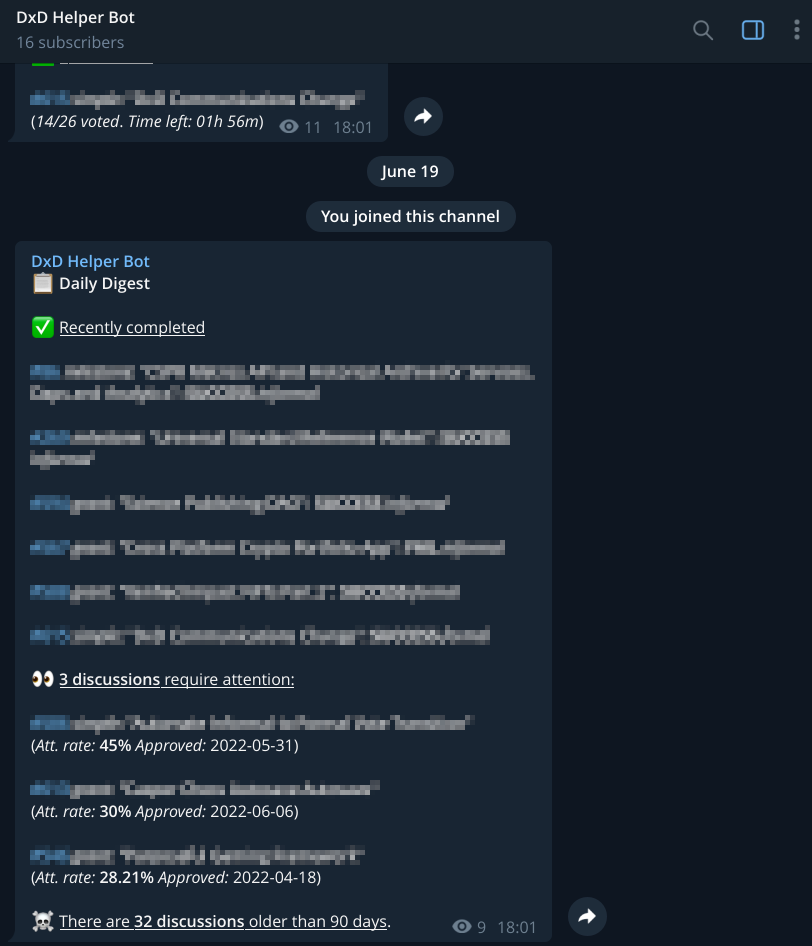

Grant Proposal | [543 - Distressing Helper Bot - improving VA's workflow productivity](https://portal.devxdao.com/public-proposals/543)
------------ | -------------
Milestone | 1
Milestone Title | Basic bot functionality - Submission 1
OP | Uchu
Reviewer | Gökhan Gurbetoğlu <crdao@ggurbet.com>

# Milestone Details

## Details & Acceptance Criteria

**Details of what will be delivered in milestone:**

Fully working bot that can gather information from the portal and post digest and alerts to a dedicated Telegram channel.

We expect the milestone to be finished before the specified deadline, but as it depends on some changes in the Portal's API, it can be delayed according to the delivery of those changes.

**Acceptance criteria:**

- Bot will access Portal's API and gather required information about proposals, formal and informal votes;
- A dedicated private Telegram channels will be created - for VAs only;
- Bot will not be accessible for other users outside of the channel;
- It will post a daily digest with a summary of passed / failed proposals and other general information;
- Once any voting has started or ended it will make a post with the details;
- It will notify of votings that are ending soon but have no quorum yet to bring attention;
- Code will be published as open source, though it will not be possible to access information from the portal without a configuration file that keeps the tokens and secret data;
- Code will be covered with tests;
- Basic documentation on how to set up the project and run the tests will be created;
- Code will be hosted and set up on a production environment.

**Additional notes regarding submission from OP:**

The channel for VAs is already live and we slowly start to invite new members, as we see it's stable and working properly. We are open to any suggestions regarding the posts schedule, content and other related things.

Interactive part will be provided in the next milestone. If you are the one who reviews this milestone, or just interested to join the alerts system at its early stage, please don't hesitate and contact us, so we can add you do the channel.

The current milestone submission addresses the acceptance criteria mentioned in the grant description.

## Milestone Submission

The following milestone assets/artifacts were submitted for review:

Repository | Revision Reviewed
------------ | -------------
https://github.com/a3mc/helperbot | 88d226a

# Install & Usage Testing Procedure and Findings

Following the instructions in the provided README, reviewer was able to successfully build the source code without errors for these milestones on both a Pardus GNU/Linux 21.2 machine and an Ubuntu 20.04 GitPod instance. All corresponding logs are listed below.

- [Build logs](assets/build.md)
- [Database migration](assets/migrate.md)

## Overall Impression of usage testing

Documentation provides sufficient installation instructions. Reviewer easily set up the environment to build the project using these.

Reviewer was able to test the bot both locally and on a live instance prepared by the developer. In both cases, the bot ran as intended and posted the specific information mentioned in acceptance criteria. These were observed:

- A dedicated private Telegram channel was created by the developer, for VAs only.
- Bot accessed DEVxDAO Portal's API and gathered required information about proposals, formal and informal votes.
- Bot is not accessible for other users outside of this channel.
- Bot posted a daily digest with a summary of passed or failed proposals and other general information.
- Once any voting has started or ended it made a post with the details.
- It notified about votings that are ending soon but have no quorum yet to bring attention.

The bot meets the acceptance criteria for this milestone.

### Developer Instance

Below is a sample post created by the bot at the dedicated channel.  
*Note: Proposal names are pixelated to protect privacy.*

### Local Instance

Below is a sample post created by the bot that runs locally at the test channel created by the reviewer.  
*Note: Since the test account is not a VA, some information is missing from this screenshot. Also, proposal names are pixelated to protect privacy.*

Below is a sample running log for the bot.  
*Note: Since the test account is not a VA, bot throws some errors when it cannot reach VA specific parts of the pulled information. These errors should be ignored for the review.*

- [Bot running log](assets/bot.md)

Requirement | Finding
------------ | -------------
Project builds without errors | PASS
Documentation provides sufficient installation/execution instructions | PASS
Project functionality meets/exceeds acceptance criteria and operates without error | PASS

# Unit / Automated Testing

All automated unit tests PASS for this milestone. Automated tests cover critical functionality. Reviewer successfully run all automated tests on an Ubuntu 20.04 GitPod instance. Overall quality of tests are sufficient. Test output is below.

- [Unit tests](assets/test.md)

Requirement | Finding
------------ | -------------
Unit Tests - At least one positive path test | PASS
Unit Tests - At least one negative path test | PASS
Unit Tests - Additional path tests | PASS

# Documentation

### Code Documentation

Critical functionality of the code is commented. However, comments would benefit from being more definitive. In its current state it needs improvements. As a suggestion from the reviewer, there could also be added comments for some non critical functionality for developers to better understand the code.

Requirement | Finding
------------ | -------------
Code Documented | PASS with Notes

### Project Documentation

Project documentation is sufficient to build and set up the bot, create Telegram channels and connect bot to the channel. Reviewer was able to complete necessary operations following the information provided by the documentation.

Requirement | Finding
------------ | -------------
Usage Documented | PASS
Example Documented | PASS

## Overall Conclusion on Documentation

Documentation is sufficient for this milestone.

# Open Source Practices

## Licenses

The Project is released under the MIT License.

Requirement | Finding
------------ | -------------
OSI-approved open source software license | PASS

## Contribution Policies

The project has CONTRIBUTING and SECURITY policies. It also includes the optional Code of Conduct policy. Pull Requests and Issues are enabled on the repository and the project is set up for public participation. Developer responded to issues very quickly.

Requirement | Finding
------------ | -------------
OSS contribution best practices | PASS

# Coding Standards

## General Observations

Source code is well-written and thought out. It is easily readable. General best coding practices are used throughout the project. Overall sufficient work is done.

# Final Conclusion

Project provides the acceptance criteria for the milestone it covers. Unit tests are well prepared and useful for helping understand how different usage scenarios can be executed. Documentation is sufficient. However, code documentation needs some additional work and would benefit greatly from more descriptive comments. Coding practices used in the project are of good quality. Because of its sufficient deliverables, reviewer suggests the project to PASS with Notes.

# Recommendation

Recommendation | PASS with Notes
------------ | -------------
