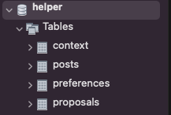

Grant Proposal | [543 - Distressing Helper Bot - improving VA's workflow productivity](https://portal.devxdao.com/public-proposals/543)
------------ | -------------
Milestone | 2
Milestone Title | Custom subscriptions and interactivity - Submission 1
OP | Uchu
Reviewer | Muhammed Didin <mdidin80@gmail.com>

# Milestone Details

## Details & Acceptance Criteria

**Details of what will be delivered in milestone:**

 A bot that accepts interactive commands to subscribe or unsubscribe to the custom alerts and sends notifications for a given proposal. 

**Acceptance criteria:**

- Bot accepts interactive commands to subscribe or unsubscribe to the custom alerts; 
- It will be possible to receive notifications for a given proposals; 
- Data returned by the bot remains private and exclusive to the dedicated members; 
- Based on the community feedback some additional custom notifications and alerts can be added; 
- Tests and documentation will be updated to cover new features.

**Additional notes regarding submission from OP:**
In the first Milestone a fully functioning bot that posts digests and alerts to the channel has been delivered. It is live in prod now and used by VAs.

This Milestone #2 introduces the interactive part: user can start a private chat with the bot by making a message request to the bot directly. It fully covers the acceptance criteria, as well as adds some additional features - ability to immediately request a Digest, list of active Informal/Formal, Settings with weekdays, timezone offset and time to post Digest. For example, user can receive Digest only on weekends, in the specified time with the respect to the timezone. Code has low-level documentation as comments, and covered by tests.

User has to be a member of the bot's common channel in order to use the custom features. Common channel can be muted if user prefers to use custom alerts instead.

To use additional features, start a private chat with the bot. A menu with a few levels will appear, allowing user to receive specific details about proposals, as well as "Settings" where user can subscribe to the alerts with custom options.

For all possible questions or suggestions during the review please contact developers directly:
Telegram: @zgysbc1s_sndd
Or post a message in CRDAO portal comments.

## Milestone Submission

The following milestone assets/artifacts were submitted for review:

Repository | Revision Reviewed
------------ | -------------
https://github.com/a3mc/helperbot | 6475588

# Install & Usage Testing Procedure and Findings

Following the instructions in the provided README, reviewer was able to successfully build the project on a MacOS Monterey.

- [Build logs](assets/build_logs.txt)

Code automatically creates tables on MySQL server:

The project has sufficient tests:

- [Test logs](assets/test_logs.txt)

## Overall Impression of usage testing

Documentation provides sufficient installation instructions. Reviewer easily set up the environment to build the project using these.

The bot ran as intended and posted the specific information mentioned in acceptance criteria. These were observed:

- Bot accepts interactive commands to subscribe or unsubscribe to the custom alerts; 

- It is possible to receive notifications for a given proposals; 

- The bot is only accessible by the DEVxDAO VAS's, so data returned by the bot remains private and exclusive to the dedicated members; 

The bot meets the acceptance criteria for this milestone.

Requirement | Finding
------------ | -------------
Project builds without errors | PASS
Documentation provides sufficient installation/execution instructions | PASS
Project functionality meets/exceeds acceptance criteria and operates without error | PASS

# Unit / Automated Testing

All automated unit tests PASS for this milestone. Automated tests cover critical functionality. Reviewer successfully run all automated tests on an MacOS Monterey. Overall quality of tests are sufficient. Test output is below.

- [Test Logs](assets/test_logs.txt)

Requirement | Finding
------------ | -------------
Unit Tests - At least one positive path test | PASS
Unit Tests - At least one negative path test | PASS
Unit Tests - Additional path tests | PASS

# Documentation

### Code Documentation

The code is now overall well documented and almost all classes and critical functions have acceptable code-level documentation.

Requirement | Finding
------------ | -------------
Code Documented | PASS

### Project Documentation

Project documentation is sufficient to build and set up the bot, create Telegram channels and connect bot to the channel. Reviewer was able to complete necessary operations following the information provided by the documentation.

Requirement | Finding
------------ | -------------
Usage Documented | PASS
Example Documented | PASS

## Overall Conclusion on Documentation

Documentation is sufficient for this milestone.

# Open Source Practices

## Licenses

The Project is released under the MIT License.

Requirement | Finding
------------ | -------------
OSI-approved open source software license | PASS

## Contribution Policies

The project has CONTRIBUTING and SECURITY policies that link to a Code of Conduct. Also, Pull Requests and Issues are enabled.

Requirement | Finding
------------ | -------------
OSS contribution best practices | PASS

# Coding Standards

## General Observations

Source code is well-written and documented. General best coding practices are used throughout the project. The project as committed to GitHub and both the unit tests and the manual tests pass.

# Final Conclusion

The project provides the functionality described in the grant application and milestone acceptance criteria. Also the code is well documented and open to public participation. 

# Recommendation

Recommendation | PASS
------------ | -------------
