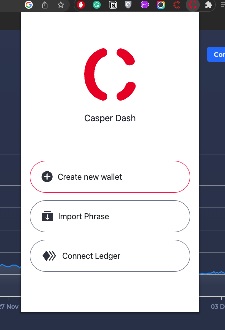
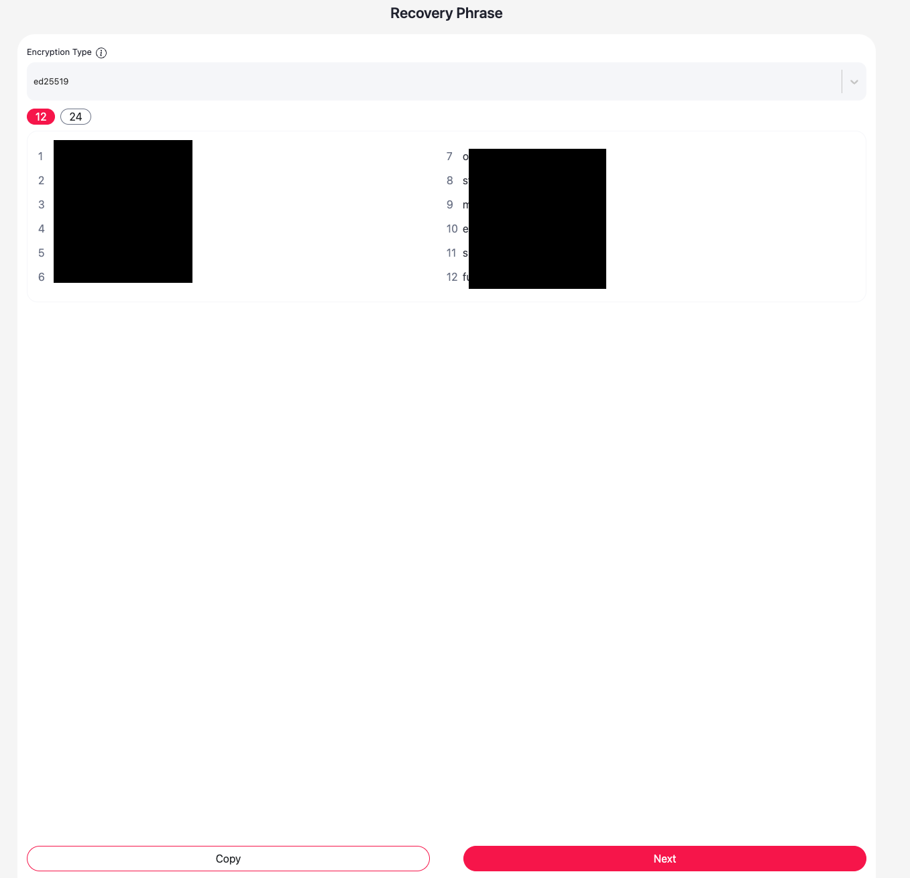
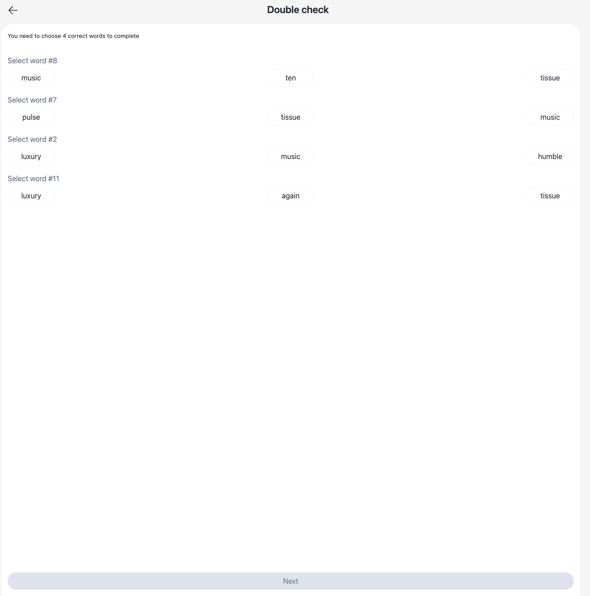
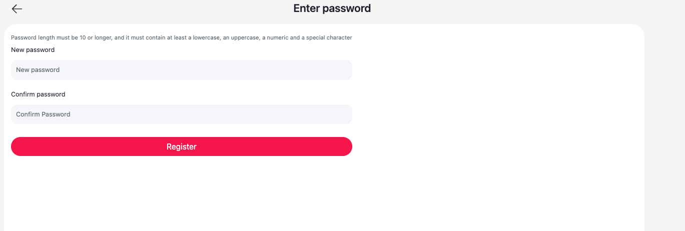
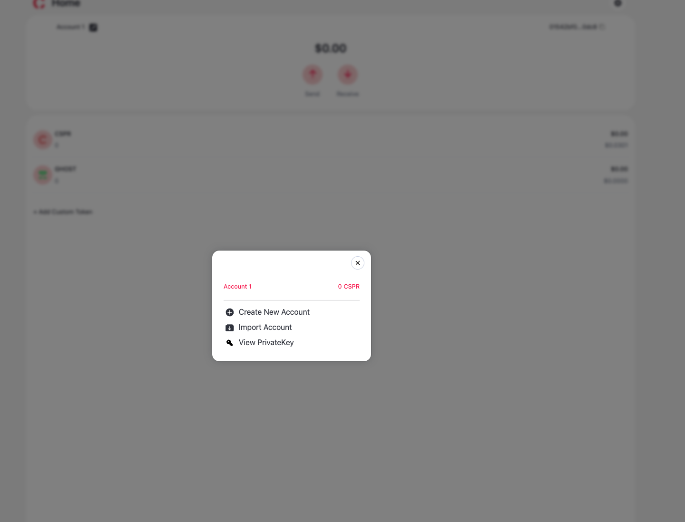
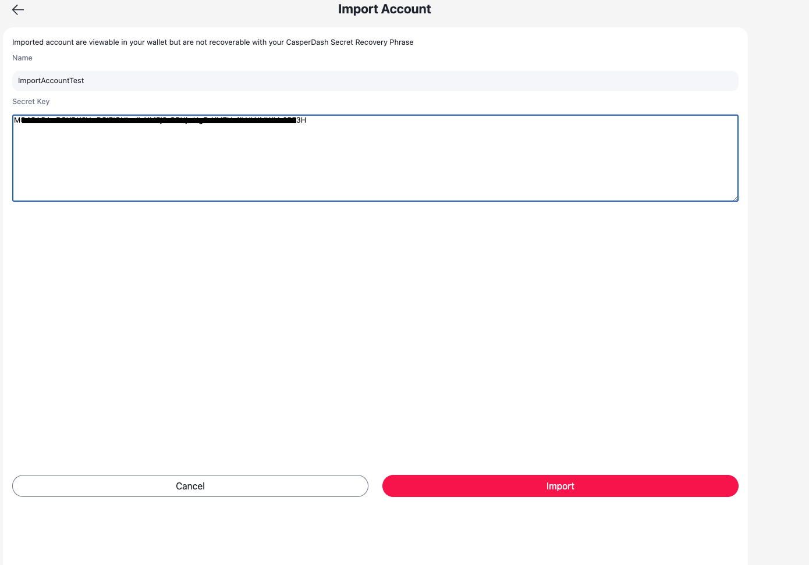
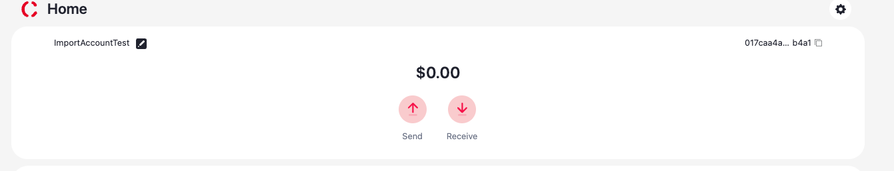
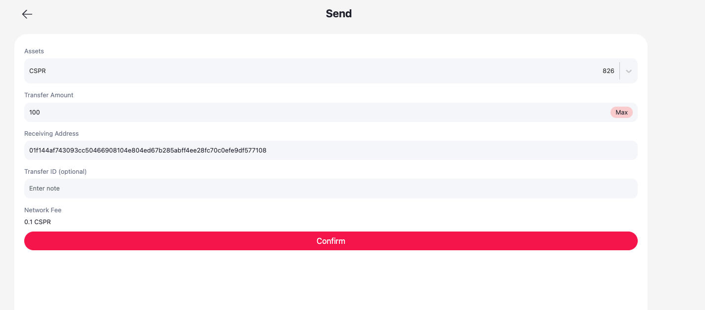
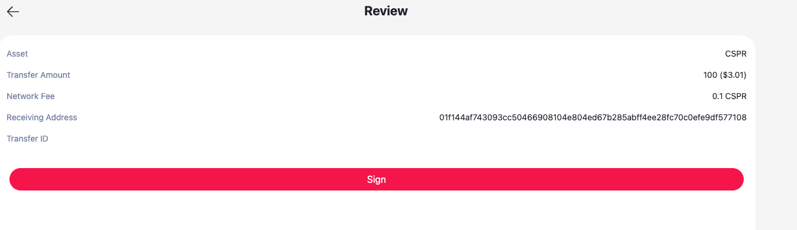
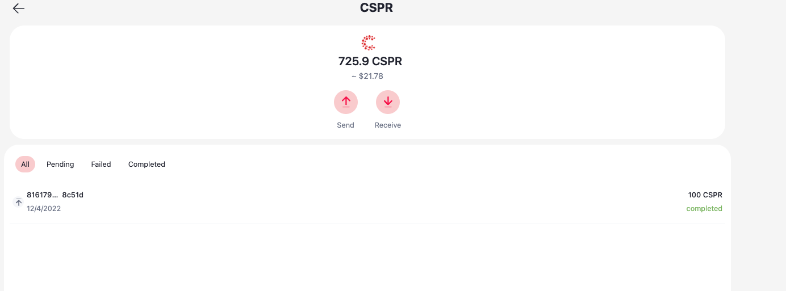

Grant Proposal | [545 -  CasperDash (Account management, signer)](https://portal.devxdao.com/app/proposal/545)
------------ | -------------
Milestone | 2
Milestone Title | CasperDash extension account management
OP | Kien Nguyen
Reviewer | Muharrem Salel

# Milestone Details
The review will cover the second milestone criteria set forth below.

## Details & Acceptance Criteria

**Details of what will be delivered in milestone:**

- Create Casper wallet by mnemonic key(BIP39) 
- Manage wallet as HD wallet (BIP32/BIP44) 
- Support to import legacy wallet which created by Casper signer 
- The web-extension wallet can sign the transaction by itself

 **Acceptance criteria:**

- Create Casper wallet by mnemonic key(BIP39) 
- Manage wallet as HD wallet (BIP32/BIP44) 
- Support to import legacy wallet which created by Casper signer 
- The web-extension wallet can sign the transaction by itself

 ## Milestone Submission

The following milestone assets/artifacts were submitted for review:

Repository | Revision Reviewed
------------ | -------------
https://github.com/CasperDash/casperdash-client | c636a45

# Install & Usage Testing Procedure and Findings

Instructions in the README.md file in the repository(https://github.com/CasperDash/casperdash-client) are well-written that make usage of the project easy. They explain a clear path for users, and following instructions step by step helps the user to run and test the codebase. The reviewer followed these steps from a Mac (macOS Monterey - MacBook Pro Intel i9 2019) and successfully run both tests and the project itself.

However, testing the acceptance criteria of the milestone required some work since there is no usage document for these functionalities. 

## Overall Impression of usage testing

The project builds without errors, and documentation provides sufficient installation and execution instructions.  The project functionality meets the acceptance criteria and operates without errors.

[Installation](./assets/yarn_install.png)
[Extension Run](./assets/extension_run.md)
[Website Run](./assets/web_run.md)

Requirement | Finding
------------ | -------------
The project builds without errors | PASS
Documentation provides sufficient installation/execution instructions | PASS
Project functionality meets/exceeds acceptance criteria and operates without error | PASS

# Unit / Automated Testing

The project has unit tests for all critical classes and methods.

[Tests](assets/yarn_test.md)

Requirement | Finding
------------ | -------------
Unit Tests - At least one positive path test | PASS
Unit Tests - At least one negative path test | PASS 
Unit Tests - Additional path tests | PASS

# Documentation

### Code Documentation

A sufficient amount of low-level documentation exists on the project via properly formatted inline comments on the critical classes and the methods. However, the OP is highly encouraged to improve the code documentation such as adding more detail on how to use different functionalities of the project.

Requirement | Finding
------------ | -------------
Low-level function documentation | PASS with Notes

### Project Documentation

The README file is so readable and clear that it is a must-have for the project. It contains all the necessary information for the project build and execution.

Requirement | Finding
------------ | -------------
Sufficient Project Documentation | PASS

# Open Source Practices

## Licenses

The project is released under the MIT License.

Requirement | Finding
------------ | -------------
OSI-approved open-source software license | PASS

## Contribution Policies

Pull requests and Issues are enabled on the repository. The project also has CONTRIBUTING and SECURITY policies.

Requirement | Finding
------------ | -------------
OSS contribution best practices | PASS

# Coding Standards

## General Observations

The code is generally well-structured and readable. The project is committed to GitHub and both the unit tests and the manual tests pass.

# Final Conclusion

The project provides the functionality described in the grant application and milestone acceptance criteria. 

Thus, in the reviewer's opinion, this submission should pass.

# Recommendation

Recommendation | PASS
------------ | -------------
