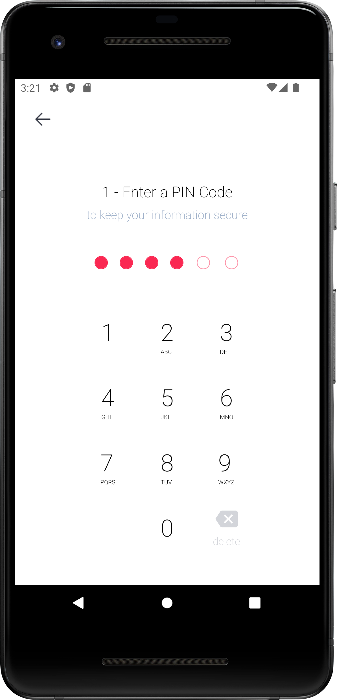

Grant Proposal | [545 - CasperDash (Account management, signer)](https://portal.devxdao.com/public-proposals/545)
------------ | -------------
Milestone | 3
Milestone Title | Account management for CasperDash app (android/ios) - Submission 1
OP | djhahe
Reviewers | Furkan Ahmet Kara <furkanahmetkara.fk@gmail.com>

# Milestone Details

## Details & Acceptance Criteria

**Details of what will be delivered in milestone:**

- Create casper wallet by mnemonic key(BIP39)
- Manage wallet as HD wallet (BIP32/BIP44)
- Support to import legacy wallet which created by casper signer
- The app can sign transaction by itself

**Acceptance criteria:**

- Create casper wallet by mnemonic key(BIP39)
- Manage wallet as HD wallet (BIP32/BIP44)
- Support to import legacy wallet which created by casper signer
- The app can sign transaction by itself

**Additional notes regarding submission from OP:**

- Create/Import casper wallet by mnemonic key
- Manage wallet as HD wallet 
- Support to import legacy wallet which created by casper signer 
- The app can sign transaction by itself

## Milestone Submission

The following milestone assets/artifacts were submitted for review:

Repository | Revision Reviewed
------------ | -------------
https://github.com/CasperDash/casperdash-mobile-wallet | 93b0267

# Install & Usage Testing Procedure and Findings

Following the instructions in the [README](https://github.com/CasperDash/casperdash-mobile-wallet) of the project, reviewer was not able to successfully build the source code and run the tests for this milestone on Ubuntu 20.04. The reviewer able to install dependencies by following the provided links but it would be better to have visual aid for the instructions to build and run the app.

[yarn install](assets/yarninstall.md)

[yarn setup-env](assets/yarnsetupenv.md)

[yarn start](assets/yarnstart.md)

[yarn android](assets/yarnandroid.md)

## Overall Impression of usage testing

The project builds without errors, the documentation provides sufficient installation and execution instructions. Build instructions are giving required information but can be enhanced and more clear by detailing each step and they can be supported with visuals. The project functionality meets/exceeds the acceptance criteria and operates without errors. The reviewer was able to run the example put deploy command successfully by following the instructions on the README.

Screenshots from the emulator for usage testing

[cspr.live link of the example transfer deploy](https://cspr.live/deploy/5565a99c00ee144c81e79fd07a9e220b895c7b08e616134c73c9f618a4547254)

Requirement | Finding
------------ | -------------
Project builds without errors | PASS
Documentation provides sufficient installation/execution instructions | PASS
Project functionality meets/exceeds acceptance criteria and operates without error | PASS

# Unit / Automated Testing

The project has a total 11 test suites and 74 tests, covering both positive and negative paths. All test run successfully.

[Test Logs](assets/yarntest.md)

Requirement | Finding
------------ | -------------
Unit Tests - At least one positive path test | PASS
Unit Tests - At least one negative path test | PASS
Unit Tests - Additional path tests | PASS

# Documentation

### Code Documentation

The critical functions of the project have an acceptable level of code-level documentation. Even if code-leve documentation is good as it is, there is still room for the improvement.

Requirement | Finding
------------ | -------------
Code Documented | PASS

### Project Documentation

The project good documentation coverage for usage with examples. The installation, build and test instructions are sufficient.

Requirement | Finding
------------ | -------------
Usage Documented | PASS
Example Documented | PASS

## Overall Conclusion on Documentation

In the reviewer's opinion, this review should pass.

# Open Source Practices

## Licenses

The Project is released under the MIT License.

Requirement | Finding
------------ | -------------
OSI-approved open source software license | PASS

## Contribution Policies

Pull requests and Issues are enabled on the repository. CONTRIBUTING and a SECURITY policy should be added to repository. Also, the reviewer recommends to add CODE of CONDUCT aswell.

Requirement | Finding
------------ | -------------
OSS contribution best practices | PASS with Notes

# Coding Standards

## General Observations

The project published publicly on GitHub. Project documentation is sufficient enough as general. Unit test coverage is good enough, and all test run successfully.

# Final Conclusion

The project meets the milestone acceptance criteria. Install and usage instructions are sufficient. Tests run successfully.

Thus, in the reviewers' opinion, this submission should PASS with Notes.

# Recommendation

Recommendation | PASS with Notes
------------ | -------------
