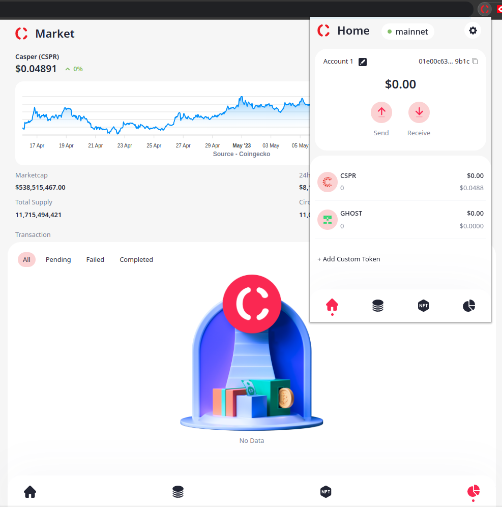
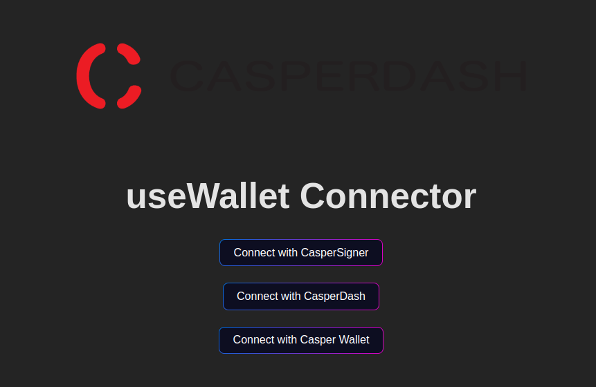
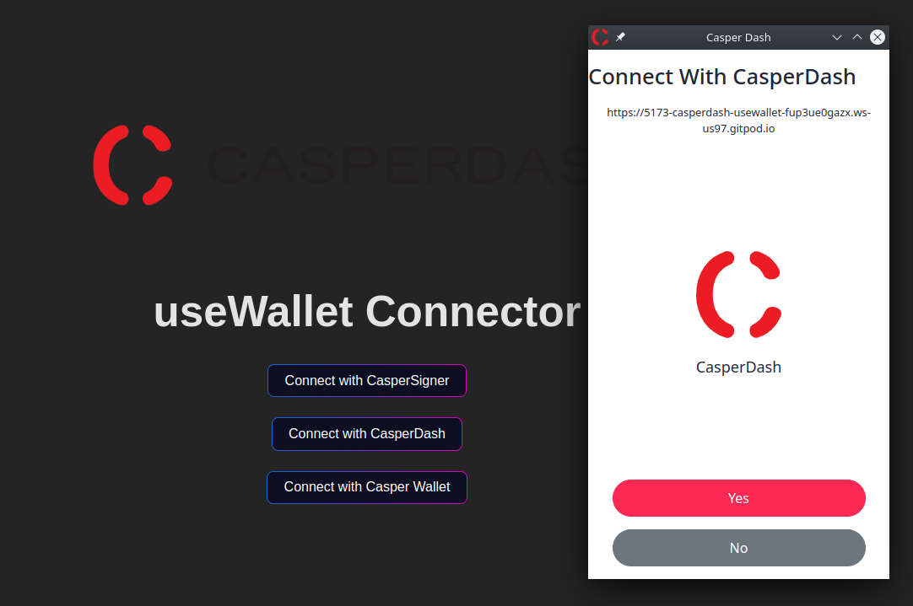
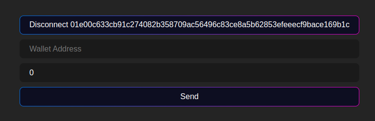

Grant Proposal | [545 - CasperDash (Account management, signer)](https://portal.devxdao.com/public-proposals/545)
------------ | -------------
Milestone | 5
Milestone Title | CasperDash extension signer
OP | Kien Nguyen
Reviewer | Gökhan Gurbetoğlu <crdao@ggurbet.com>

# Milestone Details

## Details & Acceptance Criteria

**Details of what will be delivered in milestone:**

We will delivery a lib that help DAPP connect with our web extension wallet to sign the transaction.

**Acceptance criteria:**

- A lib that help DAPP connect with web-extension wallet
- Web extension wallet can sign transaction from DAPPs

**Additional notes regarding submission from OP:**

The lib is working with latest version of CasperDash browser extension https://github.com/CasperDash/casperdash-client

## Milestone Submission

The following milestone assets/artifacts were submitted for review:

Repository | Revision Reviewed
------------ | -------------
https://github.com/CasperDash/useDApp | 25f8ac7

*Note*: Before the review started, the repo was renamed as `useWallet` but it is still reachable by the provided link with a redirection. The repo is now at: https://github.com/CasperDash/useWallet

# Install & Usage Testing Procedure and Findings

The reviewer used an Ubuntu 22.04.2 LTS GitPod instance and a local Pardus 21.5 GNU/Linux local instance for doing this review. Also, workflows on GitHub has been used to further investigate the installation process.

During the initial phases of the code review, the reviewer identified issues with the project's build process, which was failing to complete successfully. The developers involved in the project were able to commit new code to the repository that resolved the installation issues.

To verify that the issue was resolved, the reviewer assessed the installation logs and release workflow logs available on GitHub. After that, the reviewer attempted to build the project on both the local Pardus 21.5 GNU/Linux machine and the GitPod cloud Ubuntu 22.04.2 LTS instance. Both of the builds succeeded without any errors. Installation logs and the release workflow logs on GitHub are listed below.

- [Installation Logs](assets/install.md)
- [Release Workflow Logs](assets/release.md)

The reviewer used the official Casper Dash Wallet from their website then made the usage testing of the project by running `npnm play` to reach the frontend of the project, as provided by the documentation. Overall, the frontend of the project appeared to be well-designed and intuitive to use. The reviewer was able to navigate through the various sections and features of the interface without any issues. The screenshots provided below give an overview of the interface and highlight some of the key features of the project. Based on the testing done, the reviewer has no concerns regarding the frontend functionality of the project.

-
-
-
-

## Overall Impression of usage testing

The project builds without errors. Installation instructions are clear. Provided unit tests are effective in verifying the functionality of the new library and they meet their acceptance criteria.

Current installation instructions are in the CONTRIBUTING.md file. The reviewer suggests moving those into the README for better reachability.

Requirement | Finding
------------ | -------------
Project builds without errors | PASS
Documentation provides sufficient installation/execution instructions | PASS
Project functionality meets/exceeds acceptance criteria and operates without error | PASS

# Unit / Automated Testing

The usage of unit tests is explained in CONTRIBUTING.md file. Tests cover critical functonality. All tests run without errors.

- [Unit Tests Logs](assets/unit-tests.md)
- [Unit Tests Workflow Logs](assets/unit-tests-workflow.md)

Requirement | Finding
------------ | -------------
Unit Tests - At least one positive path test | PASS
Unit Tests - At least one negative path test | PASS
Unit Tests - Additional path tests | PASS

# Documentation

### Code Documentation

The code documentation is of high quality and has been well-prepared, providing comprehensive coverage of the codebase. Critical functionality of the code has been thoroughly commented, making it easier for developers to understand and maintain the code. Additionally, many other helpful comments and documentation have been included throughout the code, demonstrating a clear attention to detail and commitment to thoroughness. Overall, the code documentation is a valuable asset to the project and a testament to the developer's skill and professionalism.

Requirement | Finding
------------ | -------------
Code Documented | PASS

### Project Documentation

The project documentation is reasonably comprehensive, with a set of readme files providing much of the necessary information, and other related policy files containing further details. However, the installation instructions, which are currently located in the CONTRIBUTING.md file, could benefit from better clarity and organization to improve their accessibility and usability. The reviewer recommends that the installation instructions be moved to the README file for better visibility and ease of access. Despite this minor issue, the documentation is generally effective in conveying important information about the project's functionality and features.

Furthermore, the project's documentation is enhanced by automated workflows, which help to ensure that documentation remains up to date and accurate. The presence of these workflows is a notable advantage, as it reduces the likelihood of errors or inaccuracies arising due to manual updates.

- [Documentation Workflow Logs](assets/docs.md)

Requirement | Finding
------------ | -------------
Usage Documented | PASS
Example Documented | PASS

## Overall Conclusion on Documentation

The project's code documentation is comprehensive and well-organized, covering all critical aspects of the codebase. The project documentation is also detailed and provides adequate information about the project's design, implementation, and usage. Overall, the documentation meets the reviewer's expectations and is sufficient for this project.

# Open Source Practices

## Licenses

The project is released under MIT license.

Requirement | Finding
------------ | -------------
OSI-approved open source software license | PASS

## Contribution Policies

Project contains clear CONTRIBUTING, SECURITY and CODE OF CONDUCT policies. Pull requests and Issues are enabled on the repositories and the project is set up for public participation.

Requirement | Finding
------------ | -------------
OSS contribution best practices | PASS

# Coding Standards

## General Observations

Source code adheres to good coding standards, its structure is highly organized and easily understandable. The use of automated linting tools ensures that the code is free of common errors and inconsistencies, which significantly improves code readability and maintainability. As a result, the codebase is of high quality and easy to navigate.

- [Linting Workflow Logs](assets/linting.md)

# Final Conclusion

The project's milestones are clearly defined with provided acceptance criteria. The unit tests are well-prepared and useful for testing the library and understanding different usage scenarios. The documentation is detailed and comprehensive with additional information that covers the project's methods and usage. The coding practices are of high quality.

In addition to the above, it is worth noting that the project follows a well-organized structure, making it easy for developers to navigate and work with. The use of best practices also enhances the project's readability and maintainability. The code is consistently formatted and adheres to industry standards, which contributes to the overall quality of the project. The reviewer also noted the prompt response and quick resolution of any issues encountered during the review process, showcasing the project team's commitment to delivering a high-quality product. Given these factors, the reviewer highly recommends the project to PASS this review.

# Recommendation

Recommendation | PASS
------------ | -------------
