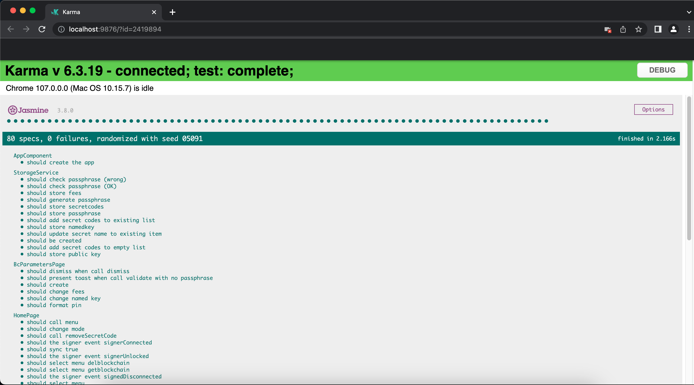

Grant Proposal | [561 - dApp : Blockchain Authenticator (OTP Generator)](https://portal.devxdao.com/app/proposal/561)
------------ | -------------
Milestone | 2
Milestone Title | Webapp - Submission 1
OP | mikael-g
Reviewer | Muhammed Didin <mdidin80@gmail.com>


# Milestone Details
The review will cover the second milestone criteria set forth below.

## Details & Acceptance Criteria

**Details of what will be delivered in milestone:**

A webapp written on top of smart contract.

**Acceptance criteria:**
Webapp written in Javascript/Typescript (AngularJS) using the Ionic framework. Web App will be available with all these functionalities : 
- Add an “authenticator code” using a QRCode (You can found a generator at https://otplib.yeojz.dev/) 
- Add an “authenticator code” manually 
- Remove an “authenticator code” 
- Update the name of an “authenticator code” 
- DESKTOP ONLY : synchronize the selected codes on the blockchain using the casper signer. 
- DESKTOP ONLY : desynchronize the selected codes on the blockchain using the casper signer. 
- DESKTOP ONLY : set and update the passphrase used to encrypt/decrypt the data stored on the blockchain. On mobile, you have to first scan a "Backup QRCode" to access the "authenticator codes" stored on the blockchain. 
- Generate a "backup QRCode" containing all the datas 
- Scan a “backup QRCode” and retrieve the data 
- Retrieve the data from the blockchain (if there is a public key registered) automatically every 30s. 
- Generate TOTP’s (Time-based One-Time Password) passwords Webapp will be available at https://authenticator.caspercommunity.io Webapp will be installable as a PWA on mobile and modern browser like Chrome and she can work offline (except for the functionnalities that needs access to the internet).

**Additional notes regarding submission from OP:**
All informations are provided in the README of the repo

## Milestone Submission

The following milestone assets/artifacts were submitted for review:

Repository | Revision Reviewed
------------ | -------------
https://github.com/caspercommunityio/blockchain-authenticator-app| 8463323


# Install & Usage Testing Procedure and Findings

Following the instructions in the provided README, the reviewer was able to successfully build the project on a macOS Monterey.

### Install

It is stated in the README that npm, git and node version 16.15.1 are prerequisites. After accomodating with prerequisites, the reviewer run ```npm install``` command.


- [Install logs](assets/install.md)
### Build
After installing modules, the reviewer run ``` ionic serve ```command to run the project. 


- [Build logs](assets/build.md)

Also, the project is live at: https://authenticator.caspercommunity.io

### Usage

User Interface welcomes the user.

Clicking the menu icon opens the menu. The user can select all the options in the menu. 


Adding manually:

Operation is done:


Sample Deploy to testnet: https://testnet.cspr.live/deploy/8becebe67ef8677952c1933ba4766167aaa19d2508498257eaf50547185fbdf8

## Overall Impression of usage testing

The project builds without errors, the documentation provides sufficient installation and execution instructions, and the project functionality meets the acceptance criteria and operates without errors. The reviewer easily set up the environment to build the project using these.

The project meets the acceptance criteria for this milestone.


Requirement | Finding
------------ | -------------
Project builds without errors | PASS
Documentation provides sufficient installation/execution instructions | PASS
Project functionality meets/exceeds acceptance criteria and operates without error | PASS

# Unit / Automated Testing

All automated unit tests PASS for this milestone. The automated tests cover critical functionality. The reviewer successfully run all automated tests on an macOS Monterey. The overall quality of tests is sufficient. The test output is below.




- [Full Test logs](assets/tests.md)

Requirement | Finding
------------ | -------------
Unit Tests - At least one positive path test | PASS
Unit Tests - At least one negative path test | PASS
Unit Tests - Additional path tests | PASS

# Documentation

### Code Documentation

The code is overall well documented, and almost all classes and critical functions have acceptable code-level documentation.

Requirement | Finding
------------ | -------------
Code Documented | PASS

### Project Documentation

Project documentation is sufficient to build and set up the project. The reviewer was able to complete the necessary operations following the information provided by the documentation.

Requirement | Finding
------------ | -------------
Usage Documented | PASS
Example Documented | PASS

## Overall Conclusion on Documentation

The code is overall well documented, and almost all classes and critical functions have acceptable code-level documentation. Project documentation is sufficient to build and set up the project. 

So, in the reviewers opinion the documentation is sufficient for this milestone.


# Open Source Practices

## Licenses

The Project is released under the MIT License.

Requirement | Finding
------------ | -------------
OSI-approved open source software license | PASS

## Contribution Policies

The project has CONTRIBUTING and SECURITY policies that link to a Code of Conduct. Also, Pull Requests and Issues are enabled.

Requirement | Finding
------------ | -------------
OSS contribution best practices | PASS


# Coding Standards

## General Observations

The source code is well-written and documented. General best coding practices are used throughout the project. The project is committed to GitHub and both the unit tests and the manual tests are passed.


# Final Conclusion

The project provides the functionality described in the grant application and milestone acceptance criteria. Also, the code is well-documented and open to public participation. 

Thus, in the reviewer's opinion, this submission should PASS.

# Recommendation

Recommendation | PASS
------------ | -------------
