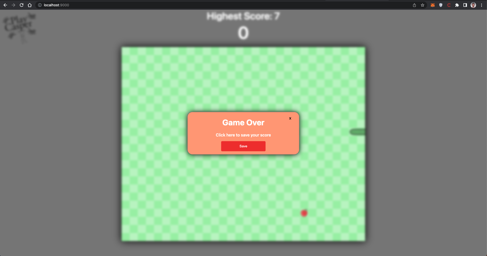
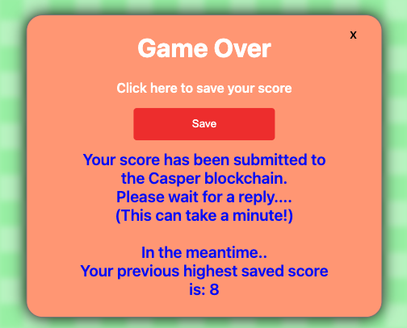
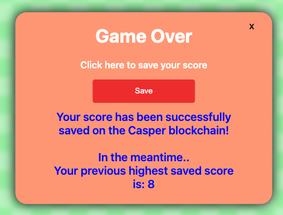

Grant Proposal | [566 - Blockchain Game Creation and Tutorial with Functioning Snake and Website](https://portal.devxdao.com/public-proposals/566)
------------ | -------------
Milestone | 2-3
Milestone Title | Completed Website - Snake Tutorial
OP | Fern
Reviewer | Muhammed Didin <mdidin80@gmail.com>

# Milestone Details

## Details & Acceptance Criteria

**Details of what will be delivered in milestone:**

**Acceptance criteria:**

Above capabilities will be hosted on a live site with everything working, in addition to the submitted open-source codebase.

A fully articulated self-paced tutorial, with functioning prototype and fully analyzable source code, available on the live site delivered in milestone 2.

**Additional notes regarding submission from OP:**

We have completed the Website.

We have completed the tutorial.

## Milestone Submission

The following milestone assets/artifacts were submitted for review:

Repository | Revision Reviewed
------------ | -------------
https://github.com/playcasper/snake-casper-game | 8c5ed04

# Install & Usage Testing Procedure and Findings

Following the instructions in the README file of the repository, the reviewer was able to successfully build and run the source code and use the project on macOS Monterey.

### Build

[Full Build Logs](assets/build.txt)

[Full Install Logs](assets/install.txt)

### Usage

After successfully building and installing, the the user can play the snake game. 

After the game is over, Casper Wallet is opened for the highest score record, the user interface warns the user to wait for a minute.

At the end, if the user has achieved the highest score, the recording is performed.

After the game is over, Casper Wallet is opened for the highest score record, the user interface warns the user to wait for a minute.

According to Acceptance criteria, the project should include smart contract tutorials. It has been observed that the relevant tutorials are published on the `https://playcasper.io/` site. Information about the content can be obtained from `https://playcasper.io/tutorials/`.

## Overall Impression of usage testing

The project builds without errors, the documentation provides sufficient installation and execution instructions, and the project functionality meets the acceptance criteria and operates without errors. Although it is not in the Acceptance criteria, the reviewer recommends improving the mainpage user interface and considering the user experience.

Requirement | Finding
------------ | -------------
Project builds without errors | PASS 
Documentation provides sufficient installation/execution instructions | PASS
Project functionality meets/exceeds acceptance criteria and operates without error | PASS

# Unit / Automated Testing

The reviewer was able to successfully run the unit tests. The bash script provided in the README file was able to run the unit tests. The project has sufficient amount of unit tests.

[Full Test Logs](assets/test.txt)

Requirement | Finding
------------ | -------------
Unit Tests - At least one positive path test | PASS
Unit Tests - At least one negative path test | PASS
Unit Tests - Additional path tests | PASS

# Documentation

### Code Documentation

Properly formatted inline comments on the critical classes and the methods are added to the project. The reviewer thinks that there is a sufficient amount of code documentation.

Requirement | Finding
------------ | -------------
Code Documented | PASS

### Project Documentation

The Readme file has sufficient basic usage instructions for the implemented methods. The reviewer was able to build, run and use the project using project documentation.

Requirement | Finding
------------ | -------------
Usage Documented | PASS 
Example Documented | PASS

## Overall Conclusion on Documentation

In the reviewer's opinion, the project has sufficient documentation. 

# Open Source Practices

## Licenses

The Project is released under the MIT License.

Requirement | Finding
------------ | -------------
OSI-approved open source software license | PASS

## Contribution Policies

The project has Contributing and Security Policies and a Code of Conduct.

Requirement | Finding
------------ | -------------
OSS contribution best practices | PASS

# Coding Standards

## General Observations

The project has well-structured and readable code. Code and project documentation is sufficient and they provide the necessary information to use the program. The project complies with open source standards.

# Final Conclusion

The project provides the functionality described in the grant application and milestone acceptance criteria. 

Thus, in the reviewer's opinion, this submission should PASS.

# Recommendation

Recommendation | PASS
------------ | -------------

