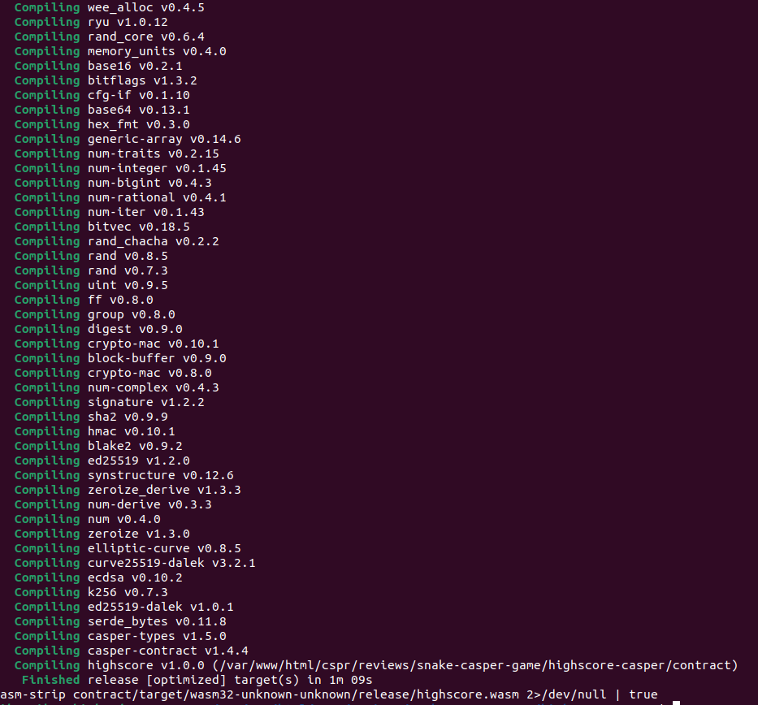
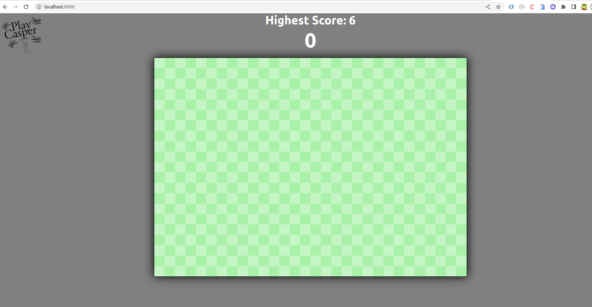
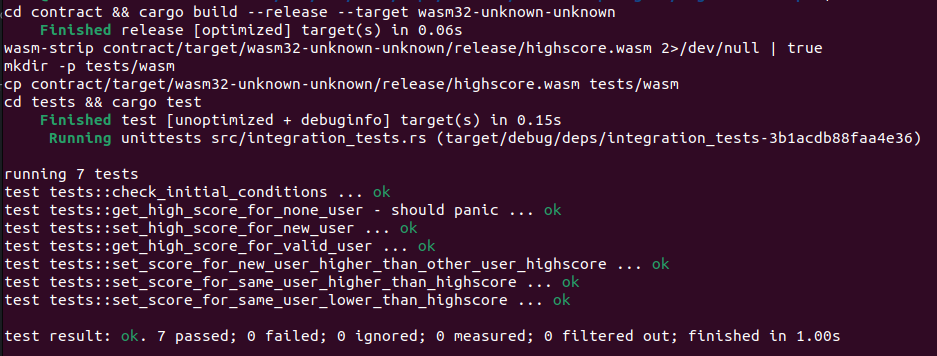
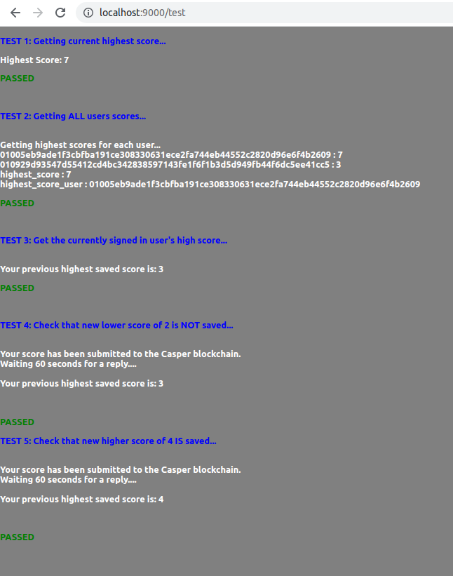

Grant Proposal | [566 - Blockchain Game Creation and Tutorial with Functioning Snake and Website](https://portal.devxdao.com/public-proposals/566)
------------ | -------------
Milestone | 1
Milestone Title | Snake Prototype
OP | Fern
Reviewer | Mikael Grouwet <m.grouwet@gmail.com>

# Milestone Details

## Details & Acceptance Criteria

**Details of what will be delivered in milestone:**

Javascript Snake Game with Highscore Blockchain Integration
- Functioning, browser-based game of Snake
- Simple smart contract to track high scores
- Ability for user to save high score to blockchain (usage of Casper Signer to invoke contract)

**Acceptance criteria:**

User can:
- Play a game of Snake in a browser window
- Optionally save their score to the smart contract
- Invoke the smart contract with Casper Signer

**Additional notes regarding submission from OP:**

No additional notes

## Milestone Submission

The following milestone assets/artifacts were submitted for review:

Repository | Revision Reviewed
------------ | -------------
https://github.com/playcasper/snake-casper-game | ea9b739

# Install & Usage Testing Procedure and Findings

The README provides the needed information to build and run the project (Webapp & Smartcontract).

The smartcontract and the game build and run successfully :

## Overall Impression of usage testing

The reviewer did not encounter any particular issues.
The game works as expected, it meets the acceptance criteria.

Requirement | Finding
------------ | -------------
Project builds without errors | PASS
Documentation provides sufficient installation/execution instructions | PASS
Project functionality meets/exceeds acceptance criteria and operates without error | PASS

# Unit / Automated Testing

There are tests for both the smart contract (7) and the app (5).

Requirement | Finding
------------ | -------------
Unit Tests - At least one positive path test | PASS
Unit Tests - At least one negative path test | PASS
Unit Tests - Additional path tests | PASS

# Documentation

### Code Documentation

In general, the code is well-documented. The main classes contain enough comments to understand the workings of the app.

Requirement | Finding
------------ | -------------
Code Documented | PASS

### Project Documentation

Project documentation provides sufficient information to build, run and test.

The reviewer was able to complete the necessary operations following the information provided by the documentation.

Requirement | Finding
------------ | -------------
Usage Documented | PASS
Example Documented | PASS

## Overall Conclusion on Documentation

The documentation provides the needed information to understand the goal of the project and to build and run it.

In the reviewer's opinion the documentation is sufficient for this milestone.

# Open Source Practices

## Licenses

The Project is released under the MIT License.

Requirement | Finding
------------ | -------------
OSI-approved open source software license | PASS

## Contribution Policies

Pull requests and Issues are enabled.  
The repository does contain a CONTRIBUTING, SECURITY and Code of conduct policy.

Requirement | Finding
------------ | -------------
OSS contribution best practices | PASS

# Coding Standards

## General Observations

The project is well documented and tested.

The reviewer appreciated the OP for his contribution during the review (documentation, tests, refactoring the folder's structure of the smartcontract to meet the Casper's standard, etc).

# Final Conclusion

The project meets the acceptance criteria. Documentation is well done and the tests cover the functionality of the game.

Thus, in the reviewer's opinion, this submission should PASS.

# Recommendation

Recommendation | PASS
------------ | -------------
