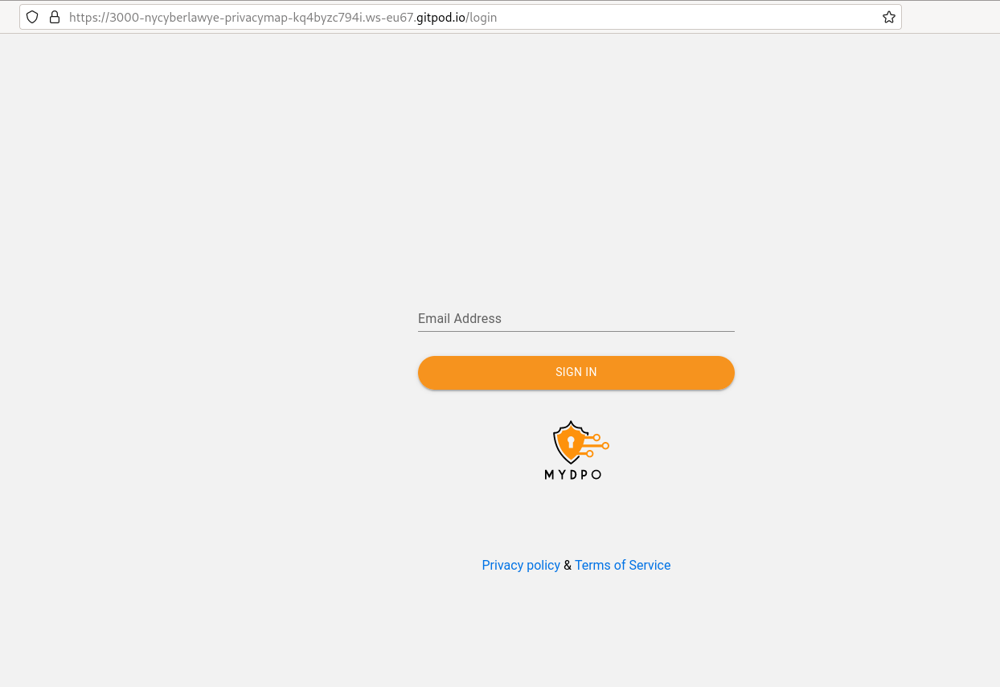
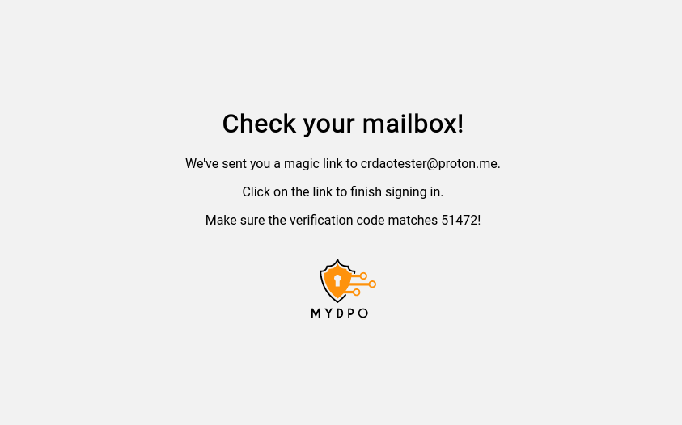
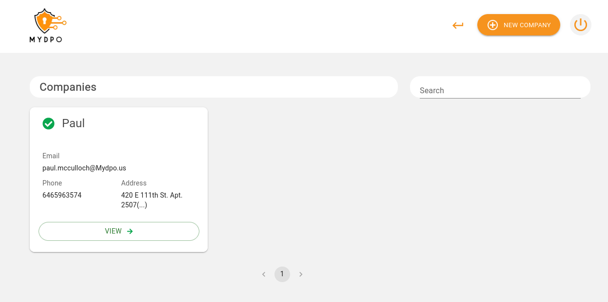
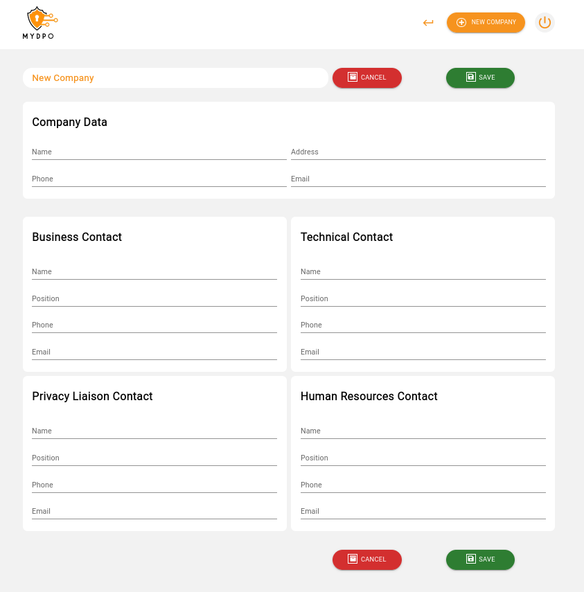
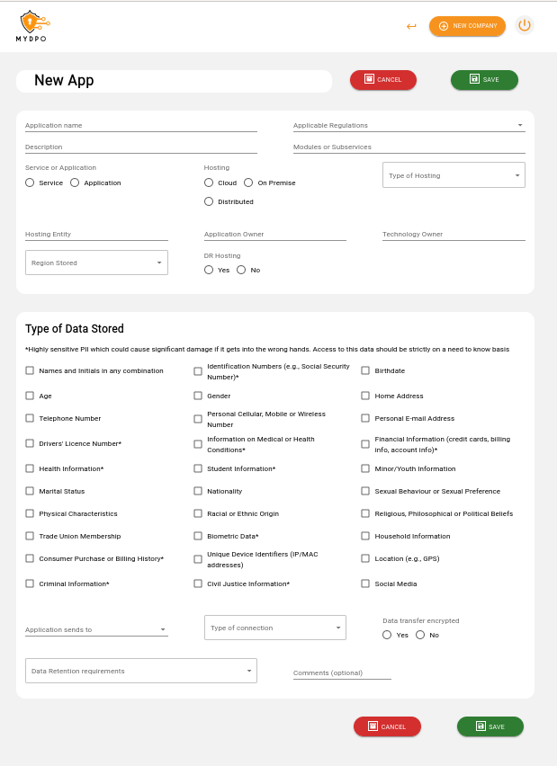
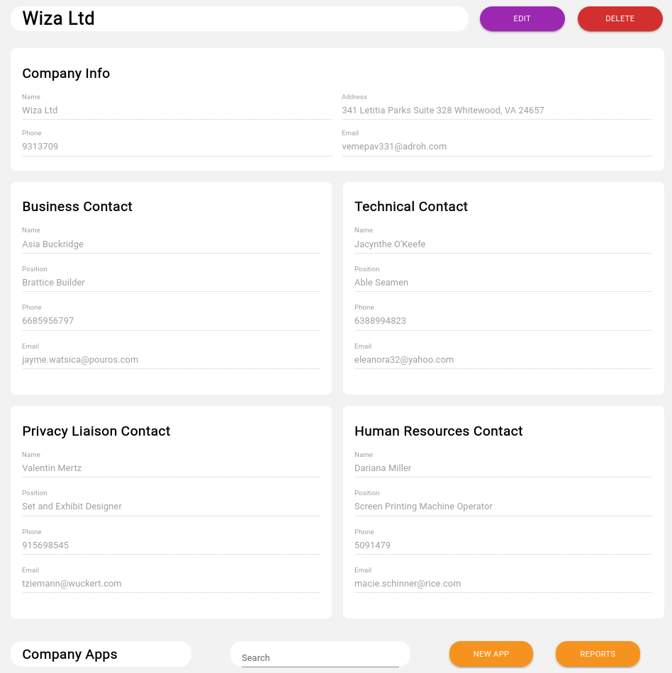
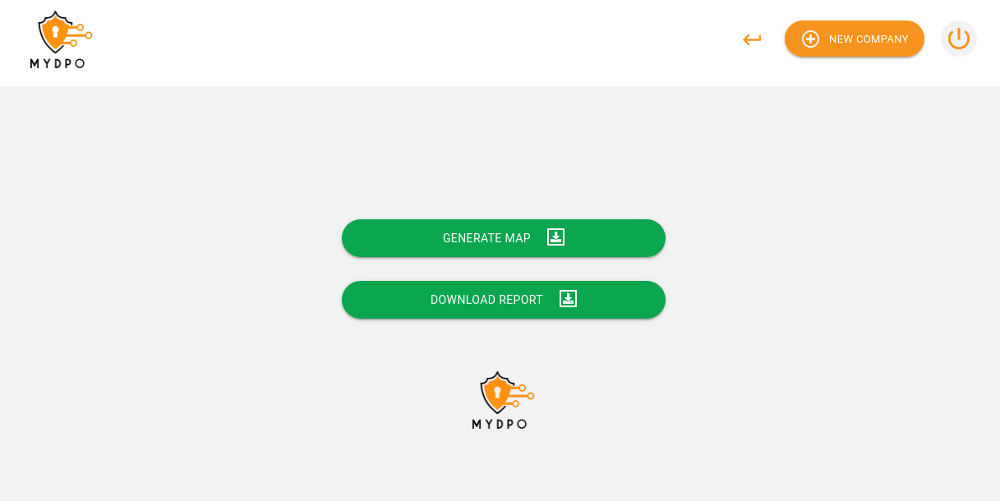
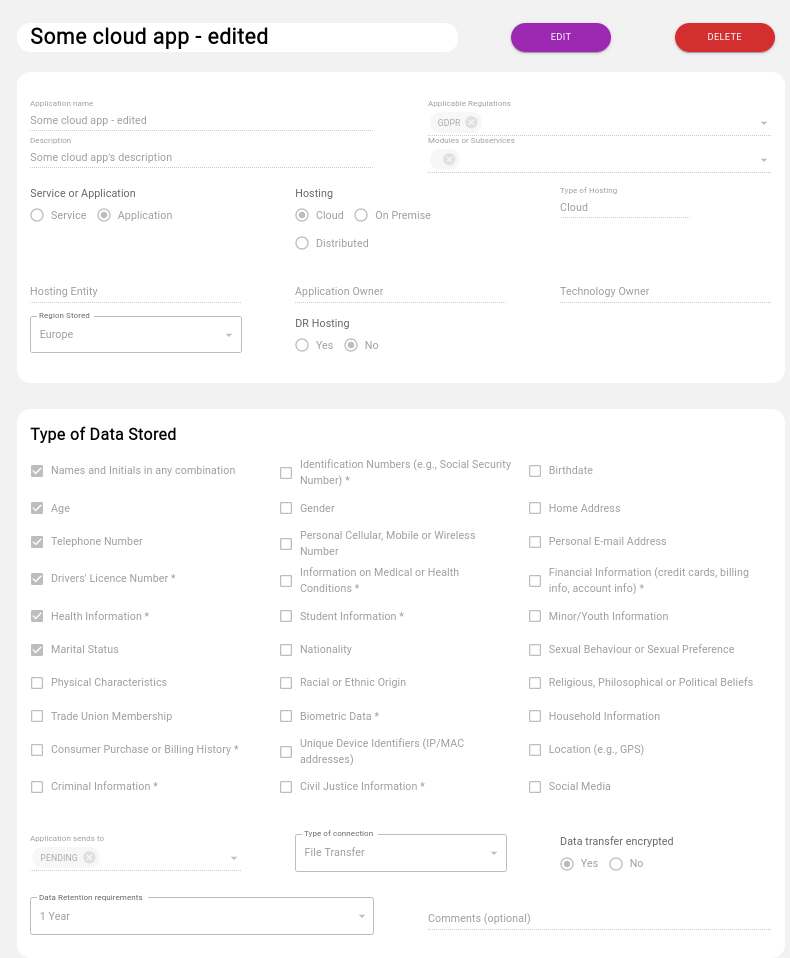

Grant Proposal | [58 - PRIVACY MAPPING APPLICATION](https://portal.devxdao.com/public-proposals/58)
------------ | -------------
Milestones | 1-2
Milestone Titles | Adaptive Privacy Questionnaire & Automated Privacy Mapping
OP | CyberLawyer
Reviewer | Muhammet Kara

# Milestone Details

## Details & Acceptance Criteria

**Details of what will be delivered in milestone:**

The deliverable in this stage will consist of an interface where users are led through an adaptive questionnaire to help them identify all data sources of data (e.g. vendors, applications, website, etc..), as well as the types of data and treatment of that information throughout the business life cycle. The result will be a data flow map with drag and drop flexibility to be modified for any developments that may impact privacy throughout the organization.  This data flow map will comprise one module in the privacy mapping dashboard. Furthermore, at each stage, users will identify the databases, servers, and other sources of data, which, in turn, will facilitate the next Milestone(s). 

The deliverable in this stage will involve the integration of automated processes within the data flow mapping process.  With the identification of different data sets throughout the organization, users will be provided the opportunity to connect all sources via API to a core repository within the data privacy mapping dashboard. For example, the User may be able to connect an API from their cloud server that can show server location at any one time and be matched to the data type on that server. This data, hosted by the business itself,  will not only illustrate the origin, processing, and destination of each piece of private data within the organization, but will also provide the basis for any additional privacy activities (e.g. consent management).

**Acceptance criteria:**

Acceptance criteria would consist of the delivery of the following items:
- Profile Creation / Login Capability for Users to enter a secure space in which to map the data
- Questionnaire Module - The generation and deployment of a Privacy Adaptive questionnaire to walk users through and map all data flow processes.
- Map Module - User will be able to see a dashboard with their Data Map, and they will also be able to update their data maps and modify them to reflect changes  (drag and drop update).
- API Integration Function - API Integration capabilities for databases from various cloud service providers, Vendors or otherwise, to ensure that data map is kept as up-to-date and accurate as possible.  Each API is customized to ensure that as much metadata about the stored data is used to update and maintain the data map in real-time. 
- Repository Module - Secure Data Repository Accessible illustrating data, location, type, and additional metadata required for privacy tracking.

**Additional notes regarding submission from OP:**

Milestone 1 is the MYDPO Folder in the repository. Milestone 2 is the API folder in the repository that is an SDK that allows people to connect an API to the application. We ran two tools on GitHub to identify any vulnerabilities, discrepancies, or dependencies on the code, and it is all clean now based on the guidelines provided by the CRDAO and the DEVxDAO.

## Milestone Submission

The following milestone assets/artifacts were submitted for review:

Repository | Revision Reviewed
------------ | -------------
https://github.com/NYCyberLawyer/PRIVACYMAP | 2b35dbb

# Install & Usage Testing Procedure and Findings

Reviewer used an Ubuntu 20.04 LTS Gitpod cloud machine and an Ubuntu 20.04 LTS local virtual machine to test the project.

Reviewer followed instructions given on the README to [install and run](assets/InstallAndRun.md) the project successfully.

Further user testing was done on [App.MyDPO.us](https://App.MyDPO.us) live instance provided by the OP.

[Company report sheet](assets/WizaLtd-Edited.xlsx)

Reviewer also performed various add, delete, edit, and search operations to verify the respective features' functionalities.

## Overall Impression of usage testing

Project works as expected. It builds without errors and its functionality covers the acceptance criteria for this milestone.

Requirement | Finding
------------ | -------------
Project builds without errors | PASS
Documentation provides sufficient installation/execution instructions | PASS
Project functionality meets/exceeds acceptance criteria and operates without error | PASS

# Unit / Automated Testing

The reviewer observed that both the backend and the frontend tests run successfully, and the API tests cover the critical functionality although the front-end tests are minimal.

- [Backend tests](assets/backend-tests.md)

- [Frontend tests](assets/cypress-tests.md)

Requirement | Finding
------------ | -------------
Unit Tests - At least one positive path test | PASS
Unit Tests - At least one negative path test | PASS
Unit Tests - Additional path tests | PASS

# Documentation

### Code Documentation

Reviewer thinks that the code documentation is sufficient, covering critical sections of the code-base, with comments that allow auto-generation of the code documentation in HTML format. The auto-generated docs are also available on the repo under the `api/docs` directory.

- [Docs](assets/docs.zip)

Requirement | Finding
------------ | -------------
Code Documented | PASS

### Project Documentation

Reviewer thinks that the project is sufficiently documented.

Requirement | Finding
------------ | -------------
Usage Documented | PASS
Example Documented | PASS

## Overall Conclusion on Documentation

Documentation for the project is sufficient for this milestone.

# Open Source Practices

## Licenses

The Project is released under the Apache-2.0 License, which is an OSI-approved open-source license, and matches the license promised on the grant proposal.

Requirement | Finding
------------ | -------------
OSI-approved open source software license | PASS

## Contribution Policies

Project contains CONTRIBUTING and SECURITY policies. Pull requests and issues are enabled on the repository and the project is set up for public participation.

Requirement | Finding
------------ | -------------
OSS contribution best practices | PASS

# Coding Standards

## General Observations

Source code is well-written and thought out. It is easily readable. General best coding practices are used throughout the project. Overall sufficient work is done.

# Final Conclusion

After all the fixes and improvements by the OP, the reviewer thinks that the project is in a working state, covering the acceptance criteria for the milestones. Thus, the reviewer suggests this milestone to PASS.

# Recommendation

Recommendation | PASS
------------ | -------------
