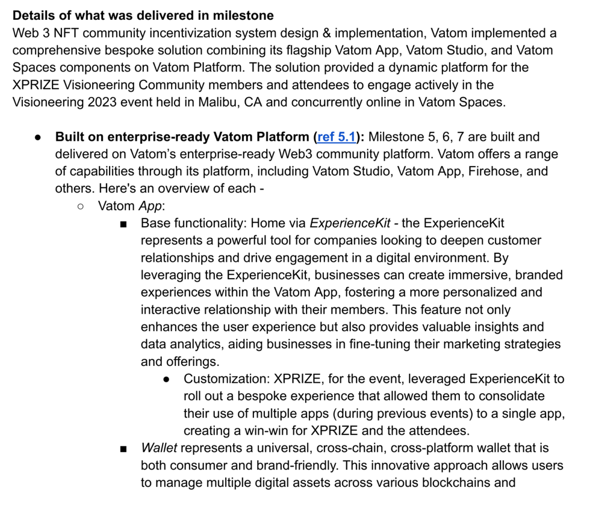
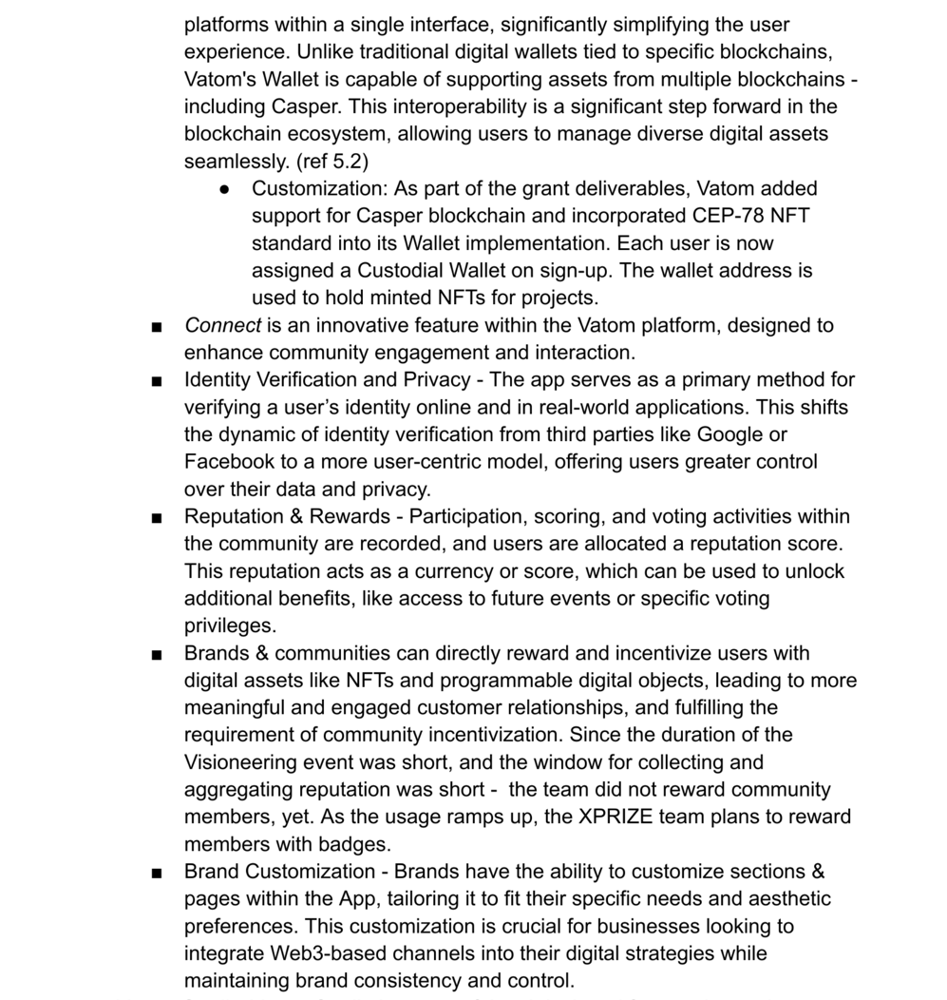
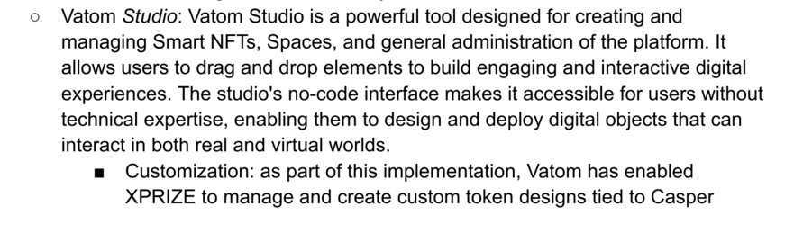
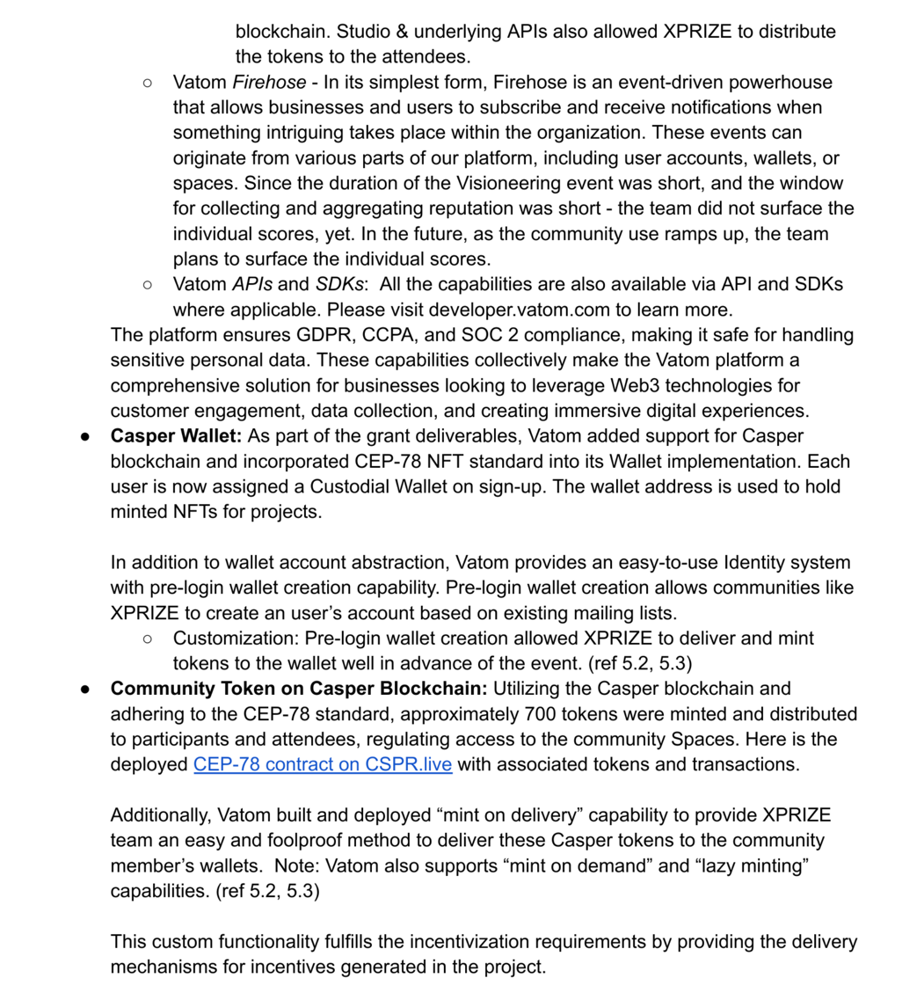
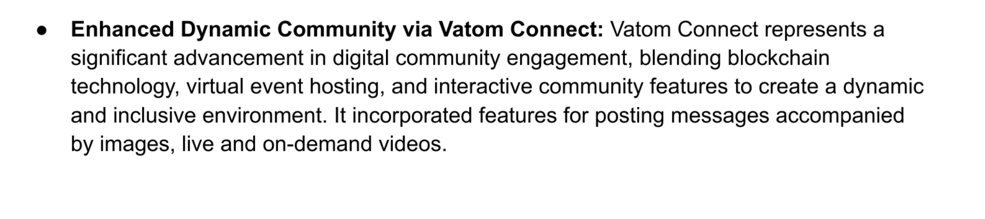
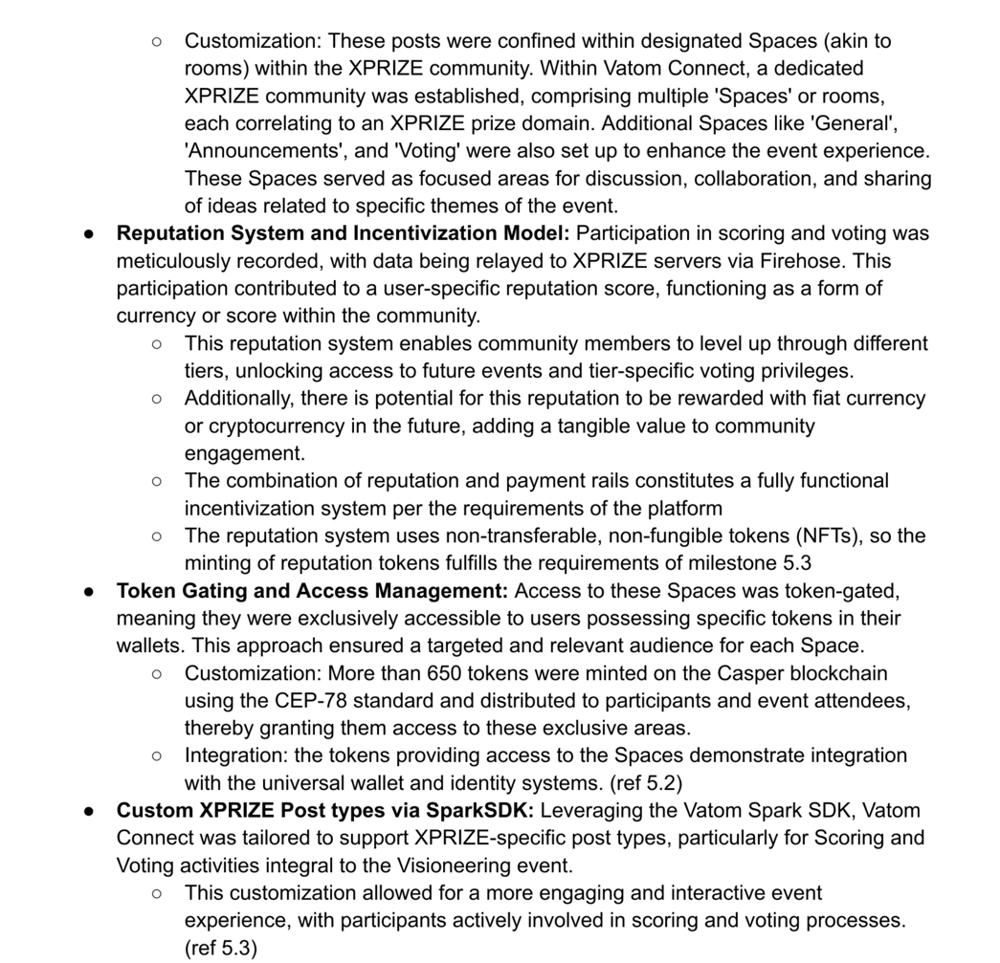
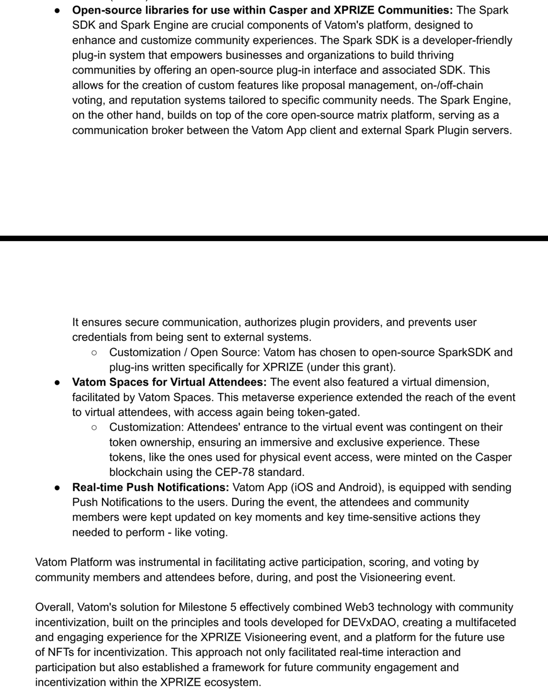

| Grant Proposal  | [581 - XPRIZE DECENTRALIZED COMMUNITY](https://portal.devxdao.com/public-proposals/581) |
|-----------------|-----------------------------------------------------------------------------------------|
| Milestone       | All Code Milestones                                                                     |
| Milestone Title | All Code Milestones                                                                     |
| OP              | Jim Mainard, CTO  XPRIZE FOUNDATION <Jim.Mainard@xprize.org>                            |
| Reviewers       | Karol Marter <karol@casper.network> Michael Steuer <michael@make.services>           |

# Milestone Details

## Details & Acceptance Criteria

### Milestone 5 

#### Details of what will be delivered in milestones: 

#### Acceptance criteria:

Web 3 NFT community incentivization system is launched and starts minting NFTs  for activities that advance the formation, structure, and governance of PROJECT FUTURE’s new venture engagement

### Additional notes regarding submission from OP:

OP has provided a detailed document outlining all milestone deliveries [here](https://streaklinks.com/B0_WrxJnp6HgI1ypTwI5vxiW/https%3A%2F%2Framprate.docsend.com%2Fview%2Fxuqnudiqekujvx6m)

Reviewer notes that this grant is of a unique nature, both in terms of the grant agreement, which is multi-party, as well as in terms
of the agreed upon Acceptance Criteria - several deliverables are based on proprietary systems of which the underlying
codebase cannot be reviewed, and correct functioning has to be deduced from provided screenshots and/or emperical testing to
the extent possible.

From a code review perspective, the Reviewer will only focus on the provided open-source repositories.

## Milestone Submission

The following milestone assets/artifacts were submitted for review:

_SparkEngine_: builds on top of the core open-source matrix platform, serving as a communication 
broker between the Vatom App client and external Spark Plugin servers. It ensures secure communication, 
authorizes plugin providers, and prevents user credentials from being sent to external systems. 
The Spark Engine extends Vatom's data model for community-specific post types, enforces business and 
community policies, enables Web3 behaviors natively in communities, and supports custom Sparks 
(Sparks are plug-ins built using SparkSDK running on Spark Engine). Spark Engine is available at:

https://github.com/VatomInc/spark-engine

_SparkSDK_: Base SDK that provides key capabilities for developers to build custom extensions to Vatom Connect (Community)

https://github.com/VatomInc/spark-sdk

_Plug-in written for XPRIZE_: This plugin builds on top of SparkSDK to deliver XPRIZE
Visioneering specific functionality related to Sketch Scoring and Voting:

https://github.com/VatomInc/spark-xprize-plugin

| Repository                                      | Revision Reviewed  |
|-------------------------------------------------|--------------------|
| https://github.com/VatomInc/spark-engine        | `c92f7ff`          |
| https://github.com/VatomInc/spark-sdk           | `1f29819`          |
| https://github.com/VatomInc/spark-xprize-plugin | `6fb95f3`          |    

# Install & Usage Testing Procedure and Findings

## Spark Engine
The documentation for the Spark Engine repository is provides a detailed README that outlines the installation and usage details

After following the installation instructions, the application ran without errors, but with several warnings that the OP should address.

## Spark SDK

The documentation for the Spark Engine repository is provides a detailed README that outlines the installation and usage details

## Spark XPrize Plugin

The documentation for the Spark Engine repository is provides a detailed README that outlines the installation and usage details

Using the [studio.vatom.com](https://studio.vatom.com) website, Reviewer was able to generate an API Key and Secret, and configure the project before building and running it. 

## Overall Impression of usage testing

Overall, the 3 repositories provide substantial documentation in order to set up the components of the project, each of which are meant to operate in conjunction with closed-source, proprietary components of the Vatom platform.

| Requirement                                                                        | Finding |
|------------------------------------------------------------------------------------|---------|
| Project builds without errors                                                      | PASS    |
| Documentation provides sufficient installation/execution instructions              | PASS    |
| Project functionality meets/exceeds acceptance criteria and operates without error | PASS    |

# Unit / Automated Testing

The project does not come with any unit tests. Below is the OP's explanation for the lack of unit tests. Reviewer has personally seen the project running against OP's proprietary, closed-source platforms, and has seen evidence of its commercial use with the Xprize project. That, combined with the reasons provided by OP, is sufficient for Reviewer to waive the unit test requirement.

_Our project fundamentally depends on the Vatom Platform to function effectively. As part of our initiative, supported by the grant, we have made two crucial repositories available to the community: Spark Engine and Spark SDK. The Spark Engine is intricately designed to operate within the Vatom Platform ecosystem. It acts as a conceptual and functional framework, guiding developers on how to adapt and implement similar functionalities across other platforms, such as Matrix Element, Fediverse, etc._

_As part of our commitment to delivering high-quality software, we have adopted a robust internal process for the development and deployment of Spark Engine, a component deeply integrated with the Vatom Platform and its associated infrastructure. Our decision not to ship unit tests alongside the open-source release of Spark Engine was made with careful consideration of our unique development environment and the specific needs of our project._

_Integration with Vatom Platform: Spark Engine is not designed to function as a standalone project. Its performance and functionality are intrinsically linked to the Vatom Platform, necessitating a comprehensive testing approach that goes beyond standard unit tests. Our internal review processes ensure that any modifications to Spark Engine are thoroughly evaluated in the context of the entire ecosystem, encompassing not just code correctness but also compatibility and performance across the platform._

_Comprehensive Internal Testing: Before any code is deployed, it undergoes a rigorous User Acceptance Testing (UAT) regimen, along with various other tests tailored to assess its integration and performance within our infrastructure. This multi-layered testing strategy is part of our strict review, build, and deployment processes, which we believe offers a more holistic assurance of quality than standalone unit tests could provide for this project._

_Empowering Developers with Spark SDK: The Spark SDK serves as a foundational layer upon which developers are encouraged to build Sparks (plug-ins). Recognizing the diverse and innovative ways in which the SDK can be utilized, we encourage developers to implement unit tests for their specific plug-ins. This approach not only fosters a culture of quality and responsibility among our developer community but also ensures that unit tests are directly relevant and tailored to the unique functionalities of each plug-in._

_Commitment to Quality and Openness: We understand the importance of transparency and quality assurance in the open-source community. While we chose not to release unit tests for Spark Engine and Spark SDK, we are dedicated to maintaining high standards of quality and reliability through our internal processes. We welcome feedback and contributions from the community to continually improve our projects and support the ecosystem around the Vatom Platform._

_Future Considerations: We are continually evaluating our development practices and the needs of our community. As Spark Engine and Spark SDK evolve, we will remain open to revisiting our approach to testing and documentation, including the potential future release of unit tests or test frameworks that could benefit the community._
_

| Requirement                                  | Finding         |
|----------------------------------------------|-----------------|
| Unit Tests - At least one positive path test | PASS with Notes |
| Unit Tests - At least one negative path test | PASS with Notes |
| Unit Tests - Additional path tests           | PASS with Notes |

# Documentation

### Code Documentation

The source code to each of the projects is well documented by its developers, and the code is very readable. The purpose of methods and variables is easily deduced by their naming.

| Requirement     | Finding |
|-----------------|---------|
| Code Documented | PASS    |

### Project Documentation

The project level documentation is sufficient, and covers both installation and example usage of each of the projects.

| Requirement        | Finding |
|--------------------|---------|
| Usage Documented   | PASS    |
| Example Documented | PASS    |

## Overall Conclusion on Documentation

Reviewer found the documentation accompanying this submission to be sufficient to install each of the projects, and found the example usage documenation very easily understood.

# Open Source Practices

## Licenses

Each of the projects is open sourced under the `MIT License`.

| Requirement                               | Finding |
|-------------------------------------------|---------|
| OSI-approved open source software license | PASS    |

## Contribution Policies

Each project has a Code of Conduct policy. Pull Requests and Issues are enabled on each repository which enables and encourages public participation. None of the projects contain a `CONTRIBUTING` or `SECURITY` policy, which the Reviewer recommends the OP improves on in the future.

| Requirement                     | Finding         |
|---------------------------------|-----------------|
| OSS contribution best practices | PASS with Notes |

# Coding Standards

## General Observations

The projects are well-structured, with sufficient documentation, flawless installation, and easily understandable code. 

# Final Conclusion

Based on the Reviewer's overall impressions, this submission should `PASS with Notes`. Areas of improvement include:
* automated testing when contextually sensible
* Improvements to Open Source preparedness
* Provide example usage against a publicly available Vatom test environment

# Recommendation

| Recommendation | PASS with Notes  |
|----------------|------------------|
