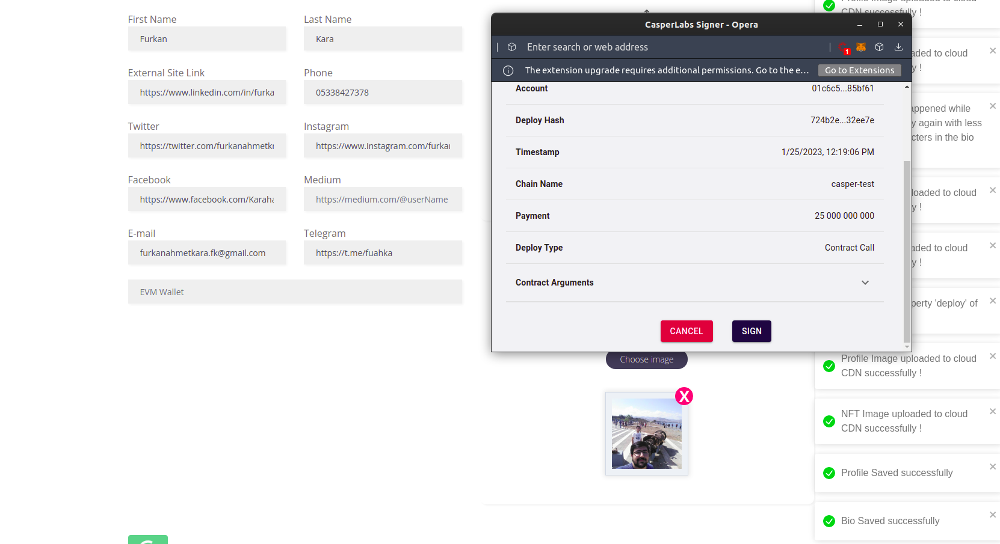
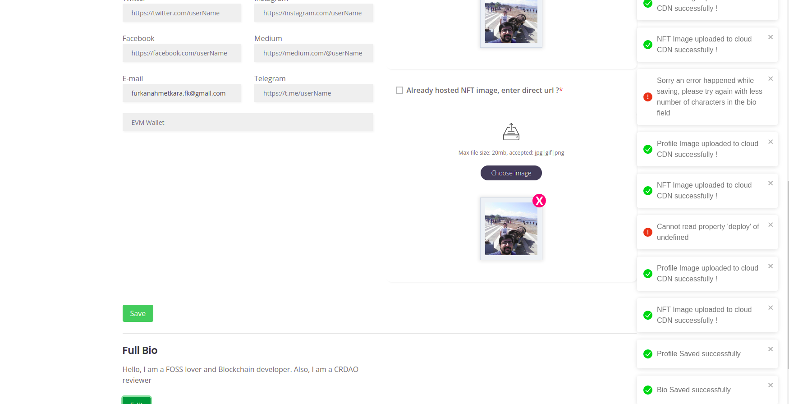
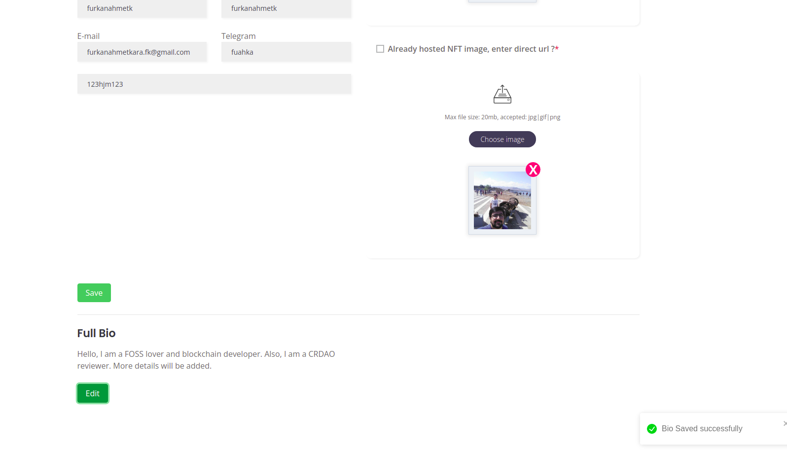

Grant Proposal | [588 - Verified Impact NFTs Part 2](https://portal.devxdao.com/public-proposals/588)
------------ | -------------
Milestone | 4
Milestone Title | Create User Profile Smart Contract
OP | dradel
Reviewer | Furkan Ahmet Kara <furkanahmetkara.fk@gmail.com>

# Milestone Details

## Details & Acceptance Criteria

**Details of what will be delivered in milestone:**

In Phase 1, we focused on adding the required fields in the smart contracts, while the UI did not support the profile functions, while this choice is acceptable to get the system going with manual contract interaction, it is a usability obstacle. To increase the usage of the platform, the user profile will play a large role.
The user profile is a smart contract that stores the user information, this way, the data is stored on chain without the need to have a central DB.

**Acceptance criteria:**

Create a smart contract with functions to write, read the following data per each profile:
Wallet Address
User Name (Required)	
Short Tag Line	
Profile Image URL	
Profile NFT	
First Name	
Last Name	
A Full Bio	
External Site Link	
Phone	
Twitter	
Instagram	
Facebook	
Medium	
E-mail	
Telegram	
Profile Type

**Additional notes regarding submission from OP:**

Please note that the amounts may be different.
Create a smart contract with functions to write, read the following data per each profile:
Wallet Address
User Name (Required)
Short Tag Line
Profile Image URL
Profile NFT
First Name
Last Name
A Full Bio
External Site Link
Phone
Twitter
Instagram
Facebook
Medium
E-mail
Telegram
Profile Type

## Milestone Submission

The following milestone assets/artifacts were submitted for review:

Repository | Revision Reviewed
------------ | -------------
https://github.com/AdelElMessiry/Verified-Impact-NFTs| e14dfa2

# Install & Usage Testing Procedure and Findings

By following the instructions in the [README](https://github.com/AdelElMessiry/Verified-Impact-NFTs/blob/main/README.md) of the repository, the reviewer was able to successfully build and run the project on ubuntu 22.04.

### Build

- Build the smart contract:

The reviewer was able to build the smart contract by following the README instructions

[make prepare](assets/makepreparelogs.md)
[make build-contract](assets/makebuildcontracts.md)

- Build the user interface:

The reviewer was able to build and run the project by following the README instructions.

[yarn install](assets/yarninstalllogs.md)

[yarn start](assets/yarnstartlogs.md)

### Usage

After building the project, the reviewer headed to the progile page to test the smart contract functionability. Reviewer connected Casper Signer to the website, and the reviewer created and updated a profile.

The user must enter his/her username and uppload images, but other fields can be empty.
Initially the reviewer got an error about the bio entry limit, and informed the OP about the issue. OP was so responsive, and fixed the issue in allignment with reviewers suggestion immediately.

[Test account cspt.live page](https://testnet.cspr.live/account/01c6c5f40d191fb1489d7f79e2cd483d8d26e576576ed185a9018526c77c85bf61)

## Overall Impression of usage testing

The project builds without errors, the documentation provides sufficient installation and execution instructions, and the project functionality meets the acceptance criteria and operates without errors.

Requirement | Finding
------------ | -------------
Project builds without errors | PASS 
Documentation provides sufficient installation/execution instructions | PASS
Project functionality meets/exceeds acceptance criteria and operates without error | PASS

# Unit / Automated Testing

The reviewer was able to successfully run the unit tests. The project has sufficient amount of unit tests which covers all critical classes and methods.

[yarn test](assets/yarntest.md)

Requirement | Finding
------------ | -------------
Unit Tests - At least one positive path test | PASS
Unit Tests - At least one negative path test | PASS
Unit Tests - Additional path tests | PASS

# Documentation

### Code Documentation

The code has sufficient amount of low-level documentation. The ritical classes and the methods have comments. The reviewer thinks that this part should pass. 

Requirement | Finding
------------ | -------------
Code Documented | PASS

### Project Documentation

The README file has sufficient install and usage instructions on the README. The reviewer was able to run and test project by following them. More visual usage instructions can be added for better experience.

Requirement | Finding
------------ | -------------
Usage Documented | PASS 
Example Documented | PASS with Notes

## Overall Conclusion on Documentation

In the reviewer's opinion, the project documentation is sufficient enough. 

# Open Source Practices

## Licenses

The Project is released under the MIT License.

Requirement | Finding
------------ | -------------
OSI-approved open source software license | PASS

## Contribution Policies

The project has Contributing and Security Policies and a Code of Conduct.

Requirement | Finding
------------ | -------------
OSS contribution best practices | PASS

# Coding Standards

## General Observations

The project has good structure. Code is well written and clear. Low-level code documentation and project documentation is sufficient. Project build and run successfully. The project complies with open source standards.

# Final Conclusion

The project provides the functionality described in the grant application and milestone acceptance criteria. 

Thus, in the reviewer's opinion, this submission should PASS.

# Recommendation

Recommendation | PASS
------------ | -------------

