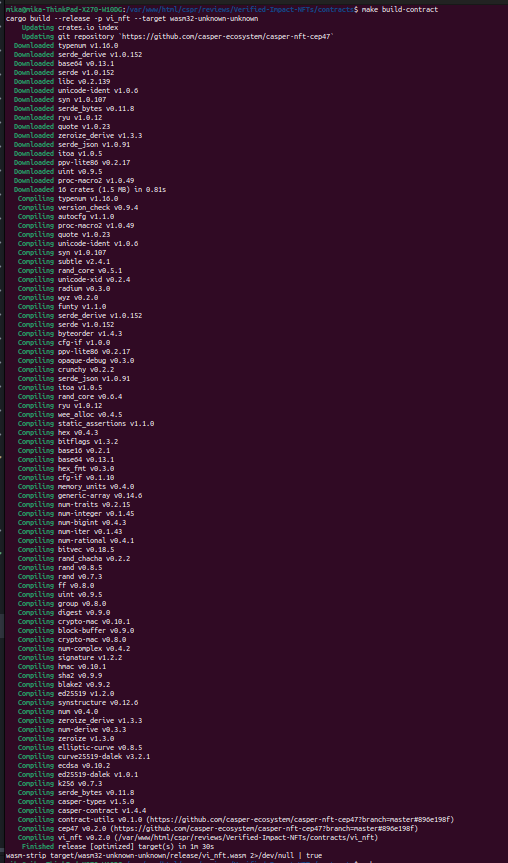
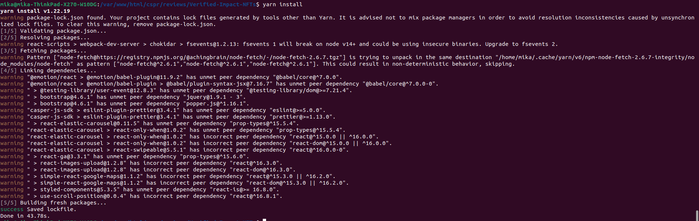
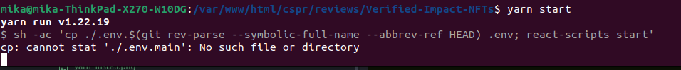
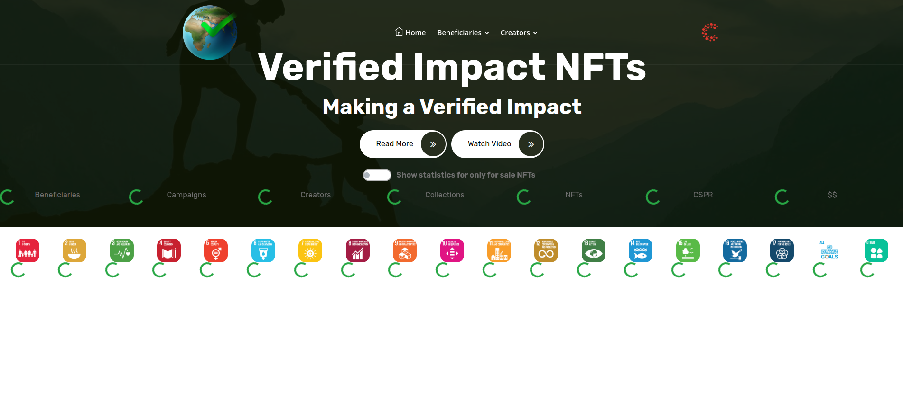
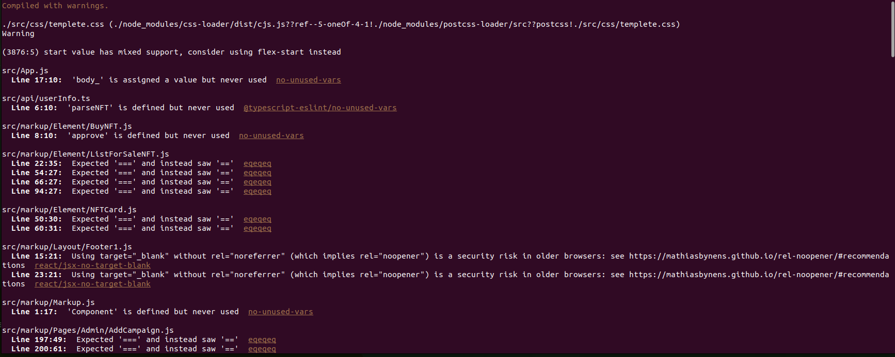
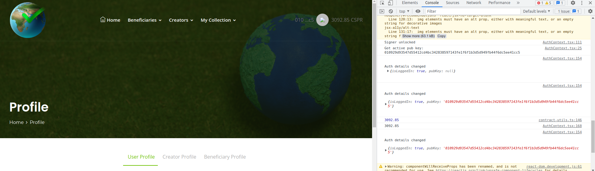
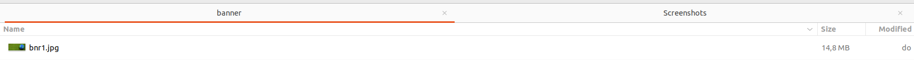
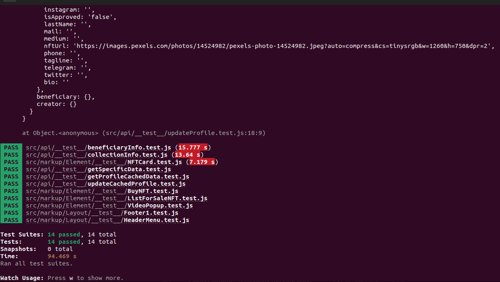

Grant Proposal | [588 - Verified Impact NFTs Part 2](https://portal.devxdao.com/public-proposals/588)
------------ | -------------
Milestone | 5
Milestone Title | Add UI for User, Creator, and Beneficiary Profiles
OP | dradel
Reviewer | Mikael Grouwet <m.grouwet@gmail.com>

# Milestone Details

## Details & Acceptance Criteria

**Details of what will be delivered in milestone:**

Add UI for User, Creator, and Beneficiary Profile tabs, which contains:
- User Name (Required)
- Short Tag Line
- Profile Image URL
- Profile NFT
- First Name
- Last Name
- A Full Bio
- External Site Link
- Phone
- Twitter
- Instagram
- Facebook
- Medium
- E-mail
- Telegram

**Acceptance criteria:**

Add UI for User, Creator, and Beneficiary Profile tabs, which contains:
- User Name (Required)
- Short Tag Line
- Profile Image URL
- Profile NFT
- First Name
- Last Name
- A Full Bio
- External Site Link
- Phone
- Twitter
- Instagram
- Facebook
- Medium
- E-mail
- Telegram
- The ability to write/read the profile

**Additional notes regarding submission from OP:**

The OP provided a documentation about how to test this milestone correctly https://github.com/AdelElMessiry/Verified-Impact-NFTs/blob/main/Milestone%205%20-%20Add%20UI%20for%20User%2C%20Creator%2C%20and%20Beneficiary%20Profiles.pdf

## Milestone Submission

The following milestone assets/artifacts were submitted for review:

Repository | Revision Reviewed
------------ | -------------
https://github.com/AdelElMessiry/Verified-Impact-NFTs | fa0b1ec

# Install & Usage Testing Procedure and Findings

The reviewer was able to build and run the contract with the documentation provided in the README.

The reviewer was able to compile and run the app successfully.

Installation of the dependencies via the "yarn install" command :

When the app starts, the following message appears but doesn't compromise the launch of the app :

Then the project starts successfully :

The app takes some time to load the data but everything works fine.

As mentioned in a previous review some stuff can be improved:

**logging**

There are a lot of warnings in the console after starting the project. 
The reviewer recommends that the OP correct some of them for better readability.

**console.log**

The reviewer also noticed that there is also a lot of "console.log" in the console of the browser.

The reviewer also recommends to clean these logs in the production environment :

**Image size**

The reviewer also saw that the main banner's size is 14Mo. It's too high and not recommended. It will have an impact on the user experience and performance.

**Constants**

The variables mentioned in the .env file are not documented. The reviewer doesn't know what these variables' goals are and what should be put in them.

It's essential for someone who wants to fork the repository. The user must know what can be parametrized or not.

**yarn build**

There is no documentation about how to build the project for a production environment. 
It's a single command but it should be mentioned somewhere.

**Button Casper Signer**

The cursor doesn't display a hand when passing the mouse over the Casper's Signer button. 

## Overall Impression of usage testing

The app works as described by the OP, the reviewer was able to update his profile.
The reviewer recommends adding more documentation in the .env file to make it easier for other people to understand the app.

The reviewer also recommends the OP to have a look at these findings :
- console.log
- logging
- image size
- constants
- yarn build
- Casper's Signer button

Requirement | Finding
------------ | -------------
Project builds without errors | PASS
Documentation provides sufficient installation/execution instructions | PASS with notes
Project functionality meets/exceeds acceptance criteria and operates without error | PASS

# Unit / Automated Testing

14 tests are defined. The reviewer recommends adding more tests to have better code coverage.

Requirement | Finding
------------ | -------------
Unit Tests - At least one positive path test | PASS
Unit Tests - At least one negative path test | PASS
Unit Tests - Additional path tests | PASS with notes

# Documentation

### Code Documentation

There is a "docs" folder with the documentation about the code which is sufficient enough.

Despite that, the reviewer advice the OP to be more exhaustive.

Requirement | Finding
------------ | -------------
Code Documented | PASS with Notes

### Project Documentation

The README contains the needed functional documentation to understand the project.

Requirement | Finding
------------ | -------------
Usage Documented | PASS
Example Documented | PASS

## Overall Conclusion on Documentation

The reviewer concludes that the project has sufficient documentation but the code documentation can be improved.

# Open Source Practices

## Licenses

The Project is released under the MIT License

Requirement | Finding
------------ | -------------
OSI-approved open source software license | PASS

## Contribution Policies

Pull requests and Issues are enabled.  
The repository does contain a CONTRIBUTING, SECURITY and Code of conduct policy.

Requirement | Finding
------------ | -------------
OSS contribution best practices | PASS

# Coding Standards

## General Observations

The code is generally well-structured and readable. 

The OP should take a look at the findings described earlier :
- console.log
- logging
- image size
- constants
- yarn build
- Casper's Signer button

He should also improve the code's documentation and add more tests for better code coverage.

# Final Conclusion

The project meets the acceptance criteria but he can improve on some parts (eg : documentation, tests).

Thus, in the reviewer's opinion, this submission should PASS with notes.

# Recommendation

Recommendation | PASS with notes
------------ | -------------
