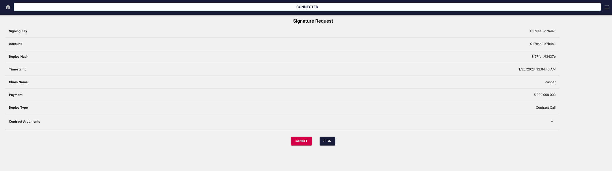

Grant Proposal | [588 - Verified Impact NFTs Part 2](https://portal.devxdao.com/app/proposal/588)
------------ | -------------
Milestone | 6
Milestone Title | Collection Management
OP | Adel ElMessiry
Reviewer | Muharrem Salel

# Milestone Details
The review will cover the sixth milestone criteria set forth below.

## Details & Acceptance Criteria

**Details of what will be delivered in milestone:**

The current system allows for a single collection to be created per creator. We need to update both the smart contract and the UI to accept multiple collections:
- Add the ability to create collections
- Add the ability to edit collections
- Add the ability to remove a collection if it is not used in an NFT

 **Acceptance criteria:**

Link to the smart contract GitHub with functions showing: 
- Add the ability to create collections 
- Add the ability to edit collections 
- Add the ability to remove a collection if it is not used in an NFT

 **Additional notes regarding submission from OP:**

- https://github.com/AdelElMessiry/Verified-Impact-NFTs/blob/main/Milestone%206%20-%20Collection%20Management.pdf

 ## Milestone Submission

The following milestone assets/artifacts were submitted for review:

Repository | Revision Reviewed
------------ | -------------
https://github.com/AdelElMessiry/Verified-Impact-NFTs | 595a034

# Install & Usage Testing Procedure and Findings

Instructions in the README.md file in the repository(https://github.com/AdelElMessiry/Verified-Impact-NFTs) are well-written that make usage of the project easy. They explain a clear path for users, and following instructions step by step helps the user to run and test the codebase. Also for each review milestone, there is a pdf file that includes each step. The reviewer followed these steps from a Mac (macOS Monterey - MacBook Pro Intel i9 2019) and successfully run both tests and the project itself.

However, the first version that was submitted to the system was not sufficient for the project to pass, However, the first version that was submitted to the system was not sufficient for the project to pass, because one of the acceptance criteria was missing and there were some missing files. The reviewer communicated with the OP about the situation, and the OP and their team took quick action and fixed the issues.

## Overall Impression of usage testing

The project builds without errors, and documentation provides sufficient installation and execution instructions.  The project functionality meets the acceptance criteria and operates without errors.

**Installation Steps**

**Create Profile Steps**

**Add Collection Steps**

**Mint NFT Steps**

**Remove Collection Steps**

Requirement | Finding
------------ | -------------
The project builds without errors | PASS
Documentation provides sufficient installation/execution instructions | PASS
Project functionality meets/exceeds acceptance criteria and operates without error | PASS

# Unit / Automated Testing

The project has unit tests for all critical classes and methods.

[Tests](assets/yarn_test.md)

Requirement | Finding
------------ | -------------
Unit Tests - At least one positive path test | PASS
Unit Tests - At least one negative path test | PASS 
Unit Tests - Additional path tests | PASS

# Documentation

### Code Documentation

A sufficient amount of low-level documentation exists on the project via properly formatted inline comments on the critical classes and the methods.

Requirement | Finding
------------ | -------------
Low-level function documentation | PASS 

### Project Documentation

The README file is so readable and clear that it is a must-have for the project. It contains all the necessary information for the project build and execution.

Requirement | Finding
------------ | -------------
Sufficient Project Documentation | PASS

# Open Source Practices

## Licenses

The project is released under the MIT License.

Requirement | Finding
------------ | -------------
OSI-approved open-source software license | PASS

## Contribution Policies

Pull requests and Issues are enabled on the repository. The project also has CONTRIBUTING and SECURITY policies.

Requirement | Finding
------------ | -------------
OSS contribution best practices | PASS

# Coding Standards

## General Observations

The code is generally well-structured and readable. The project is committed to GitHub and both the unit tests and the manual tests pass.

# Final Conclusion

The project provides the functionality described in the grant application and milestone acceptance criteria. 

Thus, in the reviewer's opinion, this submission should pass.

# Recommendation

Recommendation | PASS
------------ | -------------
