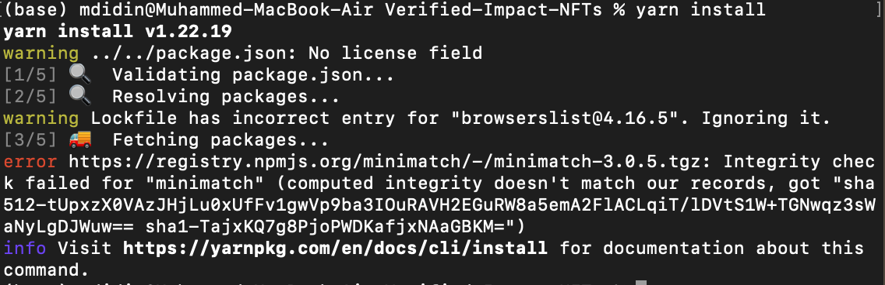
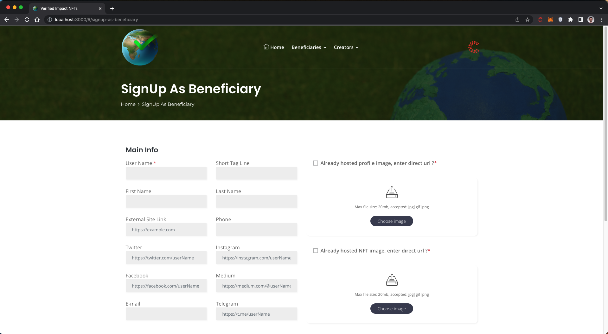
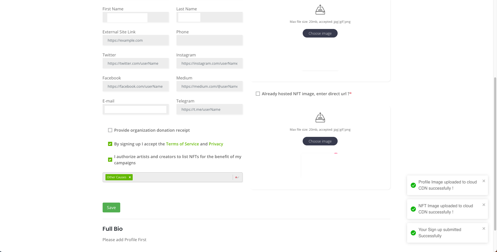
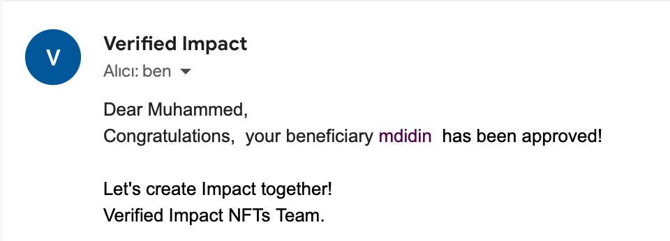
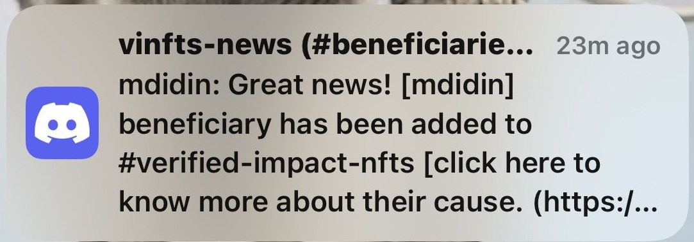
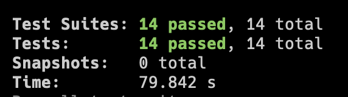

Grant Proposal | [588 - Verified Impact NFTs Part 2](https://portal.devxdao.com/app/proposal/588)
------------ | -------------
Milestone | 7
Milestone Title | Verified Impact NFTs Part 2
OP | dradel
Reviewer | Muhammed Didin <mdidin80@gmail.com>

# Milestone Details

## Details & Acceptance Criteria

**Details of what will be delivered in milestone:**

Adding a new beneficiary process.

**Acceptance criteria:**

GitHub link to the code
Screens showing the sign up process
Screen to approve the beneficiary
Enable the beneficiary in the smart contract

**Additional notes regarding submission from OP:**

Add the ability to sign up as a beneficiary. 
The information will be saved and sent for KYB (Know your beneficiary)
The beneficiary will not be enabled till they are approved.

## Milestone Submission

The following milestone assets/artifacts were submitted for review:

Repository | Revision Reviewed
------------ | -------------
https://github.com/AdelElMessiry/Verified-Impact-NFTs| 833e4dd

# Install & Usage Testing Procedure and Findings

Following the instructions in the README file of the repository, the reviewer was able to successfully build and run the source code and use the project on macOS Monterey.

### Build

 - Build the smart contract:

 The reviewer was able to build the smart contract querying make commands `make prepare` and `make build-contract`

[Full Build Logs](assets/build.txt)

- Build the user interface:

After editing the .env file, the reviewer installed the required packages by running the `yarn install` command and was able to run the project with the `yarn start` command.

[Full Install Logs](assets/install.txt)

[Full Install Logs](assets/start.txt)

### Usage

After building the project, the reviewer headed to the Sign Up As Beneficiary page.

The user must enter his/her e-mail address along with his/her name and surname.

After accepting the terms, the user should add the NFT image and click the Save button.

The system shows an alert that the request has been received. 
The project deployed the request to the chain via a smart contract. 

Sample deploy to the Casper Testnet: https://testnet.cspr.live/deploy/6a959cadd31417e14731e25463e0f713092631ce8696ae5ebced248c41c4a9ec

Then the request is approved by the admins. The confirmation mail reaches the user.

Along with these, the system congratulates the beneficiary's acceptance via [Twitter](https://twitter.com/ablaibrheem/status/1612063811913089024) and discord.

All the beneficiaries are shown in the [Explore Beneficiaries Page.](https://dev.verifiedimpactnfts.com/#/BeneficiaryNFTs?beneficiary=09489104ed5860ab7ec21c40b02b16d92a0d612f529ee441bcd73e6b98de76ff)

## Overall Impression of usage testing

The project builds without errors, the documentation provides sufficient installation and execution instructions, and the project functionality meets the acceptance criteria and operates without errors.

Requirement | Finding
------------ | -------------
Project builds without errors | PASS 
Documentation provides sufficient installation/execution instructions | PASS
Project functionality meets/exceeds acceptance criteria and operates without error | PASS

# Unit / Automated Testing

The reviewer was able to successfully run the unit tests. The bash script provided in the README file was able to run the unit tests. The project has sufficient amount of unit tests which covers all critical classes and methods.

[Full Test Logs](assets/test.txt)

Requirement | Finding
------------ | -------------
Unit Tests - At least one positive path test | PASS
Unit Tests - At least one negative path test | PASS
Unit Tests - Additional path tests | PASS

# Documentation

### Code Documentation

Properly formatted inline comments on the critical classes and the methods are added to the project. The reviewer thinks that there is a sufficient amount of code documentation.

Requirement | Finding
------------ | -------------
Code Documented | PASS

### Project Documentation

The README file has sufficient basic usage instructions for the implemented methods. The reviewer was able to build, run and use the project using project documentation.

Requirement | Finding
------------ | -------------
Usage Documented | PASS 
Example Documented | PASS

## Overall Conclusion on Documentation

In the reviewer's opinion, the project has sufficient documentation. 

# Open Source Practices

## Licenses

The Project is released under the MIT License.

Requirement | Finding
------------ | -------------
OSI-approved open source software license | PASS

## Contribution Policies

The project has Contributing and Security Policies and a Code of Conduct.

Requirement | Finding
------------ | -------------
OSS contribution best practices | PASS

# Coding Standards

## General Observations

The project has well-structured and readable code. Code and project documentation is sufficient and they provide the necessary information to use the program. The project complies with open source standards.

# Final Conclusion

The project provides the functionality described in the grant application and milestone acceptance criteria. 

Thus, in the reviewer's opinion, this submission should PASS.

# Recommendation

Recommendation | PASS
------------ | -------------

