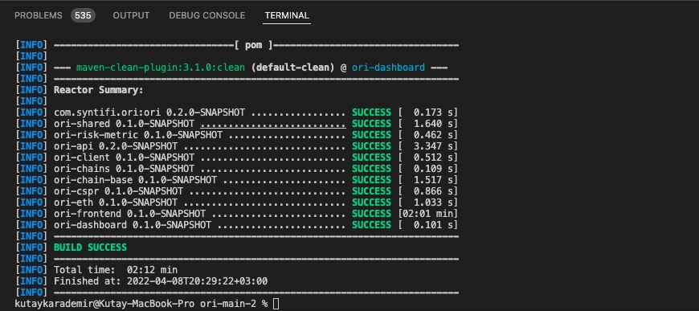
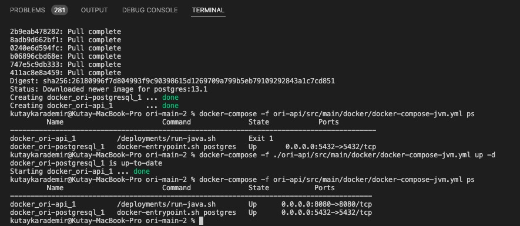
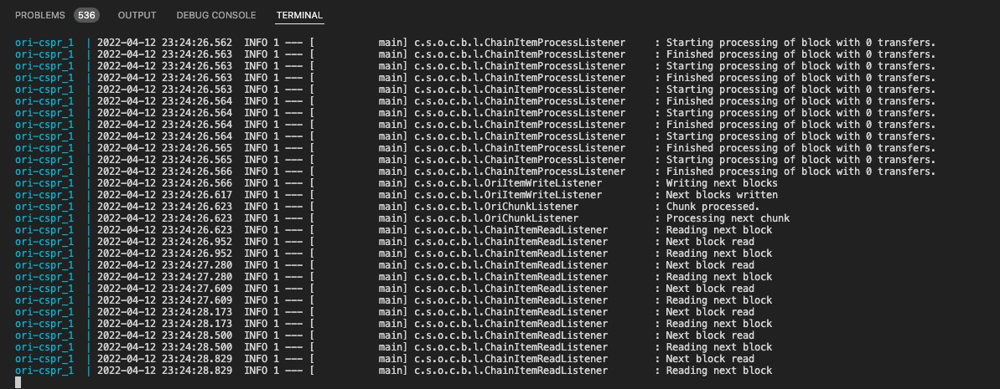
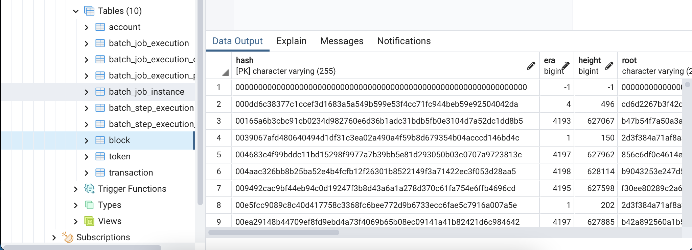
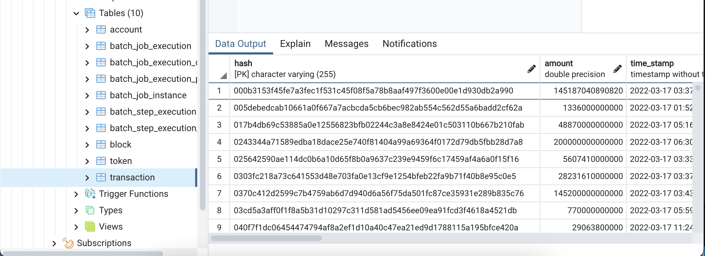
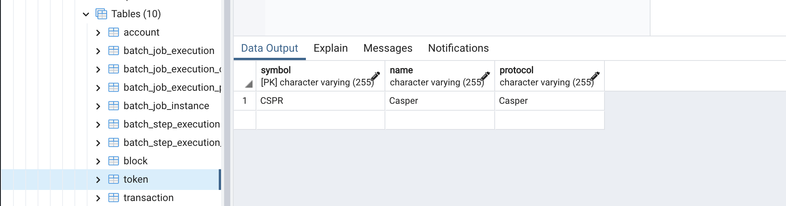
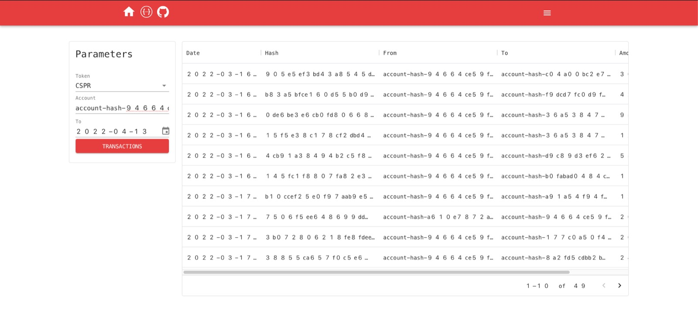
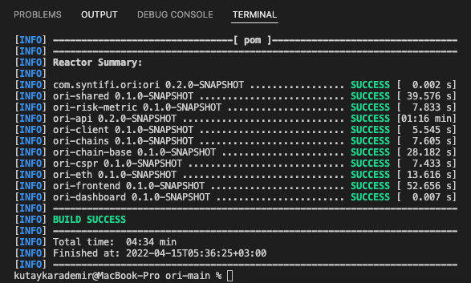
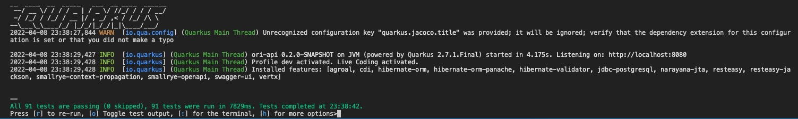

Grant Proposal | [60 - Financial crime prevention and risk intelligence on-chain tool](https://portal.devxdao.com/public-proposals/60)
------------ | -------------
Milestone | 2
Milestone Title | Web Interface
OP | Aberto
Reviewer | Kutay Karademir <eee.kutay@gmail.com>


# Milestone Details


## Details & Acceptance Criteria

**Details of what will be delivered in milestone:**

- Web Interface

**Acceptance criteria:**

- Have an interactive Web interface that leverages on the GraphQL API and enables the "trace the coin" solution.


**Additional notes regarding submission from OP:**

- This second milestone builds on top of the first milestone and adds a front-end interface built on react.js.

## Milestone Submission

The following milestone assets/artifacts were submitted for review:

Repository | Revision Reviewed
------------ | -------------
https://github.com/syntifi/ori| ade4902

# Install & Usage Testing Procedure and Findings

Following the instructions in the README file of the repository : https://github.com/syntifi/ori and the file provided as a guide for this milestone
https://github.com/syntifi/ori/blob/main/TLDR-CSPR.md


First of all , Reviewer started with installing the required dependencies.

```console
Java 11
Maven (3.8.1 or above)
Docker
Docker compose (version 1.29.2 or above)
Node.js (>=14.0.0)
```

**Test and build the project:**

```bash
kutaykarademir@MacBook-Pro ori-main % ./mvnw clean compile

```
Output:



**Build libs, jars and images:**

```bash
kutaykarademir@MacBook-Pro ori-main % ./mvnw package -DskipTests
```
Output:


**Create a docker network ori and try to start postgresql and api:**

```bash
kutaykarademir@MacBook-Pro ori-main %  docker network create ori  //Create a docker network ori
kutaykarademir@MacBook-Pro ori-main % docker-compose -f ./ori-api/src/main/docker/docker-compose-jvm.yml up -d  //Start postgresql and api modules (docker images)
kutaykarademir@MacBook-Pro ori-main % docker-compose -f ori-api/src/main/docker/docker-compose-jvm.yml ps. //Check if both went up
```
Reviewer failed to run the ori-api on the first try, but after the second try the ori-api was up and running. (OP has specified in the read.me file that this problem may occur and how to solve it.)

Output:



**Launch the crawler for CSPR chain:**

```bash
kutaykarademir@MacBook-Pro ori-main % docker-compose -f ./ori-chains/ori-cspr/src/main/docker/docker-compose.yml up -d
kutaykarademir@MacBook-Pro ori-main %  docker-compose -f ori-chains/ori-cspr/src/main/docker/docker-compose.yml ps
```
Output:

 
 
The reviewer was then able to check crawler is up and running using the following command line :

 ```bash
docker-compose -f ori-chains/ori-cspr/src/main/docker/docker-compose.yml logs -f
 ```
 Output:
 
 

**Check the database:**

```bash
docker exec -i docker_ori-postgresql_1 psql -U ori_db_user ori_db < ori-chains/ori-cspr/src/test/resources/db-sample/ori_db_sample.sql
```
The reviewer uploaded a sample of crawler data for testing purposes and observed the data using postgresql for control purpose.

    

   
   
   
   
   

**Web Interface(Frontend & Api):**

The reviewer was able to reach the web interface from http://localhost:8080 after completing all the steps and could easily observe the data from the interface by using a user account from the sample data.



## Overall Impression of usage testing
The reviewer was able to build and run the project with following the instructions. And also the documentation provides adequate installation/execution instructions for different scenarios. The reviewer thinks that the project functionality will meet the acceptance criteria.


Requirement | Finding
------------ | -------------
Project builds and runs without errors | PASS
Documentation provides sufficient installation/execution instructions | PASS
Project functionality meets/exceeds acceptance criteria and operates without error | PASS 


# Unit / Automated Testing

After following the instructions given in the README in the project and installing the requirements and adding the necessary configuration settings, the tests were run. No error was received during the tests. The tests cover both positive and negative test paths.

In Addition: Tests were also conducted in dev mode.

```bash
kutaykarademir@MacBook-Pro ori-main % sudo ./mvnw test
```



Requirement | Finding
------------ | -------------
Unit Tests - At least one positive path test | PASS
Unit Tests - At least one negative path test | PASS
Unit Tests - Additional path tests | PASS

# Documentation

### Code Documentation

The reviewer confirmed that all critical functions of the project are well documented and can be used for automated document generation.

Requirement | Finding
------------ | -------------
Code documentation | PASS

### Project Documentation

The reviewer observed that the project README has detailed usage documentation and project is generally well documented.

Requirement | Finding
------------ | -------------
Project Documentation | PASS

## Overall Conclusion on Documentation
The reviewer concluded that the project has sufficient comprehensive general documentation.

# Open Source Practices

## Licenses

The Project is released under the MIT License.

Requirement | Finding
------------ | -------------
OSI-approved open source software license | PASS

## Contribution Policies

The project contains a CONTRIBUTION policy.

Requirement | Finding
------------ | -------------
OSS contribution best practices | PASS

# Coding Standards

## General Observations

Code is generally well structured and readable. Project is easy to set up from Github repository. The reviewer observed that he did not encounter any errors in the tests that would have required the project to fail the review.

# Final Conclusion

The project provides the functionality described in the grant application and milestone acceptance criteria. It also meets the standards required by the CRDAO. Thus, in the reviewer's opinion, this submission should PASS.

# Recommendation

Recommendation | PASS
------------ | -------------
