Grant Proposal | [645 - Smart Billing Platform Prototype](https://portal.devxdao.com/app/proposal/645)
------------ | -------------
Milestone | 2
Milestone Title | Implement DID for Casper
OP |  Christian Lätsch
Reviewer | Muharrem Salel

# Milestone Details
The review will cover the second milestone criteria set forth below.

## Details & Acceptance Criteria

**Details of what will be delivered in milestone:**

A DID standard has been implemented for Ethereum (i.e. ERC-1056) but there seems to be no live implementation of a DID standard on the Casper blockchain as
of today. To enable the Casper chain for Smart Billing functionalities, we will evaluate the status of the DID resolvers that are currently being implemented and:
 - If between the submission of this proposal and the start of this project, a DID implementation that serves our needs has been implemented, we may extend and
integrate that solution for our solution.
 - If there isn’t a suitable DID implementation available on the Casper mainnet (which is status as of today), we implement our own, using existing standards on
other blockchains (such as ERC-1056) as a model.

 **Acceptance criteria:**

- A DID standard suitable for the requirements of this project is implemented on the Casper blockchain and ready for integration with the Smart Billing Platform
(code uploaded to github).

 **Additional notes regarding submission from OP:**

This is the second milestone which implements the DID on Casper according to the architecture laid out in milestone 1.

Please see the README.md for all further information.

 ## Milestone Submission

The following milestone assets/artifacts were submitted for review:

Repository | Revision Reviewed
------------ | -------------
https://github.com/NoumenaDigital/sbp-dxd-m2 | 62a7c86

# Install & Usage Testing Procedure and Findings

Instructions in the README.md file in the repository(https://github.com/NoumenaDigital/sbp-dxd-m2) are well-written that make usage of the project easy. They explain a clear path for users, and following instructions step by step helps the user to run and test the codebase. The reviewer followed these steps from a Mac (macOS Monterey - MacBook Pro Intel i9 2019) and an Ubuntu Machine (Ubuntu 18.04.6) and successfully run both tests and the project itself.

## Overall Impression of usage testing

The project builds without errors, and documentation provides sufficient installation and execution instructions.  The project functionality meets the acceptance criteria and operates without errors.

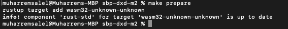
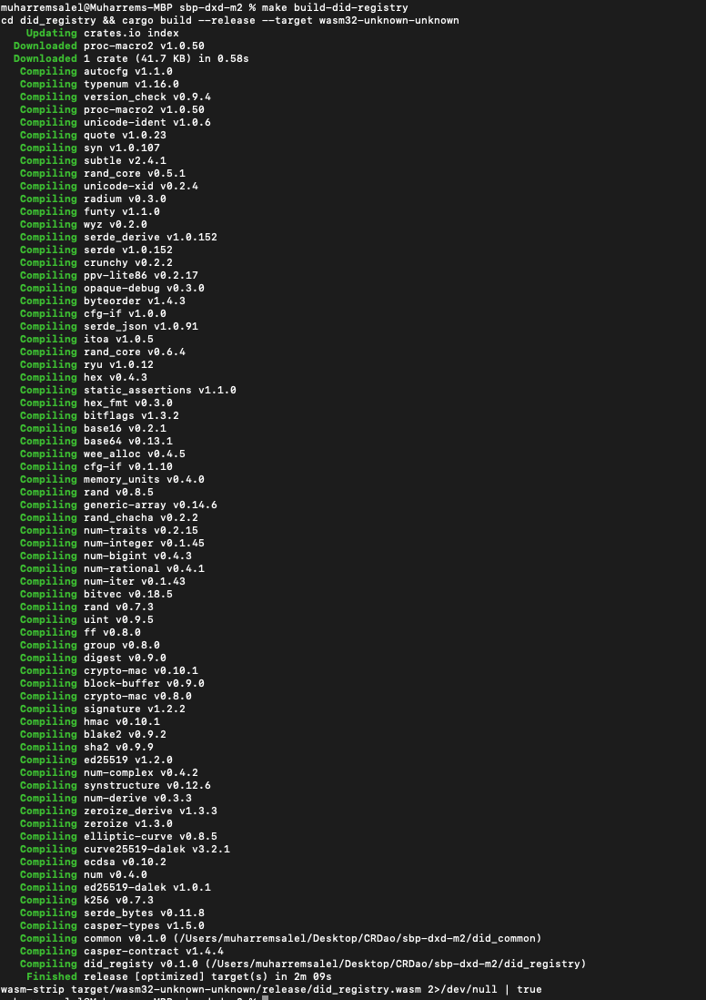

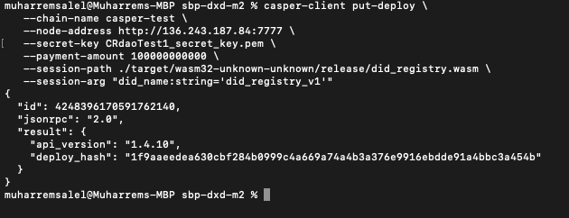
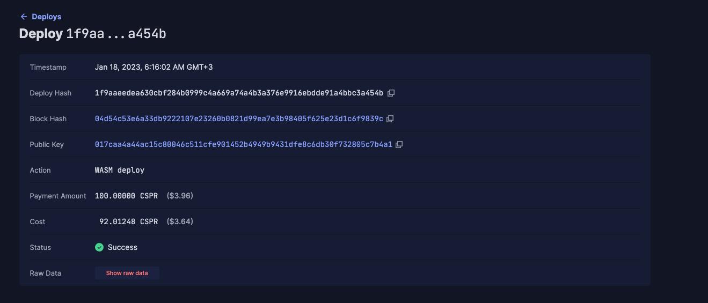

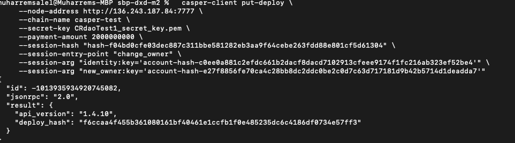
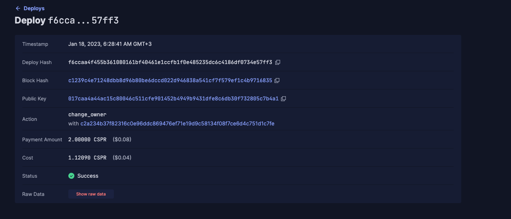
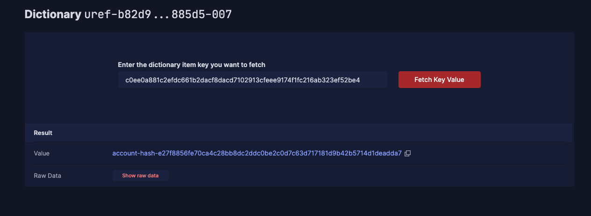

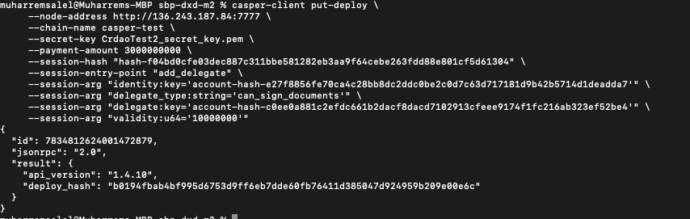
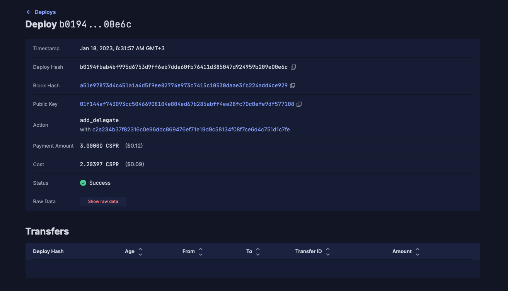
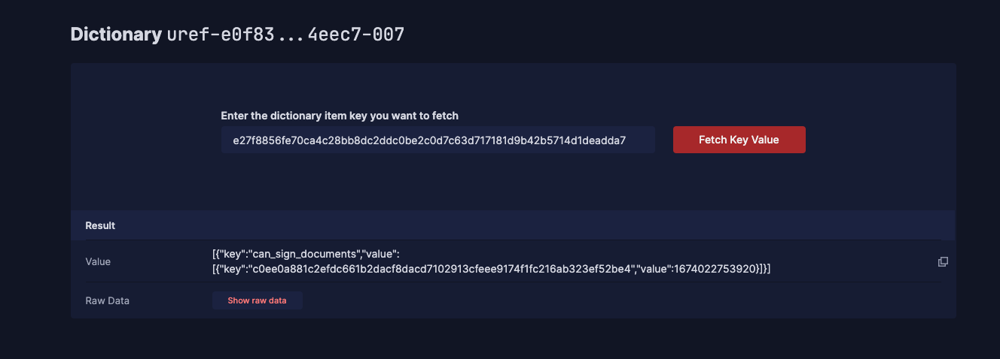

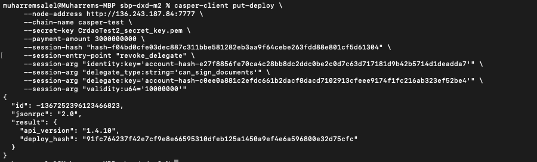
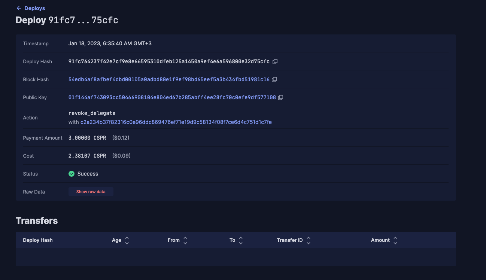
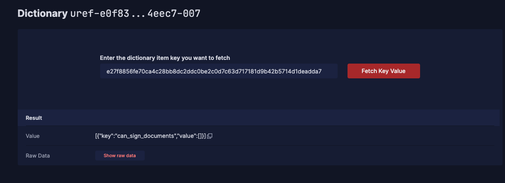

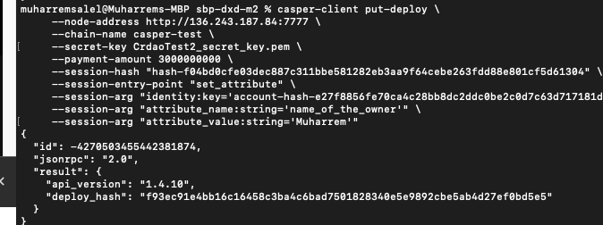
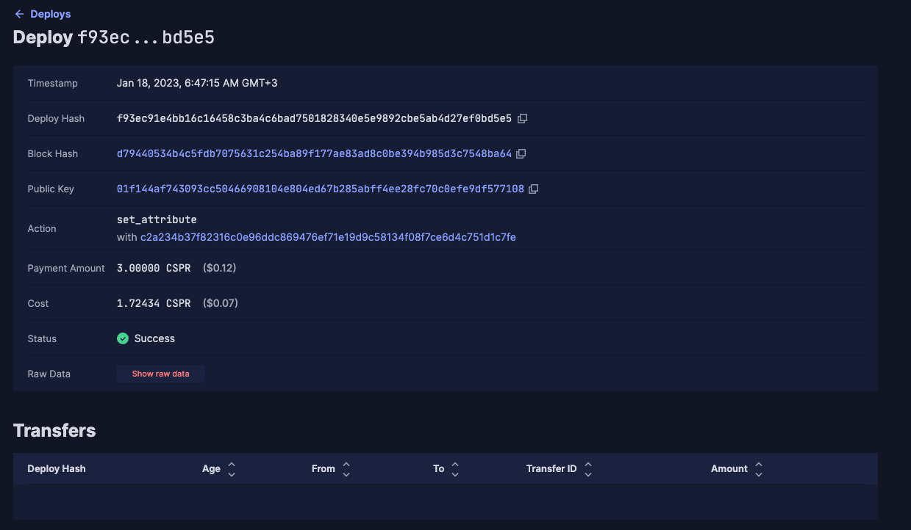
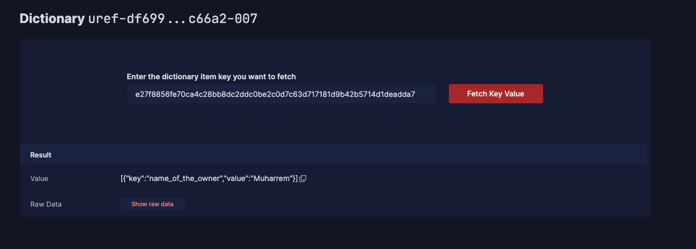

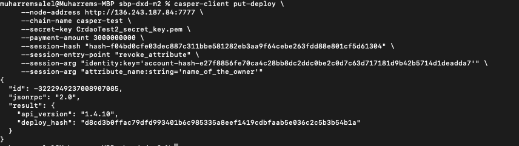
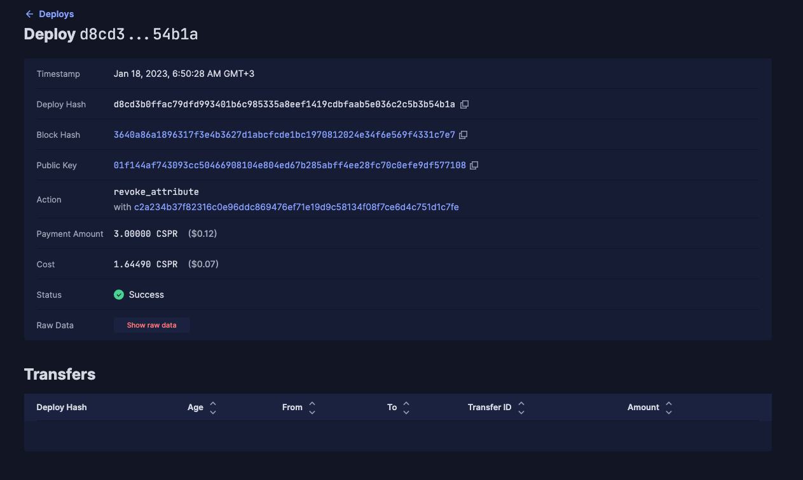
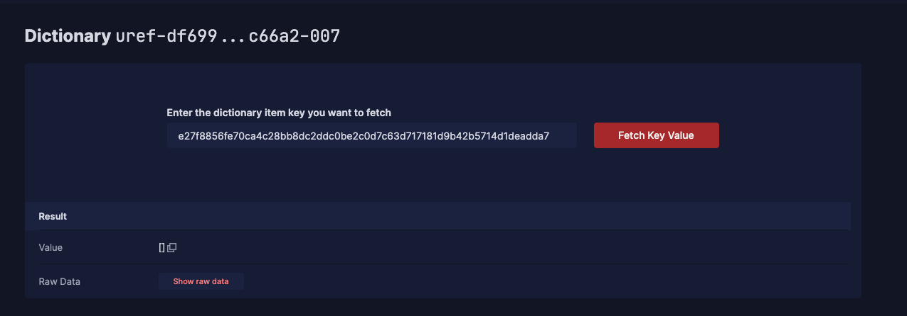

Requirement | Finding
------------ | -------------
The project builds without errors | PASS
Documentation provides sufficient installation/execution instructions | PASS
Project functionality meets/exceeds acceptance criteria and operates without error | PASS

# Unit / Automated Testing

The project has unit tests for all critical classes and methods.

[Tests](assets/make_test.md)

Requirement | Finding
------------ | -------------
Unit Tests - At least one positive path test | PASS
Unit Tests - At least one negative path test | PASS 
Unit Tests - Additional path tests | PASS

# Documentation

### Code Documentation

A sufficient amount of low-level documentation exists on the project via properly formatted inline comments on the critical classes and the methods. However, the OP is highly encouraged to improve the code documentation such as adding more detail to the documentation of the classes and methods.

Requirement | Finding
------------ | -------------
Low-level function documentation | PASS

### Project Documentation

The README file is so readable and clear that it is a must-have for the project. It contains all the necessary information for the project build and execution.

Requirement | Finding
------------ | -------------
Sufficient Project Documentation | PASS

# Open Source Practices

## Licenses

The project is released under the Apache-2.0 License.

Requirement | Finding
------------ | -------------
OSI-approved open-source software license | PASS

## Contribution Policies

Pull requests and Issues are enabled on the repository. The project also has CONTRIBUTING and SECURITY policy.

Requirement | Finding
------------ | -------------
OSS contribution best practices | PASS

# Coding Standards

## General Observations

The code is generally well-structured and readable. The project is committed to GitHub and both the unit tests and the manual tests pass.

# Final Conclusion

The project provides the functionality described in the grant application and milestone acceptance criteria. 

Thus, in the reviewer's opinion, this submission should pass.

# Recommendation

Recommendation | PASS
------------ | -------------
